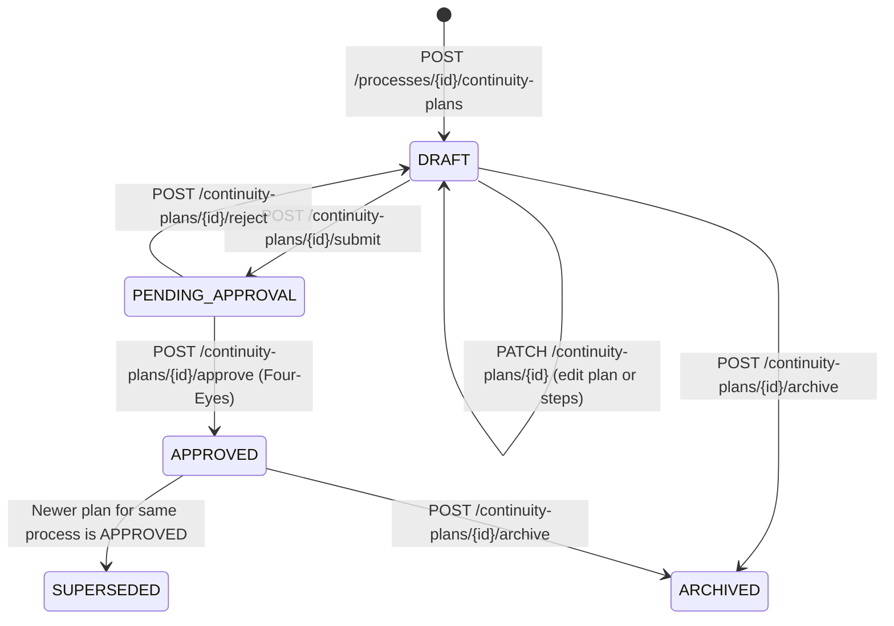
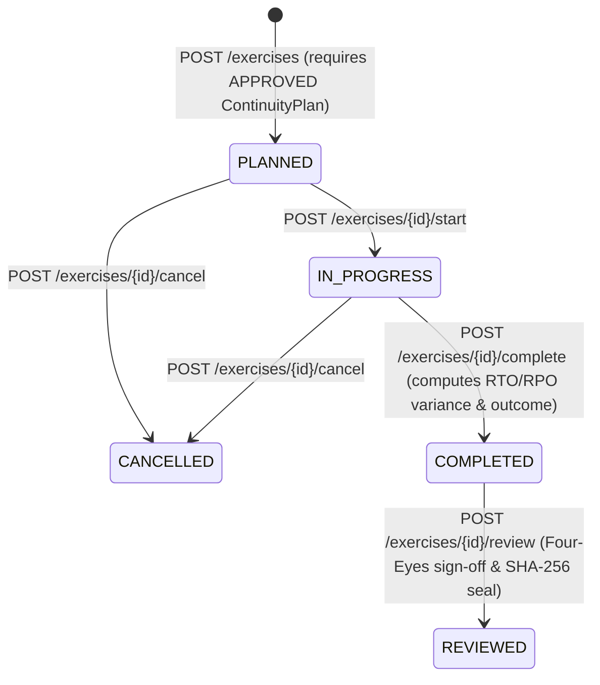

# PHASE 29 — BATCH 5 HARDENED IMPLEMENTATION PLAN: Operational Resilience Continuity Planning, DR Exercise Testing & Empirical RTO/RPO Assurance (`RESILIENCE-CONTINUITY-GRC`)

---

## 1. Hardening Executive Summary

- **REPOSITORY FACT**: ControlSphere (`https://github.com/Avalar06/ControlSphere.git`, branch `main`, frozen `HEAD` `c8d7062134bd9a771ad2cb9e1351f000ed41bab9`) completed Batch 5 Architecture Discovery in `PHASE29_BATCH5_ARCHITECTURE_DISCOVERY.md`, concluding `BATCH 5 ARCHITECTURE DISCOVERY COMPLETE — GO TO HARDENING` for **Operational Resilience Continuity Planning, DR Exercise Testing & Empirical RTO/RPO Assurance (`RESILIENCE-CONTINUITY-GRC`)**.
- **REPOSITORY FACT**: Phase 13 (`backend/app/models/resilience.py`, `backend/app/services/resilience_service.py`, `backend/app/schemas/resilience.py`, `backend/app/api/v1/endpoints/resilience.py`, `backend/alembic/versions/0013_operational_resilience.py`) currently models only static Business Processes (`BusinessProcess`), target Business Impact Analyses (`BusinessImpactAnalysis` with `rto_hours`, `rpo_hours`, `mtd_hours`, financial impact bands, and status `DRAFT | APPROVED | ARCHIVED`), and four-target dependencies (`ProcessDependency` supporting `VENDOR | ASSET | CONTROL | PROCESS`).
- **ARCHITECTURAL DECISION**: Batch 5 hardens Phase 13 into a closed-loop, regulator-defensible **Operational Resilience Continuity & Empirical Recovery Assurance Engine** aligned with **EU DORA Articles 11–12 & 24–27**, **ISO 22301:2019 Clauses 8.4 & 8.5**, **NIST SP 800-34 Rev. 1**, **FFIEC BCM**, and **SOC 2 CC7.5 / CC9.1**:
  1. **Extended Dependency Lineage (`ProcessDependency`)**: Adds `CLOUD_ASSET` (`cloud_assets.id`) and `DATA_ASSET` (`data_assets.id`) to `DependencyTypeEnum`, updates the XOR target check constraint (`chk_dependency_single_target`), adds `failure_propagation_weight` (`[0.0, 1.0]`, default `1.0`) and `recovery_priority_order` (`>= 1`, default `1`), and enforces deterministic Single-Point-of-Failure (SPOF) semantics and live dependency health calculation.
  2. **Versioned Continuity & Recovery Plans (`ContinuityPlan` & `ContinuityRecoveryStep`)**: Introduces versioned (`1.0`, `2.0`, ...) continuity plans per `BusinessProcess` with a strict 5-state lifecycle (`DRAFT` $\rightarrow$ `PENDING_APPROVAL` $\rightarrow$ `APPROVED` $\rightarrow$ `SUPERSEDED` / `ARCHIVED`), strict Four-Eyes Separation of Duties (`approved_by_user_id != created_by_user_id`), atomic superseding of prior `APPROVED` plans, SHA-256 canonical integrity hash (`plan_hash_sha256`), and ordered recovery steps (`ContinuityRecoveryStep`) with sum-of-step RTO validation.
  3. **Empirical Resilience & DR Exercises (`ResilienceExercise`)**: Models `TABLETOP`, `FUNCTIONAL_FAILOVER`, `FULL_INTERRUPTION`, `BACKUP_RESTORATION`, and `THIRD_PARTY_RESILIENCE` exercises bound to a `BusinessProcess` and an `APPROVED` `ContinuityPlan`, measuring empirical `actual_rto_hours` and `actual_rpo_hours` against the active `APPROVED` BIA targets (`target_rto_hours_snapshot`, `target_rpo_hours_snapshot`, `target_mtd_hours_snapshot`), computing deterministic variances and breach flags (`rto_breached`, `rpo_breached`, `mtd_breached`), enforcing Four-Eyes review (`reviewed_by_user_id != executed_by_user_id`), and sealing reviewed records with `result_hash_sha256`.
  4. **Tamper-Evident Evidence Attribution (`ResilienceEvidenceLink`)**: Links `ContinuityPlan` and `ResilienceExercise` records to canonical `EvidenceItem` (`evidence_items.id`) artifacts with an immutable `evidence_sha256_snapshot` captured from `EvidenceItem.sha256_hash`, requiring at least one valid linked evidence artifact before `FUNCTIONAL_FAILOVER`, `FULL_INTERRUPTION`, `BACKUP_RESTORATION`, or `THIRD_PARTY_RESILIENCE` exercises can transition to `COMPLETED`.
  5. **Closed-Loop GRC Escalation (`Finding`, `RemediationPlan`, `Risk`)**: Provides deterministic escalation (`POST /api/v1/resilience/exercises/{exercise_id}/escalate`) that creates or links a canonical `Finding` (`findings.id`), an optional `RemediationPlan` (`remediation_plans.id` via `source_type = FINDING`), and an optional `Risk` (`risks.id` + `RiskFindingLink`) without creating parallel finding, remediation, or risk tables.

---

## 2. Baseline Verification

- **REPOSITORY FACT**: The repository baseline was verified directly via shell commands prior to writing this hardening specification:
  - **Repository Path**: `E:\PROJECT WORKSPACE 2\ControlSphere`
  - **Remote Origin**: `https://github.com/Avalar06/ControlSphere.git` (fetch & push)
  - **Active Branch**: `main` (`Your branch is up to date with 'origin/main'`, working tree clean)
  - **Current `HEAD` Commit**: `c8d7062134bd9a771ad2cb9e1351f000ed41bab9` (`c8d7062 docs(batch5): add resilience continuity architecture discovery`)
  - **Frozen Batch History**:
    - Batch 1: `a3e9b4ab6926789479399e0e56df7138a7640c40` (`feat(batch1): implement audit fieldwork governance`)
    - Batch 2: `7b5c7954c33f6aca44b7a193ad91d1b384188456` (`feat(batch2): implement kri appetite governance`)
    - Batch 3: `9c34411f5cc4f7f5b849e457d2304ea1e9fc00bd` (`feat(batch3): implement data governance and lineage`)
    - Batch 4: `812a18342ff6cec90b31264f1828a60a18bdc57b` (`feat(batch4): implement policy lifecycle and workforce attestation governance`)
    - Batch 5 Discovery: `c8d7062134bd9a771ad2cb9e1351f000ed41bab9` (`docs(batch5): add resilience continuity architecture discovery`)
  - **Current Alembic Head**: `0025 (head)` (`backend/alembic/versions/0025_policy_lifecycle_governance_hardening.py`, which revises `0024`).

---

## 3. Discovery Validation

Every discovery conclusion in `PHASE29_BATCH5_ARCHITECTURE_DISCOVERY.md` was validated against live code in `backend/app/` and `frontend/src/`. The validation results and hardening refinements are documented below:

| Discovery Area | Validation Status | Repository Evidence & Hardening Refinement |
|---|---|---|
| **Phase 13 Schema & Endpoints** | **CONFIRMED** | `backend/app/models/resilience.py` defines only `BusinessProcess`, `BusinessImpactAnalysis`, and `ProcessDependency`. `backend/app/api/v1/endpoints/resilience.py` exposes 14 endpoints. Zero continuity plan or DR exercise tables exist. |
| **`EvidenceStatusEnum` Values** | **REFINED FROM CODE** | **REPOSITORY FACT**: In `backend/app/models/evidence.py` (lines 27–32), `EvidenceStatusEnum` values are `UPLOADED`, `UNDER_REVIEW`, `ACCEPTED`, `REJECTED`, and `SUPERSEDED` (there is no `EXPIRED` enum member; expiration is tracked via `EvidenceItem.expires_at`). **ARCHITECTURAL DECISION**: `ResilienceEvidenceLink` creation rejects `EvidenceItem` records where `status in (EvidenceStatusEnum.REJECTED, EvidenceStatusEnum.SUPERSEDED)` or where `expires_at is not None and expires_at < now_utc` with HTTP `422 Unprocessable Entity`. Furthermore, `ResilienceEvidenceLink.evidence_sha256_snapshot` captures `EvidenceItem.sha256_hash` at link time to detect any subsequent file mutation. |
| **`Finding` Required Fields on Escalation** | **REFINED FROM CODE** | **REPOSITORY FACT**: In `backend/app/models/finding.py` (lines 48–85), `Finding.organization_control_id` is `nullable=False` (`ForeignKey("organization_controls.id", ondelete="CASCADE")`), and `Finding` also requires `title`, `description`, `finding_type` (`FindingTypeEnum`), `severity` (`FindingSeverityEnum`), `impact` (`1..5`), `likelihood` (`1..5`), `risk_score` (`impact * likelihood`), `risk_band`, and `recommendation`. **ARCHITECTURAL DECISION**: When escalating a `ResilienceExercise` deficiency to a new `Finding`, `ResilienceService.escalate_exercise_deficiency` resolves `organization_control_id` from: (1) explicit `organization_control_id` in the escalation payload (validated in-tenant), or (2) the first active `CONTROL` dependency (`ProcessDependency.dependency_type == DependencyTypeEnum.CONTROL`) of the exercise's `BusinessProcess` (ordered by `recovery_priority_order ASC, id ASC`). If neither exists, the service raises HTTP `422 Unprocessable Entity` instructing the caller to supply `organization_control_id` or link a governing `OrganizationControl` dependency. |
| **`RemediationPlan` Single-Source Check** | **CONFIRMED** | **REPOSITORY FACT**: `backend/app/models/remediation.py` (lines 184–192) enforces `chk_remediation_single_source`: exactly one of `finding_id`, `compliance_drift_alert_id`, `security_incident_id`, `vendor_assessment_id`, `audit_id` must be `NOT NULL`. **ARCHITECTURAL DECISION**: When `create_remediation_plan=True` is passed to exercise escalation, the new `RemediationPlan` is created with `source_type = RemediationSourceTypeEnum.FINDING` and `finding_id = finding.id`, satisfying `chk_remediation_single_source` with zero changes to `remediation_plans`. |
| **Canonical SHA-256 Hashing** | **CONFIRMED** | **REPOSITORY FACT**: `backend/app/services/executive_service.py` (lines 69–105) already implements `canonical_json_dumps` and `compute_canonical_sha256`. **ARCHITECTURAL DECISION**: `ResilienceService` uses deterministic canonical JSON SHA-256 hashing to seal `ContinuityPlan.plan_hash_sha256` on approval and `ResilienceExercise.result_hash_sha256` on review. |

---

## 4. Existing Phase 13 Architecture

### 4.1 Models (`backend/app/models/resilience.py`)
- **REPOSITORY FACT**:
  - `BiaStatusEnum`: `DRAFT`, `APPROVED`, `ARCHIVED`
  - `CriticalityTierEnum`: `TIER_1_MISSION_CRITICAL`, `TIER_2_BUSINESS_CRITICAL`, `TIER_3_OPERATIONAL`, `TIER_4_ADMINISTRATIVE`
  - `DependencyTypeEnum`: `VENDOR`, `ASSET`, `CONTROL`, `PROCESS`
  - `BusinessProcess` (`business_processes`): `id`, `organization_id`, `process_code` (unique per org via `uq_business_process_org_code`), `name`, `description`, `department`, `owner_user_id`, `criticality_tier`, `is_active`, `created_at`, `updated_at`.
  - `BusinessImpactAnalysis` (`business_impact_analyses`): `id`, `organization_id`, `process_id`, `version` (`>= 1`, unique per `(organization_id, process_id, version)` via `uq_bia_org_process_version`), `status` (`BiaStatusEnum`), `rto_hours` (`Float >= 0`), `rpo_hours` (`Float >= 0`), `mtd_hours` (`Float >= 0`, `chk_bia_mtd_ge_rto`: `mtd_hours >= rto_hours`), `financial_impact_4h`, `financial_impact_24h`, `financial_impact_72h`, `financial_impact_1w` (monotonic checks `4h <= 24h <= 72h <= 1w`), `reputational_impact_score` (`1..5`), `regulatory_impact_score` (`1..5`), `operational_impact_notes`, `workaround_procedures`, `assessed_by_user_id`, `approved_by_user_id`, `approved_at`, `created_at`, `updated_at`.
  - `ProcessDependency` (`process_dependencies`): `id`, `organization_id`, `process_id`, `dependency_type`, `vendor_id`, `asset_id`, `organization_control_id`, `depends_on_process_id`, `is_single_point_of_failure`, `criticality_notes`, `created_at`, `updated_at`. Check constraints: `chk_process_dependency_no_self_ref` and `chk_dependency_single_target`.

### 4.2 Service (`backend/app/services/resilience_service.py`)
- **REPOSITORY FACT**:
  - `calculate_projected_outage_loss(duration_hours, impact_4h, impact_24h, impact_72h, impact_1w)` performs piecewise linear interpolation across outage durations (`0..4h`, `4..24h`, `24..72h`, `72..168h`, `>168h`).
  - `ResilienceService` implements:
    - Process CRUD: `list_processes`, `create_process`, `get_process`, `update_process`
    - BIA lifecycle: `list_bias_for_process`, `create_bia`, `get_bia`, `update_bia`, `approve_bia` (enforces Four-Eyes `approved_by_user.id != bia.assessed_by_user_id`, archives prior `APPROVED` BIA, syncs `process.criticality_tier` from `rto_hours`: `<= 4h -> TIER_1_MISSION_CRITICAL`, `<= 24h -> TIER_2_BUSINESS_CRITICAL`, `<= 72h -> TIER_3_OPERATIONAL`, `> 72h -> TIER_4_ADMINISTRATIVE`)
    - Dependency mapping: `list_dependencies`, `create_dependency` (validates target existence in tenant and runs DFS cycle detection `_detect_process_cycle` for `PROCESS` dependencies), `delete_dependency`
    - Blast-radius & analytics: `simulate_outage` (BFS upstream traversal up to `max_depth = 10` for `VENDOR`, `ASSET`, `CONTROL`, or `PROCESS` failure, calculating `total_projected_financial_loss`, `tier_1_affected_count`, `mtd_breach_count`, `rto_breach_count`), `get_process_impact_summary`, `get_resilience_dashboard`.

### 4.3 Existing API Surface (`backend/app/api/v1/endpoints/resilience.py`)
- **REPOSITORY FACT**: Mounted at `/api/v1/resilience` with 14 endpoints (`GET/POST /processes`, `GET/PATCH /processes/{process_id}`, `GET /processes/{process_id}/impact-summary`, `GET/POST /processes/{process_id}/bias`, `GET/PATCH /bias/{bia_id}`, `POST /bias/{bia_id}/approve`, `GET/POST /processes/{process_id}/dependencies`, `DELETE /dependencies/{dependency_id}`, `POST /simulate-outage`, `GET /dashboard`).

---

## 5. Existing Authority Matrix

- **ARCHITECTURAL DECISION**: Batch 5 strictly preserves every existing authority boundary in ControlSphere and introduces zero duplicate authority tables:

| Governance Concern | Canonical Existing Authority | Batch 5 Integration Rule |
|---|---|---|
| **Multi-Tenancy & Users** | `Organization` (`organizations`), `User` (`users`) | Every Batch 5 table carries `organization_id` (`NOT NULL`, indexed) and scopes all queries by `current_user.organization_id`. |
| **RBAC Enforcement** | `Permission` & `require_permission` (`backend/app/core/permissions.py`) | Reuses `RESILIENCE_READ`, `RESILIENCE_WRITE`, `RESILIENCE_APPROVE` (`backend/app/core/permissions.py`, lines 113–115). |
| **Immutable Audit Trail** | `AuditService.log_event` (`backend/app/services/audit_service.py`) | Every state transition, approval, rejection, evidence link, and deficiency escalation emits an immutable `AuditLog` entry. |
| **Business Processes & BIAs** | `BusinessProcess`, `BusinessImpactAnalysis` (`backend/app/models/resilience.py`) | Continuity plans and exercises attach to `BusinessProcess` and benchmark against the active `APPROVED` `BusinessImpactAnalysis`. |
| **Assets, Vendors, Controls** | `Asset` (`assets.py`), `Vendor` (`tprm.py`), `OrganizationControl` (`control.py`) | Reused via foreign keys on `ProcessDependency` and `ContinuityRecoveryStep`. |
| **Cloud & Data Assets** | `CloudAsset` (`cloudsec.py`), `DataAsset` (`privacy.py` / `data_governance.py`) | Linked directly via `ProcessDependency.cloud_asset_id` and `ProcessDependency.data_asset_id`. |
| **Evidence Repository** | `EvidenceItem` (`backend/app/models/evidence.py`) | `ResilienceEvidenceLink` links `ContinuityPlan` and `ResilienceExercise` to `EvidenceItem.id` with `evidence_sha256_snapshot`. |
| **Audit / Control Findings** | `Finding`, `FindingEvidence` (`backend/app/models/finding.py`) | `ResilienceExercise.finding_id` links directly to `findings.id`; escalation creates/links canonical `Finding` rows. |
| **Remediation Governance** | `RemediationPlan` (`backend/app/models/remediation.py`) | `ResilienceExercise.remediation_plan_id` links directly to `remediation_plans.id` (created with `source_type = FINDING`). |
| **Enterprise Risk Register** | `Risk`, `RiskFindingLink` (`backend/app/models/risk.py`) | `ResilienceExercise.risk_id` links directly to `risks.id` and synchronizes `RiskFindingLink` when a finding is present. |
| **Security Incidents** | `SecurityIncident` (`backend/app/models/incident.py`) | Optional `ResilienceExercise.triggered_by_incident_id` (`ForeignKey("security_incidents.id", ondelete="SET NULL")`) for post-incident resilience re-testing. |
| **Notifications** | `NotificationService` (`backend/app/services/notification_service.py`) | Emits in-app notifications for plan submission/approval and exercise breach/escalation events. |

---

## 6. Hardened Batch 5 Scope

- **ARCHITECTURAL DECISION**: Batch 5 adds exactly **4 new SQLAlchemy models** in `backend/app/models/resilience.py` and **extends 1 existing model** (`ProcessDependency`):
  1. **Extended `ProcessDependency` (`process_dependencies`)**:
     - Extends `DependencyTypeEnum` with `CLOUD_ASSET = "cloud_asset"` and `DATA_ASSET = "data_asset"`.
     - Adds nullable FKs `cloud_asset_id` (`cloud_assets.id`) and `data_asset_id` (`data_assets.id`).
     - Adds `failure_propagation_weight` (`Float`, default `1.0`, `0.0 < weight <= 1.0`) and `recovery_priority_order` (`Integer`, default `1`, `>= 1`).
     - Updates `chk_dependency_single_target` to enforce a 6-way XOR across `vendor_id`, `asset_id`, `organization_control_id`, `depends_on_process_id`, `cloud_asset_id`, and `data_asset_id`.
  2. **`ContinuityPlan` (`continuity_plans`)**:
     - Versioned BCP/DR runbook per `BusinessProcess` with `DRAFT -> PENDING_APPROVAL -> APPROVED -> SUPERSEDED | ARCHIVED` state machine, Four-Eyes approval (`approved_by_user_id != created_by_user_id`), and canonical SHA-256 integrity hash (`plan_hash_sha256`).
  3. **`ContinuityRecoveryStep` (`continuity_recovery_steps`)**:
     - Ordered recovery tasks (`step_order >= 1`) within a `ContinuityPlan`, with `estimated_duration_minutes >= 0`, `responsible_user_id`, optional target dependency FKs (`asset_id`, `cloud_asset_id`, `vendor_id`), `verification_criteria`, and `is_automated`.
  4. **`ResilienceExercise` (`resilience_exercises`)**:
     - Empirical DR/continuity test execution record linked to `BusinessProcess` and an `APPROVED` `ContinuityPlan`, capturing BIA target snapshots (`target_rto_hours_snapshot`, `target_rpo_hours_snapshot`, `target_mtd_hours_snapshot`), empirical measurements (`actual_rto_hours`, `actual_rpo_hours`), deterministic variances (`rto_variance_hours`, `rpo_variance_hours`), breach booleans (`rto_breached`, `rpo_breached`, `mtd_breached`), outcome classification (`ExerciseOutcomeEnum`), Four-Eyes review (`reviewed_by_user_id != executed_by_user_id`), canonical SHA-256 result seal (`result_hash_sha256`), and closed-loop FKs (`finding_id`, `remediation_plan_id`, `risk_id`, `triggered_by_incident_id`).
  5. **`ResilienceEvidenceLink` (`resilience_evidence_links`)**:
     - Join model linking a `ContinuityPlan` or `ResilienceExercise` (strict 2-way XOR `chk_resilience_evidence_single_subject`) to a canonical `EvidenceItem` (`evidence_items.id`), storing `evidence_type_context` (`ResilienceEvidenceContextEnum`) and `evidence_sha256_snapshot` (`String(64)`).

---

## 7. Data Model Specification

### 7.1 New & Extended Enums in `backend/app/models/resilience.py`

```python
class DependencyTypeEnum(str, enum.Enum):
    VENDOR = "vendor"
    ASSET = "asset"
    CONTROL = "control"
    PROCESS = "process"
    CLOUD_ASSET = "cloud_asset"
    DATA_ASSET = "data_asset"


class ContinuityPlanStatusEnum(str, enum.Enum):
    DRAFT = "draft"
    PENDING_APPROVAL = "pending_approval"
    APPROVED = "approved"
    SUPERSEDED = "superseded"
    ARCHIVED = "archived"


class ContinuityStrategyTypeEnum(str, enum.Enum):
    ACTIVE_ACTIVE_FAILOVER = "active_active_failover"
    ACTIVE_PASSIVE_FAILOVER = "active_passive_failover"
    WARM_STANDBY = "warm_standby"
    COLD_RESTORE_BACKUP = "cold_restore_backup"
    MANUAL_WORKAROUND = "manual_workaround"
    ALTERNATE_VENDOR_SWITCH = "alternate_vendor_switch"


class ExerciseTypeEnum(str, enum.Enum):
    TABLETOP = "tabletop"
    FUNCTIONAL_FAILOVER = "functional_failover"
    FULL_INTERRUPTION = "full_interruption"
    BACKUP_RESTORATION = "backup_restoration"
    THIRD_PARTY_RESILIENCE = "third_party_resilience"


class ExerciseStatusEnum(str, enum.Enum):
    PLANNED = "planned"
    IN_PROGRESS = "in_progress"
    COMPLETED = "completed"
    REVIEWED = "reviewed"
    CANCELLED = "cancelled"


class ExerciseOutcomeEnum(str, enum.Enum):
    PASS = "pass"
    PASS_WITH_MINOR_EXCEPTIONS = "pass_with_minor_exceptions"
    FAIL_RTO_BREACH = "fail_rto_breach"
    FAIL_RPO_BREACH = "fail_rpo_breach"
    FAIL_MTD_BREACH = "fail_mtd_breach"
    FAIL_CONTROL_DEFICIENCY = "fail_control_deficiency"


class ResilienceEvidenceContextEnum(str, enum.Enum):
    RUNBOOK_DOCUMENT = "runbook_document"
    ARCHITECTURE_DIAGRAM = "architecture_diagram"
    FAILOVER_LOG = "failover_log"
    RESTORATION_SCREENSHOT = "restoration_screenshot"
    OBSERVER_SIGN_OFF = "observer_sign_off"
    POST_MORTEM_REPORT = "post_mortem_report"
```

### 7.2 Extended `ProcessDependency` (`process_dependencies`)

| Column | SQLAlchemy Type | Nullability | Default | Constraints / Foreign Keys |
|---|---|---|---|---|
| `cloud_asset_id` | `Integer` | ` nullable=True` | `None` | `ForeignKey("cloud_assets.id", ondelete="CASCADE")`, indexed |
| `data_asset_id` | `Integer` | `nullable=True` | `None` | `ForeignKey("data_assets.id", ondelete="CASCADE")`, indexed |
| `failure_propagation_weight` | `Float` | `nullable=False` | `1.0` | `CheckConstraint("failure_propagation_weight > 0.0 AND failure_propagation_weight <= 1.0", name="chk_dep_propagation_weight")` |
| `recovery_priority_order` | `Integer` | `nullable=False` | `1` | `CheckConstraint("recovery_priority_order >= 1", name="chk_dep_recovery_priority")` |

- **Updated Target XOR Constraint (`chk_dependency_single_target`)**:
  ```sql
  (
    (CASE WHEN vendor_id IS NOT NULL THEN 1 ELSE 0 END) +
    (CASE WHEN asset_id IS NOT NULL THEN 1 ELSE 0 END) +
    (CASE WHEN organization_control_id IS NOT NULL THEN 1 ELSE 0 END) +
    (CASE WHEN depends_on_process_id IS NOT NULL THEN 1 ELSE 0 END) +
    (CASE WHEN cloud_asset_id IS NOT NULL THEN 1 ELSE 0 END) +
    (CASE WHEN data_asset_id IS NOT NULL THEN 1 ELSE 0 END)
  ) = 1
  ```

### 7.3 `ContinuityPlan` (`continuity_plans`)

| Column | SQLAlchemy Type | Nullability | Default | Constraints / Foreign Keys |
|---|---|---|---|---|
| `id` | `Integer` | `nullable=False` | PK | `primary_key=True, index=True` |
| `organization_id` | `Integer` | `nullable=False` | — | `ForeignKey("organizations.id", ondelete="CASCADE")`, indexed |
| `process_id` | `Integer` | `nullable=False` | — | `ForeignKey("business_processes.id", ondelete="CASCADE")`, indexed |
| `bia_id` | `Integer` | `nullable=True` | `None` | `ForeignKey("business_impact_analyses.id", ondelete="SET NULL")`, indexed |
| `plan_code` | `String(64)` | `nullable=False` | — | Indexed |
| `title` | `String(255)` | `nullable=False` | — | — |
| `version_major` | `Integer` | `nullable=False` | `1` | `CheckConstraint("version_major >= 1", name="chk_cp_version_major_pos")` |
| `version_minor` | `Integer` | `nullable=False` | `0` | `CheckConstraint("version_minor >= 0", name="chk_cp_version_minor_nonneg")` |
| `version_label` | `String(32)` | `nullable=False` | `"1.0"` | Unique per `(organization_id, process_id, plan_code, version_label)` via `uq_cp_org_proc_code_ver` |
| `status` | `Enum(ContinuityPlanStatusEnum)` | `nullable=False` | `DRAFT` | Indexed |
| `strategy_type` | `Enum(ContinuityStrategyTypeEnum)` | `nullable=False` | — | Indexed |
| `activation_triggers` | `Text` | `nullable=False` | — | — |
| `communication_plan` | `Text` | `nullable=True` | `None` | — |
| `fallback_location_or_region` | `String(255)` | `nullable=True` | `None` | — |
| `estimated_recovery_hours` | `Float` | `nullable=False` | — | `CheckConstraint("estimated_recovery_hours >= 0", name="chk_cp_est_recovery_nonneg")` |
| `estimated_rpo_hours` | `Float` | `nullable=False` | — | `CheckConstraint("estimated_rpo_hours >= 0", name="chk_cp_est_rpo_nonneg")` |
| `review_frequency_days` | `Integer` | `nullable=False` | `365` | `CheckConstraint("review_frequency_days >= 1 AND review_frequency_days <= 1825", name="chk_cp_review_freq_range")` |
| `next_review_due_at` | `DateTime(timezone=True)` | `nullable=True` | `None` | Indexed |
| `plan_hash_sha256` | `String(64)` | `nullable=True` | `None` | Populated on submission & approval |
| `created_by_user_id` | `Integer` | `nullable=True` | `None` | `ForeignKey("users.id", ondelete="SET NULL")` |
| `submitted_by_user_id` | `Integer` | `nullable=True` | `None` | `ForeignKey("users.id", ondelete="SET NULL")` |
| `submitted_at` | `DateTime(timezone=True)` | `nullable=True` | `None` | — |
| `approved_by_user_id` | `Integer` | `nullable=True` | `None` | `ForeignKey("users.id", ondelete="SET NULL")` |
| `approved_at` | `DateTime(timezone=True)` | `nullable=True` | `None` | — |
| `superseded_by_plan_id` | `Integer` | `nullable=True` | `None` | `ForeignKey("continuity_plans.id", ondelete="SET NULL")` |
| `created_at` | `DateTime(timezone=True)` | `nullable=False` | `now_utc` | — |
| `updated_at` | `DateTime(timezone=True)` | `nullable=False` | `now_utc` | `onupdate=now_utc` |

- **Table Constraints & Indexes on `continuity_plans`**:
  - `UniqueConstraint("organization_id", "process_id", "plan_code", "version_label", name="uq_cp_org_proc_code_ver")`
  - `CheckConstraint("version_major >= 1", name="chk_cp_version_major_pos")`
  - `CheckConstraint("version_minor >= 0", name="chk_cp_version_minor_nonneg")`
  - `CheckConstraint("estimated_recovery_hours >= 0", name="chk_cp_est_recovery_nonneg")`
  - `CheckConstraint("estimated_rpo_hours >= 0", name="chk_cp_est_rpo_nonneg")`
  - `CheckConstraint("review_frequency_days >= 1 AND review_frequency_days <= 1825", name="chk_cp_review_freq_range")`
  - `Index("ix_cp_org_process_status", "organization_id", "process_id", "status")`

### 7.4 `ContinuityRecoveryStep` (`continuity_recovery_steps`)

| Column | SQLAlchemy Type | Nullability | Default | Constraints / Foreign Keys |
|---|---|---|---|---|
| `id` | `Integer` | `nullable=False` | PK | `primary_key=True, index=True` |
| `organization_id` | `Integer` | `nullable=False` | — | `ForeignKey("organizations.id", ondelete="CASCADE")`, indexed |
| `continuity_plan_id` | `Integer` | `nullable=False` | — | `ForeignKey("continuity_plans.id", ondelete="CASCADE")`, indexed |
| `step_order` | `Integer` | `nullable=False` | — | `CheckConstraint("step_order >= 1", name="chk_crs_step_order_pos")` |
| `title` | `String(255)` | `nullable=False` | — | — |
| `description` | `Text` | `nullable=False` | — | — |
| `responsible_role_or_team` | `String(128)` | `nullable=True` | `None` | — |
| `responsible_user_id` | `Integer` | `nullable=True` | `None` | `ForeignKey("users.id", ondelete="SET NULL")` |
| `estimated_duration_minutes` | `Integer` | `nullable=False` | `15` | `CheckConstraint("estimated_duration_minutes >= 0", name="chk_crs_duration_nonneg")` |
| `asset_id` | `Integer` | `nullable=True` | `None` | `ForeignKey("assets.id", ondelete="SET NULL")` |
| `cloud_asset_id` | `Integer` | `nullable=True` | `None` | `ForeignKey("cloud_assets.id", ondelete="SET NULL")` |
| `vendor_id` | `Integer` | `nullable=True` | `None` | `ForeignKey("vendors.id", ondelete="SET NULL")` |
| `verification_criteria` | `Text` | `nullable=True` | `None` | — |
| `is_automated` | `Boolean` | `nullable=False` | `False` | — |
| `created_at` | `DateTime(timezone=True)` | `nullable=False` | `now_utc` | — |
| `updated_at` | `DateTime(timezone=True)` | `nullable=False` | `now_utc` | `onupdate=now_utc` |

- **Table Constraints & Indexes on `continuity_recovery_steps`**:
  - `UniqueConstraint("continuity_plan_id", "step_order", name="uq_crs_plan_step_order")`
  - `CheckConstraint("step_order >= 1", name="chk_crs_step_order_pos")`
  - `CheckConstraint("estimated_duration_minutes >= 0", name="chk_crs_duration_nonneg")`
  - `Index("ix_crs_org_plan", "organization_id", "continuity_plan_id")`

### 7.5 `ResilienceExercise` (`resilience_exercises`)

| Column | SQLAlchemy Type | Nullability | Default | Constraints / Foreign Keys |
|---|---|---|---|---|
| `id` | `Integer` | `nullable=False` | PK | `primary_key=True, index=True` |
| `organization_id` | `Integer` | `nullable=False` | — | `ForeignKey("organizations.id", ondelete="CASCADE")`, indexed |
| `process_id` | `Integer` | `nullable=False` | — | `ForeignKey("business_processes.id", ondelete="CASCADE")`, indexed |
| `continuity_plan_id` | `Integer` | `nullable=False` | — | `ForeignKey("continuity_plans.id", ondelete="RESTRICT")`, indexed |
| `bia_id` | `Integer` | `nullable=True` | `None` | `ForeignKey("business_impact_analyses.id", ondelete="SET NULL")`, indexed |
| `exercise_code` | `String(64)` | `nullable=False` | — | Unique per `(organization_id, exercise_code)` via `uq_re_org_exercise_code` |
| `title` | `String(255)` | `nullable=False` | — | — |
| `exercise_type` | `Enum(ExerciseTypeEnum)` | `nullable=False` | — | Indexed |
| `status` | `Enum(ExerciseStatusEnum)` | `nullable=False` | `PLANNED` | Indexed |
| `scenario_description` | `Text` | `nullable=False` | — | — |
| `scope_notes` | `Text` | `nullable=True` | `None` | — |
| `scheduled_start_at` | `DateTime(timezone=True)` | `nullable=False` | — | Indexed |
| `started_at` | `DateTime(timezone=True)` | `nullable=True` | `None` | — |
| `completed_at` | `DateTime(timezone=True)` | `nullable=True` | `None` | — |
| `reviewed_at` | `DateTime(timezone=True)` | `nullable=True` | `None` | — |
| `target_rto_hours_snapshot` | `Float` | `nullable=False` | — | `CheckConstraint("target_rto_hours_snapshot >= 0", name="chk_re_target_rto_nonneg")` |
| `target_rpo_hours_snapshot` | `Float` | `nullable=False` | — | `CheckConstraint("target_rpo_hours_snapshot >= 0", name="chk_re_target_rpo_nonneg")` |
| `target_mtd_hours_snapshot` | `Float` | `nullable=False` | — | `CheckConstraint("target_mtd_hours_snapshot >= target_rto_hours_snapshot", name="chk_re_target_mtd_ge_rto")` |
| `actual_rto_hours` | `Float` | `nullable=True` | `None` | `CheckConstraint("actual_rto_hours IS NULL OR actual_rto_hours >= 0", name="chk_re_actual_rto_nonneg")` |
| `actual_rpo_hours` | `Float` | `nullable=True` | `None` | `CheckConstraint("actual_rpo_hours IS NULL OR actual_rpo_hours >= 0", name="chk_re_actual_rpo_nonneg")` |
| `rto_variance_hours` | `Float` | `nullable=True` | `None` | Computed server-side: `round(actual_rto_hours - target_rto_hours_snapshot, 4)` |
| `rpo_variance_hours` | `Float` | `nullable=True` | `None` | Computed server-side: `round(actual_rpo_hours - target_rpo_hours_snapshot, 4)` |
| `rto_breached` | `Boolean` | `nullable=False` | `False` | Computed server-side |
| `rpo_breached` | `Boolean` | `nullable=False` | `False` | Computed server-side |
| `mtd_breached` | `Boolean` | `nullable=False` | `False` | Computed server-side |
| `control_deficiency_observed` | `Boolean` | `nullable=False` | `False` | — |
| `outcome` | `Enum(ExerciseOutcomeEnum)` | `nullable=True` | `None` | Indexed |
| `lessons_learned` | `Text` | `nullable=True` | `None` | — |
| `executive_summary` | `Text` | `nullable=True` | `None` | — |
| `review_notes` | `Text` | `nullable=True` | `None` | — |
| `result_hash_sha256` | `String(64)` | `nullable=True` | `None` | Populated on completion & review |
| `planned_by_user_id` | `Integer` | `nullable=True` | `None` | `ForeignKey("users.id", ondelete="SET NULL")` |
| `executed_by_user_id` | `Integer` | `nullable=True` | `None` | `ForeignKey("users.id", ondelete="SET NULL")` |
| `reviewed_by_user_id` | `Integer` | `nullable=True` | `None` | `ForeignKey("users.id", ondelete="SET NULL")` |
| `finding_id` | `Integer` | `nullable=True` | `None` | `ForeignKey("findings.id", ondelete="SET NULL")`, indexed |
| `remediation_plan_id` | `Integer` | `nullable=True` | `None` | `ForeignKey("remediation_plans.id", ondelete="SET NULL")`, indexed |
| `risk_id` | `Integer` | `nullable=True` | `None` | `ForeignKey("risks.id", ondelete="SET NULL")`, indexed |
| `triggered_by_incident_id` | `Integer` | `nullable=True` | `None` | `ForeignKey("security_incidents.id", ondelete="SET NULL")`, indexed |
| `created_at` | `DateTime(timezone=True)` | `nullable=False` | `now_utc` | — |
| `updated_at` | `DateTime(timezone=True)` | `nullable=False` | `now_utc` | `onupdate=now_utc` |

- **Table Constraints & Indexes on `resilience_exercises`**:
  - `UniqueConstraint("organization_id", "exercise_code", name="uq_re_org_exercise_code")`
  - `CheckConstraint("target_rto_hours_snapshot >= 0", name="chk_re_target_rto_nonneg")`
  - `CheckConstraint("target_rpo_hours_snapshot >= 0", name="chk_re_target_rpo_nonneg")`
  - `CheckConstraint("target_mtd_hours_snapshot >= target_rto_hours_snapshot", name="chk_re_target_mtd_ge_rto")`
  - `CheckConstraint("actual_rto_hours IS NULL OR actual_rto_hours >= 0", name="chk_re_actual_rto_nonneg")`
  - `CheckConstraint("actual_rpo_hours IS NULL OR actual_rpo_hours >= 0", name="chk_re_actual_rpo_nonneg")`
  - `Index("ix_re_org_process_status", "organization_id", "process_id", "status")`
  - `Index("ix_re_org_outcome", "organization_id", "outcome")`

### 7.6 `ResilienceEvidenceLink` (`resilience_evidence_links`)

| Column | SQLAlchemy Type | Nullability | Default | Constraints / Foreign Keys |
|---|---|---|---|---|
| `id` | `Integer` | `nullable=False` | PK | `primary_key=True, index=True` |
| `organization_id` | `Integer` | `nullable=False` | — | `ForeignKey("organizations.id", ondelete="CASCADE")`, indexed |
| `continuity_plan_id` | `Integer` | `nullable=True` | `None` | `ForeignKey("continuity_plans.id", ondelete="CASCADE")`, indexed |
| `exercise_id` | `Integer` | `nullable=True` | `None` | `ForeignKey("resilience_exercises.id", ondelete="CASCADE")`, indexed |
| `evidence_item_id` | `Integer` | `nullable=False` | — | `ForeignKey("evidence_items.id", ondelete="RESTRICT")`, indexed |
| `evidence_type_context` | `Enum(ResilienceEvidenceContextEnum)` | `nullable=False` | — | — |
| `evidence_sha256_snapshot` | `String(64)` | `nullable=False` | — | Snapshot of `EvidenceItem.sha256_hash` at link time |
| `notes` | `Text` | `nullable=True` | `None` | — |
| `linked_by_user_id` | `Integer` | `nullable=True` | `None` | `ForeignKey("users.id", ondelete="SET NULL")` |
| `created_at` | `DateTime(timezone=True)` | `nullable=False` | `now_utc` | — |

- **Table Constraints & Indexes on `resilience_evidence_links`**:
  - `CheckConstraint("((CASE WHEN continuity_plan_id IS NOT NULL THEN 1 ELSE 0 END) + (CASE WHEN exercise_id IS NOT NULL THEN 1 ELSE 0 END)) = 1", name="chk_resilience_evidence_single_subject")`
  - `UniqueConstraint("organization_id", "continuity_plan_id", "evidence_item_id", name="uq_rel_org_plan_evidence")`
  - `UniqueConstraint("organization_id", "exercise_id", "evidence_item_id", name="uq_rel_org_exercise_evidence")`

---

## 8. Continuity Plan State Machine



- **ARCHITECTURAL DECISION**:
  1. **`DRAFT`**:
     - Created with `status = ContinuityPlanStatusEnum.DRAFT`, `created_by_user_id = current_user.id`, `version_label = f"{version_major}.{version_minor}"`.
     - If the `BusinessProcess` has an active `APPROVED` BIA, `bia_id` defaults to that BIA (or validates that an explicitly supplied `bia_id` belongs to the same `process_id` and is `APPROVED`).
     - Editable via `PATCH /continuity-plans/{plan_id}`. Recovery steps can be added, updated, reordered, or deleted only while `status == DRAFT`.
  2. **`DRAFT -> PENDING_APPROVAL` (`POST /continuity-plans/{plan_id}/submit`)**:
     - Preconditions (violations raise HTTP `422 Unprocessable Entity`):
       - `plan.status == DRAFT`.
       - The parent `BusinessProcess` has an active `APPROVED` BIA (`bia`), or `plan.bia_id` points to an `APPROVED` BIA of that process.
       - `plan.estimated_recovery_hours <= active_bia.rto_hours` and `plan.estimated_rpo_hours <= active_bia.rpo_hours`.
       - At least **1** `ContinuityRecoveryStep` exists for `plan.id`.
       - Sum of recovery step durations satisfies:
         $$\frac{\sum_{i} \text{step}_i.\text{estimated\_duration\_minutes}}{60.0} \le \text{plan.estimated\_recovery\_hours}$$
     - Sets `status = PENDING_APPROVAL`, `submitted_by_user_id = current_user.id`, `submitted_at = now_utc`, and computes `plan_hash_sha256`.
  3. **`PENDING_APPROVAL -> DRAFT` (`POST /continuity-plans/{plan_id}/reject`)**:
     - Requires `Permission.RESILIENCE_APPROVE`.
     - Transitions `status` back to `DRAFT`, clears `submitted_at`, and logs rejection reason in `AuditLog`.
  4. **`PENDING_APPROVAL -> APPROVED` (`POST /continuity-plans/{plan_id}/approve`)**:
     - Requires `Permission.RESILIENCE_APPROVE`.
     - Re-verifies all submission invariants (active `APPROVED` BIA alignment, at least 1 step, sum of step durations $\le$ `estimated_recovery_hours`).
     - Enforces **Four-Eyes SoD**: `current_user.id != plan.created_by_user_id` and `current_user.id != plan.submitted_by_user_id` (violation raises HTTP `403 Forbidden`).
     - Atomically transitions any existing `APPROVED` `ContinuityPlan` for the same `(organization_id, process_id)` to `status = SUPERSEDED` and sets `old_plan.superseded_by_plan_id = plan.id`.
     - Sets `plan.status = APPROVED`, `plan.approved_by_user_id = current_user.id`, `plan.approved_at = now_utc`, `plan.next_review_due_at = now_utc + timedelta(days=plan.review_frequency_days)`, and seals `plan.plan_hash_sha256`.
  5. **`DRAFT | APPROVED -> ARCHIVED` (`POST /continuity-plans/{plan_id}/archive`)**:
     - Requires `Permission.RESILIENCE_APPROVE` (if `APPROVED`) or `Permission.RESILIENCE_WRITE` (if `DRAFT`).
     - Blocks archiving if an active `ResilienceExercise` (`status in (PLANNED, IN_PROGRESS)`) references `plan.id` (raises HTTP `409 Conflict`).
  6. **Immutability Invariant**:
     - Any attempt to `PATCH` a `ContinuityPlan` or create/update/delete its `ContinuityRecoveryStep` records when `plan.status != DRAFT` raises HTTP `409 Conflict`.

---

## 9. Recovery Step Model

- **ARCHITECTURAL DECISION**:
  - Each `ContinuityRecoveryStep` belongs to a single `ContinuityPlan` (`continuity_plan_id`) and carries `organization_id` matching the plan's tenant.
  - `step_order` (`>= 1`) is unique per `continuity_plan_id` (`uq_crs_plan_step_order`).
  - Optional dependency references (`asset_id`, `cloud_asset_id`, `vendor_id`) are validated on creation and update to confirm that the referenced `Asset`, `CloudAsset`, or `Vendor` exists in the same `organization_id` (cross-tenant or missing IDs return `404 Not Found`).
  - `responsible_user_id`, if provided, must belong to the same `organization_id` (`404 Not Found` otherwise).
  - Step duration rollup (`total_step_duration_minutes = sum(s.estimated_duration_minutes for s in steps)` and `total_step_duration_hours = round(total_step_duration_minutes / 60.0, 4)`) is computed dynamically on plan detail responses and enforced during `submit` and `approve`.

---

## 10. Resilience Exercise Model



- **ARCHITECTURAL DECISION**:
  1. **`PLANNED` (`POST /api/v1/resilience/exercises`)**:
     - Requires `process_id` and `continuity_plan_id`.
     - Validates that `continuity_plan` belongs to `process_id` in the caller's `organization_id` and has `status == ContinuityPlanStatusEnum.APPROVED` (`422 Unprocessable Entity` if not `APPROVED`).
     - Validates that the `BusinessProcess` has an active `APPROVED` `BusinessImpactAnalysis` (`422 Unprocessable Entity` if no `APPROVED` BIA exists).
     - Captures immutable BIA target snapshots on the exercise row:
       - `bia_id = active_bia.id`
       - `target_rto_hours_snapshot = active_bia.rto_hours`
       - `target_rpo_hours_snapshot = active_bia.rpo_hours`
       - `target_mtd_hours_snapshot = active_bia.mtd_hours`
     - Sets `status = ExerciseStatusEnum.PLANNED` and `planned_by_user_id = current_user.id`.
  2. **`PLANNED -> IN_PROGRESS` (`POST /api/v1/resilience/exercises/{exercise_id}/start`)**:
     - Requires `status == PLANNED`.
     - Sets `status = IN_PROGRESS`, `started_at = payload.started_at or now_utc`, and `executed_by_user_id = current_user.id`.
  3. **`IN_PROGRESS -> COMPLETED` (`POST /api/v1/resilience/exercises/{exercise_id}/complete`)**:
     - Requires `status == IN_PROGRESS`.
     - Requires `actual_rto_hours >= 0` and `actual_rpo_hours >= 0`.
     - **Evidence Gate**: If `exercise.exercise_type in (FUNCTIONAL_FAILOVER, FULL_INTERRUPTION, BACKUP_RESTORATION, THIRD_PARTY_RESILIENCE)`, verifies that at least **1** `ResilienceEvidenceLink` is attached to `exercise.id` whose underlying `EvidenceItem` is active (`status not in (REJECTED, SUPERSEDED)`) and whose `sha256_hash == link.evidence_sha256_snapshot`. If zero valid evidence links exist, raises HTTP `422 Unprocessable Entity`.
     - Computes RTO/RPO variances, breach flags, and deterministic `outcome` (Sections 11 & 12).
     - Sets `status = COMPLETED`, `completed_at = payload.completed_at or now_utc`, `executed_by_user_id = current_user.id`, and computes `result_hash_sha256`.
  4. **`COMPLETED -> REVIEWED` (`POST /api/v1/resilience/exercises/{exercise_id}/review`)**:
     - Requires `Permission.RESILIENCE_APPROVE` and `status == COMPLETED`.
     - Enforces **Four-Eyes SoD**: `current_user.id != exercise.executed_by_user_id` (raises HTTP `403 Forbidden` on self-review).
     - **Breach / Failure Governance Gate**: If `exercise.outcome in (FAIL_RTO_BREACH, FAIL_RPO_BREACH, FAIL_MTD_BREACH, FAIL_CONTROL_DEFICIENCY)` or `exercise.rto_breached` or `exercise.rpo_breached` or `exercise.mtd_breached`, the exercise **must** have either `exercise.finding_id IS NOT NULL` or `exercise.remediation_plan_id IS NOT NULL` before transitioning to `REVIEWED` (unless `approve_without_escalation_justification` is explicitly rejected — **ARCHITECTURAL DECISION**: we strictly require `finding_id IS NOT NULL or remediation_plan_id IS NOT NULL` for any failed/breached exercise before `REVIEWED`; otherwise raises HTTP `422 Unprocessable Entity`).
     - Sets `status = REVIEWED`, `reviewed_by_user_id = current_user.id`, `reviewed_at = now_utc`, `review_notes = payload.review_notes`, and re-seals `result_hash_sha256`.
  5. **`PLANNED | IN_PROGRESS -> CANCELLED` (`POST /api/v1/resilience/exercises/{exercise_id}/cancel`)**:
     - Allowed only from `PLANNED` or `IN_PROGRESS`. Completed or reviewed exercises cannot be cancelled (`409 Conflict`).

---

## 11. RTO/RPO/MTD Mathematics

- **ARCHITECTURAL DECISION**: All recovery time and recovery point calculations are executed server-side using deterministic floating-point rounding (`round(val, 4)`):
  1. **Target Snapshots (captured at Exercise Creation from active `APPROVED` BIA)**:
     $$T_{\text{RTO}} = \text{bia.rto\_hours}, \quad T_{\text{RPO}} = \text{bia.rpo\_hours}, \quad T_{\text{MTD}} = \text{bia.mtd\_hours} \quad (T_{\text{MTD}} \ge T_{\text{RTO}} \ge 0)$$
  2. **Empirical Variances (computed at Exercise Completion)**:
     $$\Delta_{\text{RTO}} = \text{round}\left(A_{\text{RTO}} - T_{\text{RTO}},\, 4\right)$$
     $$\Delta_{\text{RPO}} = \text{round}\left(A_{\text{RPO}} - T_{\text{RPO}},\, 4\right)$$
     where $A_{\text{RTO}} = \text{actual\_rto\_hours} \ge 0$ and $A_{\text{RPO}} = \text{actual\_rpo\_hours} \ge 0$.
     - Positive variance ($\Delta > 0$) indicates target exceedance (breach).
     - Zero or negative variance ($\Delta \le 0$) indicates recovery within target.
  3. **Breach Booleans**:
     $$\text{rto\_breached} = (A_{\text{RTO}} > T_{\text{RTO}})$$
     $$\text{rpo\_breached} = (A_{\text{RPO}} > T_{\text{RPO}})$$
     $$\text{mtd\_breached} = (A_{\text{RTO}} > T_{\text{MTD}})$$
     Note that since $T_{\text{MTD}} \ge T_{\text{RTO}}$, $\text{mtd\_breached} \implies \text{rto\_breached}$.
  4. **Continuity Plan Step Rollup Formula**:
     $$H_{\text{steps}} = \text{round}\left(\frac{\sum_{i=1}^{n} d_i}{60.0},\, 4\right)$$
     where $d_i \ge 0$ is `estimated_duration_minutes` of step $i$. Plan submission requires:
     $$H_{\text{steps}} \le \text{plan.estimated\_recovery\_hours} \le T_{\text{RTO}}$$

---

## 12. Exercise Outcome Classification

- **ARCHITECTURAL DECISION**: `ResilienceExercise.outcome` (`ExerciseOutcomeEnum`) is derived **deterministically server-side** during `complete_exercise` (ignoring any client attempt to forge `PASS` when a breach or deficiency occurred) using the following precedence hierarchy:

```python
def classify_exercise_outcome(
    *,
    rto_breached: bool,
    rpo_breached: bool,
    mtd_breached: bool,
    control_deficiency_observed: bool,
    minor_exceptions_noted: bool = False,
) -> ExerciseOutcomeEnum:
    if mtd_breached:
        return ExerciseOutcomeEnum.FAIL_MTD_BREACH
    if rto_breached:
        return ExerciseOutcomeEnum.FAIL_RTO_BREACH
    if rpo_breached:
        return ExerciseOutcomeEnum.FAIL_RPO_BREACH
    if control_deficiency_observed:
        return ExerciseOutcomeEnum.FAIL_CONTROL_DEFICIENCY
    if minor_exceptions_noted:
        return ExerciseOutcomeEnum.PASS_WITH_MINOR_EXCEPTIONS
    return ExerciseOutcomeEnum.PASS
```

- **Precedence Rationale**:
  1. `FAIL_MTD_BREACH` is the highest severity failure because exceeding Maximum Tolerable Downtime threatens business viability.
  2. `FAIL_RTO_BREACH` is next when $T_{\text{RTO}} < A_{\text{RTO}} \le T_{\text{MTD}}$.
  3. `FAIL_RPO_BREACH` applies when recovery time met $T_{\text{RTO}}$ ($A_{\text{RTO}} \le T_{\text{RTO}}$) but data loss exceeded $T_{\text{RPO}}$ ($A_{\text{RPO}} > T_{\text{RPO}}$).
  4. `FAIL_CONTROL_DEFICIENCY` applies when both RTO and RPO targets were met numerically, but a critical recovery control or runbook step failed (`control_deficiency_observed == True`).
  5. `PASS_WITH_MINOR_EXCEPTIONS` applies when all targets were met without control deficiencies, but `minor_exceptions_noted == True` was recorded by the executor.
  6. `PASS` applies when all targets were met cleanly.

---

## 13. Four-Eyes / SoD

- **ARCHITECTURAL DECISION**: Batch 5 enforces strict Four-Eyes Separation of Duties across all three governance lifecycles in Phase 13 / Batch 5:

| Lifecycle Action | Actor A (Preparer / Executor) | Actor B (Approver / Reviewer) | Enforcement Rule | Error on Violation |
|---|---|---|---|---|
| **BIA Approval** (Existing Phase 13) | `bia.assessed_by_user_id` | `current_user.id` (`RESILIENCE_APPROVE`) | `bia.assessed_by_user_id != current_user.id` | `403 Forbidden` |
| **Continuity Plan Approval** (Batch 5) | `plan.created_by_user_id` and `plan.submitted_by_user_id` | `current_user.id` (`RESILIENCE_APPROVE`) | `current_user.id != plan.created_by_user_id` AND `current_user.id != plan.submitted_by_user_id` | `403 Forbidden` |
| **Resilience Exercise Review** (Batch 5) | `exercise.executed_by_user_id` | `current_user.id` (`RESILIENCE_APPROVE`) | `current_user.id != exercise.executed_by_user_id` | `403 Forbidden` |

- Note: Even if a user holds `ADMIN` role (which grants all permissions in `has_permission`), Four-Eyes SoD checks compare user IDs directly (`current_user.id == ...`) and **never** bypass Four-Eyes for `ADMIN`, matching the existing pattern in `ResilienceService.approve_bia` (`backend/app/services/resilience_service.py`, lines 237–242).

---

## 14. Evidence Architecture

- **REPOSITORY FACT**: `EvidenceItem` (`backend/app/models/evidence.py`) has fields `id`, `organization_id`, `control_id`, `title`, `file_name`, `sha256_hash` (`String(64), nullable=False`), `status` (`EvidenceStatusEnum`: `UPLOADED`, `UNDER_REVIEW`, `ACCEPTED`, `REJECTED`, `SUPERSEDED`), and `expires_at` (`DateTime(timezone=True), nullable=True`).
- **ARCHITECTURAL DECISION**:
  1. **Linking Evidence (`POST /continuity-plans/{plan_id}/evidence` and `POST /exercises/{exercise_id}/evidence`)**:
     - Queries `EvidenceItem` by `(EvidenceItem.id == payload.evidence_item_id, EvidenceItem.organization_id == current_user.organization_id)`. If not found, raises `404 Not Found` (preventing cross-tenant BOLA).
     - Rejects linking if `evidence_item.status in (EvidenceStatusEnum.REJECTED, EvidenceStatusEnum.SUPERSEDED)` with `422 Unprocessable Entity`.
     - Rejects linking if `evidence_item.expires_at is not None and evidence_item.expires_at < now_utc` with `422 Unprocessable Entity`.
     - Copies `evidence_item.sha256_hash` into `ResilienceEvidenceLink.evidence_sha256_snapshot`.
     - Rejects duplicate links on the same subject via `uq_rel_org_plan_evidence` / `uq_rel_org_exercise_evidence` (`409 Conflict`).
  2. **Tamper & Lifecycle Verification on Exercise Completion & Review**:
     - When `complete_exercise` or `review_exercise` inspects `ResilienceEvidenceLink` rows for an exercise, a link is counted as **valid** only if:
       - `evidence_item.status not in (EvidenceStatusEnum.REJECTED, EvidenceStatusEnum.SUPERSEDED)`
       - `evidence_item.sha256_hash == link.evidence_sha256_snapshot` (detecting any underlying file hash mutation).
     - If any linked evidence item has a mismatched `sha256_hash` (`evidence_item.sha256_hash != link.evidence_sha256_snapshot`), the service raises HTTP `409 Conflict` (`"Linked evidence integrity check failed: SHA-256 hash mismatch"`).

---

## 15. Finding Integration

- **REPOSITORY FACT**: `Finding` (`backend/app/models/finding.py`) requires:
  - `organization_id` (`NOT NULL`)
  - `organization_control_id` (`NOT NULL`, `ForeignKey("organization_controls.id", ondelete="CASCADE")`)
  - `title` (`String(300), nullable=False`)
  - `description` (`Text, nullable=False`)
  - `finding_type` (`FindingTypeEnum`: `CONTROL_GAP`, `EVIDENCE_GAP`, `POLICY_GAP`, `PROCESS_GAP`, `TECHNICAL_GAP`, `OTHER`)
  - `severity` (`FindingSeverityEnum`: `CRITICAL`, `HIGH`, `MEDIUM`, `LOW`, `INFORMATIONAL`)
  - `status` (`FindingStatusEnum`, defaults to `OPEN`)
  - `impact` (`1..5`), `likelihood` (`1..5`), `risk_score` (`1..25`), `risk_band` (`LOW`, `MODERATE`, `HIGH`, `CRITICAL`)
  - `recommendation` (`Text, nullable=False`)
- **ARCHITECTURAL DECISION**:
  - `POST /api/v1/resilience/exercises/{exercise_id}/escalate` supports either linking an existing in-tenant `Finding` (`existing_finding_id`) or creating a new `Finding` (`create_finding = True`, default `True` when `existing_finding_id is None`).
  - **Idempotency Guard**: If `exercise.finding_id is not None` and the request attempts to create/link another finding, the service raises HTTP `409 Conflict` (`"Exercise already has an escalated finding linked"`).
  - **Governing `organization_control_id` Resolution**:
    1. If `payload.organization_control_id` is provided, verify `OrganizationControl` exists with `id == payload.organization_control_id` and `organization_id == current_user.organization_id` (`404 Not Found` if missing/cross-tenant).
    2. Else, query `ProcessDependency` for `(organization_id == org_id, process_id == exercise.process_id, dependency_type == DependencyTypeEnum.CONTROL)` ordered by `recovery_priority_order.asc(), id.asc()`. If found, use its `organization_control_id`.
    3. Else, raise HTTP `422 Unprocessable Entity` (`"Cannot create Finding without organization_control_id: provide organization_control_id or link a CONTROL dependency to the business process"`).
  - **Automatic Severity & Risk Scoring from Breach Type**:
    - If `exercise.mtd_breached`: `severity = CRITICAL`, `impact = 5`, `likelihood = 4`, `risk_score = 20`, `risk_band = "CRITICAL"`, `finding_type = FindingTypeEnum.PROCESS_GAP`
    - Else if `exercise.rto_breached` or `exercise.rpo_breached`: `severity = HIGH`, `impact = 4`, `likelihood = 4`, `risk_score = 16`, `risk_band = "HIGH"`, `finding_type = FindingTypeEnum.PROCESS_GAP`
    - Else (`control_deficiency_observed`): `severity = MEDIUM`, `impact = 3`, `likelihood = 3`, `risk_score = 9`, `risk_band = "MODERATE"`, `finding_type = FindingTypeEnum.CONTROL_GAP`
    - Caller may override `severity`, `finding_type`, `title`, `description`, and `recommendation` in the escalation payload.
  - **Evidence Propagation to `FindingEvidence`**:
    - Any valid `ResilienceEvidenceLink` records on the exercise are automatically linked to the created/linked `Finding` via `FindingEvidence` (checking uniqueness on `(finding_id, evidence_id)`).

---

## 16. Remediation Integration

- **REPOSITORY FACT**: `RemediationPlan` (`backend/app/models/remediation.py`) enforces `chk_remediation_single_source`, requiring `source_type` (`RemediationSourceTypeEnum`) and exactly one source FK (`finding_id`, `compliance_drift_alert_id`, `security_incident_id`, `vendor_assessment_id`, or `audit_id`).
- **ARCHITECTURAL DECISION**:
  - During `POST /api/v1/resilience/exercises/{exercise_id}/escalate`, if `payload.create_remediation_plan == True` (or `payload.existing_remediation_plan_id` is provided):
    - **Idempotency Guard**: If `exercise.remediation_plan_id is not None`, raises HTTP `409 Conflict`.
    - If `existing_remediation_plan_id` is provided: verifies the `RemediationPlan` belongs to `current_user.organization_id` (`404 Not Found` otherwise) and sets `exercise.remediation_plan_id = plan.id`.
    - If `create_remediation_plan == True`: requires a resolved `finding_id` (either newly created in the same escalation call or already present on `exercise.finding_id`). Creates a `RemediationPlan` with:
      - `organization_id = current_user.organization_id`
      - `source_type = RemediationSourceTypeEnum.FINDING`
      - `finding_id = finding.id`
      - `title = payload.remediation_title or f"Remediate Resilience Exercise Deficiency: {exercise.exercise_code} ({exercise.title})"`
      - `description = payload.remediation_description or exercise.lessons_learned or exercise.scenario_description`
      - `root_cause_classification = payload.root_cause_classification or RemediationRootCauseClassificationEnum.CONTROL_DEFICIENCY`
      - `root_cause_analysis = payload.root_cause_analysis or f"Empirical resilience exercise {exercise.exercise_code} resulted in outcome {exercise.outcome.value if exercise.outcome else 'DEFICIENCY'}."`
      - `status = RemediationPlanStatusEnum.DRAFT`
      - `priority = RemediationPriorityEnum.CRITICAL if exercise.mtd_breached else (RemediationPriorityEnum.HIGH if (exercise.rto_breached or exercise.rpo_breached) else RemediationPriorityEnum.MEDIUM)`
      - `assigned_owner_user_id = payload.remediation_owner_user_id or process.owner_user_id or current_user.id`
      - `created_by_user_id = current_user.id`
      - `due_date = payload.remediation_due_date or (now_utc + timedelta(days=30 if not exercise.mtd_breached else 14))`
    - Sets `exercise.remediation_plan_id = remediation_plan.id` and transitions `finding.status = FindingStatusEnum.IN_REMEDIATION`.

---

## 17. Risk Integration

- **REPOSITORY FACT**: `Risk` (`backend/app/models/risk.py`) models enterprise risks with `risk_category` (`RiskCategoryEnum.OPERATIONAL`, etc.), `risk_source` (`RiskSourceEnum.BUSINESS_OPERATION`, etc.), `inherent_impact`, `inherent_likelihood`, `inherent_risk_score`, `residual_impact`, `residual_likelihood`, `residual_risk_score`, `status` (`RiskStatusEnum`), and `RiskFindingLink` (`uq_risk_finding_link` on `(organization_id, risk_id, finding_id)`).
- **ARCHITECTURAL DECISION**:
  - During `POST /api/v1/resilience/exercises/{exercise_id}/escalate`, the caller may pass `existing_risk_id: int | None` or `create_risk: bool = False`:
    - If `existing_risk_id` is provided: validates `Risk` exists in `current_user.organization_id` (`404 Not Found` otherwise) and binds `exercise.risk_id = risk.id`.
    - If `create_risk == True` (and `exercise.risk_id is None`): creates a new `Risk` in `current_user.organization_id` with:
      - `risk_code = f"RSK-RES-{exercise.id}-{int(now_utc.timestamp())}"`
      - `title = payload.risk_title or f"Operational Resilience Recovery Gap: {process.process_code} ({exercise.exercise_code})"`
      - `description = exercise.scenario_description`
      - `risk_category = RiskCategoryEnum.OPERATIONAL`
      - `risk_source = RiskSourceEnum.BUSINESS_OPERATION`
      - `status = RiskStatusEnum.OPEN`
      - `inherent_impact = 5 if exercise.mtd_breached else (4 if (exercise.rto_breached or exercise.rpo_breached) else 3)`
      - `inherent_likelihood = 4 if (exercise.rto_breached or exercise.rpo_breached) else 3`
      - `inherent_risk_score = inherent_impact * inherent_likelihood`
      - `residual_impact = inherent_impact`
      - `residual_likelihood = inherent_likelihood`
      - `residual_risk_score = inherent_risk_score`
      - `owner_id = process.owner_user_id or current_user.id`
    - Whenever both `exercise.risk_id` and `exercise.finding_id` are non-null, `ResilienceService` ensures a `RiskFindingLink(organization_id=org_id, risk_id=exercise.risk_id, finding_id=exercise.finding_id)` exists (idempotent check against `uq_risk_finding_link`).

---

## 18. Dependency Lineage

- **ARCHITECTURAL DECISION**:
  - `ProcessDependency` supports 6 canonical target types (`DependencyTypeEnum`):
    1. `VENDOR` $\rightarrow$ `vendor_id` (`vendors.id`)
    2. `ASSET` $\rightarrow$ `asset_id` (`assets.id`)
    3. `CONTROL` $\rightarrow$ `organization_control_id` (`organization_controls.id`)
    4. `PROCESS` $\rightarrow$ `depends_on_process_id` (`business_processes.id`, with DFS cycle detection `_detect_process_cycle`)
    5. `CLOUD_ASSET` $\rightarrow$ `cloud_asset_id` (`cloud_assets.id`)
    6. `DATA_ASSET` $\rightarrow$ `data_asset_id` (`data_assets.id`)
  - **Service-Layer Target Validation (`ResilienceService._validate_dependency_target`)**:
    - Verifies that the target column matching `dependency_type` is `NOT NULL` and all 5 other target columns are `None` (`422 Unprocessable Entity` if mismatched).
    - Queries the target table (`Vendor`, `Asset`, `OrganizationControl`, `BusinessProcess`, `CloudAsset`, or `DataAsset`) scoped by `organization_id == current_user.organization_id`. If not found in tenant, raises HTTP `404 Not Found`.
    - Duplicate check: verifies no existing `ProcessDependency` in `organization_id` for the same `process_id` already links the same target (`409 Conflict`).
  - **Extended Outage Blast-Radius Simulation (`ResilienceService.simulate_outage`)**:
    - `OutageSimulationRequest.failing_node_type` now accepts all 6 `DependencyTypeEnum` values (`VENDOR`, `ASSET`, `CONTROL`, `PROCESS`, `CLOUD_ASSET`, `DATA_ASSET`).
    - When a `CLOUD_ASSET` or `DATA_ASSET` fails, `simulate_outage` identifies all active `BusinessProcess` nodes directly dependent on that `cloud_asset_id` or `data_asset_id` (`hop_distance = 1`), scales financial loss by the path propagation factor, and traverses upstream `PROCESS` dependencies via BFS (`max_depth = 10`).

---

## 19. Single-Point-of-Failure Semantics

- **ARCHITECTURAL DECISION**:
  - Each `ProcessDependency` includes:
    - `is_single_point_of_failure: bool` (default `False`)
    - `failure_propagation_weight: float` (`0.0 < w <= 1.0`, default `1.0`)
    - `recovery_priority_order: int` (`>= 1`, default `1`)
  - **Deterministic SPOF Rules**:
    1. If `is_single_point_of_failure == True`, `ResilienceService.create_dependency` forces `failure_propagation_weight = 1.0` (or rejects `< 1.0` with `422 Unprocessable Entity` if explicitly passed as `< 1.0` with `is_single_point_of_failure=True`, ensuring an SPOF always propagates 100% of outage impact).
    2. In `simulate_outage`, the effective loss weight along a dependency edge is `edge.failure_propagation_weight` (`1.0` for SPOF edges, or `0.0 < w <= 1.0` for redundant/degraded dependencies).
    3. A `BusinessProcess` is flagged as having **Unmitigated SPOF Exposure** (`unmitigated_spof_count > 0`) when it has one or more `ProcessDependency` rows with `is_single_point_of_failure == True` and the process has **no** `APPROVED` `ContinuityPlan` (or its `APPROVED` `ContinuityPlan` has not passed a `ResilienceExercise` within `review_frequency_days`).

---

## 20. Dependency Health

- **ARCHITECTURAL DECISION**: `ResilienceService` computes a deterministic **Process Dependency Health Score** (`dependency_health_score` $\in [0.0, 100.0]$) and per-dependency health status (`HEALTHY | DEGRADED | CRITICAL`) from live repository telemetry:

| `dependency_type` | Underlying Model (`backend/app/models/`) | Live Health Evaluation Rule |
|---|---|---|
| `VENDOR` | `Vendor` (`tprm.py`) | `CRITICAL` (`0.0`) if `lifecycle_state in (SUSPENDED, TERMINATED)` or `risk_rating == CRITICAL`; `DEGRADED` (`50.0`) if `risk_rating == HIGH`; else `HEALTHY` (`100.0`). |
| `ASSET` | `Asset` (`assets.py`) | `CRITICAL` (`0.0`) if `status in (DECOMMISSIONED, RETIRED)` or `is_active == False`; else `HEALTHY` (`100.0`). |
| `CONTROL` | `OrganizationControl` (`control.py`) | `CRITICAL` (`0.0`) if `implementation_status == NOT_IMPLEMENTED`; `DEGRADED` (`50.0`) if `implementation_status == PARTIALLY_IMPLEMENTED`; else `HEALTHY` (`100.0`). |
| `PROCESS` | `BusinessProcess` (`resilience.py`) | `CRITICAL` (`0.0`) if `is_active == False`; `DEGRADED` (`50.0`) if upstream process has no `APPROVED` BIA or no `APPROVED` `ContinuityPlan`; else `HEALTHY` (`100.0`). |
| `CLOUD_ASSET` | `CloudAsset` (`cloudsec.py`) | `CRITICAL` (`0.0`) if `posture_status == NON_COMPLIANT`; `DEGRADED` (`50.0`) if `posture_status in (DEVIATED, UNASSESSED)`; else `HEALTHY` (`100.0`, `COMPLIANT`). |
| `DATA_ASSET` | `DataAsset` (`privacy.py` / `data_governance.py`) | `CRITICAL` (`0.0`) if `lifecycle_state in ("archived", "purged", "disposed")`; `DEGRADED` (`50.0`) if `classification_status != "verified"`; else `HEALTHY` (`100.0`). |

- **Weighted Process Dependency Health Formula**:
  For a process with dependencies $d_1, \dots, d_k$ having individual scores $s_i \in \{0.0, 50.0, 100.0\}$ and propagation weights $w_i \in (0.0, 1.0]$ (with SPOF edges weighted $2 \times w_i$):
  $$\text{dependency\_health\_score} = \begin{cases} 100.0 & \text{if } k = 0 \\[6pt] \text{round}\left(\frac{\sum_{i=1}^{k} \alpha_i \cdot s_i}{\sum_{i=1}^{k} \alpha_i},\, 2\right) & \text{if } k > 0 \end{cases}$$
  where $\alpha_i = w_i \times (2.0 \text{ if } d_i.\text{is\_single\_point\_of\_failure else } 1.0)$.

---

## 21. Cryptographic Integrity

- **ARCHITECTURAL DECISION**: Reusing the canonical JSON SHA-256 pattern from `backend/app/services/executive_service.py` (`compute_canonical_sha256`), `ResilienceService` computes and stores deterministic SHA-256 digests:
  1. **`ContinuityPlan.plan_hash_sha256`**:
     - Computed over the canonical JSON payload:
       ```python
       {
           "organization_id": plan.organization_id,
           "process_id": plan.process_id,
           "bia_id": plan.bia_id,
           "plan_code": plan.plan_code,
           "version_label": plan.version_label,
           "strategy_type": plan.strategy_type.value,
           "activation_triggers": plan.activation_triggers,
           "estimated_recovery_hours": round(float(plan.estimated_recovery_hours), 4),
           "estimated_rpo_hours": round(float(plan.estimated_rpo_hours), 4),
           "steps": [
               {
                   "step_order": s.step_order,
                   "title": s.title,
                   "estimated_duration_minutes": s.estimated_duration_minutes,
                   "is_automated": s.is_automated,
               }
               for s in sorted(plan.recovery_steps, key=lambda x: x.step_order)
           ],
       }
       ```
  2. **`ResilienceExercise.result_hash_sha256`**:
     - Computed on `complete_exercise` and updated on `review_exercise` over the canonical JSON payload:
       ```python
       {
           "organization_id": ex.organization_id,
           "process_id": ex.process_id,
           "continuity_plan_id": ex.continuity_plan_id,
           "bia_id": ex.bia_id,
           "exercise_code": ex.exercise_code,
           "exercise_type": ex.exercise_type.value,
           "status": ex.status.value,
           "target_rto_hours_snapshot": round(float(ex.target_rto_hours_snapshot), 4),
           "target_rpo_hours_snapshot": round(float(ex.target_rpo_hours_snapshot), 4),
           "target_mtd_hours_snapshot": round(float(ex.target_mtd_hours_snapshot), 4),
           "actual_rto_hours": round(float(ex.actual_rto_hours), 4) if ex.actual_rto_hours is not None else None,
           "actual_rpo_hours": round(float(ex.actual_rpo_hours), 4) if ex.actual_rpo_hours is not None else None,
           "rto_breached": ex.rto_breached,
           "rpo_breached": ex.rpo_breached,
           "mtd_breached": ex.mtd_breached,
           "outcome": ex.outcome.value if ex.outcome else None,
           "executed_by_user_id": ex.executed_by_user_id,
           "reviewed_by_user_id": ex.reviewed_by_user_id,
           "evidence_hashes": sorted(
               link.evidence_sha256_snapshot for link in ex.evidence_links
           ),
       }
       ```

---

## 22. Executive Integration

- **ARCHITECTURAL DECISION**:
  - `ResilienceService.get_resilience_dashboard(db, current_user)` (`GET /api/v1/resilience/dashboard`) is enriched in a **100% backward-compatible** manner:
    - All 9 existing fields on `ResilienceDashboardResponse` (`total_processes`, `active_processes`, `tier_1_processes`, `processes_with_approved_bia`, `bia_coverage_pct`, `total_dependencies`, `single_point_of_failure_count`, `max_24h_financial_exposure`, `tier_breakdown`) remain unchanged in name, type, and semantics.
    - New additive Batch 5 assurance metrics on `ResilienceDashboardResponse`:
      - `processes_with_approved_continuity_plan: int = 0`
      - `continuity_plan_coverage_pct: float = 0.0`
      - `overdue_continuity_plan_reviews: int = 0`
      - `total_exercises: int = 0`
      - `completed_or_reviewed_exercises: int = 0`
      - `exercise_pass_rate_pct: float = 0.0`
      - `rto_breach_exercise_count: int = 0`
      - `rpo_breach_exercise_count: int = 0`
      - `mtd_breach_exercise_count: int = 0`
      - `unmitigated_spof_count: int = 0`
      - `average_dependency_health_score: float = 100.0`
      - `resilience_assurance_score: float = 0.0` (composite $0..100$ score: $0.30 \times \text{bia\_coverage\_pct} + 0.30 \times \text{continuity\_plan\_coverage\_pct} + 0.25 \times \text{exercise\_pass\_rate\_pct} + 0.15 \times \text{average\_dependency\_health\_score}$).
  - `ProcessImpactSummaryResponse` (`GET /api/v1/resilience/processes/{process_id}/impact-summary`) is similarly enriched with additive fields:
    - `active_continuity_plan_id: int | None = None`
    - `active_continuity_plan_version: str | None = None`
    - `latest_exercise_id: int | None = None`
    - `latest_exercise_outcome: str | None = None`
    - `latest_actual_rto_hours: float | None = None`
    - `latest_actual_rpo_hours: float | None = None`
    - `dependency_health_score: float = 100.0`
    - `unmitigated_spof_count: int = 0`

---

## 23. Continuous Assurance Integration

- **ARCHITECTURAL DECISION**:
  - When a `ResilienceExercise` is escalated (`POST /api/v1/resilience/exercises/{exercise_id}/escalate`) and creates a `Finding` against a governing `OrganizationControl` (`organization_control_id`), the finding is immediately visible to `ContinuousComplianceService` (`backend/app/services/continuous_compliance_service.py`) and control health scoring because `Finding` is the canonical control deficiency ledger.
  - Additionally, `ResilienceService.get_resilience_dashboard` computes `overdue_continuity_plan_reviews` (count of `APPROVED` continuity plans where `next_review_due_at < now_utc`) so continuous assurance monitors can detect stale continuity plans without polling external services.

---

## 24. Regulatory Integration

- **ARCHITECTURAL DECISION**: Batch 5 directly operationalizes the following regulatory clauses:
  - **EU DORA Articles 11–12 (Response and Recovery / Backup & Restoration Procedures)**: Enforced via `ContinuityPlan`, `ContinuityStrategyTypeEnum`, `ContinuityRecoveryStep`, and `estimated_recovery_hours` / `estimated_rpo_hours` validation against approved BIA targets.
  - **EU DORA Articles 24–27 (Digital Operational Resilience Testing)**: Enforced via `ResilienceExercise` (`TABLETOP`, `FUNCTIONAL_FAILOVER`, `FULL_INTERRUPTION`, `BACKUP_RESTORATION`, `THIRD_PARTY_RESILIENCE`), mandatory evidence links (`ResilienceEvidenceLink`), and closed-loop finding/remediation escalation.
  - **ISO 22301:2019 Clauses 8.4 (Business Continuity Plans and Procedures) & 8.5 (Exercise Programme)**: Enforced via versioned `ContinuityPlan` approval (`Four-Eyes`), step duration verification, and empirical `actual_rto_hours` / `actual_rpo_hours` variance tracking.
  - **NIST SP 800-34 Rev. 1 & SOC 2 CC7.5 / CC9.1**: Enforced via immutable `plan_hash_sha256` / `result_hash_sha256` digests, `EvidenceItem` SHA-256 snapshot verification, and Four-Eyes review.

---

## 25. Notification Integration

- **REPOSITORY FACT**: `NotificationService.create_notification` (`backend/app/services/notification_service.py`) creates in-app notifications (`NotificationCategoryEnum.SYSTEM` / `COMPLIANCE` / `RISK`, `NotificationSeverityEnum`).
- **ARCHITECTURAL DECISION**:
  - `ResilienceService` emits best-effort in-transaction notifications (using `NotificationService.create_notification` when target user IDs are present) on:
    1. **Continuity Plan Approved**: Notifies `plan.created_by_user_id` and `process.owner_user_id`.
    2. **Exercise Completed with Breach (`rto_breached` or `rpo_breached` or `mtd_breached`)**: Notifies `process.owner_user_id` with `HIGH` / `CRITICAL` severity.
    3. **Exercise Deficiency Escalated**: Notifies the assigned remediation owner (`remediation_plan.assigned_owner_user_id`).

---

## 26. RBAC Matrix

- **REPOSITORY FACT**: `backend/app/core/permissions.py` (lines 113–115) defines:
  - `Permission.RESILIENCE_READ = "resilience:read"` (granted to `ADMIN`, `AUDITOR`, `COMPLIANCE_MANAGER`, `RISK_MANAGER`, `SECURITY_ANALYST`, `CONTROL_OWNER`, `VIEWER`)
  - `Permission.RESILIENCE_WRITE = "resilience:write"` (granted to `ADMIN`, `COMPLIANCE_MANAGER`, `RISK_MANAGER`, `CONTROL_OWNER`)
  - `Permission.RESILIENCE_APPROVE = "resilience:approve"` (granted to `ADMIN`, `COMPLIANCE_MANAGER`, `RISK_MANAGER`)

| Endpoint | HTTP Method | Required Permission | Additional Governance Guard |
|---|---|---|---|
| `/processes/{process_id}/continuity-plans` | `GET` | `RESILIENCE_READ` | Tenant scope |
| `/processes/{process_id}/continuity-plans` | `POST` | `RESILIENCE_WRITE` | Tenant scope |
| `/continuity-plans/{plan_id}` | `GET` | `RESILIENCE_READ` | Tenant scope |
| `/continuity-plans/{plan_id}` | `PATCH` | `RESILIENCE_WRITE` | `status == DRAFT` |
| `/continuity-plans/{plan_id}/steps` | `GET` | `RESILIENCE_READ` | Tenant scope |
| `/continuity-plans/{plan_id}/steps` | `POST` | `RESILIENCE_WRITE` | `plan.status == DRAFT` |
| `/continuity-plans/{plan_id}/steps/{step_id}` | `PATCH` | `RESILIENCE_WRITE` | `plan.status == DRAFT` |
| `/continuity-plans/{plan_id}/steps/{step_id}` | `DELETE` | `RESILIENCE_WRITE` | `plan.status == DRAFT` |
| `/continuity-plans/{plan_id}/submit` | `POST` | `RESILIENCE_WRITE` | `status == DRAFT` + BIA & step rollup checks |
| `/continuity-plans/{plan_id}/approve` | `POST` | `RESILIENCE_APPROVE` | `status == PENDING_APPROVAL` + Four-Eyes (`!= created_by` & `!= submitted_by`) |
| `/continuity-plans/{plan_id}/reject` | `POST` | `RESILIENCE_APPROVE` | `status == PENDING_APPROVAL` |
| `/continuity-plans/{plan_id}/archive` | `POST` | `RESILIENCE_WRITE` | If `APPROVED`, requires `RESILIENCE_APPROVE`; no active exercises |
| `/continuity-plans/{plan_id}/evidence` | `GET` | `RESILIENCE_READ` | Tenant scope |
| `/continuity-plans/{plan_id}/evidence` | `POST` | `RESILIENCE_WRITE` | Valid in-tenant `EvidenceItem` |
| `/exercises` | `GET` | `RESILIENCE_READ` | Tenant scope |
| `/exercises` | `POST` | `RESILIENCE_WRITE` | Requires `APPROVED` `ContinuityPlan` & `APPROVED` BIA |
| `/exercises/{exercise_id}` | `GET` | `RESILIENCE_READ` | Tenant scope |
| `/exercises/{exercise_id}/start` | `POST` | `RESILIENCE_WRITE` | `status == PLANNED` |
| `/exercises/{exercise_id}/complete` | `POST` | `RESILIENCE_WRITE` | `status == IN_PROGRESS` + evidence gate for technical tests |
| `/exercises/{exercise_id}/review` | `POST` | `RESILIENCE_APPROVE` | `status == COMPLETED` + Four-Eyes (`!= executed_by`) + breach escalation gate |
| `/exercises/{exercise_id}/cancel` | `POST` | `RESILIENCE_WRITE` | `status in (PLANNED, IN_PROGRESS)` |
| `/exercises/{exercise_id}/evidence` | `GET` | `RESILIENCE_READ` | Tenant scope |
| `/exercises/{exercise_id}/evidence` | `POST` | `RESILIENCE_WRITE` | Valid in-tenant `EvidenceItem` |
| `/exercises/{exercise_id}/escalate` | `POST` | `RESILIENCE_WRITE` | `status in (COMPLETED, REVIEWED)` |
| `/processes/{process_id}/dependency-health` | `GET` | `RESILIENCE_READ` | Tenant scope |

---

## 27. Tenant Isolation

- **ARCHITECTURAL DECISION**:
  - Every new table (`continuity_plans`, `continuity_recovery_steps`, `resilience_exercises`, `resilience_evidence_links`) contains `organization_id = Column(Integer, ForeignKey("organizations.id", ondelete="CASCADE"), nullable=False, index=True)`.
  - `organization_id` is **never** accepted in any request Pydantic schema (`ContinuityPlanCreate`, `ContinuityRecoveryStepCreate`, `ResilienceExerciseCreate`, `ResilienceEvidenceLinkCreate`, `ExerciseEscalationRequest`). It is always injected from `current_user.organization_id`.
  - Every lookup helper (`_get_continuity_plan_or_404`, `_get_recovery_step_or_404`, `_get_exercise_or_404`) filters by `(Model.id == target_id, Model.organization_id == current_user.organization_id)` and raises HTTP `404 Not Found` (never `403 Forbidden`) when a record does not exist in the caller's tenant, preventing cross-tenant existence enumeration.

---

## 28. BOLA / IDOR Controls

- **ARCHITECTURAL DECISION**: Every foreign key supplied in any Batch 5 request payload is explicitly verified against `current_user.organization_id` before insert or update:
  1. `process_id` $\rightarrow$ `BusinessProcess(id=process_id, organization_id=org_id)`
  2. `bia_id` $\rightarrow$ `BusinessImpactAnalysis(id=bia_id, organization_id=org_id, process_id=process_id)`
  3. `continuity_plan_id` $\rightarrow$ `ContinuityPlan(id=continuity_plan_id, organization_id=org_id, process_id=process_id)`
  4. `cloud_asset_id` $\rightarrow$ `CloudAsset(id=cloud_asset_id, organization_id=org_id)`
  5. `data_asset_id` $\rightarrow$ `DataAsset(id=data_asset_id, organization_id=org_id)`
  6. `asset_id` $\rightarrow$ `Asset(id=asset_id, organization_id=org_id)`
  7. `vendor_id` $\rightarrow$ `Vendor(id=vendor_id, organization_id=org_id)`
  8. `organization_control_id` $\rightarrow$ `OrganizationControl(id=organization_control_id, organization_id=org_id)`
  9. `responsible_user_id` / `remediation_owner_user_id` $\rightarrow$ `User(id=user_id, organization_id=org_id)`
  10. `evidence_item_id` $\rightarrow$ `EvidenceItem(id=evidence_item_id, organization_id=org_id)`
  11. `existing_finding_id` $\rightarrow$ `Finding(id=existing_finding_id, organization_id=org_id)`
  12. `existing_remediation_plan_id` $\rightarrow$ `RemediationPlan(id=existing_remediation_plan_id, organization_id=org_id)`
  13. `existing_risk_id` $\rightarrow$ `Risk(id=existing_risk_id, organization_id=org_id)`
  14. `triggered_by_incident_id` $\rightarrow$ `SecurityIncident(id=triggered_by_incident_id, organization_id=org_id)`

---

## 29. API Specification

All Batch 5 endpoints are mounted on the existing router in `backend/app/api/v1/endpoints/resilience.py` under `/api/v1/resilience`:

### 29.1 Continuity Plans & Recovery Steps
1. **`GET /api/v1/resilience/processes/{process_id}/continuity-plans`** (`RESILIENCE_READ`)
   - Query params: `status: ContinuityPlanStatusEnum | None = None`
   - Returns: `list[ContinuityPlanResponse]` ordered by `version_major DESC, version_minor DESC, id DESC`.
2. **`POST /api/v1/resilience/processes/{process_id}/continuity-plans`** (`RESILIENCE_WRITE`, status `201 Created`)
   - Request schema: `ContinuityPlanCreate` (`plan_code`, `title`, `bia_id: int | None = None`, `version_major: int = 1`, `version_minor: int = 0`, `strategy_type: ContinuityStrategyTypeEnum`, `activation_triggers: str`, `communication_plan: str | None = None`, `fallback_location_or_region: str | None = None`, `estimated_recovery_hours: float`, `estimated_rpo_hours: float`, `review_frequency_days: int = 365`).
   - Returns: `ContinuityPlanResponse`.
3. **`GET /api/v1/resilience/continuity-plans/{plan_id}`** (`RESILIENCE_READ`)
   - Returns: `ContinuityPlanDetailResponse` (includes `recovery_steps: list[ContinuityRecoveryStepResponse]`, `total_step_duration_minutes: int`, `total_step_duration_hours: float`, `evidence_links: list[ResilienceEvidenceLinkResponse]`).
4. **`PATCH /api/v1/resilience/continuity-plans/{plan_id}`** (`RESILIENCE_WRITE`)
   - Request schema: `ContinuityPlanUpdate` (only allowed when `status == DRAFT`; `409 Conflict` otherwise).
   - Returns: `ContinuityPlanResponse`.
5. **`GET /api/v1/resilience/continuity-plans/{plan_id}/steps`** (`RESILIENCE_READ`)
   - Returns: `list[ContinuityRecoveryStepResponse]` ordered by `step_order ASC`.
6. **`POST /api/v1/resilience/continuity-plans/{plan_id}/steps`** (`RESILIENCE_WRITE`, status `201 Created`)
   - Request schema: `ContinuityRecoveryStepCreate` (`step_order: int`, `title: str`, `description: str`, `responsible_role_or_team: str | None = None`, `responsible_user_id: int | None = None`, `estimated_duration_minutes: int = 15`, `asset_id: int | None = None`, `cloud_asset_id: int | None = None`, `vendor_id: int | None = None`, `verification_criteria: str | None = None`, `is_automated: bool = False`).
   - Returns: `ContinuityRecoveryStepResponse`.
7. **`PATCH /api/v1/resilience/continuity-plans/{plan_id}/steps/{step_id}`** (`RESILIENCE_WRITE`)
   - Request schema: `ContinuityRecoveryStepUpdate`.
   - Returns: `ContinuityRecoveryStepResponse`.
8. **`DELETE /api/v1/resilience/continuity-plans/{plan_id}/steps/{step_id}`** (`RESILIENCE_WRITE`, status `204 No Content`)
   - Deletes step if `plan.status == DRAFT` (`409 Conflict` otherwise).
9. **`POST /api/v1/resilience/continuity-plans/{plan_id}/submit`** (`RESILIENCE_WRITE`)
   - Validates active `APPROVED` BIA alignment, $\ge 1$ recovery step, and step duration rollup $\le$ `estimated_recovery_hours`. Transitions `DRAFT -> PENDING_APPROVAL`.
   - Returns: `ContinuityPlanResponse`.
10. **`POST /api/v1/resilience/continuity-plans/{plan_id}/approve`** (`RESILIENCE_APPROVE`)
    - Enforces Four-Eyes SoD, supersedes prior `APPROVED` plan for the process, sets `next_review_due_at`, seals `plan_hash_sha256`. Transitions `PENDING_APPROVAL -> APPROVED`.
    - Returns: `ContinuityPlanResponse`.
11. **`POST /api/v1/resilience/continuity-plans/{plan_id}/reject`** (`RESILIENCE_APPROVE`)
    - Request schema: `ContinuityPlanRejectRequest` (`reason: str`). Transitions `PENDING_APPROVAL -> DRAFT`.
    - Returns: `ContinuityPlanResponse`.
12. **`POST /api/v1/resilience/continuity-plans/{plan_id}/archive`** (`RESILIENCE_WRITE`)
    - Transitions `DRAFT | APPROVED -> ARCHIVED` (requires `RESILIENCE_APPROVE` if `APPROVED`).
    - Returns: `ContinuityPlanResponse`.
13. **`GET /api/v1/resilience/continuity-plans/{plan_id}/evidence`** (`RESILIENCE_READ`)
    - Returns: `list[ResilienceEvidenceLinkResponse]`.
14. **`POST /api/v1/resilience/continuity-plans/{plan_id}/evidence`** (`RESILIENCE_WRITE`, status `201 Created`)
    - Request schema: `ResilienceEvidenceLinkCreate` (`evidence_item_id: int`, `evidence_type_context: ResilienceEvidenceContextEnum`, `notes: str | None = None`).
    - Returns: `ResilienceEvidenceLinkResponse`.

### 29.2 Resilience Exercises & Closed-Loop Escalation
15. **`GET /api/v1/resilience/exercises`** (`RESILIENCE_READ`)
    - Query params: `process_id: int | None = None`, `continuity_plan_id: int | None = None`, `status: ExerciseStatusEnum | None = None`, `outcome: ExerciseOutcomeEnum | None = None`, `skip: int = 0`, `limit: int = 50`.
    - Returns: `list[ResilienceExerciseResponse]`.
16. **`POST /api/v1/resilience/exercises`** (`RESILIENCE_WRITE`, status `201 Created`)
    - Request schema: `ResilienceExerciseCreate` (`process_id: int`, `continuity_plan_id: int`, `exercise_code: str`, `title: str`, `exercise_type: ExerciseTypeEnum`, `scenario_description: str`, `scope_notes: str | None = None`, `scheduled_start_at: datetime`, `triggered_by_incident_id: int | None = None`).
    - Returns: `ResilienceExerciseResponse`.
17. **`GET /api/v1/resilience/exercises/{exercise_id}`** (`RESILIENCE_READ`)
    - Returns: `ResilienceExerciseDetailResponse` (includes `evidence_links: list[ResilienceEvidenceLinkResponse]`).
18. **`POST /api/v1/resilience/exercises/{exercise_id}/start`** (`RESILIENCE_WRITE`)
    - Request schema: `ResilienceExerciseStartRequest` (`started_at: datetime | None = None`).
    - Returns: `ResilienceExerciseResponse`.
19. **`POST /api/v1/resilience/exercises/{exercise_id}/complete`** (`RESILIENCE_WRITE`)
    - Request schema: `ResilienceExerciseCompleteRequest` (`actual_rto_hours: float`, `actual_rpo_hours: float`, `control_deficiency_observed: bool = False`, `minor_exceptions_noted: bool = False`, `lessons_learned: str | None = None`, `executive_summary: str | None = None`, `completed_at: datetime | None = None`).
    - Returns: `ResilienceExerciseResponse`.
20. **`POST /api/v1/resilience/exercises/{exercise_id}/review`** (`RESILIENCE_APPROVE`)
    - Request schema: `ResilienceExerciseReviewRequest` (`review_notes: str | None = None`).
    - Returns: `ResilienceExerciseResponse`.
21. **`POST /api/v1/resilience/exercises/{exercise_id}/cancel`** (`RESILIENCE_WRITE`)
    - Request schema: `ResilienceExerciseCancelRequest` (`reason: str | None = None`).
    - Returns: `ResilienceExerciseResponse`.
22. **`GET /api/v1/resilience/exercises/{exercise_id}/evidence`** (`RESILIENCE_READ`)
    - Returns: `list[ResilienceEvidenceLinkResponse]`.
23. **`POST /api/v1/resilience/exercises/{exercise_id}/evidence`** (`RESILIENCE_WRITE`, status `201 Created`)
    - Request schema: `ResilienceEvidenceLinkCreate`.
    - Returns: `ResilienceEvidenceLinkResponse`.
24. **`POST /api/v1/resilience/exercises/{exercise_id}/escalate`** (`RESILIENCE_WRITE`)
    - Request schema: `ExerciseEscalationRequest` (`existing_finding_id: int | None = None`, `create_finding: bool = True`, `organization_control_id: int | None = None`, `finding_title: str | None = None`, `finding_description: str | None = None`, `finding_recommendation: str | None = None`, `finding_type: FindingTypeEnum | None = None`, `finding_severity: FindingSeverityEnum | None = None`, `existing_remediation_plan_id: int | None = None`, `create_remediation_plan: bool = False`, `remediation_title: str | None = None`, `remediation_description: str | None = None`, `remediation_owner_user_id: int | None = None`, `remediation_due_date: datetime | None = None`, `root_cause_classification: RemediationRootCauseClassificationEnum | None = None`, `root_cause_analysis: str | None = None`, `existing_risk_id: int | None = None`, `create_risk: bool = False`, `risk_title: str | None = None`).
    - Returns: `ResilienceExerciseResponse`.

### 29.3 Dependency Health
25. **`GET /api/v1/resilience/processes/{process_id}/dependency-health`** (`RESILIENCE_READ`)
    - Returns: `ProcessDependencyHealthResponse` (`process_id`, `process_code`, `dependency_health_score`, `total_dependencies`, `spof_count`, `unmitigated_spof_count`, `healthy_count`, `degraded_count`, `critical_count`, `dependencies: list[DependencyHealthItem]`).

---

## 30. Concurrency and Idempotency

- **ARCHITECTURAL DECISION**:
  1. **Unique Constraints**:
     - `uq_cp_org_proc_code_ver` on `continuity_plans(organization_id, process_id, plan_code, version_label)` prevents duplicate plan versions (`409 Conflict`).
     - `uq_crs_plan_step_order` on `continuity_recovery_steps(continuity_plan_id, step_order)` prevents duplicate step ordering (`409 Conflict`).
     - `uq_re_org_exercise_code` on `resilience_exercises(organization_id, exercise_code)` prevents duplicate exercise codes (`409 Conflict`).
     - `uq_rel_org_plan_evidence` and `uq_rel_org_exercise_evidence` prevent duplicate evidence links (`409 Conflict`).
  2. **Atomic Plan Superseding**:
     - During `approve_continuity_plan`, any prior `APPROVED` `ContinuityPlan` rows for `(organization_id, process_id)` are queried and updated to `SUPERSEDED` (`superseded_by_plan_id = plan.id`) in the same database transaction before `db.commit()`.
  3. **Idempotency / Double-Transition Guards**:
     - Submitting a non-`DRAFT` plan, approving a non-`PENDING_APPROVAL` plan, starting a non-`PLANNED` exercise, completing a non-`IN_PROGRESS` exercise, reviewing a non-`COMPLETED` exercise, or escalating a finding/remediation when `finding_id`/`remediation_plan_id` is already populated returns HTTP `409 Conflict`.

---

## 31. Audit Logging

- **ARCHITECTURAL DECISION**: Every state-mutating service method calls `AuditService.log_event` (`backend/app/services/audit_service.py`) within the same transaction before `db.commit()`:

| Action | `action` String | `entity_type` | Details Logged |
|---|---|---|---|
| Create Continuity Plan | `"continuity_plan.created"` | `"continuity_plan"` | `process_id`, `plan_code`, `version_label`, `strategy_type` |
| Update Continuity Plan | `"continuity_plan.updated"` | `"continuity_plan"` | `updated_fields` |
| Create/Update/Delete Step | `"continuity_recovery_step.created"` / `.updated` / `.deleted` | `"continuity_recovery_step"` | `continuity_plan_id`, `step_order`, `estimated_duration_minutes` |
| Submit Continuity Plan | `"continuity_plan.submitted"` | `"continuity_plan"` | `plan_code`, `version_label`, `plan_hash_sha256` |
| Approve Continuity Plan | `"continuity_plan.approved"` | `"continuity_plan"` | `plan_code`, `version_label`, `superseded_plan_ids`, `plan_hash_sha256` |
| Reject Continuity Plan | `"continuity_plan.rejected"` | `"continuity_plan"` | `plan_code`, `reason` |
| Archive Continuity Plan | `"continuity_plan.archived"` | `"continuity_plan"` | `plan_code`, `previous_status` |
| Link Evidence to Plan/Exercise | `"resilience_evidence.linked"` | `"resilience_evidence_link"` | `subject_type`, `subject_id`, `evidence_item_id`, `evidence_sha256_snapshot` |
| Create Exercise | `"resilience_exercise.created"` | `"resilience_exercise"` | `exercise_code`, `exercise_type`, `process_id`, `continuity_plan_id` |
| Start Exercise | `"resilience_exercise.started"` | `"resilience_exercise"` | `exercise_code`, `started_at` |
| Complete Exercise | `"resilience_exercise.completed"` | `"resilience_exercise"` | `exercise_code`, `actual_rto_hours`, `actual_rpo_hours`, `outcome`, `result_hash_sha256` |
| Review Exercise | `"resilience_exercise.reviewed"` | `"resilience_exercise"` | `exercise_code`, `outcome`, `result_hash_sha256` |
| Cancel Exercise | `"resilience_exercise.cancelled"` | `"resilience_exercise"` | `exercise_code`, `reason` |
| Escalate Exercise Deficiency | `"resilience_exercise.escalated"` | `"resilience_exercise"` | `exercise_code`, `finding_id`, `remediation_plan_id`, `risk_id` |

---

## 32. Migration Specification

- **ARCHITECTURAL DECISION**:
  - **File**: `backend/alembic/versions/0026_operational_resilience_continuity_and_testing.py`
  - **Revision ID**: `revision = "0026"`, `down_revision = "0025"`
  - **Upgrade Operations**:
    1. On PostgreSQL (`bind.dialect.name == "postgresql"`), execute `ALTER TYPE dependencytypeenum ADD VALUE IF NOT EXISTS 'cloud_asset'` and `ALTER TYPE dependencytypeenum ADD VALUE IF NOT EXISTS 'data_asset'`.
    2. Use `op.batch_alter_table("process_dependencies")` to:
       - Add columns `cloud_asset_id` (`sa.Integer(), nullable=True`), `data_asset_id` (`sa.Integer(), nullable=True`), `failure_propagation_weight` (`sa.Float(), nullable=False, server_default="1.0"`), and `recovery_priority_order` (`sa.Integer(), nullable=False, server_default="1"`).
       - Create foreign keys to `cloud_assets.id` (`ondelete="CASCADE"`) and `data_assets.id` (`ondelete="CASCADE"`), and indexes `ix_process_dependencies_cloud_asset_id` and `ix_process_dependencies_data_asset_id`.
       - Drop old check constraint `chk_dependency_single_target` and recreate `chk_dependency_single_target` covering all 6 target columns (`vendor_id`, `asset_id`, `organization_control_id`, `depends_on_process_id`, `cloud_asset_id`, `data_asset_id`).
       - Add check constraints `chk_dep_propagation_weight` (`failure_propagation_weight > 0.0 AND failure_propagation_weight <= 1.0`) and `chk_dep_recovery_priority` (`recovery_priority_order >= 1`).
    3. Create table `continuity_plans` with all columns, FKs, unique constraints, check constraints, and indexes specified in Section 7.3.
    4. Create table `continuity_recovery_steps` with all columns, FKs, unique constraints, check constraints, and indexes specified in Section 7.4.
    5. Create table `resilience_exercises` with all columns, FKs, unique constraints, check constraints, and indexes specified in Section 7.5.
    6. Create table `resilience_evidence_links` with all columns, FKs, unique constraints, check constraints, and indexes specified in Section 7.6.
  - **Downgrade Operations**:
    - Drop tables `resilience_evidence_links`, `resilience_exercises`, `continuity_recovery_steps`, `continuity_plans`, and revert `process_dependencies` columns/constraints via `op.batch_alter_table`.

---

## 33. Frontend Specification

- **ARCHITECTURAL DECISION**:
  1. **`frontend/src/lib/resilienceService.ts`**:
     - Extend TypeScript interfaces (`DependencyType` union with `'cloud_asset' | 'data_asset'`, `ProcessDependencyRecord`, `ResilienceDashboard`, `ProcessImpactSummary`) and add typed interfaces & client methods for `ContinuityPlanRecord`, `ContinuityRecoveryStepRecord`, `ResilienceExerciseRecord`, `ResilienceEvidenceLinkRecord`, and `ProcessDependencyHealth`.
  2. **`frontend/src/pages/ResiliencePage.tsx`**:
     - Add Batch 5 KPI cards and assurance widgets for **Continuity Plan Coverage %**, **Empirical Exercise Pass Rate %**, **RTO/RPO/MTD Breach Counts**, **Unmitigated SPOFs**, and **Composite Resilience Assurance Score**, plus an **Exercises & DR Testing** tab allowing users to view, filter, create, start, complete, review, and escalate resilience exercises.
  3. **`frontend/src/pages/BusinessProcessDetailPage.tsx`**:
     - Extend the process workspace with:
       - **Continuity & Recovery Plans** section (create draft plan, manage ordered recovery steps, submit for approval, Four-Eyes approve/reject, attach evidence).
       - **Resilience Exercises** section (schedule exercise against an approved plan, start/complete with empirical RTO/RPO, view variance & outcome badge, Four-Eyes review, escalate breach to Finding/Remediation/Risk).
       - **Extended Dependency Mapping & Health** supporting `CLOUD_ASSET` and `DATA_ASSET`, `failure_propagation_weight`, `recovery_priority_order`, and live dependency health badges (`HEALTHY | DEGRADED | CRITICAL`).

---

## 34. Test Strategy

- **ARCHITECTURAL DECISION**:
  - Create dedicated test suite `backend/tests/test_batch5_resilience_continuity_governance.py` containing **at least 42 comprehensive integration & adversarial tests** covering:
    1. **Extended Dependency Lineage & Health (8 tests)**:
       - `CLOUD_ASSET` and `DATA_ASSET` dependency creation & target XOR enforcement.
       - Cross-tenant `cloud_asset_id` / `data_asset_id` BOLA rejection (`404`).
       - SPOF propagation weight enforcement (`is_single_point_of_failure=True` requires `failure_propagation_weight=1.0`).
       - Outage blast-radius simulation triggered by `CLOUD_ASSET` and `DATA_ASSET` failures with `failure_propagation_weight` scaling.
       - Live dependency health calculation (`GET /processes/{id}/dependency-health`) reflecting non-compliant `CloudAsset` (`CRITICAL`), unverified `DataAsset` (`DEGRADED`), and unmitigated SPOF counts.
    2. **Continuity Plan & Recovery Step Lifecycle (12 tests)**:
       - Draft plan creation, recovery step ordering, uniqueness (`uq_crs_plan_step_order`), and step editing/deletion in `DRAFT`.
       - Submission guardrails: rejection when no `APPROVED` BIA exists (`422`), when `estimated_recovery_hours > bia.rto_hours` (`422`), when `estimated_rpo_hours > bia.rpo_hours` (`422`), when zero steps exist (`422`), or when sum of step durations exceeds `estimated_recovery_hours` (`422`).
       - Four-Eyes approval enforcement: self-approval by creator or submitter rejected (`403`); approval by distinct `RESILIENCE_APPROVE` user succeeds, seals `plan_hash_sha256`, sets `next_review_due_at`, and atomically transitions prior `APPROVED` plan to `SUPERSEDED`.
       - Plan & step immutability after leaving `DRAFT` (`409 Conflict` on `PATCH` or step mutation).
       - Plan rejection (`PENDING_APPROVAL -> DRAFT`) and archiving (`409` when active exercise exists).
    3. **Empirical Resilience Exercises & RTO/RPO/MTD Math (12 tests)**:
       - Exercise creation rejected if `ContinuityPlan` is not `APPROVED` (`422`) or belongs to a different process (`422`).
       - Immutable BIA target snapshot capture (`target_rto_hours_snapshot`, `target_rpo_hours_snapshot`, `target_mtd_hours_snapshot`).
       - Exercise lifecycle `PLANNED -> IN_PROGRESS -> COMPLETED -> REVIEWED` for `PASS`, `PASS_WITH_MINOR_EXCEPTIONS`, `FAIL_RTO_BREACH`, `FAIL_RPO_BREACH`, `FAIL_MTD_BREACH`, and `FAIL_CONTROL_DEFICIENCY`.
       - Server-side outcome precedence verification (`FAIL_MTD_BREACH > FAIL_RTO_BREACH > FAIL_RPO_BREACH > FAIL_CONTROL_DEFICIENCY > PASS_WITH_MINOR_EXCEPTIONS > PASS`).
       - Technical exercise evidence gate: `FUNCTIONAL_FAILOVER` / `FULL_INTERRUPTION` / `BACKUP_RESTORATION` / `THIRD_PARTY_RESILIENCE` completion blocked (`422`) without valid linked `EvidenceItem`; `TABLETOP` allowed without mandatory technical evidence.
       - Rejected/superseded/expired `EvidenceItem` rejected on link (`422`), and tampered `EvidenceItem.sha256_hash != evidence_sha256_snapshot` blocked (`409`).
       - Four-Eyes exercise review (`reviewed_by_user_id != executed_by_user_id`, `403` on self-review) and breach review gate (`422` if failed/breached exercise has no linked `Finding` or `RemediationPlan`).
    4. **Closed-Loop Escalation & Cross-Tenant / RBAC Security (10 tests)**:
       - Escalation (`POST /exercises/{id}/escalate`) auto-creating a `Finding` (resolving `organization_control_id` from process `CONTROL` dependency), `RemediationPlan` (`source_type=FINDING`), and `Risk` (`RiskFindingLink`), plus propagating exercise evidence to `FindingEvidence`.
       - Duplicate escalation blocked (`409 Conflict`).
       - Escalation without `organization_control_id` when process has no `CONTROL` dependency returns `422`.
       - Cross-tenant BOLA isolation across all new endpoints (`404 Not Found`) and RBAC enforcement (`VIEWER` / `AUDITOR` blocked from write/approve endpoints with `403`).
       - Backward compatibility of all existing Phase 13 tests (`backend/tests/test_resilience_api.py` and `backend/tests/test_resilience_domain.py`).

---

## 35. Adversarial Security Matrix

All 45 discovery vectors (`SEC-B5-01` through `SEC-B5-45`) plus 5 implementation-level hardening vectors (`SEC-B5-46` through `SEC-B5-50`) are specified below:

| ID | Attack Vector / Failure Mode | Hardened Defense Mechanism | HTTP Status |
|---|---|---|---|
| `SEC-B5-01` | Cross-tenant read/update of `ContinuityPlan` by ID | `_get_continuity_plan_or_404` scopes by `organization_id == current_user.organization_id` | `404 Not Found` |
| `SEC-B5-02` | Cross-tenant read/update of `ResilienceExercise` by ID | `_get_exercise_or_404` scopes by `organization_id == current_user.organization_id` | `404 Not Found` |
| `SEC-B5-03` | Cross-tenant `cloud_asset_id` in `ProcessDependency` | `_validate_dependency_target` queries `CloudAsset` with `organization_id == current_user.organization_id` | `404 Not Found` |
| `SEC-B5-04` | Cross-tenant `data_asset_id` in `ProcessDependency` | `_validate_dependency_target` queries `DataAsset` with `organization_id == current_user.organization_id` | `404 Not Found` |
| `SEC-B5-05` | Cross-tenant `evidence_item_id` in `ResilienceEvidenceLink` | Verified against `EvidenceItem(id=..., organization_id=current_user.organization_id)` | `404 Not Found` |
| `SEC-B5-06` | Cross-tenant `existing_finding_id`, `existing_remediation_plan_id`, or `existing_risk_id` in escalation | Each FK verified against `current_user.organization_id` | `404 Not Found` |
| `SEC-B5-07` | Cross-tenant `responsible_user_id` on `ContinuityRecoveryStep` | Verified against `User(id=..., organization_id=current_user.organization_id)` | `404 Not Found` |
| `SEC-B5-08` | Self-approval of `ContinuityPlan` by creator (`created_by_user_id`) | `approve_continuity_plan` checks `current_user.id != plan.created_by_user_id` | `403 Forbidden` |
| `SEC-B5-09` | Self-approval of `ContinuityPlan` by submitter (`submitted_by_user_id`) | `approve_continuity_plan` checks `current_user.id != plan.submitted_by_user_id` | `403 Forbidden` |
| `SEC-B5-10` | Self-review of `ResilienceExercise` by executor (`executed_by_user_id`) | `review_exercise` checks `current_user.id != exercise.executed_by_user_id` | `403 Forbidden` |
| `SEC-B5-11` | `VIEWER` or `AUDITOR` attempting to create/edit a `ContinuityPlan` | `require_permission(Permission.RESILIENCE_WRITE)` | `403 Forbidden` |
| `SEC-B5-12` | `CONTROL_OWNER` attempting to approve a `ContinuityPlan` or review an exercise | `require_permission(Permission.RESILIENCE_APPROVE)` | `403 Forbidden` |
| `SEC-B5-13` | Mutating a `ContinuityPlan` after it leaves `DRAFT` | `update_continuity_plan` requires `plan.status == ContinuityPlanStatusEnum.DRAFT` | `409 Conflict` |
| `SEC-B5-14` | Adding/editing/deleting `ContinuityRecoveryStep` on an `APPROVED` plan | Step mutations require `plan.status == ContinuityPlanStatusEnum.DRAFT` | `409 Conflict` |
| `SEC-B5-15` | Submitting a `ContinuityPlan` with zero recovery steps | `submit_continuity_plan` requires `len(steps) >= 1` | `422 Unprocessable Entity` |
| `SEC-B5-16` | Submitting a `ContinuityPlan` whose step durations sum to more than `estimated_recovery_hours` | `submit_continuity_plan` enforces `sum(step.estimated_duration_minutes) / 60.0 <= plan.estimated_recovery_hours` | `422 Unprocessable Entity` |
| `SEC-B5-17` | Submitting/approving a `ContinuityPlan` where `estimated_recovery_hours > active_bia.rto_hours` | Enforced in both `submit_continuity_plan` and `approve_continuity_plan` | `422 Unprocessable Entity` |
| `SEC-B5-18` | Submitting/approving a `ContinuityPlan` where `estimated_rpo_hours > active_bia.rpo_hours` | Enforced in both `submit_continuity_plan` and `approve_continuity_plan` | `422 Unprocessable Entity` |
| `SEC-B5-19` | Submitting/approving a `ContinuityPlan` for a process with no `APPROVED` BIA | Enforced in `submit_continuity_plan` and `approve_continuity_plan` | `422 Unprocessable Entity` |
| `SEC-B5-20` | Approving a `ContinuityPlan` directly from `DRAFT` (skipping `PENDING_APPROVAL`) | `approve_continuity_plan` requires `plan.status == ContinuityPlanStatusEnum.PENDING_APPROVAL` | `409 Conflict` |
| `SEC-B5-21` | Creating a `ResilienceExercise` against a `DRAFT`, `SUPERSEDED`, or `ARCHIVED` plan | `create_exercise` requires `plan.status == ContinuityPlanStatusEnum.APPROVED` | `422 Unprocessable Entity` |
| `SEC-B5-22` | Creating a `ResilienceExercise` where `continuity_plan.process_id != exercise.process_id` | `create_exercise` validates `plan.process_id == payload.process_id` | `422 Unprocessable Entity` |
| `SEC-B5-23` | Completing a `PLANNED` exercise without starting it (`IN_PROGRESS`) | `complete_exercise` requires `exercise.status == ExerciseStatusEnum.IN_PROGRESS` | `409 Conflict` |
| `SEC-B5-24` | Reviewing an `IN_PROGRESS` or `PLANNED` exercise before `COMPLETED` | `review_exercise` requires `exercise.status == ExerciseStatusEnum.COMPLETED` | `409 Conflict` |
| `SEC-B5-25` | Cancelling a `COMPLETED` or `REVIEWED` exercise to hide a breach | `cancel_exercise` allows only `PLANNED` or `IN_PROGRESS` | `409 Conflict` |
| `SEC-B5-26` | Mutating `actual_rto_hours` or `actual_rpo_hours` after `COMPLETED` / `REVIEWED` | Re-completing a `COMPLETED` / `REVIEWED` exercise is blocked | `409 Conflict` |
| `SEC-B5-27` | Client attempting to inject `outcome = PASS` when `actual_rto_hours > target_rto_hours_snapshot` | `outcome` is not accepted in `ResilienceExerciseCompleteRequest`; computed server-side | Ignored / Server Computed |
| `SEC-B5-28` | Negative `actual_rto_hours` or `actual_rpo_hours` | Pydantic `ge=0` + DB `chk_re_actual_rto_nonneg` / `chk_re_actual_rpo_nonneg` | `422 Unprocessable Entity` |
| `SEC-B5-29` | Completing a `FUNCTIONAL_FAILOVER`, `FULL_INTERRUPTION`, `BACKUP_RESTORATION`, or `THIRD_PARTY_RESILIENCE` exercise with zero evidence links | `complete_exercise` enforces mandatory valid `ResilienceEvidenceLink` count $\ge 1$ | `422 Unprocessable Entity` |
| `SEC-B5-30` | Linking a `REJECTED`, `SUPERSEDED`, or expired `EvidenceItem` | `link_evidence` rejects `status in (REJECTED, SUPERSEDED)` or `expires_at < now_utc` | `422 Unprocessable Entity` |
| `SEC-B5-31` | Reviewing a failed/breached exercise (`rto_breached`, `rpo_breached`, `mtd_breached`, or `FAIL_*`) without a linked `Finding` or `RemediationPlan` | `review_exercise` requires `finding_id IS NOT NULL or remediation_plan_id IS NOT NULL` on failed/breached exercises | `422 Unprocessable Entity` |
| `SEC-B5-32` | Duplicate escalation on the same exercise creating duplicate findings/remediations | `escalate_exercise_deficiency` blocks duplicate finding/remediation creation when FK is already set | `409 Conflict` |
| `SEC-B5-33` | `ProcessDependency` setting multiple target FKs simultaneously | Service validation + DB `chk_dependency_single_target` 6-way XOR | `422 Unprocessable Entity` |
| `SEC-B5-34` | `ProcessDependency` setting zero target FKs | Service validation + DB `chk_dependency_single_target` | `422 Unprocessable Entity` |
| `SEC-B5-35` | `ProcessDependency` mismatching `dependency_type` and target FK column | `_validate_dependency_target` checks exact mapping between `dependency_type` and FK | `422 Unprocessable Entity` |
| `SEC-B5-36` | Circular `PROCESS` dependency graph ($A \to B \to C \to A$) | `_detect_process_cycle` DFS cycle detection | `422 Unprocessable Entity` |
| `SEC-B5-37` | Outage simulation graph DoS on deep chains | BFS bounded by `visited_processes` set and `max_depth = 10` | Safe Termination |
| `SEC-B5-38` | `ResilienceEvidenceLink` referencing both `continuity_plan_id` and `exercise_id` or neither | DB `chk_resilience_evidence_single_subject` + separate endpoint routing | `422 Unprocessable Entity` |
| `SEC-B5-39` | Duplicate `step_order` within the same `ContinuityPlan` | Service check + DB `uq_crs_plan_step_order` | `409 Conflict` |
| `SEC-B5-40` | Duplicate `(organization_id, process_id, plan_code, version_label)` | Service check + DB `uq_cp_org_proc_code_ver` | `409 Conflict` |
| `SEC-B5-41` | Duplicate `(organization_id, exercise_code)` | Service check + DB `uq_re_org_exercise_code` | `409 Conflict` |
| `SEC-B5-42` | Retroactive BIA modification altering historical exercise targets | `ResilienceExercise` snapshots `target_rto_hours_snapshot`, `target_rpo_hours_snapshot`, `target_mtd_hours_snapshot` at creation | Immutable Snapshot |
| `SEC-B5-43` | Invalid `failure_propagation_weight` ($\le 0$ or $> 1.0$) or SPOF with weight $< 1.0$ | Pydantic `gt=0.0, le=1.0` + SPOF check + DB `chk_dep_propagation_weight` | `422 Unprocessable Entity` |
| `SEC-B5-44` | Invalid `review_frequency_days` ($< 1$ or $> 1825$) | Pydantic `ge=1, le=1825` + DB `chk_cp_review_freq_range` | `422 Unprocessable Entity` |
| `SEC-B5-45` | Deleting an `EvidenceItem` that is linked to a `ContinuityPlan` or `ResilienceExercise` | `ForeignKey("evidence_items.id", ondelete="RESTRICT")` | Integrity Restricted |
| `SEC-B5-46` | Mass-assignment of `organization_id`, `status`, `plan_hash_sha256`, `result_hash_sha256`, `approved_by_user_id`, or `reviewed_by_user_id` in request bodies | Excluded from all request Pydantic schemas (`Create` / `Update` / `Complete` / `Review`) | Ignored / Stripped |
| `SEC-B5-47` | Evidence file substitution/tampering after linking to an exercise (`EvidenceItem.sha256_hash` changed after link creation) | `complete_exercise` and `review_exercise` verify `evidence_item.sha256_hash == link.evidence_sha256_snapshot` | `409 Conflict` |
| `SEC-B5-48` | Evidence item rejected or superseded after being linked to an `IN_PROGRESS` exercise | `complete_exercise` and `review_exercise` re-verify `evidence_item.status not in (REJECTED, SUPERSEDED)` | `422 Unprocessable Entity` |
| `SEC-B5-49` | Escalating an exercise to a new `Finding` when no `organization_control_id` is passed and the process has no `CONTROL` dependency | `escalate_exercise_deficiency` explicitly checks and returns a clear `422` validation error instead of a DB `NOT NULL` crash | `422 Unprocessable Entity` |
| `SEC-B5-50` | Archiving an `APPROVED` `ContinuityPlan` while an active exercise (`PLANNED` or `IN_PROGRESS`) is bound to it | `archive_continuity_plan` checks for active exercises and blocks archiving | `409 Conflict` |

---

## 36. Anti-Duplication Gate

- **ARCHITECTURAL DECISION**:
  1. **Zero Duplicate Finding Tables**: Exercise deficiencies link to `findings.id` (`Finding` in `backend/app/models/finding.py`).
  2. **Zero Duplicate Remediation Tables**: Exercise remediation plans link to `remediation_plans.id` (`RemediationPlan` in `backend/app/models/remediation.py` with `source_type = FINDING`).
  3. **Zero Duplicate Evidence Tables**: Continuity plans and exercises link to `evidence_items.id` (`EvidenceItem` in `backend/app/models/evidence.py`) via the lightweight join table `ResilienceEvidenceLink`.
  4. **Zero Duplicate Risk Tables**: Exercise operational risks link to `risks.id` (`Risk` in `backend/app/models/risk.py`) and `RiskFindingLink`.
  5. **Zero Duplicate Asset / Cloud / Data / Vendor Tables**: Dependencies and recovery steps reference `assets.id`, `cloud_assets.id`, `data_assets.id`, `vendors.id`, and `organization_controls.id`.
  6. **Zero Duplicate Routers**: All endpoints are added to `backend/app/api/v1/endpoints/resilience.py` under `/api/v1/resilience`.

---

## 37. Implementation File Inventory

### 37.1 Files to Create (2 files)
1. `backend/alembic/versions/0026_operational_resilience_continuity_and_testing.py` — Alembic migration `0026` (`down_revision = "0025"`).
2. `backend/tests/test_batch5_resilience_continuity_governance.py` — Comprehensive Batch 5 domain, API, cross-module integration, and adversarial security test suite.

### 37.2 Files to Modify (8 files)
1. `backend/app/models/resilience.py` — Extend `DependencyTypeEnum` and `ProcessDependency`; add `ContinuityPlanStatusEnum`, `ContinuityStrategyTypeEnum`, `ExerciseTypeEnum`, `ExerciseStatusEnum`, `ExerciseOutcomeEnum`, `ResilienceEvidenceContextEnum`, `ContinuityPlan`, `ContinuityRecoveryStep`, `ResilienceExercise`, and `ResilienceEvidenceLink`.
2. `backend/app/models/__init__.py` — Export the new enums and models from `app.models.resilience`.
3. `backend/app/schemas/resilience.py` — Extend dependency, impact summary, and dashboard schemas; add Pydantic request/response schemas for continuity plans, recovery steps, exercises, evidence links, escalation, and dependency health.
4. `backend/app/services/resilience_service.py` — Extend `ResilienceService` with continuity plan lifecycle, recovery step CRUD & duration rollup, exercise lifecycle & RTO/RPO/MTD variance/outcome engine, evidence linking & SHA-256 verification, closed-loop Finding/Remediation/Risk escalation, extended `CLOUD_ASSET`/`DATA_ASSET` dependency validation & blast-radius simulation, and live dependency health calculation.
5. `backend/app/api/v1/endpoints/resilience.py` — Mount the 25 new Batch 5 endpoints under `/api/v1/resilience`.
6. `frontend/src/lib/resilienceService.ts` — Add TypeScript interfaces and API client functions for continuity plans, recovery steps, exercises, evidence links, escalation, and dependency health.
7. `frontend/src/pages/ResiliencePage.tsx` — Add continuity & exercise assurance KPIs and the interactive **Exercises & DR Testing** management tab.
8. `frontend/src/pages/BusinessProcessDetailPage.tsx` — Add **Continuity & Recovery Plans**, **Resilience Exercises**, and **Dependency Health** sections (`CLOUD_ASSET` / `DATA_ASSET` support).

---

## 38. Implementation Order

1. **Step 1 — SQLAlchemy Models (`backend/app/models/resilience.py` & `backend/app/models/__init__.py`)**:
   - Add new enums, extend `ProcessDependency`, and define `ContinuityPlan`, `ContinuityRecoveryStep`, `ResilienceExercise`, and `ResilienceEvidenceLink`.
2. **Step 2 — Alembic Migration (`backend/alembic/versions/0026_operational_resilience_continuity_and_testing.py`)**:
   - Implement `upgrade()` and `downgrade()` (`revision = "0026"`, `down_revision = "0025"`) and verify `alembic heads` resolves to a single head `0026`.
3. **Step 3 — Pydantic Schemas (`backend/app/schemas/resilience.py`)**:
   - Implement all request/response schemas with strict field validation and additive backward-compatible fields on `ProcessDependencyResponse`, `ProcessImpactSummaryResponse`, and `ResilienceDashboardResponse`.
4. **Step 4 — Domain Service (`backend/app/services/resilience_service.py`)**:
   - Implement all continuity plan, recovery step, exercise, evidence link, escalation, dependency health, and extended outage simulation methods with Four-Eyes SoD, canonical SHA-256 hashing, and `AuditService.log_event`.
5. **Step 5 — FastAPI Endpoints (`backend/app/api/v1/endpoints/resilience.py`)**:
   - Wire all 25 new endpoints with `require_permission(Permission.RESILIENCE_READ | RESILIENCE_WRITE | RESILIENCE_APPROVE)`.
6. **Step 6 — Frontend Integration (`frontend/src/lib/resilienceService.ts`, `ResiliencePage.tsx`, `BusinessProcessDetailPage.tsx`)**:
   - Wire the API client and UI views and verify `npm run build` / `tsc -b` passes with zero errors.
7. **Step 7 — Automated Verification (`backend/tests/test_batch5_resilience_continuity_governance.py`)**:
   - Run existing Phase 13 tests (`test_resilience_api.py`, `test_resilience_domain.py`), the new Batch 5 test suite (`test_batch5_resilience_continuity_governance.py`), and regression suites across Batches 1–4.

---

## 39. Security Gates

Before Batch 5 can be committed in the implementation phase, all of the following security gates must pass:
1. **Single Alembic Head**: `python -m alembic -c backend/alembic.ini heads` outputs `0026 (head)`.
2. **100% Tenant Scope & BOLA Protection**: All cross-tenant foreign key and resource ID tests return `404 Not Found`.
3. **Four-Eyes SoD Enforcement**: Self-approval of `ContinuityPlan` (by creator or submitter) and self-review of `ResilienceExercise` (by executor) return `403 Forbidden`.
4. **Cryptographic Integrity Verification**: `plan_hash_sha256`, `result_hash_sha256`, and `evidence_sha256_snapshot` tamper checks are verified by automated tests.
5. **Closed-Loop Escalation Integrity**: Failed/breached exercises cannot transition to `REVIEWED` without a linked `Finding` or `RemediationPlan`, and escalated `RemediationPlan` records satisfy `chk_remediation_single_source`.

---

## 40. Backward Compatibility

- **ARCHITECTURAL DECISION**:
  - All 14 existing endpoints in `backend/app/api/v1/endpoints/resilience.py` preserve their exact URL paths, HTTP methods, status codes, request payloads, and response keys.
  - `ProcessDependencyCreate` defaults `failure_propagation_weight = 1.0` and `recovery_priority_order = 1`, so existing callers creating `VENDOR`, `ASSET`, `CONTROL`, or `PROCESS` dependencies require zero payload changes.
  - `ProcessImpactSummaryResponse` and `ResilienceDashboardResponse` only add new fields with safe defaults, ensuring 100% compatibility with existing `test_resilience_api.py` and `test_resilience_domain.py` assertions.

---

## 41. Scope Boundary

- **IN SCOPE FOR BATCH 5**:
  - Extended `ProcessDependency` (`CLOUD_ASSET`, `DATA_ASSET`, `failure_propagation_weight`, `recovery_priority_order`, live dependency health).
  - `ContinuityPlan` & `ContinuityRecoveryStep` lifecycle, duration rollup validation, Four-Eyes approval, and canonical SHA-256 hashing.
  - `ResilienceExercise` lifecycle, empirical RTO/RPO/MTD variance & outcome classification, Four-Eyes review, and canonical SHA-256 result hashing.
  - `ResilienceEvidenceLink` linking `EvidenceItem` with `evidence_sha256_snapshot`.
  - Closed-loop deficiency escalation to `Finding`, `RemediationPlan`, and `Risk`.
  - Frontend continuity & exercise governance views in `ResiliencePage.tsx` and `BusinessProcessDetailPage.tsx`.
- **OUT OF SCOPE FOR BATCH 5**:
  - Live automated infrastructure chaos injection (e.g., terminating live AWS/Azure VMs directly from ControlSphere).
  - External SMS/voice paging gateways (in-app `NotificationService` is used).
  - Modifying frozen Batch 1, Batch 2, Batch 3, or Batch 4 migrations (`0022`–`0025`).

---

## 42. Open Questions

- **OPEN QUESTION**: None. Every schema column, enum member, check constraint, state transition, mathematical formula, cross-module foreign key, and adversarial security test vector has been verified directly against the repository codebase.

---

## 43. Final Hardening Decision

`BATCH 5 HARDENING COMPLETE — GO TO IMPLEMENTATION.`
