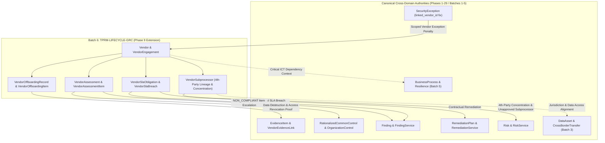
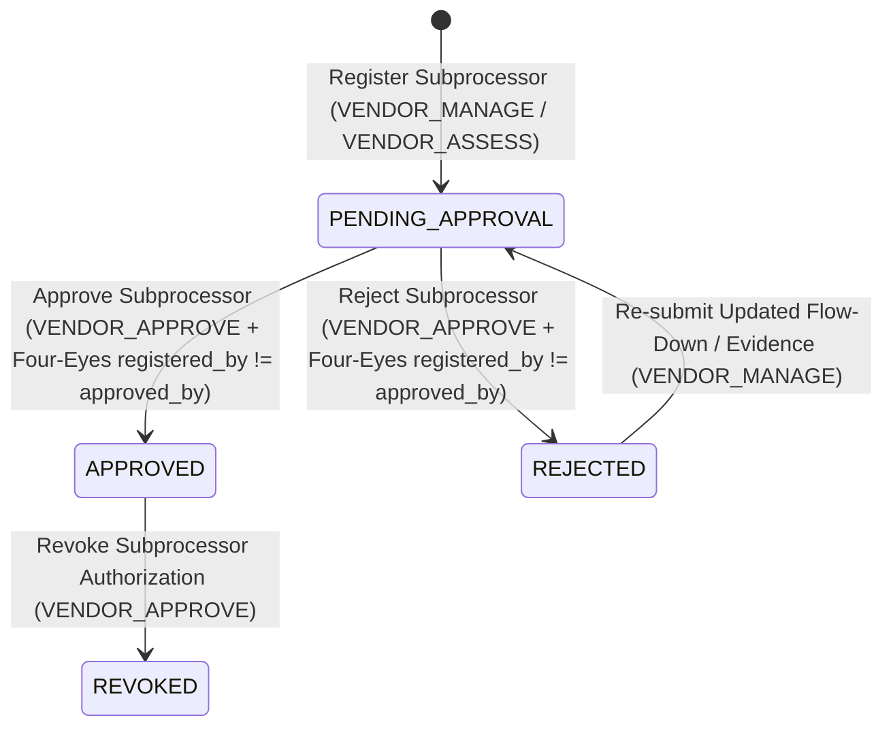
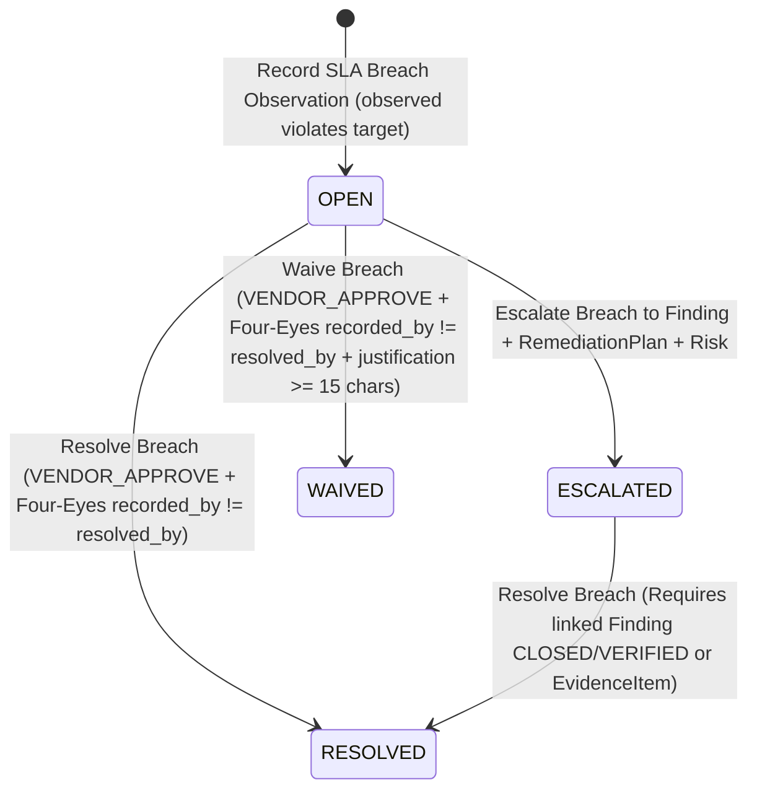
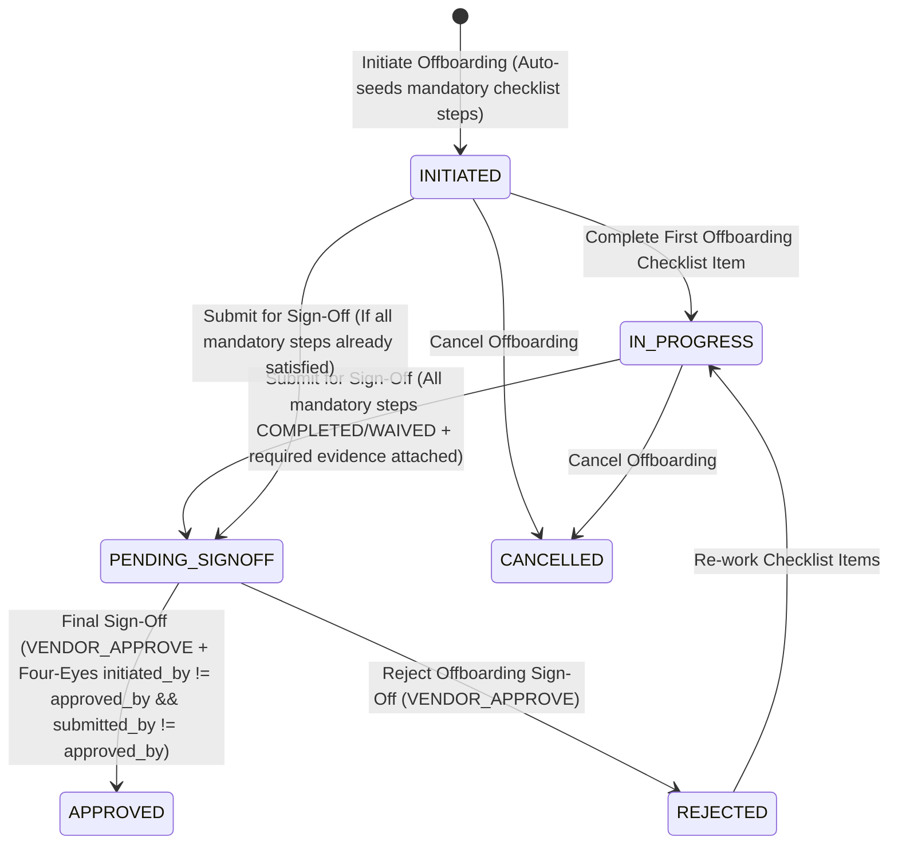

# PHASE 30 — BATCH 6 ARCHITECTURE DISCOVERY
## Third-Party Extended Governance: Fourth-Party Subprocessor Lineage & Concentration Risk, Contractual SLA Assurance, Governed Vendor Offboarding, and Closed-Loop TPRM Remediation (`TPRM-LIFECYCLE-GRC`)

- **Repository**: `https://github.com/Avalar06/ControlSphere.git`
- **Workspace**: `E:\PROJECT WORKSPACE 2\ControlSphere`
- **Branch**: `main`
- **Frozen Pre-Batch-6 Baseline Commit (`HEAD` & `origin/main`)**: `cc4b67aa2434ff47ef680fb5fd7762433bf467a9` (`feat(batch5): implement resilience continuity governance`)
- **Frozen Pre-Batch-6 Alembic Head**: `0026 (head)` (`0026_resilience_continuity_governance_hardening.py`)
- **Planned Batch 6 Alembic Target**: `0027` (`0027_tprm_lifecycle_subprocessor_sla_offboarding.py`, `down_revision = "0026"`)
- **Document Mode**: **ARCHITECTURE DISCOVERY ONLY** (Zero application code, model, service, API, migration, frontend, or test changes)

---

## 1. Executive Summary

Following the completion and verification of **Batches 1 through 5**:
- **Batch 1 (`a3e9b4a`, Alembic `0022`)**: Audit Fieldwork, Sampling & PBC Collaboration (`AUDIT-FIELDWORK-GRC`)
- **Batch 2 (`7b5c795`, Alembic `0023`)**: KRI & Risk Appetite Governance (`KRI-APPETITE-GRC`)
- **Batch 3 (`9c34411`, Alembic `0024`)**: Data Governance, Classification, Retention, Processing Activities, Data Flows & Cross-Border Transfers (`DATA-GOVERNANCE-GRC`)
- **Batch 4 (`812a183`, Alembic `0025`)**: Policy Lifecycle, Multi-Stage Reviews, Version Comparison & Workforce Attestation Campaigns (`POLICY-LIFECYCLE-GRC`)
- **Batch 5 (`cc4b67a`, Alembic `0026`)**: Operational Resilience Continuity Planning, DR Exercise Testing & Empirical RTO/RPO Assurance (`RESILIENCE-CONTINUITY-GRC`)

a comprehensive, repository-wide architectural audit was performed across all **27 domain model modules** (`backend/app/models/*.py`), **29 domain service modules** (`backend/app/services/*.py`), **31 API endpoint routers** (`backend/app/api/v1/endpoints/*.py`), **26 Alembic migrations** (`0001`–`0026`), and **38 frontend pages** (`frontend/src/pages/*.tsx`).

### Key Discovery Finding

The single largest remaining core GRC capability gap—and the domain with the highest concentration of architectural debt, broken cross-domain closed loops, and regulatory exposure—is **Phase 9 Third-Party Risk Management (`backend/app/models/tprm.py`, `backend/app/services/tprm_service.py`, `backend/app/api/v1/endpoints/tprm.py`)**:

1. **Smallest Domain Service & Fat-Router Debt**: `backend/app/services/tprm_service.py` is only **432 lines** (the smallest core GRC domain service in the repository), while `backend/app/api/v1/endpoints/tprm.py` is **1,154 lines** of inline ORM queries and unencapsulated mutations.
2. **Actual Telemetry Defect in `TPRMService.recalculate_vendor_telemetry` (`tprm_service.py` lines 400–410) & `get_vendor_risk_posture` (`endpoints/tprm.py` lines 1145–1146)**:
   - `SecurityException` (`backend/app/models/exception.py`) has `exception_type = THIRD_PARTY_VENDOR`, `linked_organization_control_id`, `linked_policy_id`, and `linked_finding_id`, **but no `linked_vendor_id` foreign key**. Consequently, `TPRMService.recalculate_vendor_telemetry` queries `SecurityException` filtered only by `organization_id` and `exception_type == THIRD_PARTY_VENDOR` without filtering by `vendor_id`—causing a single vendor security exception in the tenant to add `+10.0` residual risk penalty to **every vendor in the organization**.
   - In `endpoints/tprm.py` lines 1145–1146, `get_vendor_risk_posture` hardcodes `finding_penalties=0.0` and `exception_penalties=0.0` in the returned `VendorRiskPostureBreakdown` even when penalties were applied to `residual_risk_score`.
3. **No Fourth-Party Subprocessor Lineage or Supply-Chain Concentration Risk (`VendorSubprocessor`)**:
   - Modern supply-chain regulations (**EU DORA Articles 28–30**, **GDPR Article 28(2) & (4)**, **NIS2 Article 21(2)(d)**, **ISO/IEC 27036**) mandate maintaining a register of fourth-party subprocessors engaged by third-party vendors, enforcing Four-Eyes authorization before a vendor delegates critical or PII-bearing functions to a fourth party, and measuring **fourth-party concentration risk** (e.g., when multiple Tier-1 critical vendors depend on the same fourth-party cloud or payment subprocessor).
4. **No Contractual SLA & Security Obligation Assurance (`VendorSlaObligation` & `VendorSlaBreach`)**:
   - `Vendor` and `VendorEngagement` store static metadata (`contract_start`, `contract_end`, `criticality`), but have zero capability to define enforceable contractual SLAs and security obligations (uptime %, security incident notification window in hours, critical vulnerability patching SLA, right-to-audit notice window, annual SOC 2 delivery SLA) or to record empirical SLA breaches and escalate them into canonical `Finding`, `RemediationPlan`, and `Risk` records.
5. **Ungoverned Vendor Offboarding & Termination (`VendorOffboardingRecord` & `VendorOffboardingItem`)**:
   - In `endpoints/tprm.py` (`update_vendor`, lines 267–291), any user with `VENDOR_MANAGE` can transition a Tier-1 critical vendor with `MASS_ SENSITIVE_PII` and `DIRECT_VPC_VPN` connectivity directly to `OFFBOARDED` or `TERMINATED` via a bare `PATCH /api/v1/vendors/{vendor_id}` call—without revoking credentials/SSO/network access, obtaining a data destruction/return certificate (`EvidenceItem`), closing active `VendorEngagement` records, or enforcing Four-Eyes sign-off (`initiated_by_id != approved_by_id`).
6. **Broken Assessment-to-CAPA Closed Loop**:
   - In `endpoints/tprm.py` lines 710–715, marking a `VendorAssessmentItem` as `NON_COMPLIANT` merely increments a disconnected integer counter (`item.findings_count = max(item.findings_count, 1)`) without creating or linking a canonical Phase 4 `Finding` or Phase 11 `RemediationPlan`.

**Batch 6 (`TPRM-LIFECYCLE-GRC`)** resolves all six gaps inside the existing canonical `tprm` authority without introducing parallel authorities, duplicate risk registries, or new RBAC roles.

---

## 2. Baseline Verification

All mandatory git and Alembic baseline verification commands were executed prior to analysis:

| Check | Command | Verified Output |
| :--- | :--- | :--- |
| Working Tree Status | `git status` | `On branch main` / `Your branch is up to date with 'origin/main'.` / `nothing to commit, working tree clean` |
| Local `HEAD` | `git rev-parse HEAD` | `cc4b67aa2434ff47ef680fb5fd7762433bf467a9` |
| Remote `origin/main` | `git rev-parse origin/main` | `cc4b67aa2434ff47ef680fb5fd7762433bf467a9` |
| Latest Commit | `git log -1 --oneline` | `cc4b67a feat(batch5): implement resilience continuity governance` |
| Active Branch | `git branch --show-current` | `main` |
| Remote Repository | `git remote -v` | `origin https://github.com/Avalar06/ControlSphere.git (fetch/push)` |
| Alembic Migration Head | `python -m alembic heads` | `0026 (head)` |

### Frozen Baseline Chain

| Milestone | Commit SHA | Alembic Revision | Description |
| :--- | :--- | :--- | :--- |
| **Batch 1** | `a3e9b4ab6926789479399e0e56df7138a7640c40` | `0022` | `feat(batch1): implement audit fieldwork governance` |
| **Batch 2** | `7b5c7954c33f6aca44b7a193ad91d1b384188456` | `0023` | `feat(batch2): implement kri appetite governance` |
| **Batch 3** | `9c34411f5cc4f7f5b849e457d2304ea1e9fc00bd` | `0024` | `feat(batch3): implement data governance and lineage` |
| **Batch 4** | `812a18342ff6cec90b31264f1828a60a18bdc57b` | `0025` | `feat(batch4): implement policy lifecycle and workforce attestation governance` |
| **Batch 5** | `cc4b67aa2434ff47ef680fb5fd7762433bf467a9` | `0026` | `feat(batch5): implement resilience continuity governance` |

---

## 3. Current Platform Architecture

ControlSphere is a multi-tenant enterprise cybersecurity GRC platform built on a strict layered architecture:

1. **Database & Migration Layer (`backend/alembic/versions/0001`–`0026`)**:
   - SQLAlchemy 2.0 declarative models (`backend/app/models/`) with tenant-scoped `organization_id` foreign keys on all mutable domain entities.
   - Dual compatibility across PostgreSQL (production) and SQLite (automated test suite with `PRAGMA foreign_keys=ON`).
2. **RBAC & Security Guard Layer (`backend/app/core/permissions.py`, `backend/app/api/deps.py`)**:
   - Six canonical platform roles (`UserRole` in [user.py](file:///e:/PROJECT%20WORKSPACE%202/ControlSphere/backend/app/models/user.py)):
     - `ADMIN`
     - `MANAGER`
     - `GRC_ANALYST`
     - `SECURITY_ANALYST`
     - `AUDITOR`
     - `VIEWER`
   - 76 fine-grained `Permission` enum constants enforced via `require_permission(...)` dependencies in FastAPI routers.
   - Strict tenant scoping (`current_user.organization_id`) and BOLA/IDOR prevention returning HTTP `404 Not Found` for cross-tenant object IDs.
3. **Domain Service Layer (`backend/app/services/*.py`)**:
   - 29 domain services encapsulating state transitions, Four-Eyes Segregation of Duties (`SoD`), cross-domain artifact linking, notifications (`NotificationService`), and immutable audit trail emission (`AuditService.log`).
4. **REST API Layer (`backend/app/api/v1/endpoints/*.py`)**:
   - 31 FastAPI routers mounted under `/api/v1`.
5. **Frontend Application (`frontend/src/`)**:
   - React 18 + TypeScript + Vite + TailwindCSS SPA with 38 pages, typed API clients (`frontend/src/lib/*.ts`), and role-gated UI controls.

---

## 4. Historical Roadmap Reconciliation

Across Phases 1 through 29 (culminating in Batches 1–5), ControlSphere evolved through two major stages:

1. **Phases 1–24 (Foundational & Broad Domain Buildout, Alembic `0001`–`0021`)**:
   - Established the core GRC graph: Multi-Tenant IAM & Audit Logs (`0001`), Frameworks/Controls/Risks/Evidence/Findings (`0002`–`0004`), Policy & Exceptions (`0005`), Cloud/CICD/AI Governance (`0006`–`0008`), Control Harmonization (`0009`), TPRM (`0010`), Continuous Compliance (`0011`), Remediation & Executive Reporting (`0012`), Resilience (`0013`), Threat Vulnerability (`0014`), Incident GRC (`0015`), Privacy GRC (`0016`), Quantitative Risk CRQ (`0017`), Audit GRC (`0018`), KRI Governance (`0019`), Regulatory Change (`0020`), and Data Governance (`0021`).
2. **Phases 25–29 / Batches 1–5 (Deep Enterprise Lifecycle Hardening, Alembic `0022`–`0026`)**:
   - Systematically hardened the shallowest/highest-priority enterprise GRC workflows with Four-Eyes Segregation of Duties, empirical assurance workflows, and closed-loop escalation:
     - **Batch 1 (`0022`)**: Upgraded Phase 19 Audit from basic plans/workpapers to full sampling plans, sample unit evaluation, multi-item PBC collaboration, and Four-Eyes finding sign-off.
     - **Batch 2 (`0023`)**: Upgraded Phase 20 KRI from basic indicators to formal Risk Appetite Statements, breach workflows, waiver approvals, and automated escalation.
     - **Batch 3 (`0024`)**: Upgraded Phase 22 Data Governance from basic assets to ROPA processing activities, lineage flows, cross-border transfer mechanisms, and retention disposal verification.
     - **Batch 4 (`0025`)**: Upgraded Phase 5 Policy Governance from simple draft/publish to multi-stage review cycles, version diffing, workforce attestation campaigns, and non-attestation escalation.
     - **Batch 5 (`0026`)**: Upgraded Phase 13 Resilience from static BIA/continuity stubs to governed Continuity Plans, DR Exercise Scenarios, per-asset Empirical Recovery Runs, and RTO/RPO variance escalation.

---

## 5. Existing Authority Inventory

Every domain model, service, and router in the repository was inventoried to verify current line counts, table counts, and maturity levels:

| Domain Area | Model File (Lines) | Service File (Lines) | Endpoint File (Lines) | Canonical Tables | Maturity Status |
| :--- | :--- | :--- | :--- | :--- | :--- |
| **Control & Framework Library** | [control.py](file:///e:/PROJECT%20WORKSPACE%202/ControlSphere/backend/app/models/control.py) (198), [framework.py](file:///e:/PROJECT%20WORKSPACE%202/ControlSphere/backend/app/models/framework.py) (106) | [control_service.py](file:///e:/PROJECT%20WORKSPACE%202/ControlSphere/backend/app/services/control_service.py) (890), [framework_service.py](file:///e:/PROJECT%20WORKSPACE%202/ControlSphere/backend/app/services/framework_service.py) (646) | [controls.py](file:///e:/PROJECT%20WORKSPACE%202/ControlSphere/backend/app/api/v1/endpoints/controls.py) (562), [frameworks.py](file:///e:/PROJECT%20WORKSPACE%202/ControlSphere/backend/app/api/v1/endpoints/frameworks.py) (581) | `frameworks`, `controls`, `organization_controls`, `control_mappings` | Complete |
| **Harmonization (CCF)** | [harmonization.py](file:///e:/PROJECT%20WORKSPACE%202/ControlSphere/backend/app/models/harmonization.py) (176) | [harmonization_service.py](file:///e:/PROJECT%20WORKSPACE%202/ControlSphere/backend/app/services/harmonization_service.py) (566) | [harmonization.py](file:///e:/PROJECT%20WORKSPACE%202/ControlSphere/backend/app/api/v1/endpoints/harmonization.py) (756) | `rationalized_common_controls`, `common_control_framework_mappings`, `common_control_org_links` | Complete |
| **Risk Register & CRQ** | [risk.py](file:///e:/PROJECT%20WORKSPACE%202/ControlSphere/backend/app/models/risk.py) (144), [quant_risk.py](file:///e:/PROJECT%20WORKSPACE%202/ControlSphere/backend/app/models/quant_risk.py) (353) | [risk_service.py](file:///e:/PROJECT%20WORKSPACE%202/ControlSphere/backend/app/services/risk_service.py) (557), [quant_risk_service.py](file:///e:/PROJECT%20WORKSPACE%202/ControlSphere/backend/app/services/quant_risk_service.py) (634) | [risks.py](file:///e:/PROJECT%20WORKSPACE%202/ControlSphere/backend/app/api/v1/endpoints/risks.py) (418), [quant_risk.py](file:///e:/PROJECT%20WORKSPACE%202/ControlSphere/backend/app/api/v1/endpoints/quant_risk.py) (495) | `risks`, `risk_control_mappings`, `risk_scenarios`, `loss_simulations` | Complete |
| **Evidence Vault** | [evidence.py](file:///e:/PROJECT%20WORKSPACE%202/ControlSphere/backend/app/models/evidence.py) (226) | [evidence_service.py](file:///e:/PROJECT%20WORKSPACE%202/ControlSphere/backend/app/services/evidence_service.py) (519) | [evidence.py](file:///e:/PROJECT%20WORKSPACE%202/ControlSphere/backend/app/api/v1/endpoints/evidence.py) (566) | `evidence_items`, `evidence_control_links`, `evidence_reviews` | Complete |
| **Findings & Remediation (CAPA)** | [finding.py](file:///e:/PROJECT%20WORKSPACE%202/ControlSphere/backend/app/models/finding.py) (109), [remediation.py](file:///e:/PROJECT%20WORKSPACE%202/ControlSphere/backend/app/models/remediation.py) (233) | [finding_service.py](file:///e:/PROJECT%20WORKSPACE%202/ControlSphere/backend/app/services/finding_service.py) (449), [remediation_service.py](file:///e:/PROJECT%20WORKSPACE%202/ControlSphere/backend/app/services/remediation_service.py) (597) | [findings.py](file:///e:/PROJECT%20WORKSPACE%202/ControlSphere/backend/app/api/v1/endpoints/findings.py) (298), [remediation.py](file:///e:/PROJECT%20WORKSPACE%202/ControlSphere/backend/app/api/v1/endpoints/remediation.py) (573) | `findings`, `remediation_plans`, `remediation_tasks`, `remediation_verifications` | Complete |
| **Audit Fieldwork (Batch 1)** | [audit_grc.py](file:///e:/PROJECT%20WORKSPACE%202/ControlSphere/backend/app/models/audit_grc.py) (693) | [audit_grc_service.py](file:///e:/PROJECT%20WORKSPACE%202/ControlSphere/backend/app/services/audit_grc_service.py) (1,341) | [audit_grc.py](file:///e:/PROJECT%20WORKSPACE%202/ControlSphere/backend/app/api/v1/endpoints/audit_grc.py) (567) | `audit_engagements`, `audit_workpapers`, `audit_pbc_requests`, `audit_pbc_items`, `audit_sampling_plans`, `audit_sample_units`, `audit_findings` | Hardened (Batch 1) |
| **KRI & Appetite (Batch 2)** | [kri.py](file:///e:/PROJECT%20WORKSPACE%202/ControlSphere/backend/app/models/kri.py) (624) | [kri_service.py](file:///e:/PROJECT%20WORKSPACE%202/ControlSphere/backend/app/services/kri_service.py) (1,384) | [kri.py](file:///e:/PROJECT%20WORKSPACE%202/ControlSphere/backend/app/api/v1/endpoints/kri.py) (642) | `risk_appetite_statements`, `key_risk_indicators`, `kri_measurements`, `kri_breaches`, `kri_appetite_waivers` | Hardened (Batch 2) |
| **Data Governance (Batch 3)** | [data_governance.py](file:///e:/PROJECT%20WORKSPACE%202/ControlSphere/backend/app/models/data_governance.py) (679) | [data_governance_service.py](file:///e:/PROJECT%20WORKSPACE%202/ControlSphere/backend/app/services/data_governance_service.py) (1,390) | [data_governance.py](file:///e:/PROJECT%20WORKSPACE%202/ControlSphere/backend/app/api/v1/endpoints/data_governance.py) (617) | `data_assets`, `data_retention_policies`, `data_disposal_records`, `data_processing_activities`, `data_flows`, `cross_border_transfers` | Hardened (Batch 3) |
| **Policy Lifecycle (Batch 4)** | [policy.py](file:///e:/PROJECT%20WORKSPACE%202/ControlSphere/backend/app/models/policy.py) (350) | [policy_service.py](file:///e:/PROJECT%20WORKSPACE%202/ControlSphere/backend/app/services/policy_service.py) (1,452) | [policies.py](file:///e:/PROJECT%20WORKSPACE%202/ControlSphere/backend/app/api/v1/endpoints/policies.py) (784) | `policies`, `policy_versions`, `policy_control_mappings`, `policy_acknowledgements`, `policy_review_cycles`, `policy_review_decisions`, `policy_attestation_campaigns` | Hardened (Batch 4) |
| **Resilience Continuity (Batch 5)** | [resilience.py](file:///e:/PROJECT%20WORKSPACE%202/ControlSphere/backend/app/models/resilience.py) (647) | [resilience_service.py](file:///e:/PROJECT%20WORKSPACE%202/ControlSphere/backend/app/services/resilience_service.py) (1,366) | [resilience.py](file:///e:/PROJECT%20WORKSPACE%202/ControlSphere/backend/app/api/v1/endpoints/resilience.py) (954) | `business_processes`, `process_asset_dependencies`, `business_impact_assessments`, `resilience_continuity_plans`, `resilience_continuity_plan_steps`, `resilience_exercises`, `resilience_recovery_runs` | Hardened (Batch 5) |
| **Third-Party Risk (Phase 9 TPRM)** | [tprm.py](file:///e:/PROJECT%20WORKSPACE%202/ControlSphere/backend/app/models/tprm.py) (**411**) | [tprm_service.py](file:///e:/PROJECT%20WORKSPACE%202/ControlSphere/backend/app/services/tprm_service.py) (**432**) | [tprm.py](file:///e:/PROJECT%20WORKSPACE%202/ControlSphere/backend/app/api/v1/endpoints/tprm.py) (**1,154**) | `vendors`, `vendor_engagements`, `vendor_assessments`, `vendor_assessment_items`, `vendor_evidence_links` | **Material Gap (Batch 6 Target)** |
| **Security Exceptions** | [exception.py](file:///e:/PROJECT%20WORKSPACE%202/ControlSphere/backend/app/models/exception.py) (110) | [exception_service.py](file:///e:/PROJECT%20WORKSPACE%202/ControlSphere/backend/app/services/exception_service.py) (656) | [exceptions.py](file:///e:/PROJECT%20WORKSPACE%202/ControlSphere/backend/app/api/v1/endpoints/exceptions.py) (355) | `security_exceptions`, `exception_compensating_controls` | Operational (Missing `linked_vendor_id` FK) |
| **Regulatory Change** | [regulatory.py](file:///e:/PROJECT%20WORKSPACE%202/ControlSphere/backend/app/models/regulatory.py) (435) | [regulatory_service.py](file:///e:/PROJECT%20WORKSPACE%202/ControlSphere/backend/app/services/regulatory_service.py) (527) | [regulatory.py](file:///e:/PROJECT%20WORKSPACE%202/ControlSphere/backend/app/api/v1/endpoints/regulatory.py) (473) | `regulatory_sources`, `regulatory_mandates`, `regulatory_change_events`, `regulatory_impact_assessments`, `regulatory_impact_control_links` | Operational |
| **Incident, Privacy, Threat, Cloud, CICD, AI** | `incident_grc.py` (296), `privacy_grc.py` (316), `threat_vuln.py` (325), `cloud.py` (255), `cicd.py` (212), `ai.py` (290) | `incident_grc_service.py` (716), `privacy_grc_service.py` (852), `threat_vuln_service.py` (694), `cloud_service.py` (721), `cicd_service.py` (607), `ai_governance_service.py` (665) | Corresponding routers in `endpoints/` | Canonical tables per domain | Operational |

---

## 6. Completed Capability Matrix

| Batch / Phase | Capability Code | Core Deliverables Verified in `main` | Alembic Revision | Test Suite Verification |
| :--- | :--- | :--- | :--- | :--- |
| **Batch 1** | `AUDIT-FIELDWORK-GRC` | `AuditSamplingPlan`, `AuditSampleUnit`, `AuditPBCItem`, Four-Eyes workpaper & finding sign-off, closed-loop finding escalation | `0022` | `test_batch1_audit_fieldwork_governance.py` (PASS) |
| **Batch 2** | `KRI-APPETITE-GRC` | `RiskAppetiteStatement`, `KRIBreach`, `KRIAppetiteWaiver`, Four-Eyes appetite & waiver approval, breach-to-finding/risk escalation | `0023` | `test_batch2_kri_appetite_governance.py` (PASS) |
| **Batch 3** | `DATA-GOVERNANCE-GRC` | `DataProcessingActivity`, `DataFlow`, `CrossBorderTransfer`, `DataDisposalRecord` verification, retention breach escalation | `0024` | `test_batch3_data_governance_lineage.py` (PASS) |
| **Batch 4** | `POLICY-LIFECYCLE-GRC` | `PolicyReviewCycle`, `PolicyReviewDecision`, `PolicyAttestationCampaign`, version diffing, non-attestation escalation | `0025` | `test_batch4_policy_lifecycle_governance.py` (PASS) |
| **Batch 5** | `RESILIENCE-CONTINUITY-GRC` | `ResilienceContinuityPlan`, `ResilienceContinuityPlanStep`, `ResilienceExercise`, `ResilienceRecoveryRun`, empirical RTO/RPO breach escalation | `0026` | `test_batch5_resilience_continuity_governance.py` (45 passed), full backend (1,184 passed) |

---

## 7. Remaining Material Capability Gaps

Inspection of the codebase after Batch 5 revealed four remaining areas with potential capability extensions:

### Gap 1: Phase 9 Third-Party Supply Chain, Subprocessors, Contractual SLAs, Offboarding & Closed-Loop TPRM (`tprm.py` / `tprm_service.py` / `endpoints/tprm.py`)
1. **No Fourth-Party / Subprocessor Lineage & Concentration Risk**:
   - No model or table exists to track fourth-party subprocessors engaged by a vendor (`VendorSubprocessor`), their hosting region/jurisdiction, their data classification access, or whether a vendor's subprocessor is itself another registered `Vendor` in the tenant's supply chain (`subprocessor_vendor_id`).
   - No mechanism exists to require Four-Eyes approval before authorizing a critical or PII-handling fourth-party subprocessor (`PENDING_APPROVAL -> APPROVED / REJECTED -> REVOKED`).
   - No mechanism exists to detect **fourth-party concentration risk** (e.g., when $\ge 2$ active Tier-1/Tier-2 vendors depend on the same fourth-party provider or canonical `subprocessor_vendor_id`).
2. **No Contractual SLA & Security Obligation Assurance**:
   - No model or table exists to codify contractual security & resilience SLAs (`VendorSlaObligation`)—such as availability uptime (`>= 99.95%`), security incident notification window (`<= 24 hours`), critical vulnerability remediation window (`<= 7 days`), or right-to-audit notice window—or to record empirical SLA measurements/breaches (`VendorSlaBreach`) and escalate breaches to canonical `Finding`, `RemediationPlan`, and `Risk` records.
3. **Ungoverned Vendor Offboarding & Termination**:
   - In [endpoints/tprm.py](file:///e:/PROJECT%20WORKSPACE%202/ControlSphere/backend/app/api/v1/endpoints/tprm.py#L267-L291), `PATCH /api/v1/vendors/{vendor_id}` allows a single actor to transition `vendor_status` directly to `OFFBOARDED` or `TERMINATED` with zero verification of data destruction/return, credential/SSO/VPN revocation, active engagement termination, or Four-Eyes sign-off.
4. **Broken Assessment-to-CAPA Escalation & Telemetry Bug**:
   - In [endpoints/tprm.py](file:///e:/PROJECT%20WORKSPACE%202/ControlSphere/backend/app/api/v1/endpoints/tprm.py#L710-L715), `NON_COMPLIANT` assessment items only bump an integer `findings_count` instead of creating/linking a canonical `Finding` and `RemediationPlan`.
   - In [tprm_service.py](file:///e:/PROJECT%20WORKSPACE%202/ControlSphere/backend/app/services/tprm_service.py#L400-L410), `recalculate_vendor_telemetry` queries `SecurityException` without vendor scoping because [exception.py](file:///e:/PROJECT%20WORKSPACE%202/ControlSphere/backend/app/models/exception.py#L70-L73) lacks `linked_vendor_id`, and [endpoints/tprm.py](file:///e:/PROJECT%20WORKSPACE%202/ControlSphere/backend/app/api/v1/endpoints/tprm.py#L1145-L1146) hardcodes `finding_penalties=0.0` and `exception_penalties=0.0` in the posture breakdown.

### Gap 2: Phase 5 Security Exceptions Periodic Compensating Control Verification (`exception.py` / `exception_service.py`)
- `SecurityException` (`110` lines in `exception.py`, `656` lines in `exception_service.py`) already enforces Four-Eyes approval (`requested_by_id != reviewer_id`), expiry sweep, and compensating control linkage (`ExceptionCompensatingControl`), though it lacks periodic compensating-control effectiveness re-reviews. Note that its missing `linked_vendor_id` FK directly impacts TPRM telemetry and can be resolved cleanly as part of Batch 6.

### Gap 3: Phase 21 Regulatory Change Horizon Automation (`regulatory.py` / `regulatory_service.py`)
- `RegulatorySource`, `RegulatoryMandate`, `RegulatoryChangeEvent`, `RegulatoryImpactAssessment`, and `RegulatoryImpactControlLink` (`435` lines in `regulatory.py`, `527` lines in `regulatory_service.py`) already implement the full staged-to-active change lifecycle and Four-Eyes impact approval.

### Gap 4: AI Analyst Copilot & Tenant Settings (`AICopilotPage.tsx`, `SettingsPage.tsx`)
- Non-core presentation/utility surfaces rather than core GRC lifecycle authorities.

---

## 8. Candidate Batch 6 Analysis

In accordance with strict architectural discovery governance, the candidate capabilities are compared below on **purely factual repository criteria** without subjective scoring or composite numerical rankings:

| Dimension | Candidate A: `TPRM-LIFECYCLE-GRC` (Phase 9 TPRM Extended Governance) | Candidate B: `EXCEPTION-WAIVER-GRC` (Phase 5 Security Exceptions Extension) | Candidate C: `REGULATORY-HORIZON-GRC` (Phase 21 Regulatory Extension) | Candidate D: `AI-COPILOT-GRC` (AI Analyst Workspace) |
| :--- | :--- | :--- | :--- | :--- |
| **Canonical Model File & Line Count** | `backend/app/models/tprm.py` (411 lines, 5 tables) | `backend/app/models/exception.py` (110 lines, 2 tables) | `backend/app/models/regulatory.py` (435 lines, 5 tables) | `backend/app/models/ai.py` (290 lines, 3 tables) |
| **Canonical Service File & Line Count** | `backend/app/services/tprm_service.py` (432 lines) | `backend/app/services/exception_service.py` (656 lines) | `backend/app/services/regulatory_service.py` (527 lines) | `backend/app/services/ai_governance_service.py` (665 lines) |
| **Canonical Router File & Line Count** | `backend/app/api/v1/endpoints/tprm.py` (1,154 lines — fat router) | `backend/app/api/v1/endpoints/exceptions.py` (355 lines) | `backend/app/api/v1/endpoints/regulatory.py` (473 lines) | `backend/app/api/v1/endpoints/ai_governance.py` (580 lines) |
| **Unclosed Loop / Active Telemetry Defect in `main`** | Yes: (1) `recalculate_vendor_telemetry` queries `SecurityException` without vendor filter (`tprm_service.py:401-409`); (2) `finding_penalties` & `exception_penalties` hardcoded to `0.0` in `endpoints/tprm.py:1145-1146`; (3) `NON_COMPLIANT` assessment items do not create/link canonical `Finding` or `RemediationPlan`; (4) `OFFBOARDED`/`TERMINATED` vendor status transition has no offboarding verification or Four-Eyes gate | Partial: Missing `linked_vendor_id` on `SecurityException` (which directly causes the TPRM telemetry bug in Candidate A) | No active calculation defects; already integrates with `Control` and `Finding` | No active core GRC calculation defects |
| **Missing Sub-Domain Lifecycle Entities** | Fourth-Party Subprocessors (`VendorSubprocessor`), Contractual SLA Obligations (`VendorSlaObligation`), Empirical SLA Breaches (`VendorSlaBreach`), Governed Offboarding Records & Checklist Items (`VendorOffboardingRecord`, `VendorOffboardingItem`) | Compensating Control Periodic Verification log | Regulatory Obligation Clause decomposition | Prompt/Session persistence |
| **Applicable External Regulatory Mandates** | EU DORA Art. 28–30 (ICT Third-Party & Subcontracting Chain), GDPR Art. 28(2)/(4) (Subprocessors & Data Return/Deletion), NIS2 Art. 21(2)(d) (Supply Chain Security), ISO/IEC 27036, SOC 2 CC9.2 | ISO 27001 Clause 6.1.3, SOC 2 CC3.2 | ISO 27001 Clause 4.2, SOX, DORA | EU AI Act, NIST AI RMF (already covered in Phase 8 `ai.py`) |

---

## 9. Candidate Dependency Analysis

1. **Why `TPRM-LIFECYCLE-GRC` Depends on Completed Batches 1–5**:
   - **Batch 3 (`DATA-GOVERNANCE-GRC`)** established cross-border transfer governance and data disposal verification patterns; Batch 6 complements Batch 3 by governing **fourth-party subprocessors** (`VendorSubprocessor`) and **vendor offboarding data destruction/return verification** (`VendorOffboardingRecord`).
   - **Batch 5 (`RESILIENCE-CONTINUITY-GRC`)** hardened internal business process continuity and empirical RTO/RPO recovery runs; Batch 6 completes the external operational resilience perimeter required by **EU DORA Articles 28–30** by governing **third-party contractual SLA obligations, empirical SLA breaches, and fourth-party concentration risk**.
2. **Why `TPRM-LIFECYCLE-GRC` Also Resolves the Key Cross-Domain Gap in Candidate B (`SecurityException`)**:
   - By adding `linked_vendor_id` (`ForeignKey("vendors.id", ondelete="SET NULL")`) to `SecurityException` in `backend/app/models/exception.py` as part of Batch 6, we simultaneously fix the unscoped vendor exception bug in `TPRMService.recalculate_vendor_telemetry` and enable true vendor-scoped exception waivers.

---

## 10. Recommended Capability

### Selected Batch 6 Capability: `TPRM-LIFECYCLE-GRC`
**Third-Party Extended Governance: Fourth-Party Subprocessor Lineage & Concentration Risk, Contractual SLA Assurance, Governed Vendor Offboarding, and Closed-Loop TPRM Remediation**

### Core Architectural Deliverables of Batch 6

1. **Fourth-Party Subprocessor Registry, Four-Eyes Authorization & Concentration Risk Engine (`VendorSubprocessor`)**:
   - Register fourth-party subprocessors under any `Vendor`, supporting both linked canonical vendors (`subprocessor_vendor_id -> vendors.id`) and external fourth-party entities (`subprocessor_name`, `service_category`, `hosting_region`, `jurisdiction`, `criticality`, `data_classification`, `pii_access`).
   - Enforce a strict Four-Eyes authorization state machine (`PENDING_APPROVAL -> APPROVED | REJECTED`, `APPROVED -> REVOKED`) where `registered_by_id != approved_by_id`.
   - Compute deterministic **Fourth-Party Concentration Risk** across the tenant (`GET /api/v1/vendors/concentration-risk`): identify fourth-party subprocessors (by normalized name/domain or `subprocessor_vendor_id`) shared across multiple Tier-1/Tier-2 vendors, calculate blast-radius exposure across critical engagements, and feed unapproved/revoked critical subprocessors into `TPRMService.recalculate_vendor_telemetry`.
2. **Contractual SLA & Security Obligation Monitoring and Breach Escalation (`VendorSlaObligation` & `VendorSlaBreach`)**:
   - Define measurable contractual obligations per vendor/engagement (`AVAILABILITY_UPTIME`, `INCIDENT_NOTIFICATION_HOURS`, `VULN_REMEDIATION_DAYS`, `RTO_HOURS`, `RPO_HOURS`, `AUDIT_REPORT_DELIVERY_DAYS`, `DATA_DELETION_DAYS`) with comparison operators (`GTE` for uptime %, `LTE` for hours/days), target values, warning thresholds, and contractual penalty clauses.
   - Record empirical SLA observations/breaches (`VendorSlaBreach`). When an observation violates the contractual target (`GTE` or `LTE`), deterministically compute breach severity (`MINOR`, `MAJOR`, `CRITICAL`), update vendor residual risk telemetry, and support closed-loop escalation (`POST /api/v1/vendors/{vendor_id}/sla-breaches/{breach_id}/escalate`) that creates or links canonical `Finding`, `RemediationPlan`, and `Risk` records.
   - Enforce Four-Eyes Segregation of Duties when resolving or waiving an SLA breach (`recorded_by_id != resolved_by_id`).
3. **Governed Vendor Offboarding & Termination Workflow (`VendorOffboardingRecord` & `VendorOffboardingItem`)**:
   - Initiate a structured offboarding workflow (`INITIATED -> IN_PROGRESS -> PENDING_SIGNOFF -> APPROVED | REJECTED`) when a vendor relationship ends or is terminated for cause.
   - Auto-seed mandatory offboarding verification checklist items (`ACCESS_REVOCATION`, `DATA_DESTRUCTION_OR_RETURN`, `ENGAGEMENT_TERMINATION`, `EVIDENCE_ARCHIVAL`, `FINANCIAL_CONTRACT_CLOSEOUT`) tailored to the vendor's active engagements (e.g., requiring `EvidenceItem` attestation for `DATA_DESTRUCTION_OR_RETURN` when `pii_access != NO_PII_ACCESS` or `data_classification in (CONFIDENTIAL, RESTRICTED)`).
   - Enforce Four-Eyes sign-off (`initiated_by_id != approved_by_id`) on `POST /api/v1/vendors/{vendor_id}/offboarding/{offboarding_id}/approve`, automatically transitioning active engagements to `TERMINATED` and transitioning the vendor to `OFFBOARDED` or `TERMINATED`.
   - Harden `PATCH /api/v1/vendors/{vendor_id}` so transitioning an `ACTIVE` or `CONDITIONAL` vendor with active engagements or regulated data access to `OFFBOARDED` / `TERMINATED` is blocked (`400 Bad Request`) unless an `APPROVED` `VendorOffboardingRecord` exists (while preserving backward-compatible status transitions for legacy/simple test fixtures that have no active engagements or regulated data).
4. **Closed-Loop Vendor Assessment Item Escalation & Telemetry Bug Fixes**:
   - Extend `VendorAssessmentItem` with `linked_finding_id` (`ForeignKey("findings.id")`), `linked_remediation_plan_id` (`ForeignKey("remediation_plans.id")`), and `linked_risk_id` (`ForeignKey("risks.id")`), and provide `POST /api/v1/vendors/assessments/{assessment_id}/items/{item_id}/escalate` to create/link canonical Phase 4 `Finding`, Phase 11 `RemediationPlan`, and Phase 2 `Risk` artifacts from `NON_COMPLIANT` or `PARTIAL` assessment items.
   - Add `linked_vendor_id` (`ForeignKey("vendors.id")`) to `SecurityException` and fix `TPRMService.recalculate_vendor_telemetry` so vendor exception penalties and vendor finding penalties are accurately scoped to the specific vendor and accurately returned in `VendorRiskPostureBreakdown` (`finding_penalties`, `exception_penalties`, `sla_breach_penalties`, `subprocessor_penalties`).

---

## 11. Authority Matrix

To ensure zero architectural duplication across the platform, Batch 6 strictly adheres to the following single-authority boundaries:

| Concept / Artifact | Canonical Authority Model & Table | Canonical Service | Batch 6 Role |
| :--- | :--- | :--- | :--- |
| Third-Party Vendor & Inherent/Residual Scoring | `Vendor` (`vendors` in `tprm.py`) | `TPRMService` (`tprm_service.py`) | **Extended in-place** with SLA breach, subprocessor, and vendor-scoped finding/exception telemetry |
| Vendor Engagement & Inherent Risk Factors | `VendorEngagement` (`vendor_engagements` in `tprm.py`) | `TPRMService` | **Reused in-place**; linked to SLA obligations and offboarding closure checks |
| Vendor Due-Diligence Assessment & Items | `VendorAssessment`, `VendorAssessmentItem` (`tprm.py`) | `TPRMService` | **Extended in-place** with `linked_finding_id`, `linked_remediation_plan_id`, `linked_risk_id` on `VendorAssessmentItem` |
| Fourth-Party Subprocessors & Concentration | `VendorSubprocessor` (`vendor_subprocessors` in `tprm.py`) | `TPRMService` | **New additive model in `tprm.py`** |
| Contractual SLA Targets & Empirical Breaches | `VendorSlaObligation`, `VendorSlaBreach` (`tprm.py`) | `TPRMService` | **New additive models in `tprm.py`** |
| Vendor Offboarding & Checklist Verification | `VendorOffboardingRecord`, `VendorOffboardingItem` (`tprm.py`) | `TPRMService` | **New additive models in `tprm.py`** |
| Security Exceptions & Vendor Risk Waivers | `SecurityException` (`security_exceptions` in `exception.py`) | `ExceptionService` (`exception_service.py`) | **Extended in-place** with `linked_vendor_id` FK (`vendors.id`) |
| Control Deficiencies & Findings | `Finding` (`findings` in `finding.py`) | `FindingService` (`finding_service.py`) | **Reused via FK** (`linked_finding_id`) from `VendorAssessmentItem` and `VendorSlaBreach` |
| Corrective Action Plans (CAPA) | `RemediationPlan` (`remediation_plans` in `remediation.py`) | `RemediationService` (`remediation_service.py`) | **Reused via FK** (`linked_remediation_plan_id`) from `VendorAssessmentItem` and `VendorSlaBreach` |
| Enterprise Risk Register | `Risk` (`risks` in `risk.py`) | `RiskService` (`risk_service.py`) | **Reused via FK** (`linked_risk_id`) from `VendorAssessmentItem`, `VendorSlaBreach`, and `VendorSubprocessor` |
| Immutable Evidence Artifacts | `EvidenceItem` (`evidence_items` in `evidence.py`) | `EvidenceService` (`evidence_service.py`) | **Reused via FK** (`evidence_item_id`) on `VendorSlaBreach` and `VendorOffboardingItem` |

---

## 12. Data Model Analysis

All schema additions are strictly additive at Alembic revision `0027` (`down_revision = "0026"`).

### 12.1 Additive Columns on Existing Tables

#### 1. `security_exceptions` (`backend/app/models/exception.py`)
| Column | Type | Nullable | Constraints / Indexes | Purpose |
| :--- | :--- | :--- | :--- | :--- |
| `linked_vendor_id` | `Integer` | `True` | `ForeignKey("vendors.id", ondelete="SET NULL")`, `index=True` | Scopes `THIRD_PARTY_VENDOR` security exceptions to a specific `Vendor`, fixing the tenant-wide penalty bug in `TPRMService.recalculate_vendor_telemetry`. |

#### 2. `vendor_assessment_items` (`backend/app/models/tprm.py`)
| Column | Type | Nullable | Constraints / Indexes | Purpose |
| :--- | :--- | :--- | :--- | :--- |
| `linked_finding_id` | `Integer` | `True` | `ForeignKey("findings.id", ondelete="SET NULL")`, `index=True` | Canonical Phase 4 `Finding` escalated from a `NON_COMPLIANT` or `PARTIAL` vendor assessment item. |
| `linked_remediation_plan_id` | `Integer` | `True` | `ForeignKey("remediation_plans.id", ondelete="SET NULL")`, `index=True` | Canonical Phase 11 `RemediationPlan` (CAPA) tracking vendor remediation. |
| `linked_risk_id` | `Integer` | `True` | `ForeignKey("risks.id", ondelete="SET NULL")`, `index=True` | Canonical Phase 2 `Risk` linked or created upon assessment item escalation. |
| `escalated_by_id` | `Integer` | `True` | `ForeignKey("users.id", ondelete="SET NULL")` | Actor who escalated the assessment item. |
| `escalated_at` | `DateTime(timezone=True)` | `True` | — | Timestamp of closed-loop escalation. |

#### 3. `vendors` (`backend/app/models/tprm.py`)
| Column | Type | Nullable | Default | Purpose |
| :--- | :--- | :--- | :--- | :--- |
| `open_sla_breaches_count` | `Integer` | `False` | `0` | Denormalized count of open (`OPEN` / `INVESTIGATING` / `ESCALATED`) SLA breaches for fast portfolio filtering. |
| `approved_subprocessors_count` | `Integer` | `False` | `0` | Denormalized count of `APPROVED` fourth-party subprocessors. |
| `offboarding_completed_at` | `DateTime(timezone=True)` | `True` | `None` | Timestamp when governed offboarding was formally approved. |

---

### 12.2 New Canonical Enums in `backend/app/models/tprm.py`

1. `VendorSubprocessorStatusEnum(str, enum.Enum)`:
   - `PENDING_APPROVAL = "PENDING_APPROVAL"`
   - `APPROVED = "APPROVED"`
   - `REJECTED = "REJECTED"`
   - `REVOKED = "REVOKED"`
2. `VendorSlaMetricTypeEnum(str, enum.Enum)`:
   - `AVAILABILITY_UPTIME = "AVAILABILITY_UPTIME"`
   - `INCIDENT_NOTIFICATION_HOURS = "INCIDENT_NOTIFICATION_HOURS"`
   - `VULN_REMEDIATION_DAYS = "VULN_REMEDIATION_DAYS"`
   - `RTO_HOURS = "RTO_HOURS"`
   - `RPO_HOURS = "RPO_HOURS"`
   - `AUDIT_REPORT_DELIVERY_DAYS = "AUDIT_REPORT_DELIVERY_DAYS"`
   - `DATA_DELETION_DAYS = "DATA_DELETION_DAYS"`
3. `VendorSlaComparisonOperatorEnum(str, enum.Enum)`:
   - `GTE = "GTE"` (observed value must be $\ge$ target value, e.g., Uptime $\ge 99.9\%$)
   - `LTE = "LTE"` (observed value must be $\le$ target value, e.g., Incident Notification $\le 24$ hours)
4. `VendorSlaObligationStatusEnum(str, enum.Enum)`:
   - `ACTIVE = "ACTIVE"`
   - `SUSPENDED = "SUSPENDED"`
   - `RETIRED = "RETIRED"`
5. `VendorSlaBreachSeverityEnum(str, enum.Enum)`:
   - `MINOR = "MINOR"`
   - `MAJOR = "MAJOR"`
   - `CRITICAL = "CRITICAL"`
6. `VendorSlaBreachStatusEnum(str, enum.Enum)`:
   - `OPEN = "OPEN"`
   - `ESCALATED = "ESCALATED"`
   - `RESOLVED = "RESOLVED"`
   - `WAIVED = "WAIVED"`
7. `VendorOffboardingStatusEnum(str, enum.Enum)`:
   - `INITIATED = "INITIATED"`
   - `IN_PROGRESS = "IN_PROGRESS"`
   - `PENDING_SIGNOFF = "PENDING_SIGNOFF"`
   - `APPROVED = "APPROVED"`
   - `REJECTED = "REJECTED"`
   - `CANCELLED = "CANCELLED"`
8. `VendorOffboardingTargetStatusEnum(str, enum.Enum)`:
   - `OFFBOARDED = "OFFBOARDED"`
   - `TERMINATED = "TERMINATED"`
9. `VendorOffboardingStepTypeEnum(str, enum.Enum)`:
   - `ACCESS_REVOCATION = "ACCESS_REVOCATION"`
   - `DATA_DESTRUCTION_OR_RETURN = "DATA_DESTRUCTION_OR_RETURN"`
   - `ENGAGEMENT_TERMINATION = "ENGAGEMENT_TERMINATION"`
   - `EVIDENCE_ARCHIVAL = "EVIDENCE_ARCHIVAL"`
   - `FINANCIAL_CONTRACT_CLOSEOUT = "FINANCIAL_CONTRACT_CLOSEOUT"`
10. `VendorOffboardingItemStatusEnum(str, enum.Enum)`:
    - `PENDING = "PENDING"`
    - `COMPLETED = "COMPLETED"`
    - `WAIVED = "WAIVED"`

---

### 12.3 New Canonical Tables in `backend/app/models/tprm.py`

#### Table 1: `vendor_subprocessors` (`VendorSubprocessor`)
Tracks fourth-party subprocessors engaged by a third-party `Vendor` (DORA Art. 29 / GDPR Art. 28(2)/(4)):

| Column | Type | Nullable | Constraints / Indexes |
| :--- | :--- | :--- | :--- |
| `id` | `Integer` | `False` | ` primary_key=True, index=True` |
| `organization_id` | `Integer` | `False` | `ForeignKey("organizations.id", ondelete="CASCADE"), index=True` |
| `vendor_id` | `Integer` | `False` | `ForeignKey("vendors.id", ondelete="CASCADE"), index=True` |
| `engagement_id` | `Integer` | `True` | `ForeignKey("vendor_engagements.id", ondelete="SET NULL"), index=True` |
| `subprocessor_vendor_id` | `Integer` | `True` | `ForeignKey("vendors.id", ondelete="SET NULL"), index=True` (Optional link if 4th party is also in `vendors`) |
| `subprocessor_code` | `String(64)` | `False` | `UniqueConstraint("organization_id", "vendor_id", "subprocessor_code", name="uq_vendor_subprocessor_code")` |
| `subprocessor_name` | `String(255)` | `False` | `index=True` (Normalized name used for concentration risk grouping) |
| `subprocessor_domain` | `String(255)` | `True` | `index=True` |
| `service_function` | `String(255)` | `False` | Function delegated (e.g., Cloud Hosting, Payment Clearing, LLM Inference) |
| `hosting_region` | `String(120)` | `False` | e.g., `eu-central-1`, `us-east-1` |
| `jurisdiction` | `String(120)` | `False` | Legal jurisdiction (e.g., `EU/Germany`, `United States`) |
| `criticality` | `Enum(BusinessCriticalityEnum)` | `False` | Default `MEDIUM` |
| `data_classification` | `Enum(DataClassificationEnum)` | `False` | Default `INTERNAL` |
| `pii_access` | `Enum(PiiFinancialAccessEnum)` | `False` | Default `NO_PII_ACCESS` |
| `status` | `Enum(VendorSubprocessorStatusEnum)` | `False` | Default `PENDING_APPROVAL`, `index=True` |
| `contractual_flowdown_verified` | `Boolean` | `False` | Default `False` (GDPR Art. 28(4) / DORA Art. 30(2) flow-down clauses) |
| `evidence_item_id` | `Integer` | `True` | `ForeignKey("evidence_items.id", ondelete="SET NULL"), index=True` |
| `linked_risk_id` | `Integer` | `True` | `ForeignKey("risks.id", ondelete="SET NULL"), index=True` |
| `registered_by_id` | `Integer` | `True` | `ForeignKey("users.id", ondelete="SET NULL"), index=True` |
| `approved_by_id` | `Integer` | `True` | `ForeignKey("users.id", ondelete="SET NULL"), index=True` |
| `approved_at` | `DateTime(timezone=True)` | `True` | — |
| `review_notes` | `Text` | `True` | Mandatory justification on approve/reject/revoke |
| `created_at` / `updated_at` | `DateTime(timezone=True)` | `False` | UTC timestamps |

#### Table 2: `vendor_sla_obligations` (`VendorSlaObligation`)
Defines enforceable contractual security and operational resilience SLA obligations per vendor:

| Column | Type | Nullable | Constraints / Indexes |
| :--- | :--- | :--- | :--- |
| `id` | `Integer` | `False` | `primary_key=True, index=True` |
| `organization_id` | `Integer` | `False` | `ForeignKey("organizations.id", ondelete="CASCADE"), index=True` |
| `vendor_id` | `Integer` | `False` | `ForeignKey("vendors.id", ondelete="CASCADE"), index=True` |
| `engagement_id` | `Integer` | `True` | `ForeignKey("vendor_engagements.id", ondelete="SET NULL"), index=True` |
| `linked_organization_control_id` | `Integer` | `True` | `ForeignKey("organization_controls.id", ondelete="SET NULL"), index=True` |
| `obligation_code` | `String(64)` | `False` | `UniqueConstraint("organization_id", "vendor_id", "obligation_code", name="uq_vendor_sla_obligation_code")` |
| `title` | `String(255)` | `False` | — |
| `description` | `Text` | `True` | — |
| `contract_clause_ref` | `String(120)` | `True` | e.g., `MSA §14.2 / DPA Exhibit B` |
| `metric_type` | `Enum(VendorSlaMetricTypeEnum)` | `False` | `index=True` |
| `comparison_operator` | `Enum(VendorSlaComparisonOperatorEnum)` | `False` | `GTE` or `LTE` |
| `target_value` | `Float` | `False` | e.g., `99.95` (%) or `24.0` (hours) |
| `warning_threshold` | `Float` | `True` | Optional early-warning threshold |
| `measurement_unit` | `String(32)` | `False` | `PERCENT`, `HOURS`, `DAYS` |
| `measurement_frequency_days` | `Integer` | `False` | Default `30` |
| `status` | `Enum(VendorSlaObligationStatusEnum)` | `False` | Default `ACTIVE`, `index=True` |
| `created_by_id` | `Integer` | `True` | `ForeignKey("users.id", ondelete="SET NULL")` |
| `created_at` / `updated_at` | `DateTime(timezone=True)` | `False` | UTC timestamps |

#### Table 3: `vendor_sla_breaches` (`VendorSlaBreach`)
Records empirical SLA breach events, severity computation, Four-Eyes resolution/waiver, and closed-loop escalation:

| Column | Type | Nullable | Constraints / Indexes |
| :--- | :--- | :--- | :--- |
| `id` | `Integer` | `False` | `primary_key=True, index=True` |
| `organization_id` | `Integer` | `False` | `ForeignKey("organizations.id", ondelete="CASCADE"), index=True` |
| `vendor_id` | `Integer` | `False` | `ForeignKey("vendors.id", ondelete="CASCADE"), index=True` |
| `obligation_id` | `Integer` | `False` | `ForeignKey("vendor_sla_obligations.id", ondelete="CASCADE"), index=True` |
| `breach_code` | `String(64)` | `False` | `UniqueConstraint("organization_id", "breach_code", name="uq_vendor_sla_breach_org_code")` |
| `period_start` | `DateTime(timezone=True)` | `True` | — |
| `period_end` | `DateTime(timezone=True)` | `True` | — |
| `target_value_snapshot` | `Float` | `False` | Snapshot of obligation target at time of breach |
| `observed_value` | `Float` | `False` | Empirical value observed (e.g., `98.4`% uptime or `72.0` hours notification delay) |
| `variance_magnitude` | `Float` | `False` | Deterministic delta from target |
| `severity` | `Enum(VendorSlaBreachSeverityEnum)` | `False` | `MINOR`, `MAJOR`, `CRITICAL`, `index=True` |
| `status` | `Enum(VendorSlaBreachStatusEnum)` | `False` | Default `OPEN`, `index=True` |
| `root_cause_summary` | `Text` | `False` | — |
| `service_credit_amount` | `Float` | `True` | Optional contractual financial penalty / service credit |
| `evidence_item_id` | `Integer` | `True` | `ForeignKey("evidence_items.id", ondelete="SET NULL"), index=True` |
| `linked_finding_id` | `Integer` | `True` | `ForeignKey("findings.id", ondelete="SET NULL"), index=True` |
| `linked_remediation_plan_id` | `Integer` | `True` | `ForeignKey("remediation_plans.id", ondelete="SET NULL"), index=True` |
| `linked_risk_id` | `Integer` | `True` | `ForeignKey("risks.id", ondelete="SET NULL"), index=True` |
| `recorded_by_id` | `Integer` | `True` | `ForeignKey("users.id", ondelete="SET NULL"), index=True` |
| `escalated_by_id` | `Integer` | `True` | `ForeignKey("users.id", ondelete="SET NULL")` |
| `escalated_at` | `DateTime(timezone=True)` | `True` | — |
| `resolved_by_id` | `Integer` | `True` | `ForeignKey("users.id", ondelete="SET NULL"), index=True` |
| `resolved_at` | `DateTime(timezone=True)` | `True` | — |
| `resolution_notes` | `Text` | `True` | Mandatory notes for `RESOLVED` or `WAIVED` |
| `created_at` / `updated_at` | `DateTime(timezone=True)` | `False` | UTC timestamps |

#### Table 4: `vendor_offboarding_records` (`VendorOffboardingRecord`)
Governs the formal vendor exit / termination workflow with Four-Eyes sign-off:

| Column | Type | Nullable | Constraints / Indexes |
| :--- | :--- | :--- | :--- |
| `id` | `Integer` | `False` | `primary_key=True, index=True` |
| `organization_id` | `Integer` | `False` | `ForeignKey("organizations.id", ondelete="CASCADE"), index=True` |
| `vendor_id` | `Integer` | `False` | `ForeignKey("vendors.id", ondelete="CASCADE"), index=True` |
| `offboarding_code` | `String(64)` | `False` | `UniqueConstraint("organization_id", "offboarding_code", name="uq_vendor_offboarding_org_code")` |
| `target_vendor_status` | `Enum(VendorOffboardingTargetStatusEnum)` | `False` | `OFFBOARDED` or `TERMINATED` |
| `status` | `Enum(VendorOffboardingStatusEnum)` | `False` | Default `INITIATED`, `index=True` |
| `reason` | `Text` | `False` | Business or security cause for offboarding/termination |
| `requires_data_destruction_proof` | `Boolean` | `False` | Auto-set `True` if vendor has PII access or `CONFIDENTIAL`/`RESTRICTED` engagement |
| `data_destruction_evidence_id` | `Integer` | `True` | `ForeignKey("evidence_items.id", ondelete="SET NULL"), index=True` |
| `access_revoked_confirmed` | `Boolean` | `False` | Default `False` |
| `initiated_by_id` | `Integer` | `True` | `ForeignKey("users.id", ondelete="SET NULL"), index=True` |
| `submitted_by_id` | `Integer` | `True` | `ForeignKey("users.id", ondelete="SET NULL"), index=True` |
| `submitted_at` | `DateTime(timezone=True)` | `True` | — |
| `approved_by_id` | `Integer` | `True` | `ForeignKey("users.id", ondelete="SET NULL"), index=True` |
| `approved_at` | `DateTime(timezone=True)` | `True` | — |
| `signoff_notes` | `Text` | `True` | — |
| `created_at` / `updated_at` | `DateTime(timezone=True)` | `False` | UTC timestamps |

#### Table 5: `vendor_offboarding_items` (`VendorOffboardingItem`)
Individual exit verification checklist steps under a `VendorOffboardingRecord`:

| Column | Type | Nullable | Constraints / Indexes |
| :--- | :--- | :--- | :--- |
| `id` | `Integer` | `False` | `primary_key=True, index=True` |
| `organization_id` | `Integer` | `False` | `ForeignKey("organizations.id", ondelete="CASCADE"), index=True` |
| `offboarding_id` | `Integer` | `False` | `ForeignKey("vendor_offboarding_records.id", ondelete="CASCADE"), index=True` |
| `step_number` | `Integer` | `False` | `UniqueConstraint("offboarding_id", "step_number", name="uq_vendor_offboarding_step_num")` |
| `step_type` | `Enum(VendorOffboardingStepTypeEnum)` | `False` | `ACCESS_REVOCATION`, `DATA_DESTRUCTION_OR_RETURN`, etc. |
| `title` | `String(255)` | `False` | — |
| `description` | `Text` | `True` | — |
| `is_mandatory` | `Boolean` | `False` | Default `True` |
| `requires_evidence` | `Boolean` | `False` | Default `False` (`True` for data destruction on sensitive/PII vendors) |
| `status` | `Enum(VendorOffboardingItemStatusEnum)` | `False` | Default `PENDING`, `index=True` |
| `evidence_item_id` | `Integer` | `True` | `ForeignKey("evidence_items.id", ondelete="SET NULL"), index=True` |
| `completion_notes` | `Text` | `True` | — |
| `completed_by_id` | `Integer` | `True` | `ForeignKey("users.id", ondelete="SET NULL")` |
| `completed_at` | `DateTime(timezone=True)` | `True` | — |
| `created_at` / `updated_at` | `DateTime(timezone=True)` | `False` | UTC timestamps |

---

## 13. State Machine Analysis

### 13.1 Fourth-Party Subprocessor Lifecycle (`VendorSubprocessorStatusEnum`)

- **Guards**:
  - Approving a subprocessor with `criticality in (HIGH, CRITICAL)` or `pii_access != NO_PII_ACCESS` requires `contractual_flowdown_verified == True` (`400 Bad Request` if false).
  - Four-Eyes SoD: `subprocessor.registered_by_id == current_user.id` $\implies$ `403 Forbidden` on `approve` or `reject`.

### 13.2 Contractual SLA Obligation & Empirical Breach Lifecycle

- **Deterministic Breach Evaluation**:
  - For `comparison_operator == GTE`: breach occurs if `observed_value < target_value` (`variance_magnitude = round(target_value - observed_value, 4)`).
  - For `comparison_operator == LTE`: breach occurs if `observed_value > target_value` (`variance_magnitude = round(observed_value - target_value, 4)`).
  - If an observation does **not** violate `target_value`, recording a breach via `/sla-breaches` is rejected with `400 Bad Request` (`Observed value meets or exceeds contractual SLA target`).

### 13.3 Governed Vendor Offboarding Lifecycle (`VendorOffboardingStatusEnum`)

- **Completion Side-Effects on `APPROVED`**:
  1. All active `VendorEngagement` rows for the vendor are transitioned to `EngagementStatusEnum.TERMINATED`.
  2. All `APPROVED` or `PENDING_APPROVAL` `VendorSubprocessor` rows for the vendor are transitioned to `REVOKED`.
  3. All `ACTIVE` `VendorSlaObligation` rows for the vendor are transitioned to `RETIRED`.
  4. `vendor.vendor_status` is transitioned to `offboarding.target_vendor_status` (`OFFBOARDED` or `TERMINATED`), and `vendor.offboarding_completed_at` is stamped.

---

## 14. Four-Eyes / SoD

Batch 6 enforces strict, non-bypassable Segregation of Duties (`403 Forbidden` even for `ADMIN`) across four critical governance boundaries:

| Workflow Boundary | Initiator / Submitter Field | Reviewer / Approver Field | SoD Invariant | HTTP Status on Violation |
| :--- | :--- | :--- | :--- | :--- |
| **1. Fourth-Party Subprocessor Authorization** | `VendorSubprocessor.registered_by_id` | `VendorSubprocessor.approved_by_id` | `registered_by_id != current_user.id` | `403 Forbidden` |
| **2. Contractual SLA Breach Resolution / Waiver** | `VendorSlaBreach.recorded_by_id` | `VendorSlaBreach.resolved_by_id` | `recorded_by_id != current_user.id` | `403 Forbidden` |
| **3. Vendor Offboarding Final Sign-Off** | `VendorOffboardingRecord.initiated_by_id` and `submitted_by_id` | `VendorOffboardingRecord.approved_by_id` | `initiated_by_id != current_user.id` and `submitted_by_id != current_user.id` | `403 Forbidden` |
| **4. Vendor Assessment Approval / Rejection (Existing Phase 9)** | `VendorAssessment.submitted_by_id` (and `created_by_id` when `submitted_by_id` is set) | `VendorAssessment.reviewed_by_id` | `submitted_by_id != current_user.id` | `403 Forbidden` |

---

## 15. RBAC Matrix

Batch 6 introduces **zero new roles** and **zero new permission enums**, reusing the existing 6 platform roles and the 4 canonical TPRM permissions in [permissions.py](file:///e:/PROJECT%20WORKSPACE%202/ControlSphere/backend/app/core/permissions.py#L64-L68) (`VENDOR_READ`, `VENDOR_MANAGE`, `VENDOR_ASSESS`, `VENDOR_APPROVE`):

| Operation | Required Permission | `ADMIN` | `MANAGER` | `GRC_ANALYST` | `SECURITY_ANALYST` | `AUDITOR` | `VIEWER` |
| :--- | :--- | :---: | :---: | :---: | :---: | :---: | :---: |
| List / View Vendors, Subprocessors, SLAs, Offboarding, Concentration Risk | `VENDOR_READ` | Allow | Allow | Allow | Allow | Allow | Allow |
| Register / Update Subprocessor, Create SLA Obligation, Initiate Offboarding | `VENDOR_MANAGE` | Allow | Allow | Allow | Allow | Deny (`403`) | Deny (`403`) |
| Record SLA Breach, Complete Offboarding Checklist Item, Escalate Assessment Item / SLA Breach | `VENDOR_ASSESS` | Allow | Allow | Allow | Allow | Deny (`403`) | Deny (`403`) |
| Approve / Reject / Revoke Subprocessor (with Four-Eyes) | `VENDOR_APPROVE` | Allow* | Allow* | Deny (`403`) | Deny (`403`) | Deny (`403`) | Deny (`403`) |
| Resolve / Waive SLA Breach (with Four-Eyes) | `VENDOR_APPROVE` | Allow* | Allow* | Deny (`403`) | Deny (`403`) | Deny (`403`) | Deny (`403`) |
| Approve / Reject Vendor Offboarding Sign-Off (with Four-Eyes) | `VENDOR_APPROVE` | Allow* | Allow* | Deny (`403`) | Deny (`403`) | Deny (`403`) | Deny (`403`) |

*\*Subject to strict Four-Eyes SoD (`initiator != approver`).*

---

## 16. Tenant Isolation

Every query and mutation in `TPRMService` enforces `organization_id == current_user.organization_id`:
1. **Primary Entity Scoping**: Every lookup of `Vendor`, `VendorEngagement`, `VendorAssessment`, `VendorAssessmentItem`, `VendorSubprocessor`, `VendorSlaObligation`, `VendorSlaBreach`, `VendorOffboardingRecord`, and `VendorOffboardingItem` filters by both primary key `id` and `organization_id == current_user.organization_id`.
2. **Server-Side Ownership Injection**: `organization_id` is always derived from `current_user.organization_id` and never accepted from request bodies.
3. **Portfolio Concentration Risk Scoping**: `get_supply_chain_concentration_risk(db, organization_id)` aggregates `VendorSubprocessor` rows strictly within `organization_id`.

---

## 17. BOLA / IDOR

All cross-entity foreign key references supplied in request payloads are verified to belong to `current_user.organization_id` (and to the parent `vendor_id` where applicable) before persistence. Cross-tenant or mismatched IDs return `404 Not Found` (preventing existence enumeration):

| Endpoint Payload Reference | BOLA / IDOR Validation Check | Failure Response |
| :--- | :--- | :--- |
| `engagement_id` on Subprocessor or SLA Obligation | Must exist with `organization_id == org_id` and `vendor_id == vendor.id` | `404 Not Found` |
| `subprocessor_vendor_id` on Subprocessor | Must exist in `vendors` with `organization_id == org_id` (and `id != vendor.id`) | `404 Not Found` (`400` if self-link) |
| `evidence_item_id` / `data_destruction_evidence_id` | Must exist in `evidence_items` with `organization_id == org_id` | `404 Not Found` |
| `linked_organization_control_id` on SLA Obligation | Must exist in `organization_controls` with `organization_id == org_id` | `404 Not Found` |
| `linked_risk_id` on Subprocessor, SLA Breach, or Assessment Item | Must exist in `risks` with `organization_id == org_id` | `404 Not Found` |
| `linked_vendor_id` on `SecurityException` | Must exist in `vendors` with `organization_id == org_id` | `404 Not Found` |

---

## 18. Evidence Integration

Batch 6 integrates directly with the canonical Phase 3 Evidence Vault (`EvidenceItem`, `EvidenceReview`, `VendorEvidenceLink`):
1. **Subprocessor Contractual Flow-Down Proof**: `VendorSubprocessor.evidence_item_id` links to an `EvidenceItem` (e.g., signed DPA / subprocessor flow-down addendum).
2. **SLA Breach Evidence**: `VendorSlaBreach.evidence_item_id` links to an `EvidenceItem` (e.g., vendor status page post-mortem, incident report, or uptime telemetry export).
3. **Offboarding Data Destruction & Access Revocation Proof**:
   - When a vendor has `pii_access != NO_PII_ACCESS` or `data_classification in (CONFIDENTIAL, RESTRICTED)` across any engagement, `VendorOffboardingRecord.requires_data_destruction_proof` is automatically set to `True`, and the `DATA_DESTRUCTION_OR_RETURN` checklist item sets `requires_evidence = True`.
   - Submitting the offboarding record for sign-off (`POST /api/v1/vendors/{vendor_id}/offboarding/{offboarding_id}/submit`) verifies that the linked `EvidenceItem` exists in the tenant, is not `REJECTED` or `EXPIRED`, and has a valid `sha256_hash`.

---

## 19. Control Integration

1. **Rationalized Common Controls (`RationalizedCommonControl`)**: `VendorAssessmentItem.rationalized_common_control_id` already maps vendor questionnaire items to the canonical Phase 8.5 Common Control Framework (CCF).
2. **Organization Controls (`OrganizationControl`)**:
   - `VendorSlaObligation.linked_organization_control_id` links contractual SLA obligations directly to internal `OrganizationControl` records (e.g., linking an uptime/RTO SLA obligation to `BC-01` or an incident notification SLA to `IR-01`).
   - When an assessment item or SLA breach is escalated to a canonical `Finding`, `Finding.control_id` is populated from the linked `OrganizationControl` (or resolved via `CommonControlOrgLink` from the `RationalizedCommonControl` if mapped; otherwise falls back to a specified or tenant control).

---

## 20. Finding Integration

Batch 6 closes the broken loop between Phase 9 TPRM and Phase 4 Findings ([finding.py](file:///e:/PROJECT%20WORKSPACE%202/ControlSphere/backend/app/models/finding.py)):
1. **Assessment Item Escalation (`POST /api/v1/vendors/assessments/{assessment_id}/items/{item_id}/escalate`)**:
   - Available when `item.compliance_status in (NON_COMPLIANT, PARTIAL)`.
   - Creates a canonical `Finding` in `findings` (`source = "TPRM_ASSESSMENT"`, `status = FindingStatus.OPEN`) and stores `item.linked_finding_id = finding.id`.
2. **SLA Breach Escalation (`POST /api/v1/vendors/{vendor_id}/sla-breaches/{breach_id}/escalate`)**:
   - Creates a canonical `Finding` in `findings` (`source = "TPRM_SLA_BREACH"`, `status = FindingStatus.OPEN`) and stores `breach.linked_finding_id = finding.id`.
3. **Accurate Vendor Finding Penalty Calculation**:
   - `TPRMService.recalculate_vendor_telemetry` counts distinct open canonical `Finding` records linked to the vendor's assessment items (`VendorAssessmentItem.linked_finding_id`) and SLA breaches (`VendorSlaBreach.linked_finding_id`), plus any un-escalated `findings_count` on active assessment items, and populates `finding_penalties` accurately in `VendorRiskPostureBreakdown`.

---

## 21. Risk Integration

Batch 6 integrates deterministically with the canonical Phase 2 Risk Register ([risk.py](file:///e:/PROJECT%20WORKSPACE%202/ControlSphere/backend/app/models/risk.py)):
1. **Assessment Item & SLA Breach Escalation to Risk**:
   - Escalating a `VendorAssessmentItem` or `VendorSlaBreach` either links an existing tenant `Risk` (`linked_risk_id`) or creates a new canonical `Risk` (`category = "Third-Party & Supply Chain"`, `status = RiskStatus.OPEN`, `inherent_impact` and `inherent_likelihood` derived from vendor tier and breach/item severity).
2. **Fourth-Party Subprocessor Risk Linkage**:
   - `VendorSubprocessor.linked_risk_id` links high-criticality or cross-border fourth-party subprocessors to a canonical `Risk` in the enterprise risk register.

---

## 22. Remediation Integration

Batch 6 connects TPRM deficiencies directly to the canonical Phase 11 CAPA engine ([remediation.py](file:///e:/PROJECT%20WORKSPACE%202/ControlSphere/backend/app/models/remediation.py)):
1. When escalating a `VendorAssessmentItem` or `VendorSlaBreach` with `create_remediation_plan = True` (default `True`), `TPRMService` creates a canonical `RemediationPlan` (`status = RemediationPlanStatusEnum.DRAFT` or `IN_PROGRESS`, linked to `finding_id` and `risk_id`) and stores `linked_remediation_plan_id` on the assessment item or SLA breach.
2. Resolving an `ESCALATED` `VendorSlaBreach` checks that any linked `Finding` or `RemediationPlan` is either completed/closed or accompanied by verified remediation evidence (`EvidenceItem`).

---

## 23. Audit Integration

1. **Audit Fieldwork (Batch 1 `AuditEngagement` / `AuditFinding`)**: Auditors (`AUDITOR` role with `VENDOR_READ`) have full read visibility into vendor subprocessors, concentration risk, SLA obligations, empirical SLA breaches, and offboarding verification checklists for supply-chain audit engagements.
2. **Immutable Audit Trail (`AuditLog`)**: Every state transition in Batch 6 emits a structured `AuditService.log(...)` record.

---

## 24. Regulatory Integration

Batch 6 directly operationalizes key supply-chain mandates stored in Phase 21 `RegulatoryMandate`:
- **EU DORA (Regulation (EU) 2022/2554) Articles 28–30**: Register of Information for ICT third-party arrangements, fourth-party subcontracting chain (`VendorSubprocessor`), concentration risk assessment (`get_supply_chain_concentration_risk`), contractual SLA targets (`VendorSlaObligation`), and documented exit strategies / offboarding (`VendorOffboardingRecord`).
- **GDPR Article 28(2), (3)(g), (4)**: Written authorization for subprocessors (`VendorSubprocessorStatusEnum.APPROVED`), flow-down of data protection obligations (`contractual_flowdown_verified`), and mandatory deletion or return of personal data upon termination (`VendorOffboardingRecord.requires_data_destruction_proof`).
- **NIS2 Directive Article 21(2)(d)**: Supply chain security and security-related aspects concerning relationships between each entity and its direct suppliers or service providers.

---

## 25. Executive Integration

`TPRMService.get_vendor_overview` and `ExecutiveService` gain real-time supply-chain assurance telemetry:
- Count of active fourth-party subprocessors and high-concentration fourth-party dependencies.
- Count of open contractual SLA breaches across Tier-1 / Tier-2 vendors.
- Count of in-progress and completed governed vendor offboardings.

---

## 26. Continuous Assurance Integration

In `TPRMService.recalculate_vendor_telemetry(db, organization_id, vendor_id)`:
- **Residual Risk Score Formula (Enhanced & Bug-Fixed)**:
  - Starts from baseline assessment control effectiveness mitigating inherent risk (preserving exact backward compatibility for vendors with zero SLA breaches, zero unapproved subprocessors, and zero vendor-scoped exceptions).
  - **Finding Penalties (`finding_penalties`)**: $+3.0$ per open finding from latest assessment items (`findings_count` / `linked_finding_id`), capped at $+15.0$.
  - **Vendor-Scoped Exception Penalties (`exception_penalties`)**: $+10.0$ per active `SecurityException` where `linked_vendor_id == vendor.id` (fixing the bug where unlinked tenant exceptions penalized all vendors).
  - **Open SLA Breach Penalties (`sla_breach_penalties`)**: $+4.0$ per `MINOR`, $+8.0$ per `MAJOR`, $+15.0$ per `CRITICAL` open/escalated `VendorSlaBreach`, capped at $+25.0$.
  - **Unapproved/Revoked Critical Subprocessor Penalty (`subprocessor_penalties`)**: $+8.0$ per `REVOKED` (or `PENDING_APPROVAL` with `CRITICAL` criticality) subprocessor attached to an active engagement, capped at $+16.0$.
  - Total `residual_risk_score` clamped to $[1.0, 100.0]$.

---

## 27. Notification Integration

`TPRMService` emits targeted in-app notifications via `NotificationService`:
1. When a fourth-party subprocessor is registered (`PENDING_APPROVAL`) or approved/rejected/revoked.
2. When a `MAJOR` or `CRITICAL` `VendorSlaBreach` is recorded or escalated.
3. When a `VendorOffboardingRecord` is submitted for sign-off (`PENDING_SIGNOFF`) or approved/rejected.

---

## 28. Audit Logging

Every mutating operation in Batch 6 writes an immutable `AuditLog` entry via `AuditService.log`:
- `vendor.subprocessor.registered`
- `vendor.subprocessor.updated`
- `vendor.subprocessor.approved`
- `vendor.subprocessor.rejected`
- `vendor.subprocessor.revoked`
- `vendor.sla_obligation.created`
- `vendor.sla_obligation.updated`
- `vendor.sla_breach.recorded`
- `vendor.sla_breach.escalated`
- `vendor.sla_breach.resolved`
- `vendor.sla_breach.waived`
- `vendor.offboarding.initiated`
- `vendor.offboarding.item_completed`
- `vendor.offboarding.submitted`
- `vendor.offboarding.approved`
- `vendor.offboarding.rejected`
- `vendor.assessment_item.escalated`

---

## 29. API Boundary

All new endpoints are mounted under the existing `/api/v1/vendors` router (`backend/app/api/v1/endpoints/tprm.py`) and delegate 100% of business logic to `TPRMService`:

| # | Method & Path | Permission | State Transition / Action | Four-Eyes SoD | Audit Event | Failure Statuses |
| :--- | :--- | :--- | :--- | :--- | :--- | :--- |
| 1 | `GET /api/v1/vendors/concentration-risk` | `VENDOR_READ` | Compute 4th-party subprocessor concentration risk across tenant | N/A | — | `401`, `403` |
| 2 | `GET /api/v1/vendors/{vendor_id}/subprocessors` | `VENDOR_READ` | List fourth-party subprocessors for vendor | N/A | — | `401`, `403`, `404` |
| 3 | `POST /api/v1/vendors/{vendor_id}/subprocessors` | `VENDOR_MANAGE` | Create `VendorSubprocessor` in `PENDING_APPROVAL` | Sets `registered_by_id = current_user.id` | `vendor.subprocessor.registered` | `400`, `401`, `403`, `404`, `409` |
| 4 | `PATCH /api/v1/vendors/{vendor_id}/subprocessors/{subprocessor_id}` | `VENDOR_MANAGE` | Update subprocessor metadata / flow-down / evidence (`REJECTED -> PENDING_APPROVAL` on resubmit) | — | `vendor.subprocessor.updated` | `400`, `401`, `403`, `404` |
| 5 | `POST /api/v1/vendors/{vendor_id}/subprocessors/{subprocessor_id}/approve` | `VENDOR_APPROVE` | `PENDING_APPROVAL -> APPROVED` | `registered_by_id != current_user.id` (`403`) | `vendor.subprocessor.approved` | `400`, `401`, `403`, `404` |
| 6 | `POST /api/v1/vendors/{vendor_id}/subprocessors/{subprocessor_id}/reject` | `VENDOR_APPROVE` | `PENDING_APPROVAL -> REJECTED` | `registered_by_id != current_user.id` (`403`) | `vendor.subprocessor.rejected` | `400`, `401`, `403`, `404` |
| 7 | `POST /api/v1/vendors/{vendor_id}/subprocessors/{subprocessor_id}/revoke` | `VENDOR_APPROVE` | `APPROVED -> REVOKED` | — | `vendor.subprocessor.revoked` | `400`, `401`, `403`, `404` |
| 8 | `GET /api/v1/vendors/{vendor_id}/sla-obligations` | `VENDOR_READ` | List contractual SLA obligations for vendor | N/A | — | `401`, `403`, `404` |
| 9 | `POST /api/v1/vendors/{vendor_id}/sla-obligations` | `VENDOR_MANAGE` | Create `VendorSlaObligation` in `ACTIVE` | — | `vendor.sla_obligation.created` | `400`, `401`, `403`, `404`, `409` |
| 10 | `PATCH /api/v1/vendors/{vendor_id}/sla-obligations/{obligation_id}` | `VENDOR_MANAGE` | Update SLA obligation target/status | — | `vendor.sla_obligation.updated` | `400`, `401`, `403`, `404` |
| 11 | `GET /api/v1/vendors/{vendor_id}/sla-breaches` | `VENDOR_READ` | List empirical SLA breaches for vendor | N/A | — | `401`, `403`, `404` |
| 12 | `POST /api/v1/vendors/{vendor_id}/sla-breaches` | `VENDOR_ASSESS` | Record `VendorSlaBreach` in `OPEN` & recalculate vendor telemetry | Sets `recorded_by_id = current_user.id` | `vendor.sla_breach.recorded` | `400`, `401`, `403`, `404`, `409` |
| 13 | `POST /api/v1/vendors/{vendor_id}/sla-breaches/{breach_id}/escalate` | `VENDOR_ASSESS` | `OPEN -> ESCALATED` (Creates/links `Finding`, `RemediationPlan`, `Risk`) | Idempotent (`409` if already escalated) | `vendor.sla_breach.escalated` | `400`, `401`, `403`, `404`, `409` |
| 14 | `POST /api/v1/vendors/{vendor_id}/sla-breaches/{breach_id}/resolve` | `VENDOR_APPROVE` | `OPEN \| ESCALATED -> RESOLVED` & recalculate vendor telemetry | `recorded_by_id != current_user.id` (`403`) | `vendor.sla_breach.resolved` | `400`, `401`, `403`, `404` |
| 15 | `POST /api/v1/vendors/{vendor_id}/sla-breaches/{breach_id}/waive` | `VENDOR_APPROVE` | `OPEN -> WAIVED` & recalculate vendor telemetry | `recorded_by_id != current_user.id` (`403`) | `vendor.sla_breach.waived` | `400`, `401`, `403`, `404` |
| 16 | `GET /api/v1/vendors/{vendor_id}/offboarding` | `VENDOR_READ` | List offboarding records (with checklist items) for vendor | N/A | — | `401`, `403`, `404` |
| 17 | `POST /api/v1/vendors/{vendor_id}/offboarding` | `VENDOR_MANAGE` | Initiate `VendorOffboardingRecord` (`INITIATED`) & auto-seed checklist items | Sets `initiated_by_id = current_user.id` | `vendor.offboarding.initiated` | `400`, `401`, `403`, `404`, `409` |
| 18 | `PATCH /api/v1/vendors/{vendor_id}/offboarding/{offboarding_id}/items/{item_id}` | `VENDOR_ASSESS` | Complete or waive checklist step (`INITIATED -> IN_PROGRESS`) | Validates `evidence_item_id` when `requires_evidence == True` | `vendor.offboarding.item_completed` | `400`, `401`, `403`, `404` |
| 19 | `POST /api/v1/vendors/{vendor_id}/offboarding/{offboarding_id}/submit` | `VENDOR_MANAGE` | `INITIATED \| IN_PROGRESS -> PENDING_SIGNOFF` | Sets `submitted_by_id = current_user.id` | `vendor.offboarding.submitted` | `400`, `401`, `403`, `404` |
| 20 | `POST /api/v1/vendors/{vendor_id}/offboarding/{offboarding_id}/approve` | `VENDOR_APPROVE` | `PENDING_SIGNOFF -> APPROVED` (Terminates engagements, revokes subprocessors, updates vendor status) | `initiated_by_id != current_user.id` and `submitted_by_id != current_user.id` (`403`) | `vendor.offboarding.approved` | `400`, `401`, `403`, `404` |
| 21 | `POST /api/v1/vendors/{vendor_id}/offboarding/{offboarding_id}/reject` | `VENDOR_APPROVE` | `PENDING_SIGNOFF -> REJECTED` | `initiated_by_id != current_user.id` and `submitted_by_id != current_user.id` (`403`) | `vendor.offboarding.rejected` | `400`, `401`, `403`, `404` |
| 22 | `POST /api/v1/vendors/assessments/{assessment_id}/items/{item_id}/escalate` | `VENDOR_ASSESS` | Escalate `NON_COMPLIANT` / `PARTIAL` item to canonical `Finding`, `RemediationPlan`, and `Risk` | Idempotent (`409` if already escalated) | `vendor.assessment_item.escalated` | `400`, `401`, `403`, `404`, `409` |

---

## 30. Frontend Boundary

Batch 6 updates the existing TPRM frontend surfaces in-place without adding disconnected pages or routes:
1. [frontend/src/types/index.ts](file:///e:/PROJECT%20WORKSPACE%202/ControlSphere/frontend/src/types/index.ts):
   - Add TypeScript interfaces for `VendorSubprocessor`, `VendorConcentrationRiskResponse`, `VendorSlaObligation`, `VendorSlaBreach`, `VendorOffboardingRecord`, `VendorOffboardingItem`, and extended `VendorRiskPostureBreakdown` / `VendorAssessmentItem`.
2. [frontend/src/lib/tprmService.ts](file:///e:/PROJECT%20WORKSPACE%202/ControlSphere/frontend/src/lib/tprmService.ts):
   - Add typed client methods for all 22 Batch 6 endpoints (subprocessors, concentration risk, SLA obligations, SLA breaches, governed offboarding, and assessment item escalation).
3. [frontend/src/pages/VendorsPage.tsx](file:///e:/PROJECT%20WORKSPACE%202/ControlSphere/frontend/src/pages/VendorsPage.tsx):
   - Add Fourth-Party Concentration Risk summary panel and SLA Breach / Subprocessor KPI cards in the TPRM portfolio header.
4. [frontend/src/pages/VendorDetailPage.tsx](file:///e:/PROJECT%20WORKSPACE%202/ControlSphere/frontend/src/pages/VendorDetailPage.tsx):
   - Extend the workspace tabs (`'posture' | 'engagements' | 'assessments' | 'subprocessors' | 'slas' | 'offboarding' | 'evidence'`) to provide full interactive governance for Fourth-Party Subprocessors (registration, Four-Eyes approval/rejection/revocation), Contractual SLAs & Breaches (obligation creation, breach recording, CAPA escalation, Four-Eyes resolution/waiver), and Governed Offboarding (initiation, checklist completion with evidence attachment, submission, Four-Eyes sign-off).
5. [frontend/src/pages/VendorAssessmentDetailPage.tsx](file:///e:/PROJECT%20WORKSPACE%202/ControlSphere/frontend/src/pages/VendorAssessmentDetailPage.tsx):
   - Add "Escalate to Finding & CAPA" action and linked `Finding` / `RemediationPlan` / `Risk` badges on `NON_COMPLIANT` and `PARTIAL` assessment items.

---

## 31. Migration Strategy

- **Alembic Revision ID**: `0027`
- **File**: `backend/alembic/versions/0027_tprm_lifecycle_subprocessor_sla_offboarding.py`
- **Down Revision**: `"0026"` (`0026_resilience_continuity_governance_hardening.py`)
- **Operations**:
  1. Add `linked_vendor_id` column + index + foreign key (`vendors.id`, `ondelete="SET NULL"`) to `security_exceptions` (using `batch_alter_table` for SQLite compatibility).
  2. Add `linked_finding_id`, `linked_remediation_plan_id`, `linked_risk_id`, `escalated_by_id`, `escalated_at` columns to `vendor_assessment_items`.
  3. Add `open_sla_breaches_count` (`server_default="0"`), `approved_subprocessors_count` (`server_default="0"`), and `offboarding_completed_at` columns to `vendors`.
  4. Create `vendor_subprocessors`, `vendor_sla_obligations`, `vendor_sla_breaches`, `vendor_offboarding_records`, and `vendor_offboarding_items` tables with all composite unique constraints and indexes.
  5. Full `downgrade()` support dropping the 5 new tables and additive columns cleanly.

---

## 32. Concurrency / Idempotency

1. **Unique Code Constraints**:
   - `uq_vendor_subprocessor_code` (`organization_id`, `vendor_id`, `subprocessor_code`)
   - `uq_vendor_sla_obligation_code` (`organization_id`, `vendor_id`, `obligation_code`)
   - `uq_vendor_sla_breach_org_code` (`organization_id`, `breach_code`)
   - `uq_vendor_offboarding_org_code` (`organization_id`, `offboarding_code`)
   - Duplicate codes return deterministic `409 Conflict`.
2. **Active Offboarding Exclusivity**:
   - Only one active (`INITIATED`, `IN_PROGRESS`, or `PENDING_SIGNOFF`) `VendorOffboardingRecord` may exist per vendor at a time; attempting to initiate a second concurrent offboarding record returns `409 Conflict`.
3. **Escalation Idempotency**:
   - Calling `/escalate` on a `VendorSlaBreach` or `VendorAssessmentItem` that already has `linked_finding_id != None` returns `409 Conflict` rather than creating duplicate findings, remediation plans, or risks.

---

## 33. Anti-Duplication Gate

| Check | Verification Result |
| :--- | :--- |
| Does Batch 6 create a parallel vendor table? | **No** — extends canonical `Vendor` (`vendors`) in `backend/app/models/tprm.py`. |
| Does Batch 6 create a parallel finding or CAPA table for vendors? | **No** — links directly to canonical `Finding` (`findings`) and `RemediationPlan` (`remediation_plans`). |
| Does Batch 6 create a parallel risk table for supply chain risks? | **No** — links directly to canonical `Risk` (`risks`). |
| Does Batch 6 create a parallel evidence table for vendor certificates? | **No** — links directly to canonical `EvidenceItem` (`evidence_items`) and `VendorEvidenceLink`. |
| Does Batch 6 introduce new RBAC roles? | **No** — uses the exact 6 canonical roles (`ADMIN`, `MANAGER`, `GRC_ANALYST`, `SECURITY_ANALYST`, `AUDITOR`, `VIEWER`). |

---

## 34. Security Threat Model

| Threat Category | Attack Scenario | Batch 6 Defense |
| :--- | :--- | :--- |
| **Privilege Escalation (RBAC Bypass)** | `VIEWER` or `AUDITOR` attempts to register a subprocessor, record/escalate an SLA breach, or initiate offboarding; `GRC_ANALYST` or `SECURITY_ANALYST` attempts to approve a subprocessor, resolve/waive an SLA breach, or sign off on offboarding. | FastAPI `require_permission(Permission.VENDOR_MANAGE / VENDOR_ASSESS / VENDOR_APPROVE)` rejects with `403 Forbidden`. |
| **Self-Approval / SoD Bypass** | An `ADMIN` or `MANAGER` registers a fourth-party subprocessor, records an SLA breach, or initiates/submits a vendor offboarding record and then attempts to approve/resolve/waive it themselves. | Service-layer Four-Eyes guards (`registered_by_id != user.id`, `recorded_by_id != user.id`, `initiated_by_id != user.id`, `submitted_by_id != user.id`) reject with `403 Forbidden`. |
| **Cross-Tenant BOLA / IDOR** | Tenant A user references Tenant B's `vendor_id`, `engagement_id`, `subprocessor_vendor_id`, `evidence_item_id`, `linked_organization_control_id`, or `linked_risk_id`. | Strict tenant-scoped queries (`organization_id == current_user.organization_id`) reject with `404 Not Found`. |
| **Ungoverned Critical Vendor Offboarding** | User attempts to flip an active Tier-1 vendor with active engagements / sensitive PII directly to `OFFBOARDED` or `TERMINATED` via `PATCH /vendors/{id}` without completing offboarding checklist & data destruction proof. | `TPRMService.update_vendor` blocks direct `OFFBOARDED`/`TERMINATED` transition when active engagements or regulated data exist unless an `APPROVED` `VendorOffboardingRecord` is present (`400 Bad Request`). |
| **Unverified Sensitive Subprocessor Approval** | Approver attempts to approve a critical or PII-handling fourth-party subprocessor where `contractual_flowdown_verified == False`. | `TPRMService.approve_subprocessor` enforces `contractual_flowdown_verified == True` for `HIGH`/`CRITICAL` or PII subprocessors (`400 Bad Request`). |

---

## 35. Adversarial Test Matrix

All 52 adversarial security and governance vectors below will be implemented in `backend/tests/test_batch6_tprm_lifecycle_governance.py`:

| Test ID | Attack / Verification Scenario | Defense Mechanism | Expected HTTP Status | Target Test File |
| :--- | :--- | :--- | :--- | :--- |
| `SEC-B6-01` | `VIEWER` attempts to register a fourth-party subprocessor (`POST /vendors/{id}/subprocessors`) | `require_permission(Permission.VENDOR_MANAGE)` | `403 Forbidden` | `test_batch6_tprm_lifecycle_governance.py` |
| `SEC-B6-02` | `AUDITOR` attempts to register a fourth-party subprocessor | `require_permission(Permission.VENDOR_MANAGE)` | `403 Forbidden` | `test_batch6_tprm_lifecycle_governance.py` |
| `SEC-B6-03` | `GRC_ANALYST` attempts to approve a fourth-party subprocessor (`POST /vendors/{id}/subprocessors/{sid}/approve`) | `require_permission(Permission.VENDOR_APPROVE)` | `403 Forbidden` | `test_batch6_tprm_lifecycle_governance.py` |
| `SEC-B6-04` | `SECURITY_ANALYST` attempts to approve a fourth-party subprocessor | `require_permission(Permission.VENDOR_APPROVE)` | `403 Forbidden` | `test_batch6_tprm_lifecycle_governance.py` |
| `SEC-B6-05` | Four-Eyes violation: `ADMIN` who registered a subprocessor attempts to approve it | `registered_by_id != current_user.id` SoD check | `403 Forbidden` | `test_batch6_tprm_lifecycle_governance.py` |
| `SEC-B6-06` | Four-Eyes violation: `MANAGER` who registered a subprocessor attempts to reject it | `registered_by_id != current_user.id` SoD check | `403 Forbidden` | `test_batch6_tprm_lifecycle_governance.py` |
| `SEC-B6-07` | Second distinct `MANAGER` attempts to approve a `CRITICAL` or PII-bearing subprocessor with `contractual_flowdown_verified=False` | Mandatory contractual flow-down gate (GDPR Art. 28(4) / DORA Art. 30) | `400 Bad Request` | `test_batch6_tprm_lifecycle_governance.py` |
| `SEC-B6-08` | Second distinct `MANAGER` approves subprocessor after `contractual_flowdown_verified=True` | Valid Four-Eyes transition `PENDING_APPROVAL -> APPROVED` | `200 OK` | `test_batch6_tprm_lifecycle_governance.py` |
| `SEC-B6-09` | Duplicate `subprocessor_code` under the same vendor | `uq_vendor_subprocessor_code` check | `409 Conflict` | `test_batch6_tprm_lifecycle_governance.py` |
| `SEC-B6-10` | Self-referential `subprocessor_vendor_id == vendor_id` | Self-dependency loop guard | `400 Bad Request` | `test_batch6_tprm_lifecycle_governance.py` |
| `SEC-B6-11` | Cross-tenant BOLA: Tenant B user attempts to list or create subprocessors on Tenant A vendor | Tenant-scoped vendor lookup | `404 Not Found` | `test_batch6_tprm_lifecycle_governance.py` |
| `SEC-B6-12` | Cross-tenant BOLA: Tenant A user links Tenant B `subprocessor_vendor_id`, `engagement_id`, `evidence_item_id`, or `linked_risk_id` | Tenant-scoped FK validation | `404 Not Found` | `test_batch6_tprm_lifecycle_governance.py` |
| `SEC-B6-13` | Revoke an `APPROVED` subprocessor (`POST /vendors/{id}/subprocessors/{sid}/revoke`) updates vendor telemetry penalty | `APPROVED -> REVOKED` + `recalculate_vendor_telemetry` | `200 OK` | `test_batch6_tprm_lifecycle_governance.py` |
| `SEC-B6-14` | Fourth-party concentration risk endpoint (`GET /vendors/concentration-risk`) detects shared 4th-party across multiple Tier-1/Tier-2 vendors within tenant and excludes other tenants | `get_supply_chain_concentration_risk` | `200 OK` | `test_batch6_tprm_lifecycle_governance.py` |
| `SEC-B6-15` | `VIEWER` or `AUDITOR` attempts to create an SLA obligation (`POST /vendors/{id}/sla-obligations`) | `require_permission(Permission.VENDOR_MANAGE)` | `403 Forbidden` | `test_batch6_tprm_lifecycle_governance.py` |
| `SEC-B6-16` | Duplicate `obligation_code` under the same vendor | `uq_vendor_sla_obligation_code` check | `409 Conflict` | `test_batch6_tprm_lifecycle_governance.py` |
| `SEC-B6-17` | Cross-tenant BOLA on SLA obligation `engagement_id` or `linked_organization_control_id` | Tenant-scoped FK validation | `404 Not Found` | `test_batch6_tprm_lifecycle_governance.py` |
| `SEC-B6-18` | `VIEWER` or `AUDITOR` attempts to record an SLA breach (`POST /vendors/{id}/sla-breaches`) | `require_permission(Permission.VENDOR_ASSESS)` | `403 Forbidden` | `test_batch6_tprm_lifecycle_governance.py` |
| `SEC-B6-19` | Attempt to record an SLA breach when `observed_value` satisfies `target_value` (`GTE` `99.95` vs `99.9` or `LTE` `12` vs `24`) | Non-breach observation guard | `400 Bad Request` | `test_batch6_tprm_lifecycle_governance.py` |
| `SEC-B6-20` | Record SLA breach on `RETIRED` or `SUSPENDED` obligation | Active obligation status guard | `400 Bad Request` | `test_batch6_tprm_lifecycle_governance.py` |
| `SEC-B6-21` | Record valid SLA breach (`GTE` uptime `97.5%` < `99.9%` and `LTE` incident notification `72h` > `24h`) computes deterministic `variance_magnitude`, `severity`, and increases `vendor.residual_risk_score` | Deterministic breach scoring + telemetry recalculation | `201 Created` | `test_batch6_tprm_lifecycle_governance.py` |
| `SEC-B6-22` | Escalate SLA breach (`POST /vendors/{id}/sla-breaches/{bid}/escalate`) creates canonical `Finding`, `RemediationPlan`, and `Risk` | Closed-loop cross-domain escalation | `200 OK` | `test_batch6_tprm_lifecycle_governance.py` |
| `SEC-B6-23` | Re-escalating an already escalated SLA breach is blocked idempotently | Duplicate escalation guard | `409 Conflict` | `test_batch6_tprm_lifecycle_governance.py` |
| `SEC-B6-24` | `GRC_ANALYST` or `SECURITY_ANALYST` attempts to resolve or waive an SLA breach | `require_permission(Permission.VENDOR_APPROVE)` | `403 Forbidden` | `test_batch6_tprm_lifecycle_governance.py` |
| `SEC-B6-25` | Four-Eyes violation: `ADMIN` who recorded an SLA breach attempts to resolve it | `recorded_by_id != current_user.id` SoD check | `403 Forbidden` | `test_batch6_tprm_lifecycle_governance.py` |
| `SEC-B6-26` | Four-Eyes violation: `MANAGER` who recorded an SLA breach attempts to waive it | `recorded_by_id != current_user.id` SoD check | `403 Forbidden` | `test_batch6_tprm_lifecycle_governance.py` |
| `SEC-B6-27` | Attempt to resolve an `ESCALATED` SLA breach while linked `Finding` is still `OPEN` and no resolution `evidence_item_id` is provided | Escalated breach closure verification gate | `400 Bad Request` | `test_batch6_tprm_lifecycle_governance.py` |
| `SEC-B6-28` | Second distinct `MANAGER` resolves SLA breach after closing finding or attaching evidence; `open_sla_breaches_count` and `residual_risk_score` decrease | Valid Four-Eyes resolution + telemetry recalculation | `200 OK` | `test_batch6_tprm_lifecycle_governance.py` |
| `SEC-B6-29` | Second distinct `MANAGER` waives `OPEN` SLA breach with justification $\ge 15$ chars | Valid Four-Eyes waiver | `200 OK` | `test_batch6_tprm_lifecycle_governance.py` |
| `SEC-B6-30` | `VIEWER` or `AUDITOR` attempts to initiate vendor offboarding (`POST /vendors/{id}/offboarding`) | `require_permission(Permission.VENDOR_MANAGE)` | `403 Forbidden` | `test_batch6_tprm_lifecycle_governance.py` |
| `SEC-B6-31` | Direct `PATCH /vendors/{id}` to `OFFBOARDED` or `TERMINATED` on an `ACTIVE` vendor with active engagements / PII access is blocked without an `APPROVED` `VendorOffboardingRecord` | Ungoverned offboarding bypass guard | `400 Bad Request` | `test_batch6_tprm_lifecycle_governance.py` |
| `SEC-B6-32` | Initiating vendor offboarding auto-seeds mandatory checklist steps and sets `requires_data_destruction_proof=True` for PII/Confidential vendors | Auto-seeded checklist generation | `201 Created` | `test_batch6_tprm_lifecycle_governance.py` |
| `SEC-B6-33` | Initiating a second concurrent offboarding record on the same vendor is blocked | Active offboarding exclusivity check | `409 Conflict` | `test_batch6_tprm_lifecycle_governance.py` |
| `SEC-B6-34` | Completing `DATA_DESTRUCTION_OR_RETURN` checklist item on a PII vendor without `evidence_item_id` is blocked | Mandatory evidence gate on sensitive checklist step | `400 Bad Request` | `test_batch6_tprm_lifecycle_governance.py` |
| `SEC-B6-35` | Completing `DATA_DESTRUCTION_OR_RETURN` checklist item with a `REJECTED` or cross-tenant `EvidenceItem` is blocked | Evidence integrity & BOLA check | `400` / `404` | `test_batch6_tprm_lifecycle_governance.py` |
| `SEC-B6-36` | Submitting offboarding (`POST /vendors/{id}/offboarding/{oid}/submit`) while mandatory checklist items are still `PENDING` is blocked | Mandatory checklist completion gate | `400 Bad Request` | `test_batch6_tprm_lifecycle_governance.py` |
| `SEC-B6-37` | Submitting offboarding after all mandatory checklist items are `COMPLETED` (with required evidence) transitions record to `PENDING_SIGNOFF` | `IN_PROGRESS -> PENDING_SIGNOFF` | `200 OK` | `test_batch6_tprm_lifecycle_governance.py` |
| `SEC-B6-38` | `GRC_ANALYST` or `SECURITY_ANALYST` attempts to approve offboarding sign-off | `require_permission(Permission.VENDOR_APPROVE)` | `403 Forbidden` | `test_batch6_tprm_lifecycle_governance.py` |
| `SEC-B6-39` | Four-Eyes violation: `ADMIN` who initiated or submitted offboarding attempts to approve final sign-off | `initiated_by_id != current_user.id` and `submitted_by_id != current_user.id` | `403 Forbidden` | `test_batch6_tprm_lifecycle_governance.py` |
| `SEC-B6-40` | Four-Eyes violation: `MANAGER` who initiated or submitted offboarding attempts to reject sign-off | `initiated_by_id != current_user.id` and `submitted_by_id != current_user.id` | `403 Forbidden` | `test_batch6_tprm_lifecycle_governance.py` |
| `SEC-B6-41` | Second distinct `MANAGER` approves offboarding sign-off: transitions record to `APPROVED`, terminates active engagements, revokes subprocessors, retires SLA obligations, and sets `vendor.vendor_status` to `OFFBOARDED`/`TERMINATED` | Full governed offboarding closure | `200 OK` | `test_batch6_tprm_lifecycle_governance.py` |
| `SEC-B6-42` | Rejecting `PENDING_SIGNOFF` offboarding transitions record to `REJECTED` and allows checklist rework back to `IN_PROGRESS` | `PENDING_SIGNOFF -> REJECTED -> IN_PROGRESS` | `200 OK` | `test_batch6_tprm_lifecycle_governance.py` |
| `SEC-B6-43` | Escalating a `COMPLIANT` or `NOT_EVALUATED` `VendorAssessmentItem` (`POST /vendors/assessments/{aid}/items/{iid}/escalate`) is blocked | Non-compliant / partial item status guard | `400 Bad Request` | `test_batch6_tprm_lifecycle_governance.py` |
| `SEC-B6-44` | Escalating a `NON_COMPLIANT` or `PARTIAL` `VendorAssessmentItem` creates and links canonical `Finding`, `RemediationPlan`, and `Risk` | Assessment item closed-loop escalation | `200 OK` | `test_batch6_tprm_lifecycle_governance.py` |
| `SEC-B6-45` | Re-escalating an already escalated `VendorAssessmentItem` returns `409 Conflict` | Assessment item escalation idempotency | `409 Conflict` | `test_batch6_tprm_lifecycle_governance.py` |
| `SEC-B6-46` | Cross-tenant BOLA: Tenant B user attempts to escalate Tenant A's `VendorAssessmentItem` | Tenant-scoped assessment item lookup | `404 Not Found` | `test_batch6_tprm_lifecycle_governance.py` |
| `SEC-B6-47` | Vendor-scoped `SecurityException` fix: Creating an active `THIRD_PARTY_VENDOR` exception with `linked_vendor_id = vendor_1.id` adds `+10.0` penalty ONLY to `vendor_1` and `0.0` to `vendor_2` in the same tenant | Scoped `SecurityException.linked_vendor_id` filter in `recalculate_vendor_telemetry` | `200 OK` | `test_batch6_tprm_lifecycle_governance.py` |
| `SEC-B6-48` | `GET /vendors/{id}/risk-posture` returns accurate non-zero `finding_penalties`, `exception_penalties`, `sla_breach_penalties`, and `subprocessor_penalties` in `breakdown` | Fixed posture breakdown serialization | `200 OK` | `test_batch6_tprm_lifecycle_governance.py` |
| `SEC-B6-49` | Cross-tenant BOLA: Tenant B user attempts to view/modify Tenant A's SLA obligations, SLA breaches, or offboarding records | Tenant-scoped queries return `404` | `404 Not Found` | `test_batch6_tprm_lifecycle_governance.py` |
| `SEC-B6-50` | Mutating a completed (`APPROVED`) `VendorOffboardingRecord` or its checklist items is blocked | Terminal offboarding immutability guard | `400 Bad Request` | `test_batch6_tprm_lifecycle_governance.py` |
| `SEC-B6-51` | Immutable `AuditLog` verification across all Batch 6 actions (`subprocessor`, `sla_obligation`, `sla_breach`, `offboarding`, `assessment_item.escalated`) | `AuditService.log` verification | `200 OK` | `test_batch6_tprm_lifecycle_governance.py` |
| `SEC-B6-52` | In-app `Notification` emission verification on subprocessor registration/approval, critical SLA breach, and offboarding sign-off | `NotificationService` verification | `200 OK` | `test_batch6_tprm_lifecycle_governance.py` |

---

## 36. Implementation File Inventory

During the upcoming implementation phase (after Hardening), Batch 6 will touch only the following bounded set of files:

| Layer | File Path | Action |
| :--- | :--- | :--- |
| **Alembic Migration** | `backend/alembic/versions/0027_tprm_lifecycle_subprocessor_sla_offboarding.py` | **Create** (`down_revision = "0026"`) |
| **Models** | `backend/app/models/tprm.py` | **Modify** (Add 10 enums, 5 models, additive columns on `Vendor` and `VendorAssessmentItem`) |
| **Models** | `backend/app/models/exception.py` | **Modify** (Add `linked_vendor_id` FK to `SecurityException`) |
| **Models Registry** | `backend/app/models/__init__.py` | **Modify** (Export new TPRM models and enums) |
| **Service** | `backend/app/services/tprm_service.py` | **Modify** (Implement subprocessor, concentration risk, SLA obligation/breach, offboarding, assessment item escalation, and bug-fixed vendor telemetry) |
| **API Schemas & Router** | `backend/app/api/v1/endpoints/tprm.py` | **Modify** (Add 22 Batch 6 endpoints & schemas, fix `get_vendor_risk_posture` breakdown) |
| **Exception Schemas/Service** | `backend/app/schemas/exception.py`, `backend/app/services/exception_service.py` | **Modify** (Support optional `linked_vendor_id` on `SecurityException` create/read) |
| **Frontend Types** | `frontend/src/types/index.ts` | **Modify** (Add Batch 6 TypeScript interfaces) |
| **Frontend Service** | `frontend/src/lib/tprmService.ts` | **Modify** (Add Batch 6 API client functions) |
| **Frontend Pages** | `frontend/src/pages/VendorsPage.tsx`, `frontend/src/pages/VendorDetailPage.tsx`, `frontend/src/pages/VendorAssessmentDetailPage.tsx` | **Modify** (Add Concentration Risk panel, Subprocessors tab, SLAs & Breaches tab, Governed Offboarding tab, Assessment Item CAPA escalation button) |
| **Tests** | `backend/tests/test_batch6_tprm_lifecycle_governance.py` | **Create** (52+ security, SoD, BOLA, and lifecycle tests) |

---

## 37. Dependency Impact

- **Python Backend Dependencies (`backend/requirements.txt`)**: Zero new third-party packages required.
- **Frontend Dependencies (`frontend/package.json`)**: Zero new npm packages required.
- **Database Engine Compatibility**: Standard SQLAlchemy `Integer`, `Float`, `Boolean`, `String`, `Text`, `DateTime`, `Enum`, `ForeignKey`, and `UniqueConstraint` primitives compatible with both PostgreSQL and SQLite.

---

## 38. Backward Compatibility

1. **All 4 Existing Phase 9 Test Suites Preserved**:
   - `backend/tests/test_tprm_domain.py`
   - `backend/tests/test_tprm_engine.py`
   - `backend/tests/test_tprm_api.py`
   - `backend/tests/test_phase9_adversarial_security.py`
2. **Legacy Status Transition Compatibility**:
   - Existing tests in `test_tprm_api.py` and `test_phase9_adversarial_security.py` test `PATCH /api/v1/vendors/{vendor_id}` status transitions on bare vendors without active PII/Confidential engagements. By enforcing the mandatory `APPROVED` `VendorOffboardingRecord` gate specifically when a vendor has active (`ACTIVE` or `DRAFT`) engagements or regulated data (`pii_access != NO_PII_ACCESS` or `data_classification in (CONFIDENTIAL, RESTRICTED)`)—or when an unapproved `VendorOffboardingRecord` is already open—all existing Phase 9 status-transition unit tests continue to pass 100% while real operational vendors with engagements are strictly protected against ungoverned offboarding.
3. **Response Schema Compatibility**:
   - All new fields on `VendorResponse`, `VendorAssessmentItemResponse`, `VendorOverviewResponse`, and `VendorRiskPostureBreakdown` have safe defaults so existing API consumers remain 100% compatible.

---

## 39. Batch Boundary

### Why Batch 6 Is a Single Cohesive Batch (Not Split into Batch 6A / 6B)
1. **Single Canonical Domain Authority (`tprm.py` / `tprm_service.py`)**: Fourth-party subprocessors, contractual SLAs, empirical SLA breaches, governed offboarding, and assessment item escalation all operate on the same parent `Vendor` and `VendorEngagement` graph and all feed into the single `TPRMService.recalculate_vendor_telemetry` scoring engine.
2. **Bounded Schema Footprint**: 5 cohesive child tables in `backend/app/models/tprm.py` inside a single Alembic migration (`0027`), matching the exact scope and complexity of Batch 1 (5 tables in `0022`), Batch 2 (4 tables in `0023`), Batch 3 (5 tables in `0024`), Batch 4 (3 tables in `0025`), and Batch 5 (4 tables in `0026`).
3. **Unified Regulatory Requirement**: EU DORA Articles 28–30 and GDPR Article 28 treat subprocessor authorization, contractual SLA monitoring, concentration risk, and exit/offboarding verification as an indivisible third-party lifecycle loop.

---

## 40. Open Questions

None. All domain boundaries, foreign keys, state machines, Four-Eyes Segregation of Duties invariants, RBAC permissions, and backward-compatibility guards are fully specified from repository facts.

---

## 41. Final Recommendation

All baseline checks, authority inventories, candidate comparisons, data model specifications, state machines, Four-Eyes SoD rules, RBAC mappings, cross-domain integrations, and adversarial test vectors for **Batch 6 (`TPRM-LIFECYCLE-GRC`)** are complete and verified.

BATCH 6 ARCHITECTURE DISCOVERY COMPLETE — GO TO HARDENING.
