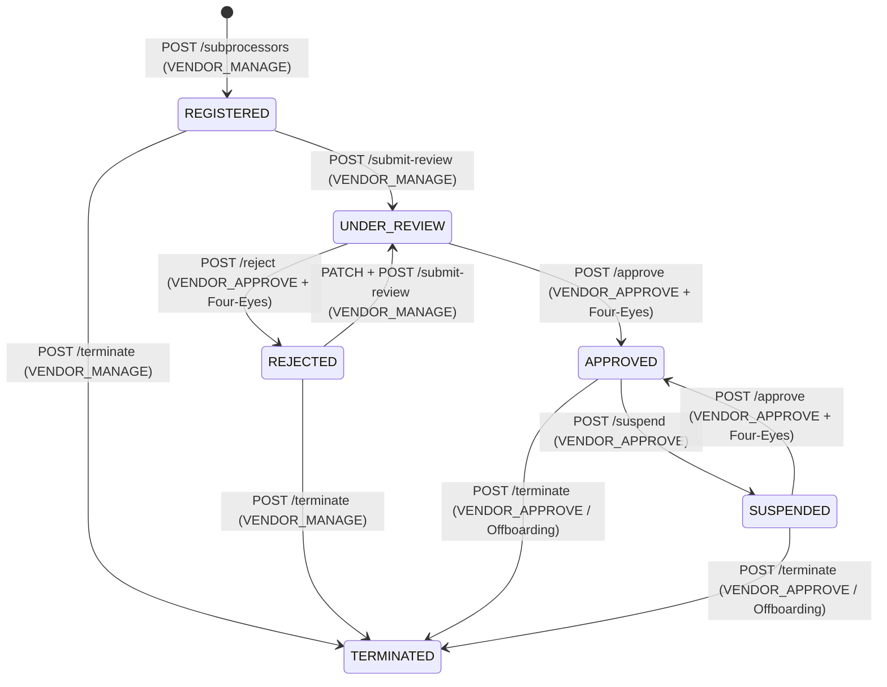
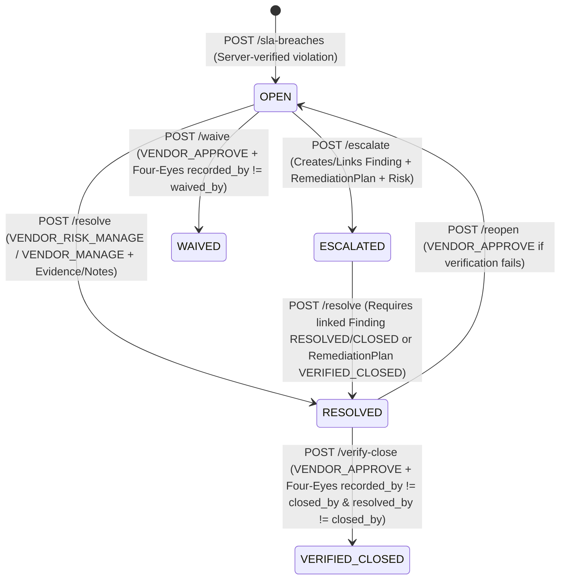
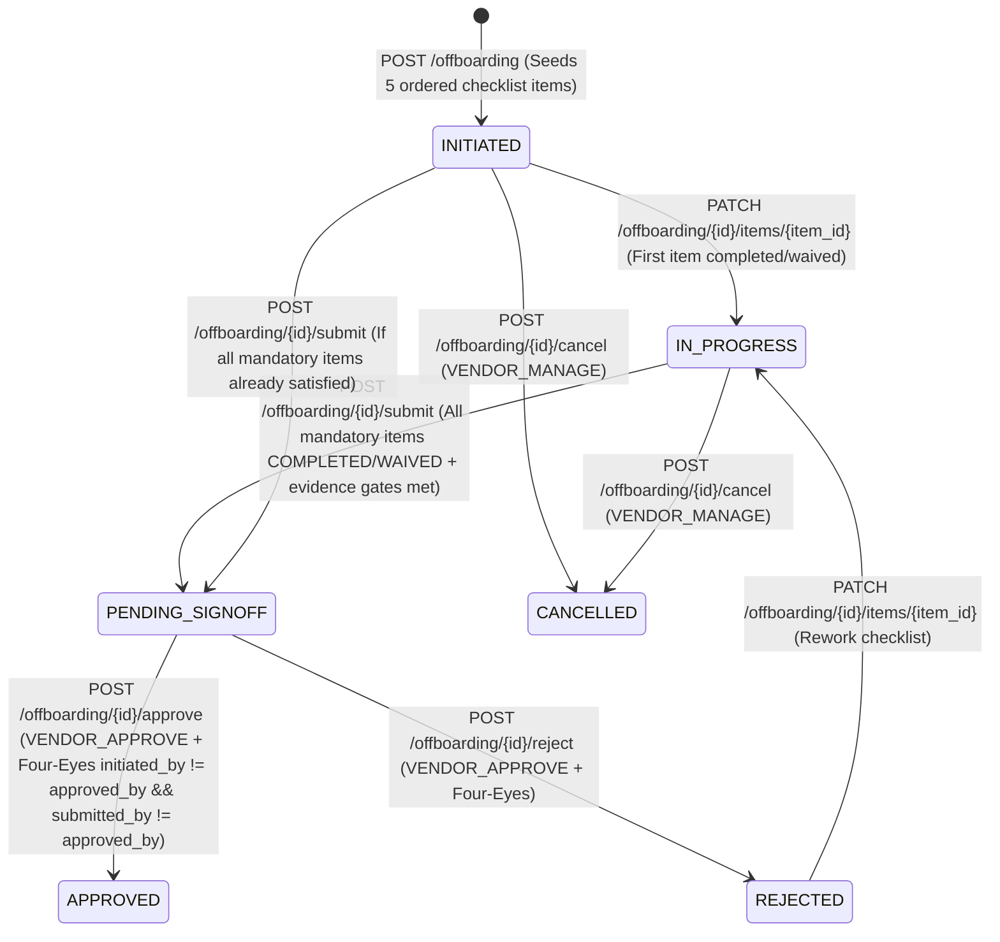

# PHASE 30 — BATCH 6 HARDENED IMPLEMENTATION PLAN: Third-Party Extended Governance — Fourth-Party Subprocessor Lineage, Concentration Risk, Contractual SLA Assurance, Governed Offboarding & Closed-Loop TPRM Remediation (`TPRM-LIFECYCLE-GRC`)

- **Repository**: `https://github.com/Avalar06/ControlSphere.git` (`E:\PROJECT WORKSPACE 2\ControlSphere`)
- **Branch**: `main`
- **Frozen Pre-Batch-6 Commit Baseline (`HEAD` & `origin/main`)**: `cc4b67aa2434ff47ef680fb5fd7762433bf467a9` (`feat(batch5): implement resilience continuity governance`)
- **Frozen Pre-Batch-6 Alembic Baseline**: `0026` (`0026_operational_resilience_continuity_and_testing.py`)
- **Target Batch 6 Alembic Revision**: `0027` (`0027_tprm_lifecycle_subprocessor_sla_offboarding.py`, `down_revision = "0026"`)
- **Document Mode**: **ARCHITECTURE HARDENING ONLY** (Zero application code, model, schema, service, router, migration, test, or frontend modifications)

---

## 1. Frozen Baseline & Hardening Executive Summary

### 1.1 Verified Repository Baseline
- **[REPOSITORY FACT]**: Prior to authoring this hardened specification, the repository state was verified:
  - `HEAD` and `origin/main` are identical at commit `cc4b67aa2434ff47ef680fb5fd7762433bf467a9` (`feat(batch5): implement resilience continuity governance`).
  - Current single Alembic migration head is `0026 (head)`.
  - Historical Batch 1–5 migrations (`0022` through `0026`) are frozen and untouched.
  - Full backend regression baseline stands at `1,184 passed, 0 failed`, including all 4 existing Phase 9 TPRM test suites ([test_tprm_domain.py](file:///e:/PROJECT%20WORKSPACE%202/ControlSphere/backend/tests/test_tprm_domain.py), [test_tprm_engine.py](file:///e:/PROJECT%20WORKSPACE%202/ControlSphere/backend/tests/test_tprm_engine.py), [test_tprm_api.py](file:///e:/PROJECT%20WORKSPACE%202/ControlSphere/backend/tests/test_tprm_api.py), and [test_phase9_adversarial_security.py](file:///e:/PROJECT%20WORKSPACE%202/ControlSphere/backend/tests/test_phase9_adversarial_security.py)).

### 1.2 Classification Legend
Every architectural statement in this plan is explicitly classified as one of:
- **[REPOSITORY FACT]**: Directly verified from existing source files in `backend/` or `frontend/`.
- **[ARCHITECTURAL DECISION]**: Binding engineering specification for Batch 6 implementation derived from repository conventions.
- **[ASSUMPTION]**: Explicit boundary condition validated against existing platform behavior.
- **[OPEN QUESTION]**: Any unresolved ambiguity (all candidate open questions were resolved via direct repository code inspection; `0` unresolved open questions remain).

---

## 2. Discovery Validation & Repository Evidence Reconciliation

All 21 required authority modules and existing Phase 9 files were inspected line-by-line to validate and harden the findings from [PHASE30_BATCH6_ARCHITECTURE_DISCOVERY.md](file:///e:/PROJECT%20WORKSPACE%202/ControlSphere/PHASE30_BATCH6_ARCHITECTURE_DISCOVERY.md):

| Authority / Subsystem Inspected | Repository Files Verified | Key Repository Fact & Hardening Refinement |
| :--- | :--- | :--- |
| **Phase 9 TPRM Models, Service & Router** | [models/tprm.py](file:///e:/PROJECT%20WORKSPACE%202/ControlSphere/backend/app/models/tprm.py) (411 lines), [services/tprm_service.py](file:///e:/PROJECT%20WORKSPACE%202/ControlSphere/backend/app/services/tprm_service.py) (432 lines), [schemas/tprm.py](file:///e:/PROJECT%20WORKSPACE%202/ControlSphere/backend/app/schemas/tprm.py) (240 lines), [endpoints/tprm.py](file:///e:/PROJECT%20WORKSPACE%202/ControlSphere/backend/app/api/v1/endpoints/tprm.py) (1,154 lines) | **[REPOSITORY FACT]**: Defines 5 tables (`vendors`, `vendor_engagements`, `vendor_assessments`, `vendor_assessment_items`, `vendor_evidence_links`) and 17 endpoints mounted at `/api/v1/vendors`. Note that `tprm.py` imports `Base` from `app.db.base_class` (which aliases `app.db.base.Base`). |
| **Phase 9 Telemetry Bug #1 (Unscoped Exceptions)** | [services/tprm_service.py](file:///e:/PROJECT%20WORKSPACE%202/ControlSphere/backend/app/services/tprm_service.py#L400-L410), [models/exception.py](file:///e:/PROJECT%20WORKSPACE%202/ControlSphere/backend/app/models/exception.py#L70-L73) | **[REPOSITORY FACT]**: `SecurityException` has `linked_organization_control_id`, `linked_policy_id`, and `linked_finding_id`, but **no `linked_vendor_id`**. `TPRMService.recalculate_vendor_telemetry` queries `SecurityException` filtered only by `organization_id`, `status == ACTIVE`, and `exception_type == THIRD_PARTY_VENDOR`, applying $+10.0$ per tenant exception to **every** vendor in the tenant. **[ARCHITECTURAL DECISION]**: Add `linked_vendor_id` (`ForeignKey("vendors.id", ondelete="SET NULL")`) to `SecurityException` and filter `recalculate_vendor_telemetry` by `SecurityException.linked_vendor_id == vendor.id`. |
| **Phase 9 Telemetry Bug #2 (Hardcoded `0.0` Breakdown)** | [endpoints/tprm.py](file:///e:/PROJECT%20WORKSPACE%202/ControlSphere/backend/app/api/v1/endpoints/tprm.py#L1145-L1146) | **[REPOSITORY FACT]**: `get_vendor_risk_posture` hardcodes `finding_penalties=0.0` and `exception_penalties=0.0` in `VendorResidualRiskBreakdown` even when `recalculate_vendor_telemetry` added penalties to `vendor.residual_risk_score`. **[ARCHITECTURAL DECISION]**: Compute and return authoritative penalty components in `TPRMService` and `VendorResidualRiskBreakdown`. |
| **RBAC & `MANAGER` Role Invariant** | [core/permissions.py](file:///e:/PROJECT%20WORKSPACE%202/ControlSphere/backend/app/core/permissions.py#L83-L88), [tests/test_tprm_domain.py](file:///e:/PROJECT%20WORKSPACE%202/ControlSphere/backend/tests/test_tprm_domain.py#L243-L281) | **[REPOSITORY FACT]**: The 5 existing Phase 9 permissions are `VENDOR_READ`, `VENDOR_MANAGE`, `VENDOR_ASSESS`, `VENDOR_APPROVE`, and `VENDOR_RISK_MANAGE`. Crucially, `test_tprm_domain.py` line 268 explicitly asserts `assert not has_permission(RoleEnum.MANAGER, Permission.VENDOR_ASSESS)`, while `MANAGER` **does** hold `VENDOR_READ`, `VENDOR_MANAGE`, `VENDOR_APPROVE`, and `VENDOR_RISK_MANAGE` (`permissions.py` lines 425–428). **[ARCHITECTURAL DECISION]**: Do **not** alter existing role assignments for the 5 Phase 9 permissions. Use `VENDOR_RISK_MANAGE` / `VENDOR_MANAGE` for operational SLA/offboarding/escalation actions where both Analysts and Managers participate, `VENDOR_ASSESS` for questionnaire assessment actions, and `VENDOR_APPROVE` for governed Four-Eyes approvals (`ADMIN`, `MANAGER`). |
| **Canonical `Finding` Invariants** | [models/finding.py](file:///e:/PROJECT%20WORKSPACE%202/ControlSphere/backend/app/models/finding.py#L44-L118), [services/finding_service.py](file:///e:/PROJECT%20WORKSPACE%202/ControlSphere/backend/app/services/finding_service.py) | **[REPOSITORY FACT]**: `Finding.organization_control_id` (`ForeignKey("organization_controls.id")`) is `nullable=False`, and `Finding.recommendation` is `nullable=False`. **[ARCHITECTURAL DECISION]**: Every Batch 6 escalation to a new `Finding` resolves `organization_control_id` deterministically from authoritative control lineage (and rejects with HTTP `422` if no control can be resolved—never creating a control-less `Finding`) and invokes canonical `FindingService` / `Finding` invariants. |
| **Canonical `RemediationPlan` Single-Source Check** | [models/remediation.py](file:///e:/PROJECT%20WORKSPACE%202/ControlSphere/backend/app/models/remediation.py#L184-L192), [services/remediation_service.py](file:///e:/PROJECT%20WORKSPACE%202/ControlSphere/backend/app/services/remediation_service.py) | **[REPOSITORY FACT]**: `remediation_plans` enforces `chk_remediation_single_source`: exactly one of `finding_id`, `compliance_drift_alert_id`, `security_incident_id`, `vendor_assessment_id`, `audit_id` must be `NOT NULL`. **[ARCHITECTURAL DECISION]**: When creating a `RemediationPlan` from an escalated SLA breach or assessment item, `TPRMService` links `finding_id = finding.id` with `source_type = RemediationSourceTypeEnum.FINDING` (or `vendor_assessment_id = assessment.id` with `source_type = RemediationSourceTypeEnum.TPRM_ASSESSMENT` when explicitly requested on an assessment without a finding), strictly satisfying `chk_remediation_single_source`. |
| **Canonical `EvidenceItem` & `EvidenceReview` Lifecycle** | [models/evidence.py](file:///e:/PROJECT%20WORKSPACE%202/ControlSphere/backend/app/models/evidence.py#L27-L112) | **[REPOSITORY FACT]**: `EvidenceItem` has `status` (`UPLOADED`, `UNDER_REVIEW`, `ACCEPTED`, `REJECTED`, `SUPERSEDED`), `sha256_hash` (`String(64)`), `uploaded_by_id`, and `superseded_by_id`, but **no `expires_at` column on `evidence_items`** (expiration dates for vendor documents live on `VendorEvidenceLink.expiration_date`). Reviews are recorded in `EvidenceReview` (`reviewer_id`, `decision = ACCEPT | REJECT`). **[ARCHITECTURAL DECISION]**: Batch 6 distinguishes `UPLOADED` evidence from `ACCEPTED` evidence (`EvidenceItem.status == EvidenceStatusEnum.ACCEPTED`) and snapshots `EvidenceItem.sha256_hash` into `evidence_sha256_snapshot`. |
| **Notification / Alerting Architecture** | [models/monitoring.py](file:///e:/PROJECT%20WORKSPACE%202/ControlSphere/backend/app/models/monitoring.py#L108-L160), [services/audit_service.py](file:///e:/PROJECT%20WORKSPACE%202/ControlSphere/backend/app/services/audit_service.py) | **[REPOSITORY FACT]**: There is **no** `NotificationService` or `notifications` table in `backend/app/`. Platform alerting uses `ComplianceDriftAlert` (`compliance_drift_alerts` in `monitoring.py`, when an `organization_control_id` is involved) and structured `AuditLog` events via `AuditService.log`. **[ARCHITECTURAL DECISION]**: Reuse `ComplianceDriftAlert` for control-linked SLA breaches and `AuditService.log` (with structured `notification_hook` metadata in `details`) for all governance workflow triggers—creating zero duplicate notification tables. |
| **Phase 9 Backward-Compatibility Invariants** | [tests/test_phase9_adversarial_security.py](file:///e:/PROJECT%20WORKSPACE%202/ControlSphere/backend/tests/test_phase9_adversarial_security.py#L185-L260), [tests/test_tprm_domain.py](file:///e:/PROJECT%20WORKSPACE%202/ControlSphere/backend/tests/test_tprm_domain.py#L36-L46) | **[REPOSITORY FACT]**: (1) `test_adv_p9_06` through `test_adv_p9_09` send extra fields (`organization_id`, `calculated_inherent_risk`, `residual_risk_score`, `calculated_tier`) to `POST /vendors` and `PATCH /vendors/{id}` and assert `201`/`200` (proving those fields are ignored). (2) `test_adv_p9_16` transitions a bare `ACTIVE` vendor (with `0` engagements) directly to `TERMINATED` via `PATCH /vendors/{id}` and expects `200`. **[ARCHITECTURAL DECISION]**: Keep `VendorCreate` and `VendorUpdate` ignoring unknown fields while enforcing `ConfigDict(extra="forbid")` on all new Batch 6 request schemas; enforce the mandatory `APPROVED` `VendorOffboardingRecord` gate on `PATCH /vendors/{id}` whenever the vendor has $\ge 1$ `ACTIVE` engagement or $\ge 1$ open/in-progress `VendorOffboardingRecord`. |

---

## 3. Batch 6 Objective (`TPRM-LIFECYCLE-GRC`)

- **[ARCHITECTURAL DECISION]**: Batch 6 (`TPRM-LIFECYCLE-GRC`) hardens Phase 9 Third-Party Risk Management into a complete, closed-loop enterprise supply-chain assurance engine by extending the canonical `tprm` authority in-place with:
  1. **Fourth-Party Subprocessor Governance & Lineage (`VendorSubprocessor`)**
  2. **Deterministic Fourth-Party Concentration Risk Analytics (`GET /api/v1/vendors/concentration-risk`)**
  3. **Contractual SLA & Security Obligation Monitoring (`VendorSlaObligation` & `VendorSlaBreach`)**
  4. **Closed-Loop SLA Breach & Vendor Assessment Item Escalation to Canonical `Finding`, `RemediationPlan`, and `Risk`**
  5. **Canonical `SecurityException` Vendor Linkage (`linked_vendor_id`) & Authoritative Vendor Telemetry Bug Fixes**
  6. **Governed Vendor Offboarding & Exit Checklist Verification (`VendorOffboardingRecord` & `VendorOffboardingItem`) with Tamper-Evident Data Destruction Evidence Proof**

---

## 4. Absolute Anti-Duplication Gate & Authority Reuse Matrix

- **[ARCHITECTURAL DECISION]**: Batch 6 creates **zero** parallel or shadow authorities (`Vendor2`, `VendorAssessment2`, `VendorRisk2`, `Risk2`, `Finding2`, `Evidence2`, `Remediation2`, `SecurityException2`, `Notification2`, `Control2`, `ExecutiveMetric2`, `ContinuousAssurance2`, `TPRM2`, `RBAC2` are strictly forbidden).

| Canonical Authority | Authoritative Model & Table | Authoritative Service | How Batch 6 Reuses / Extends In-Place |
| :--- | :--- | :--- | :--- |
| **Vendor Profile & Scoring** | `Vendor` (`vendors` in `models/tprm.py`) | `TPRMService` (`services/tprm_service.py`) | Extended in-place with denormalized counters (`open_sla_breaches_count`, `approved_subprocessors_count`, `offboarding_completed_at`) and enhanced `recalculate_vendor_telemetry`. |
| **Vendor Engagements** | `VendorEngagement` (`vendor_engagements` in `models/tprm.py`) | `TPRMService` | Reused via FK on `VendorSubprocessor` and `VendorSlaObligation`; automatically transitioned to `TERMINATED` upon offboarding approval. |
| **Vendor Assessments & Items** | `VendorAssessment`, `VendorAssessmentItem` (`models/tprm.py`) | `TPRMService` | `VendorAssessmentItem` extended in-place with `linked_finding_id`, `linked_remediation_plan_id`, `linked_risk_id`, `escalated_by_id`, `escalated_at`. |
| **Security Exceptions** | `SecurityException` (`security_exceptions` in `models/exception.py`) | `ExceptionService` (`services/exception_service.py`) | Extended in-place with `linked_vendor_id` (`ForeignKey("vendors.id", ondelete="SET NULL")`). |
| **Evidence Vault & Reviews** | `EvidenceItem`, `EvidenceReview` (`models/evidence.py`), `VendorEvidenceLink` (`models/tprm.py`) | `EvidenceService` (`services/evidence_service.py`) | Reused via FK (`evidence_id`) and SHA-256 snapshot (`evidence_sha256_snapshot`) on `VendorSubprocessor`, `VendorSlaBreach`, and `VendorOffboardingItem`. |
| **Findings** | `Finding`, `FindingEvidence` (`models/finding.py`) | `FindingService` (`services/finding_service.py`) | Reused via FK (`linked_finding_id`) on `VendorAssessmentItem` and `VendorSlaBreach`. |
| **Remediation / CAPA** | `RemediationPlan`, `RemediationTask` (`models/remediation.py`) | `RemediationService` (`services/remediation_service.py`) | Reused via FK (`linked_remediation_plan_id`) on `VendorAssessmentItem` and `VendorSlaBreach`, respecting `chk_remediation_single_source`. |
| **Enterprise Risk Register** | `Risk`, `RiskControlLink`, `RiskFindingLink` (`models/risk.py`) | `RiskService` (`services/risk_service.py`) | Reused via FK (`linked_risk_id`) on `VendorSubprocessor`, `VendorSlaBreach`, and `VendorAssessmentItem`. |
| **Controls & Harmonization** | `OrganizationControl` (`models/control.py`), `RationalizedCommonControl`, `CommonControlMapping` (`models/harmonization.py`) | `ControlService`, `HarmonizationService` | Reused to resolve `Finding.organization_control_id` and link `VendorSlaObligation.linked_organization_control_id`. |
| **Continuous Monitoring Alerts** | `ComplianceDriftAlert` (`models/monitoring.py`) | `MonitoringService` | Reused to emit control-linked drift alerts when contractual SLA breaches occur on control-mapped obligations. |
| **Audit Trail** | `AuditLog` (`models/audit_log.py`) | `AuditService.log` (`services/audit_service.py`) | Reused for non-repudiable logging of all Batch 6 state transitions and notification hooks. |
| **Executive & Assurance Engines** | `ExecutiveSnapshot` (`models/executive.py`), `ContinuousAssuranceSnapshot` (`models/continuous_compliance.py`) | `ExecutiveService`, `ContinuousComplianceService` | Extended in-place so TPRM domain telemetry reflects SLA breaches, subprocessors, and accurate vendor risk bands. |

---

## 5. Hardened Component A: `VendorSubprocessor` (Fourth-Party Governance & Lineage)

### 5.1 Lifecycle State Machine (`VendorSubprocessorStatusEnum`)
- **[ARCHITECTURAL DECISION]**: `VendorSubprocessorStatusEnum` defines the exact 6 states required for governed fourth-party lineage:
  - `REGISTERED = "REGISTERED"` (Initial state upon creation; `registered_by_id` stamped from `current_user.id`)
  - `UNDER_REVIEW = "UNDER_REVIEW"` (Submitted for formal contractual flow-down and security review; `submitted_by_id` and `submitted_at` stamped)
  - `APPROVED = "APPROVED"` (Authorized via Four-Eyes review; lineage fields become immutable)
  - `REJECTED = "REJECTED"` (Rejected during review with mandatory `rejection_reason`; can be remediated and re-submitted to `UNDER_REVIEW`)
  - `SUSPENDED = "SUSPENDED"` (Temporarily suspended due to fourth-party incident or expired/revoked evidence; contributes penalty to parent vendor residual risk)
  - `TERMINATED = "TERMINATED"` (Terminal archival state when fourth-party relationship ends or parent vendor is offboarded)



### 5.2 Exact Semantics & Governance Rules per State
1. **`REGISTERED`**:
   - Subprocessor relationship is recorded against `vendor_id` (and optional `engagement_id`).
   - Can reference either an existing canonical `Vendor` in the same tenant (`subprocessor_vendor_id`) or an external fourth-party entity (`subprocessor_name` + `subprocessor_code`), or both (when `subprocessor_vendor_id` is supplied, `subprocessor_name` defaults to `subprocessor_vendor.legal_name`).
   - Self-reference (`subprocessor_vendor_id == vendor_id`) is rejected at both the application layer (`422 Unprocessable Entity`) and database layer (`chk_subprocessor_no_self_ref`).
   - Cyclic lineage ($V_1 \to V_2 \to \dots \to V_1$) is rejected via deterministic bounded BFS cycle detection (`422 Unprocessable Entity`).
2. **`UNDER_REVIEW`**:
   - Transitioned via `POST /api/v1/vendors/{vendor_id}/subprocessors/{subprocessor_id}/submit-review`.
   - Stamps `submitted_by_id = current_user.id` and `submitted_at = now_utc`.
3. **`APPROVED`**:
   - Transitioned via `POST /api/v1/vendors/{vendor_id}/subprocessors/{subprocessor_id}/approve` (requires `Permission.VENDOR_APPROVE`).
   - **Four-Eyes Invariant**: `current_user.id != subprocessor.registered_by_id` AND `current_user.id != subprocessor.submitted_by_id` (`403 Forbidden` on violation).
   - **Mandatory Contractual Flow-Down & Evidence Gate (GDPR Art. 28(2)/(4) & DORA Art. 30)**:
     - If `subprocessor.criticality in (BusinessCriticalityEnum.CRITICAL, BusinessCriticalityEnum.HIGH)` OR `subprocessor.pii_access != PiiFinancialAccessEnum.NONE` OR `vendor.effective_tier == VendorTierEnum.TIER_1_CRITICAL`:
       1. `subprocessor.contractual_flowdown_verified` MUST be `True` (`422 Unprocessable Entity` otherwise).
       2. `subprocessor.evidence_id` MUST be `NOT NULL` and reference an in-tenant `EvidenceItem` with `status == EvidenceStatusEnum.ACCEPTED` (`422 Unprocessable Entity` if `UPLOADED`, `UNDER_REVIEW`, `REJECTED`, or `SUPERSEDED`) and `EvidenceItem.sha256_hash == subprocessor.evidence_sha256_snapshot` (`409 Conflict` if hash mutated).
   - **Immutable Approved Lineage**: Once in `APPROVED`, `vendor_id`, `subprocessor_vendor_id`, `subprocessor_code`, `subprocessor_name`, `service_function`, `hosting_region`, `jurisdiction`, `criticality`, `data_classification`, and `pii_access` are locked against `PATCH` mutation (`400 Bad Request`).
4. **`REJECTED`**:
   - Transitioned from `UNDER_REVIEW` via `POST /reject` (requires `Permission.VENDOR_APPROVE`, `current_user.id != registered_by_id`, and `rejection_reason` $\ge 10$ characters).
5. **`SUSPENDED`**:
   - Transitioned from `APPROVED` via `POST /suspend` (requires `Permission.VENDOR_APPROVE` and `suspension_reason` $\ge 10$ characters). Adds a deterministic subprocessor risk penalty to parent `Vendor.residual_risk_score`.
6. **`TERMINATED`**:
   - Terminal state. Cannot transition out of `TERMINATED` (`400 Bad Request`). Automatically applied to all non-terminated subprocessors when parent `Vendor` completes governed offboarding.

---

## 6. Hardened Component B: Fourth-Party Concentration Risk (`GET /api/v1/vendors/concentration-risk`)

### 6.1 Endpoint Authority & Tenant Scoping
- **[ARCHITECTURAL DECISION]**:
  - Path: `GET /api/v1/vendors/concentration-risk`
  - Permission: `Permission.VENDOR_READ`
  - Tenant Scope: Strictly derived from `current_user.organization_id`. Zero client-supplied `organization_id` parameters accepted.
  - Excludes parent vendors in `OFFBOARDED` or `TERMINATED` states and excludes subprocessors in `REJECTED` or `TERMINATED` states.

### 6.2 Concentration Dimensions & Canonical Grouping Key
Every active fourth-party subprocessor edge $(v \to s)$ in the tenant is grouped by a deterministic canonical fourth-party identifier:
- If `s.subprocessor_vendor_id IS NOT NULL`: `group_key = f"VENDOR:{s.subprocessor_vendor_id}"`
- Otherwise: `group_key = f"ENTITY:{s.subprocessor_name.strip().upper()}"`

For each fourth-party node $k$, the server computes **7 deterministic concentration dimensions**:
1. `dependent_vendor_count` ($N_{\text{vendors},k}$): Count of distinct active third-party `Vendor` records directly or transitively (up to `MAX_TRAVERSAL_DEPTH = 10`) depending on fourth-party $k$.
2. `tier_1_dependent_vendor_count` ($N_{\text{T1},k}$): Count of distinct dependent vendors where `effective_tier == VendorTierEnum.TIER_1_CRITICAL`.
3. `critical_service_count` ($N_{\text{crit},k}$): Count of subprocessor edges to $k$ where `criticality == BusinessCriticalityEnum.CRITICAL`.
4. `pii_exposure_count` ($N_{\text{pii},k}$): Count of subprocessor edges to $k$ where `pii_access == PiiFinancialAccessEnum.DIRECT_PCI_PII_PHI`.
5. `restricted_data_count` ($N_{\text{rest},k}$): Count of subprocessor edges to $k$ where `data_classification == DataClassificationEnum.RESTRICTED`.
6. `hosting_regions` ($R_k$): Sorted unique list of `hosting_region` values across edges to $k$, plus `primary_region_share_pct` (percentage of edges hosted in the single most common region).
7. `max_chain_depth` ($D_k$): Maximum supply-chain hop depth ($1 \le D_k \le 10$) reaching fourth-party $k$.

### 6.3 Deterministic Server-Authoritative Concentration Score Formula
- **[ARCHITECTURAL DECISION]**: To avoid arbitrary scoring, the Concentration Risk Score $C_k \in [0.0, 100.0]$ is a deterministic weighted function of normalized exposure factors:
  - **Multi-Vendor Breadth Factor** ($B_k \in [0, 100]$):
    $$B_k = \min\left(100.0,\ (N_{\text{vendors},k} - 1) \times 35.0 + N_{\text{T1},k} \times 25.0\right)$$
    *(Note: If only 1 non-Tier-1 vendor uses subprocessor $k$, $N_{\text{vendors},k}=1$ and $N_{\text{T1},k}=0 \implies B_k = 0.0$.)*
  - **Criticality & Data Sensitivity Factor** ($S_k \in [0, 100]$):
    $$S_k = \min\left(100.0,\ N_{\text{crit},k} \times 30.0 + N_{\text{pii},k} \times 25.0 + N_{\text{rest},k} \times 20.0\right)$$
  - **Geographic Single-Region Lock-In Factor** ($G_k \in [0, 100]$):
    $$G_k = \text{primary\_region\_share\_pct} \quad \text{if } N_{\text{vendors},k} \ge 2 \text{ else } 0.0$$
  - **Composite Fourth-Party Concentration Score** ($C_k$):
    $$C_k = \text{round}\left(\min\left(100.0,\ \max\left(0.0,\ 0.50 \cdot B_k + 0.35 \cdot S_k + 0.15 \cdot G_k\right)\right),\ 2\right)$$
  - **Concentration Risk Band Mapping**:
    - `CRITICAL`: $C_k \ge 80.0$ (or $N_{\text{T1},k} \ge 2$ and $N_{\text{crit},k} \ge 2$)
    - `HIGH`: $60.0 \le C_k < 80.0$ (or $N_{\text{vendors},k} \ge 3$)
    - `MODERATE`: $40.0 \le C_k < 60.0$ (or $N_{\text{vendors},k} == 2$)
    - `LOW`: $C_k < 40.0$ and $N_{\text{vendors},k} < 2$
  - **Deterministic Ordering**: Results are sorted by `(-concentration_score, -tier_1_dependent_vendor_count, -dependent_vendor_count, subprocessor_name ASC)`.

---

## 7. Hardened Component C: `VendorSlaObligation` & `VendorSlaBreach`

### 7.1 Six-Stage Conceptual Distinction
- **[ARCHITECTURAL DECISION]**: Batch 6 strictly separates the 6 distinct governance concepts for vendor SLAs:
  1. **Contractual Target (`VendorSlaObligation.target_value` & `tolerance_value`)**: The binding contractual threshold in `vendor_sla_obligations`.
  2. **Observed Measurement (`VendorSlaBreach.observed_value`)**: The empirical measurement over `[period_start, period_end]`.
  3. **Numerical Variance (`VendorSlaBreach.variance_magnitude`)**: Server-calculated signed excess beyond target/tolerance using integer-scaled decimal arithmetic (`round(val, 4)`).
  4. **Governance Breach (`VendorSlaBreach.status == OPEN` & `severity`)**: Server-classified breach record created only when the observation violates the effective threshold.
  5. **Remediation State (`VendorSlaBreach.status == ESCALATED` & `linked_finding_id` / `linked_remediation_plan_id`)**: Active CAPA remediation state tracked in canonical `Finding` and `RemediationPlan`.
  6. **Final Closure (`VendorSlaBreach.status in (WAIVED, RESOLVED, VERIFIED_CLOSED)`)**: Four-Eyes governed closure after evidence/remediation verification.

### 7.2 Supported SLA Metric Types & Comparison Semantics
- **[ARCHITECTURAL DECISION]**: `VendorSlaMetricTypeEnum` supports:
  - `AVAILABILITY_UPTIME = "AVAILABILITY_UPTIME"` (Unit: `PERCENT`, range `[0.0, 100.0]`, default operator `GTE`)
  - `INCIDENT_NOTIFICATION_HOURS = "INCIDENT_NOTIFICATION_HOURS"` (Unit: `HOURS`, range `> 0.0`, default operator `LTE`)
  - `VULN_REMEDIATION_DAYS = "VULN_REMEDIATION_DAYS"` (Unit: `DAYS`, range `> 0.0`, default operator `LTE`)
  - `RTO_HOURS = "RTO_HOURS"` (Unit: `HOURS`, range `> 0.0`, default operator `LTE`)
  - `RPO_HOURS = "RPO_HOURS"` (Unit: `HOURS`, range `>= 0.0`, default operator `LTE`)
  - `AUDIT_REPORT_DELIVERY_DAYS = "AUDIT_REPORT_DELIVERY_DAYS"` (Unit: `DAYS`, range `> 0.0`, default operator `LTE`)
  - `DATA_DELETION_DAYS = "DATA_DELETION_DAYS"` (Unit: `DAYS`, range `> 0.0`, default operator `LTE`)
  - `CUSTOM_METRIC = "CUSTOM_METRIC"` (Extensible contractual metric with explicit operator and unit)

### 7.3 Obligation Lifecycle (`VendorSlaObligationStatusEnum`)
- States: `DRAFT`, `ACTIVE`, `SUSPENDED`, `EXPIRED`, `RETIRED`.
- Date rules: `effective_from` (`DateTime(timezone=True)`, required) and optional `expiry_date` (`DateTime(timezone=True)`). Check constraint `chk_sla_obligation_dates`: `expiry_date IS NULL OR expiry_date > effective_from`.
- Only `ACTIVE` obligations within their effective window (`effective_from <= period_end` and `(expiry_date IS NULL OR expiry_date >= period_start)`) can record breaches (`400 Bad Request` if `DRAFT`, `SUSPENDED`, `EXPIRED`, or `RETIRED`).

### 7.4 Deterministic Variance & Severity Mathematics (Zero Floating-Point Ambiguity)
- **[ARCHITECTURAL DECISION]**: To eliminate IEEE-754 floating-point boundary ambiguity, all target, tolerance, and observed values are converted to `Decimal` quantized to `0.0001` (`ROUND_HALF_UP`) prior to comparison:
  - Let $T = \text{Decimal(str(round(target\_value, 4)))}$, $\tau = \text{Decimal(str(round(tolerance\_value or 0.0, 4)))}$ ($\tau \ge 0$), and $O = \text{Decimal(str(round(observed\_value, 4)))}$.
  - **Case 1: Lower-Is-Better (`comparison_operator == LTE`, e.g., hours/days)**:
    - Effective breach threshold: $T_{\text{eff}} = T + \tau$.
    - **Compliant (Inclusive Boundary)**: $O \le T_{\text{eff}}$ is compliant (recording a breach is rejected with HTTP `400 Bad Request`).
    - **Breach (Strict Inequality)**: $O > T_{\text{eff}}$ is a breach, with:
      $$\Delta_{\text{raw}} = O - T, \quad \Delta_{\text{effective}} = O - T_{\text{eff}}$$
    - **Severity Classification (`LTE`)**:
      - If $T > 0$: ratio $r = \Delta_{\text{raw}} / T$:
        - `CRITICAL`: $r \ge 1.00$ (observed is $\ge 2\times$ target)
        - `MAJOR`: $0.25 \le r < 1.00$
        - `MINOR`: $r < 0.25$
      - If $T == 0$ (e.g., `RPO_HOURS == 0`):
        - `CRITICAL`: $\Delta_{\text{raw}} \ge 4.0$
        - `MAJOR`: $1.0 \le \Delta_{\text{raw}} < 4.0$
        - `MINOR`: $0.0 < \Delta_{\text{raw}} < 1.0$
  - **Case 2: Higher-Is-Better (`comparison_operator == GTE`, e.g., `AVAILABILITY_UPTIME` %)**:
    - Effective breach threshold: $T_{\text{eff}} = T - \tau$.
    - **Compliant (Inclusive Boundary)**: $O \ge T_{\text{eff}}$ is compliant (recording a breach is rejected with HTTP `400 Bad Request`).
    - **Breach (Strict Inequality)**: $O < T_{\text{eff}}$ is a breach, with:
      $$\Delta_{\text{raw}} = T - O, \quad \Delta_{\text{effective}} = T_{\text{eff}} - O$$
    - **Severity Classification (`GTE`)**:
      - For `AVAILABILITY_UPTIME` (`PERCENT`):
        - `CRITICAL`: $\Delta_{\text{raw}} \ge 2.0000$ percentage points (or $O < 95.0000\%$)
        - `MAJOR`: $0.5000 \le \Delta_{\text{raw}} < 2.0000$ percentage points
        - `MINOR`: $0.0000 < \Delta_{\text{raw}} < 0.5000$ percentage points
      - For general `GTE` metrics ($T > 0$):
        - `CRITICAL`: $(\Delta_{\text{raw}} / T) \ge 0.20$
        - `MAJOR`: $0.05 \le (\Delta_{\text{raw}} / T) < 0.20$
        - `MINOR`: $(\Delta_{\text{raw}} / T) < 0.05$

### 7.5 SLA Breach State Machine (`VendorSlaBreachStatusEnum`)
- States:
  - `OPEN = "OPEN"`
  - `ESCALATED = "ESCALATED"`
  - `WAIVED = "WAIVED"`
  - `RESOLVED = "RESOLVED"`
  - `VERIFIED_CLOSED = "VERIFIED_CLOSED"`



---

## 8. Hardened Component D: SLA Breach Closed-Loop Integration (`Finding`, `RemediationPlan`, `Risk`)

### 8.1 Authoritative `Finding.organization_control_id` Resolution
- **[REPOSITORY FACT]**: `Finding.organization_control_id` is `NOT NULL` (`backend/app/models/finding.py` line 49).
- **[ARCHITECTURAL DECISION]**: When `POST /api/v1/vendors/{vendor_id}/sla-breaches/{breach_id}/escalate` is invoked:
  1. `TPRMService.escalate_sla_breach` resolves `organization_control_id` using the following strict precedence order:
     - **Priority 1**: Explicit `organization_control_id` supplied in `VendorSlaBreachEscalateRequest` (verified to exist in `organization_controls` with `organization_id == current_user.organization_id`; cross-tenant ID returns `404 Not Found`).
     - **Priority 2**: `obligation.linked_organization_control_id` on the parent `VendorSlaObligation` (if `NOT NULL` and belongs to `organization_id`).
  2. **Deterministic Failure Behavior**: If neither Priority 1 nor Priority 2 yields an authoritative in-tenant `OrganizationControl`, the service **rejects the escalation with HTTP `422 Unprocessable Entity`** (`detail="Cannot create canonical Finding without an authoritative organization_control_id. Link an OrganizationControl to the SLA obligation or supply organization_control_id in the escalation request."`). It **never** creates a control-less `Finding` or picks an arbitrary tenant control.

### 8.2 When `Finding`, `RemediationPlan`, and `Risk` Are Created vs. Reused
1. **Idempotency Guard**: If `breach.status == VendorSlaBreachStatusEnum.ESCALATED` or `breach.linked_finding_id is not None`, calling `/escalate` again returns HTTP `409 Conflict` (`"SLA breach has already been escalated"`).
2. **`Finding` Creation vs. Reuse**:
   - If `existing_finding_id` is provided in the request, it must belong to `current_user.organization_id` (`404` if not) and match the resolved `organization_control_id` (`422` if mismatched).
   - Otherwise, a new canonical `Finding` is created via `FindingService` / `Finding` with:
     - `organization_id = current_user.organization_id`
     - `organization_control_id = resolved_control_id`
     - `title = f"[TPRM SLA Breach] {vendor.vendor_code} - {obligation.title} ({breach.breach_code})"`
     - `description = f"Contractual SLA breach on {obligation.metric_type.value}: target {obligation.comparison_operator.value} {breach.target_value_snapshot}, observed {breach.observed_value} (variance {breach.variance_magnitude}). Root cause: {breach.root_cause_summary}"`
     - `finding_type = FindingTypeEnum.CONTROL_GAP`
     - `severity`: `CRITICAL -> FindingSeverityEnum.CRITICAL`, `MAJOR -> FindingSeverityEnum.HIGH`, `MINOR -> FindingSeverityEnum.MEDIUM`
     - `impact` / `likelihood`: `(5, 4)` for `CRITICAL` (`risk_score=20, risk_band="CRITICAL"`), `(4, 4)` for `MAJOR` (`risk_score=16, risk_band="HIGH"`), `(3, 3)` for `MINOR` (`risk_score=9, risk_band="MODERATE"`)
     - `recommendation = f"Remediate vendor SLA breach {breach.breach_code} under contract clause {obligation.contract_clause_ref or 'MSA'} and verify corrective controls."`
     - `status = FindingStatusEnum.OPEN`
     - `created_by_id = current_user.id`
   - If `breach.evidence_id` is present, a `FindingEvidence` link is automatically created (`finding_id=finding.id, evidence_id=breach.evidence_id`).
3. **`RemediationPlan` Creation (`create_remediation_plan = True` by default)**:
   - Creates a canonical `RemediationPlan` with:
     - `organization_id = current_user.organization_id`
     - `plan_code = f"CAPA-SLA-{breach.id}-{int(now_utc.timestamp())}"`
     - `title = f"CAPA for Vendor SLA Breach {breach.breach_code} ({vendor.legal_name})"`
     - `problem_statement = breach.root_cause_summary`
     - `root_cause_classification = RemediationRootCauseClassificationEnum.VENDOR_DEFAULT`
     - `source_type = RemediationSourceTypeEnum.FINDING`
     - `finding_id = finding.id` (strictly satisfying `chk_remediation_single_source` where only `finding_id` is non-null)
     - `severity`: mapped from breach severity (`CRITICAL`, `HIGH`, `MEDIUM`)
     - `status = RemediationStatusEnum.DRAFT`
     - `plan_owner_id = payload.plan_owner_id or vendor.business_owner_id or current_user.id`
4. **`Risk` Creation or Linkage (`create_or_link_risk`)**:
   - If `existing_risk_id` is provided, verifies tenant ownership (`404` if foreign) and links `breach.linked_risk_id = existing_risk_id`.
   - If `create_risk = True` (and no `existing_risk_id`), creates a canonical `Risk` (`risk_category = RiskCategoryEnum.THIRD_PARTY`, `risk_source = RiskSourceEnum.VENDOR_ASSESSMENT`, `status = RiskStatusEnum.IDENTIFIED`) and links `RiskFindingLink(organization_id=org_id, risk_id=risk.id, finding_id=finding.id)` and `RiskControlLink(organization_id=org_id, risk_id=risk.id, organization_control_id=resolved_control_id)`.

---

## 9. Hardened Component E: Vendor Assessment Item Closed-Loop Integration

### 9.1 Additive Columns on `VendorAssessmentItem` (`vendor_assessment_items`)
- **[ARCHITECTURAL DECISION]**: Extend `VendorAssessmentItem` in `backend/app/models/tprm.py` with:
  - `linked_finding_id = Column(Integer, ForeignKey("findings.id", ondelete="SET NULL"), nullable=True, index=True)`
  - `linked_remediation_plan_id = Column(Integer, ForeignKey("remediation_plans.id", ondelete="SET NULL"), nullable=True, index=True)`
  - `linked_risk_id = Column(Integer, ForeignKey("risks.id", ondelete="SET NULL"), nullable=True, index=True)`
  - `escalated_by_id = Column(Integer, ForeignKey("users.id", ondelete="SET NULL"), nullable=True)`
  - `escalated_at = Column(DateTime(timezone=True), nullable=True)`

### 9.2 Eligibility, Control Lineage & Immutability Rules
1. **Eligibility by Response Status**:
   - Only assessment items with `response_status in (VendorResponseStatusEnum.NON_COMPLIANT, VendorResponseStatusEnum.PARTIALLY_COMPLIANT)` may be escalated via `POST /api/v1/vendors/assessments/{assessment_id}/items/{item_id}/escalate`.
   - Attempting to escalate a `COMPLIANT` or `NOT_APPLICABLE` item is rejected with HTTP `400 Bad Request`.
2. **Optional vs. Mandatory Semantics**:
   - `linked_finding_id`, `linked_remediation_plan_id`, and `linked_risk_id` are nullable on `VendorAssessmentItem` so existing Phase 9 questionnaire updates (`PATCH /api/v1/vendors/assessments/{assessment_id}/items`) remain 100% non-breaking.
   - However, an assessment item's `response_status` is **never** treated as equivalent to `Finding`, `RemediationPlan`, or `Risk` closure: once escalated, the canonical `Finding` and `RemediationPlan` govern remediation lifecycle independently.
3. **Authoritative `organization_control_id` Resolution for Assessment Items**:
   - **Priority 1**: Explicit `organization_control_id` in `VendorAssessmentItemEscalateRequest` (verified in-tenant; `404` if cross-tenant).
   - **Priority 2**: If `item.rationalized_common_control_id IS NOT NULL`, query `CommonControlMapping` (`common_control_mappings` in `models/harmonization.py`) for `organization_id == current_user.organization_id` and `rationalized_common_control_id == item.rationalized_common_control_id`, ordered by `weight DESC, id ASC`, and use its `organization_control_id`.
   - **Deterministic Failure**: If neither resolves an in-tenant `OrganizationControl`, return HTTP `422 Unprocessable Entity`.
4. **Historical Immutability Preservation**:
   - Escalating an item on an `IN_REVIEW` or `APPROVED` assessment attaches the governance tracking links (`linked_finding_id`, `linked_remediation_plan_id`, `linked_risk_id`, `escalated_by_id`, `escalated_at`, and increments `findings_count = max(item.findings_count, 1)`) **without** mutating `question_key`, `question_text`, `response_status`, `weight`, `vendor_response_text`, or `assessment.calculated_score`.
   - Once `linked_finding_id` is set on a `VendorAssessmentItem`, it is immutable and cannot be overwritten or unlinked (`409 Conflict` on duplicate escalation).

---

## 10. Hardened Component F: `SecurityException` Integration & Telemetry Bug Remediation

### 10.1 Schema & Model Extension on `SecurityException` (`security_exceptions`)
- **[ARCHITECTURAL DECISION]**: Add to `SecurityException` in [backend/app/models/exception.py](file:///e:/PROJECT%20WORKSPACE%202/ControlSphere/backend/app/models/exception.py):
  - `linked_vendor_id = Column(Integer, ForeignKey("vendors.id", ondelete="SET NULL"), nullable=True, index=True)`
  - `linked_vendor = relationship("Vendor", foreign_keys=[linked_vendor_id])`
- Extend `ExceptionBase`, `ExceptionCreate`, `ExceptionUpdate`, and `ExceptionResponse` in [backend/app/schemas/exception.py](file:///e:/PROJECT%20WORKSPACE%202/ControlSphere/backend/app/schemas/exception.py) with `linked_vendor_id: Optional[int] = None`.

### 10.2 Tenant Validation & Lifecycle Immutability Rules in `ExceptionService`
1. **Cross-Tenant BOLA Protection**:
   - Whenever `linked_vendor_id` is supplied on `create_exception` or `update_exception`, `ExceptionService` queries `Vendor` filtered by `id == linked_vendor_id` and `organization_id == organization_id`. If not found, raises HTTP `404 Not Found` (or `ValueError` mapped to `404`).
2. **Type Consistency**:
   - If `exception_type == ExceptionTypeEnum.THIRD_PARTY_VENDOR` and `linked_vendor_id` is provided, upon exception approval (`approve_exception`) or closure (`close_exception`), `TPRMService.recalculate_vendor_telemetry(db, vendor)` is automatically triggered so the vendor's residual risk score immediately reflects the active or closed exception.
3. **No Arbitrary Vendor Reassignment After Approval**:
   - In `ExceptionService.update_exception`, if `exception.status in (ExceptionStatusEnum.APPROVED, ExceptionStatusEnum.ACTIVE, ExceptionStatusEnum.EXPIRED, ExceptionStatusEnum.CLOSED)` and `obj_in.linked_vendor_id is not None and obj_in.linked_vendor_id != exception.linked_vendor_id`, the update is rejected with HTTP `400 Bad Request` (`"Cannot reassign linked_vendor_id after security exception has been approved or closed"`).

### 10.3 Authoritative Remediation of the Two Phase 9 Telemetry Bugs
1. **Fix for Bug #1 (`TPRMService.recalculate_vendor_telemetry` in `tprm_service.py` lines 400–410)**:
   - **[REPOSITORY FACT]**: Currently queries `SecurityException` without filtering by vendor.
   - **[ARCHITECTURAL DECISION]**: Filter `SecurityException` by:
     ```python
     SecurityException.organization_id == vendor.organization_id,
     SecurityException.linked_vendor_id == vendor.id,
     SecurityException.status.in_([ExceptionStatusEnum.APPROVED, ExceptionStatusEnum.ACTIVE]),
     ```
     and verify via `calculate_exception_effective_status(e.status.value, e.expiry_date, e.effective_date, date.today()) == "ACTIVE"`. Each active vendor-linked exception adds `+10.0` (capped at `30.0`), ensuring an exception for Vendor A never penalizes Vendor B.
2. **Fix for Bug #2 (`get_vendor_risk_posture` in `endpoints/tprm.py` lines 1145–1146)**:
   - **[REPOSITORY FACT]**: Currently hardcodes `finding_penalties=0.0, exception_penalties=0.0`.
   - **[ARCHITECTURAL DECISION]**: `TPRMService.compute_vendor_penalty_breakdown(db, vendor)` returns the exact authoritative dictionary `{"finding_penalties": ..., "exception_penalties": ..., "sla_breach_penalties": ..., "subprocessor_penalties": ...}` used inside `recalculate_vendor_telemetry`, and `get_vendor_risk_posture` populates `VendorResidualRiskBreakdown` directly from that authoritative calculation.

---

## 11. Hardened Component G: Governed Vendor Offboarding (`VendorOffboardingRecord` & `VendorOffboardingItem`)

### 11.1 Required Checklist Categories (`VendorOffboardingStepTypeEnum`)
- **[ARCHITECTURAL DECISION]**: Every `VendorOffboardingRecord` deterministically auto-seeds 5 ordered checklist items (`step_number` `1..5`) corresponding to the 5 mandatory categories:
  1. `step_number = 1`: `ACCESS_REVOCATION` — Revoke all API keys, SSO federation, VPN tunnels, and IAM roles.
  2. `step_number = 2`: `DATA_DESTRUCTION_OR_RETURN` — Obtain certified destruction or return of all organization data and PII/PHI/PCI assets.
  3. `step_number = 3`: `ENGAGEMENT_TERMINATION` — Terminate active operational service engagements and fourth-party subprocessor delegations.
  4. `step_number = 4`: `EVIDENCE_ARCHIVAL` — Archive final audit reports, assessment snapshots, and compliance attestations in the Evidence Vault.
  5. `step_number = 5`: `FINANCIAL_CONTRACT_CLOSEOUT` — Complete legal notice, SLA credit settlement, and contract closeout.

### 11.2 Offboarding Lifecycle State Machine (`VendorOffboardingStatusEnum`)
- Record States:
  - `INITIATED = "INITIATED"`
  - `IN_PROGRESS = "IN_PROGRESS"`
  - `PENDING_SIGNOFF = "PENDING_SIGNOFF"`
  - `APPROVED = "APPROVED"`
  - `REJECTED = "REJECTED"`
  - `CANCELLED = "CANCELLED"`
- Checklist Item States (`VendorOffboardingItemStatusEnum`):
  - `PENDING = "PENDING"`
  - `COMPLETED = "COMPLETED"`
  - `WAIVED = "WAIVED"`



### 11.3 Offboarding Governance Invariants
1. **Single Active Offboarding Per Vendor**:
   - A vendor may have at most **one** non-terminal offboarding record (`status in (INITIATED, IN_PROGRESS, PENDING_SIGNOFF, REJECTED)`) at any time. Attempting to create a second active offboarding record returns HTTP `409 Conflict`.
2. **Immutable Completed Checklist Items**:
   - Once a `VendorOffboardingItem` transitions to `COMPLETED` (with verified evidence where required), its `step_type`, `step_number`, `completed_by_id`, `completed_at`, `evidence_id`, and `evidence_sha256_snapshot` are locked unless the parent `VendorOffboardingRecord` is transitioned to `REJECTED` for rework (`400 Bad Request` on attempt to mutate a `COMPLETED` item while record is `IN_PROGRESS`, `PENDING_SIGNOFF`, or `APPROVED`).
3. **Non-Waivable Sensitive Steps**:
   - For any vendor where `requires_data_destruction_proof == True` (i.e., any engagement has `pii_access != PiiFinancialAccessEnum.NONE` or `data_classification in (DataClassificationEnum.RESTRICTED, DataClassificationEnum.CONFIDENTIAL)`), the `DATA_DESTRUCTION_OR_RETURN` and `ACCESS_REVOCATION` steps **cannot** be marked `WAIVED` (`422 Unprocessable Entity`); they must be `COMPLETED`.
4. **Four-Eyes Sign-Off Invariant**:
   - On `POST /api/v1/vendors/{vendor_id}/offboarding/{offboarding_id}/approve` (requires `Permission.VENDOR_APPROVE`):
     - `current_user.id != offboarding.initiated_by_id` AND `current_user.id != offboarding.submitted_by_id` (`403 Forbidden` on violation).
   - On approval, the server atomically:
     1. Transitions `offboarding.status = VendorOffboardingStatusEnum.APPROVED`, stamps `approved_by_id = current_user.id` and `approved_at = now_utc`, and seals `offboarding.signoff_hash_sha256`.
     2. Transitions all `VendorEngagement` rows for `vendor_id` with `status != TERMINATED` to `EngagementStatusEnum.TERMINATED`.
     3. Transitions all `VendorSubprocessor` rows for `vendor_id` with `status != TERMINATED` to `VendorSubprocessorStatusEnum.TERMINATED`.
     4. Transitions all `VendorSlaObligation` rows for `vendor_id` with `status == ACTIVE` to `VendorSlaObligationStatusEnum.RETIRED`.
     5. Transitions `vendor.vendor_status` to `offboarding.target_vendor_status` (`OFFBOARDED` or `TERMINATED`), sets `vendor.offboarding_completed_at = now_utc`, and runs `recalculate_vendor_telemetry`.

---

## 12. Data Destruction / Return Evidence Lifecycle & Verification Gate

### 12.1 Strict Distinction Between Evidence Upload and Evidence Acceptance
- **[REPOSITORY FACT]**: In [backend/app/models/evidence.py](file:///e:/PROJECT%20WORKSPACE%202/ControlSphere/backend/app/models/evidence.py):
  - Uploading a file creates an `EvidenceItem` with `status = EvidenceStatusEnum.UPLOADED` and `uploaded_by_id = current_user.id`.
  - Reviewing an evidence item via `EvidenceService` creates an `EvidenceReview` (`reviewer_id`, `decision = ReviewDecisionEnum.ACCEPT | REJECT`) and transitions `EvidenceItem.status` to `EvidenceStatusEnum.ACCEPTED` or `EvidenceStatusEnum.REJECTED`.
- **[ARCHITECTURAL DECISION]**: Batch 6 **never** auto-accepts uploaded evidence and **never** treats `EvidenceStatusEnum.UPLOADED` or `EvidenceStatusEnum.UNDER_REVIEW` as sufficient for regulated offboarding or critical subprocessor authorization:
  1. **When `requires_data_destruction_proof == True`**:
     - `requires_data_destruction_proof` is computed server-side at offboarding initiation time as `True` if **any** engagement of the vendor (active or historical) has `pii_access in (PiiFinancialAccessEnum.DIRECT_PCI_PII_PHI, PiiFinancialAccessEnum.METADATA_ONLY)` OR `data_classification in (DataClassificationEnum.RESTRICTED, DataClassificationEnum.CONFIDENTIAL)` OR `vendor.effective_tier == VendorTierEnum.TIER_1_CRITICAL`.
  2. **Evidence Requirements on `DATA_DESTRUCTION_OR_RETURN` Checklist Item**:
     - To transition the `DATA_DESTRUCTION_OR_RETURN` item to `COMPLETED` when `requires_evidence == True`:
       - `evidence_id` MUST be provided and belong to `current_user.organization_id` (`404 Not Found` if foreign).
       - `EvidenceItem.status` MUST equal `EvidenceStatusEnum.ACCEPTED` (`422 Unprocessable Entity` if `UPLOADED`, `UNDER_REVIEW`, `REJECTED`, or `SUPERSEDED`).
       - `EvidenceItem.evidence_type` MUST be in `(EvidenceTypeEnum.DOCUMENT, EvidenceTypeEnum.AUDIT_REPORT, EvidenceTypeEnum.LOG_EXPORT)` (`422 Unprocessable Entity` if `OTHER` or `SCREENSHOT`).
       - If an `EvidenceReview` with `decision == ReviewDecisionEnum.ACCEPT` exists on the `EvidenceItem`, its `reviewer_id` must not equal `EvidenceItem.uploaded_by_id` (`422 Unprocessable Entity` if self-accepted evidence is detected).
       - If the `EvidenceItem` is also linked via `VendorEvidenceLink` for this vendor, `VendorEvidenceLink.expiration_date` must not be in the past (`expiration_date >= now_utc`, otherwise `422 Unprocessable Entity`).
       - At item completion time, `item.evidence_sha256_snapshot = evidence.sha256_hash` and `offboarding.data_destruction_evidence_id = evidence.id` are recorded.

---

## 13. Evidence Integrity & Tamper-Evident Cryptographic Digest Architecture

- **[REPOSITORY FACT]**: `EvidenceItem.sha256_hash` (`String(64)`) stores the lowercase hexadecimal SHA-256 digest of the uploaded evidence binary, and `ExecutiveService` (`backend/app/services/executive_service.py` lines 69–105) defines `canonical_json_dumps` and `compute_canonical_sha256`.
- **[ARCHITECTURAL DECISION]**: Batch 6 uses **Tamper-Evident Cryptographic Evidence Digests / SHA-256 Snapshots** (never conflated with asymmetric digital signatures):
  1. **Snapshot Columns**:
     - `VendorSubprocessor.evidence_sha256_snapshot` (`String(64)`, nullable)
     - `VendorSlaBreach.evidence_sha256_snapshot` (`String(64)`, nullable)
     - `VendorOffboardingItem.evidence_sha256_snapshot` (`String(64)`, nullable)
     - `VendorOffboardingRecord.signoff_hash_sha256` (`String(64)`, nullable — canonical JSON SHA-256 digest of the offboarding record and all 5 checklist items upon `APPROVED`)
  2. **Snapshot Timing**:
     - Whenever an `evidence_id` is linked to a `VendorSubprocessor`, `VendorSlaBreach`, or `VendorOffboardingItem`, the server validates the `EvidenceItem` and immediately copies `EvidenceItem.sha256_hash` into `evidence_sha256_snapshot`.
  3. **Re-Verification at Governance Gate Transitions**:
     - Before completing a subprocessor approval (`POST /subprocessors/{id}/approve`), SLA breach closure (`POST /sla-breaches/{id}/verify-close`), offboarding submission (`POST /offboarding/{id}/submit`), or offboarding final sign-off (`POST /offboarding/{id}/approve`), `TPRMService._verify_evidence_integrity(db, org_id, evidence_id, expected_sha256_snapshot, vendor_id)` re-fetches the live `EvidenceItem` and enforces:
       - **Hash Mutation Detection**: If `live_evidence.sha256_hash != expected_sha256_snapshot` $\implies$ raises HTTP `409 Conflict` (`"Tamper-Evident Cryptographic Evidence Digest mismatch: underlying EvidenceItem SHA-256 hash mutated after linkage"`).
       - **Post-Linkage Rejection Detection**: If `live_evidence.status == EvidenceStatusEnum.REJECTED` $\implies$ raises HTTP `422 Unprocessable Entity` (`"Linked EvidenceItem was subsequently REJECTED"`).
       - **Post-Linkage Supersession Detection**: If `live_evidence.status == EvidenceStatusEnum.SUPERSEDED` or `live_evidence.superseded_by_id is not None` $\implies$ raises HTTP `422 Unprocessable Entity` (`"Linked EvidenceItem was SUPERSEDED and must be relinked to the current accepted artifact"`).
       - **Post-Linkage Expiry Detection**: If a `VendorEvidenceLink` exists for `(vendor_id, evidence_id)` with `expiration_date < now_utc` $\implies$ raises HTTP `422 Unprocessable Entity` (`"Linked vendor evidence artifact has expired"`).

---

## 14. Four-Eyes / Segregation of Duties Specification

- **[ARCHITECTURAL DECISION]**: No client-provided actor ID is ever accepted in any request schema. Actor identities are always extracted from the authenticated JWT session (`current_user.id`). Same-user API calls attempting both sides of a Four-Eyes boundary are rejected with **HTTP `403 Forbidden`** (even if `current_user.role == RoleEnum.ADMIN`):

| # | Governance Boundary | Actor A (Initiator / Submitter) | Actor B (Reviewer / Approver) | Required Permission for Actor B | State Transition | Identity Separation Rule | Audit Event Emitted |
| :--- | :--- | :--- | :--- | :--- | :--- | :--- | :--- |
| 1 | **Subprocessor Approval** | `registered_by_id` and `submitted_by_id` | `approved_by_id` (`current_user.id`) | `Permission.VENDOR_APPROVE` | `UNDER_REVIEW -> APPROVED` | `current_user.id != registered_by_id` AND `(submitted_by_id is None or current_user.id != submitted_by_id)` | `VENDOR_SUBPROCESSOR_APPROVED` |
| 2 | **Subprocessor Rejection** | `registered_by_id` and `submitted_by_id` | `reviewed_by_id` (`current_user.id`) | `Permission.VENDOR_APPROVE` | `UNDER_REVIEW -> REJECTED` | `current_user.id != registered_by_id` AND `(submitted_by_id is None or current_user.id != submitted_by_id)` | `VENDOR_SUBPROCESSOR_REJECTED` |
| 3 | **SLA Breach Waiver** | `recorded_by_id` | `waived_by_id` (`current_user.id`) | `Permission.VENDOR_APPROVE` | `OPEN -> WAIVED` | `current_user.id != recorded_by_id` | `VENDOR_SLA_BREACH_WAIVED` |
| 4 | **SLA Breach Verified Closure** | `recorded_by_id` and `resolved_by_id` | `closed_by_id` (`current_user.id`) | `Permission.VENDOR_APPROVE` | `RESOLVED -> VERIFIED_CLOSED` | `current_user.id != recorded_by_id` AND `current_user.id != resolved_by_id` | `VENDOR_SLA_BREACH_CLOSED` |
| 5 | **Vendor Offboarding Final Sign-Off** | `initiated_by_id` and `submitted_by_id` | `approved_by_id` (`current_user.id`) | `Permission.VENDOR_APPROVE` | `PENDING_SIGNOFF -> APPROVED` | `current_user.id != initiated_by_id` AND `current_user.id != submitted_by_id` | `VENDOR_OFFBOARDING_APPROVED` |
| 6 | **Vendor Offboarding Rejection** | `initiated_by_id` and `submitted_by_id` | `approved_by_id` (`current_user.id`) | `Permission.VENDOR_APPROVE` | `PENDING_SIGNOFF -> REJECTED` | `current_user.id != initiated_by_id` AND `current_user.id != submitted_by_id` | `VENDOR_OFFBOARDING_REJECTED` |
| 7 | **Evidence Acceptance (Phase 3 Authority)** | `EvidenceItem.uploaded_by_id` | `EvidenceReview.reviewer_id` | `Permission.EVIDENCE_REVIEW` | `UPLOADED/UNDER_REVIEW -> ACCEPTED` | `reviewer_id != uploaded_by_id` | Verified at link & completion gates |

---

## 15. RBAC Matrix & Permission Architecture

- **[REPOSITORY FACT]**: `backend/app/core/permissions.py` defines exactly 6 roles (`ADMIN`, `MANAGER`, `GRC_ANALYST`, `SECURITY_ANALYST`, `AUDITOR`, `VIEWER`) and 5 Phase 9 TPRM permissions (`VENDOR_READ`, `VENDOR_MANAGE`, `VENDOR_ASSESS`, `VENDOR_APPROVE`, `VENDOR_RISK_MANAGE`).
- **[ARCHITECTURAL DECISION]**: Batch 6 reuses these exact 5 canonical Phase 9 permissions without adding new roles or modifying existing role-permission mappings (preserving `test_tprm_domain.py::test_tprm_rbac_permission_matrix` 100%):

| Capability / Action | Canonical Permission Constant | `ADMIN` | `MANAGER` | `GRC_ANALYST` | `SECURITY_ANALYST` | `AUDITOR` | `VIEWER` |
| :--- | :--- | :---: | :---: | :---: | :---: | :---: | :---: |
| **TPRM Read & Concentration Risk Read** (`GET /vendors/...`, `GET /vendors/concentration-risk`) | `Permission.VENDOR_READ` | Allow | Allow | Allow | Allow | Allow | Allow |
| **Subprocessor Register / Update / Submit Review** | `Permission.VENDOR_MANAGE` | Allow | Allow | Allow | Allow | **Deny (`403`)** | **Deny (`403`)** |
| **Subprocessor Approve / Reject / Suspend / Terminate** | `Permission.VENDOR_APPROVE` | Allow* | Allow* | **Deny (`403`)** | **Deny (`403`)** | **Deny (`403`)** | **Deny (`403`)** |
| **SLA Obligation Create / Update / Activate / Retire** | `Permission.VENDOR_MANAGE` | Allow | Allow | Allow | Allow | **Deny (`403`)** | **Deny (`403`)** |
| **SLA Breach Record / Escalate / Resolve** | `Permission.VENDOR_RISK_MANAGE` | Allow | Allow | Allow | Allow | **Deny (`403`)** | **Deny (`403`)** |
| **SLA Breach Waive / Verify-Close / Reopen** | `Permission.VENDOR_APPROVE` | Allow* | Allow* | **Deny (`403`)** | **Deny (`403`)** | **Deny (`403`)** | **Deny (`403`)** |
| **Offboarding Initiate / Item Complete / Submit / Cancel** | `Permission.VENDOR_MANAGE` | Allow | Allow | Allow | Allow | **Deny (`403`)** | **Deny (`403`)** |
| **Offboarding Approve / Reject Sign-Off** | `Permission.VENDOR_APPROVE` | Allow* | Allow* | **Deny (`403`)** | **Deny (`403`)** | **Deny (`403`)** | **Deny (`403`)** |
| **Assessment Item Escalate to Finding/CAPA/Risk** | `Permission.VENDOR_RISK_MANAGE` | Allow | Allow | Allow | Allow | **Deny (`403`)** | **Deny (`403`)** |
| **Vendor Exception Linkage (`SecurityException.linked_vendor_id`)** | `Permission.EXCEPTION_MANAGE` (Create/Update) / `Permission.EXCEPTION_APPROVE` (Approve) | Allow | Approve Only | Allow | Create/Update Only | **Deny (`403`)** | **Deny (`403`)** |

*\*Subject to strict Four-Eyes actor separation (`403 Forbidden` if same user).*

---

## 16. Tenant Isolation, BOLA & IDOR Prevention Matrix

- **[ARCHITECTURAL DECISION]**:
  1. **Authoritative Tenant Resolution**: `org_id = current_user.organization_id` is the sole source of tenant scope.
  2. **Compound Path & Parent-Child Verification**: Every nested route (`/api/v1/vendors/{vendor_id}/subprocessors/{subprocessor_id}`, `/api/v1/vendors/{vendor_id}/sla-obligations/{obligation_id}`, `/api/v1/vendors/{vendor_id}/sla-breaches/{breach_id}`, `/api/v1/vendors/{vendor_id}/offboarding/{offboarding_id}/items/{item_id}`) verifies in a single tenant-scoped query that:
     - The parent `Vendor` exists with `Vendor.id == vendor_id` AND `Vendor.organization_id == current_user.organization_id`.
     - The child resource exists with `child.id == child_id` AND `child.vendor_id == vendor_id` AND `child.organization_id == current_user.organization_id`.
  3. **Uniform `404 Not Found` on Cross-Tenant or Mismatched Parent Access**: Any failure of the tenant or parent-vendor match returns **HTTP `404 Not Found`** without leaking whether the ID exists in another tenant.
  4. **Foreign Key Payload Validation**: Every referenced ID in a request payload (`engagement_id`, `subprocessor_vendor_id`, `evidence_id`, `linked_organization_control_id`, `existing_finding_id`, `existing_risk_id`, `plan_owner_id`, `linked_vendor_id`) is queried with `.filter(Model.id == ref_id, Model.organization_id == current_user.organization_id)`. If not found in the caller's tenant, the service raises **HTTP `404 Not Found`**.

---

## 17. Vendor/Subprocessor Graph Security & Cycle Prevention

- **[ARCHITECTURAL DECISION]**: Vendor-to-subprocessor links where `subprocessor_vendor_id IS NOT NULL` form a directed supply-chain dependency graph $G = (V, E)$ within each tenant (`organization_id`).
- Batch 6 hardens $G$ against all graph attacks:
  1. **Self-Link Prevention**: `vendor_id == subprocessor_vendor_id` is blocked by service validation (`422 Unprocessable Entity`) and DB check constraint `chk_subprocessor_no_self_ref` (`subprocessor_vendor_id IS NULL OR subprocessor_vendor_id != vendor_id`).
  2. **Duplicate Edge Prevention**: Composite unique constraints prevent registering the same `subprocessor_code` (`uq_vendor_subprocessor_org_vendor_code`) or linking the same `subprocessor_vendor_id` (`uq_vendor_subprocessor_vendor_edge` on `(organization_id, vendor_id, subprocessor_vendor_id)` when `subprocessor_vendor_id IS NOT NULL`) twice under the same parent vendor (`409 Conflict`).
  3. **Cycle Detection (Direct $A \leftrightarrow B$ and Multi-Hop $A \to B \to C \to A$)**:
     - Before inserting or updating a `VendorSubprocessor` with `subprocessor_vendor_id = target_vid` under `vendor_id = source_vid`, `TPRMService._detect_subprocessor_cycle(db, org_id, source_vid, target_vid)` executes a deterministic Breadth-First Search (BFS) starting from `target_vid` across all non-terminated `VendorSubprocessor` edges in `org_id`:
       - Maintains a `visited: Set[int]` set so each node is visited at most once ($O(|V| + |E|)$ time).
       - If `source_vid` is reached, raises HTTP `422 Unprocessable Entity` (`detail="Circular vendor/subprocessor lineage cycle detected in supply-chain graph"`).
  4. **Pathological Depth Cap (`MAX_SUPPLY_CHAIN_DEPTH = 10`)**:
     - If adding an edge would create a chain exceeding depth `10`, or during concentration-risk traversal if depth reaches `10`, traversal halts deterministically at depth `10` (`422 Unprocessable Entity` on edge creation if depth > `10`).
  5. **Cross-Tenant Edge Prevention**: `subprocessor_vendor_id` is verified to belong to `organization_id` (`404 Not Found` if foreign).
  6. **Deleted/Terminated Reference Protection**: Foreign key `subprocessor_vendor_id` uses `ondelete="RESTRICT"` (or `SET NULL` with service guard) and prevents linking a `TERMINATED` vendor as a new subprocessor (`400 Bad Request`).

---

## 18. Migration `0027` Engineering Specification (`0026 -> 0027`)

- **[ARCHITECTURAL DECISION]**:
  - **File**: `backend/alembic/versions/0027_tprm_lifecycle_subprocessor_sla_offboarding.py`
  - **`revision`**: `"0027"`
  - **`down_revision`**: `"0026"`
  - **Historical Migrations `0001`–`0026`**: Zero modifications.
  - **Dialect Compatibility**: Uses `op.batch_alter_table(...)` for all `ALTER TABLE` operations on existing tables (`vendors`, `vendor_assessment_items`, `security_exceptions`) so both PostgreSQL and SQLite pass `upgrade()` and `downgrade()` cleanly.

### 18.1 Altered Existing Tables in `0027`

1. **`security_exceptions` (`backend/app/models/exception.py`)**:
   - Add column `linked_vendor_id` (`sa.Integer()`, `nullable=True`).
   - Add foreign key `fk_security_exceptions_linked_vendor_id` $\to$ `vendors(id)` (`ondelete="SET NULL"`).
   - Add index `ix_security_exceptions_linked_vendor_id` on `["linked_vendor_id"]`.
2. **`vendor_assessment_items` (`backend/app/models/tprm.py`)**:
   - Add `linked_finding_id` (`sa.Integer()`, `nullable=True`, FK `findings.id` `ondelete="SET NULL"`, indexed).
   - Add `linked_remediation_plan_id` (`sa.Integer()`, `nullable=True`, FK `remediation_plans.id` `ondelete="SET NULL"`, indexed).
   - Add `linked_risk_id` (`sa.Integer()`, `nullable=True`, FK `risks.id` `ondelete="SET NULL"`, indexed).
   - Add `escalated_by_id` (`sa.Integer()`, `nullable=True`, FK `users.id` `ondelete="SET NULL"`).
   - Add `escalated_at` (`sa.DateTime(timezone=True)`, `nullable=True`).
3. **`vendors` (`backend/app/models/tprm.py`)**:
   - Add `open_sla_breaches_count` (`sa.Integer()`, `nullable=False`, `server_default="0"`).
   - Add `approved_subprocessors_count` (`sa.Integer()`, `nullable=False`, `server_default="0"`).
   - Add `offboarding_completed_at` (`sa.DateTime(timezone=True)`, `nullable=True`).

### 18.2 Five New Tables Created in `0027`
1. `vendor_subprocessors` (`VendorSubprocessor`)
2. `vendor_sla_obligations` (`VendorSlaObligation`)
3. `vendor_sla_breaches` (`VendorSlaBreach`)
4. `vendor_offboarding_records` (`VendorOffboardingRecord`)
5. `vendor_offboarding_items` (`VendorOffboardingItem`)

### 18.3 Complete `downgrade()` Behavior (`0027 -> 0026`)
- Drops `vendor_offboarding_items`, `vendor_offboarding_records`, `vendor_sla_breaches`, `vendor_sla_obligations`, and `vendor_subprocessors` in reverse dependency order.
- Uses `op.batch_alter_table` to drop the additive columns and indexes from `vendors`, `vendor_assessment_items`, and `security_exceptions`.
- On PostgreSQL, drops the new Batch 6 enum types (`vendorsubprocessorstatusenum`, `vendorslametrictypeenum`, `vendorslacomparisonoperatorenum`, `vendorslaobligationstatusenum`, `vendorslabreachseverityenum`, `vendorslabreachstatusenum`, `vendoroffboardingstatusenum`, `vendoroffboardingtargetstatusenum`, `vendoroffboardingsteptypeenum`, `vendoroffboardingitemstatusenum`).

---

## 19. Database-Level Constraints & Invariants

- **[ARCHITECTURAL DECISION]**: Critical invariants are enforced at the database level via `UniqueConstraint`, `CheckConstraint`, and `ForeignKey` in addition to service validation:

| Table | Constraint Name | Type | SQL Expression / Definition | Invariant Protected |
| :--- | :--- | :--- | :--- | :--- |
| `vendor_subprocessors` | `uq_vendor_subprocessor_org_vendor_code` | `UniqueConstraint` | `(organization_id, vendor_id, subprocessor_code)` | Tenant-scoped unique subprocessor code per vendor |
| `vendor_subprocessors` | `chk_subprocessor_no_self_ref` | `CheckConstraint` | `subprocessor_vendor_id IS NULL OR subprocessor_vendor_id != vendor_id` | Prevents vendor from being its own subprocessor |
| `vendor_subprocessors` | `chk_subprocessor_four_eyes` | `CheckConstraint` | `approved_by_id IS NULL OR registered_by_id IS NULL OR approved_by_id != registered_by_id` | DB-level Four-Eyes enforcement on subprocessor approval |
| `vendor_sla_obligations` | `uq_vendor_sla_obligation_org_vendor_code` | `UniqueConstraint` | `(organization_id, vendor_id, obligation_code)` | Tenant-scoped unique SLA obligation code per vendor |
| `vendor_sla_obligations` | `chk_sla_obligation_tolerance_non_neg` | `CheckConstraint` | `tolerance_value >= 0.0` | Non-negative SLA tolerance |
| `vendor_sla_obligations` | `chk_sla_obligation_freq_pos` | `CheckConstraint` | `measurement_frequency_days >= 1` | Positive measurement cadence |
| `vendor_sla_obligations` | `chk_sla_obligation_dates` | `CheckConstraint` | `expiry_date IS NULL OR expiry_date > effective_from` | Expiry date must follow effective start date |
| `vendor_sla_obligations` | `chk_sla_obligation_pct_range` | `CheckConstraint` | `metric_type != 'AVAILABILITY_UPTIME' OR (target_value > 0.0 AND target_value <= 100.0)` | Uptime percentage bounded in $(0.0, 100.0]$ |
| `vendor_sla_ obligations` | `chk_sla_obligation_target_non_neg` | `CheckConstraint` | `target_value >= 0.0` | Non-negative SLA target value |
| `vendor_sla_breaches` | `uq_vendor_sla_breach_org_code` | `UniqueConstraint` | `(organization_id, breach_code)` | Tenant-scoped unique SLA breach code |
| `vendor_sla_breaches` | `chk_sla_breach_variance_pos` | `CheckConstraint` | `variance_magnitude > 0.0` | Every recorded breach must have strictly positive variance |
| `vendor_sla_breaches` | `chk_sla_breach_period_order` | `CheckConstraint` | `period_end >= period_start` | Non-negative measurement period duration |
| `vendor_sla_breaches` | `chk_sla_breach_waiver_four_eyes` | `CheckConstraint` | `waived_by_id IS NULL OR recorded_by_id IS NULL OR waived_by_id != recorded_by_id` | DB-level Four-Eyes enforcement on SLA waiver |
| `vendor_sla_breaches` | `chk_sla_breach_close_four_eyes` | `CheckConstraint` | `closed_by_id IS NULL OR ((recorded_by_id IS NULL OR closed_by_id != recorded_by_id) AND (resolved_by_id IS NULL OR closed_by_id != resolved_by_id))` | DB-level Four-Eyes enforcement on SLA verified closure |
| `vendor_offboarding_records` | `uq_vendor_offboarding_org_code` | `UniqueConstraint` | `(organization_id, offboarding_code)` | Tenant-scoped unique offboarding code |
| `vendor_offboarding_records` | `chk_offboarding_four_eyes` | `CheckConstraint` | `approved_by_id IS NULL OR ((initiated_by_id IS NULL OR approved_by_id != initiated_by_id) AND (submitted_by_id IS NULL OR approved_by_id != submitted_by_id))` | DB-level Four-Eyes enforcement on offboarding approval |
| `vendor_offboarding_items` | `uq_vendor_offboarding_item_step` | `UniqueConstraint` | `(offboarding_id, step_number)` | Unique step ordering per offboarding record |
| `vendor_offboarding_items` | `uq_vendor_offboarding_item_type` | `UniqueConstraint` | `(offboarding_id, step_type)` | Exactly one checklist item per mandatory category |
| `vendor_offboarding_items` | `chk_offboarding_step_num_range` | `CheckConstraint` | `step_number >= 1 AND step_number <= 10` | Valid step number bounds |

---

## 20. Concurrency Control, Row Locking & Race Condition Prevention

- **[ARCHITECTURAL DECISION]**:
  1. **Row-Level Locking (`with_for_update()`)**:
     - On all state-transitioning mutations (`approve_subprocessor`, `reject_subprocessor`, `suspend_subprocessor`, `escalate_sla_breach`, `resolve_sla_breach`, `waive_sla_breach`, `verify_close_sla_breach`, `initiate_offboarding`, `complete_offboarding_item`, `submit_offboarding`, `approve_offboarding`, `reject_offboarding`, `escalate_assessment_item`), `TPRMService` acquires a row lock on the target row (and parent `Vendor` row where vendor status/counters are updated) via `.with_for_update()`.
  2. **Idempotent / Conflict Responses on Concurrent Races (`409 Conflict`)**:
     - **Simultaneous Subprocessor Approval Race**: First transaction transitions `UNDER_REVIEW -> APPROVED`; second concurrent transaction sees `status == APPROVED` and returns HTTP `409 Conflict` (`"Subprocessor is already in APPROVED state"`).
     - **Simultaneous SLA Breach Escalation / Duplicate Finding Race**: First transaction transitions `OPEN -> ESCALATED` and sets `linked_finding_id`; second transaction sees `linked_finding_id IS NOT NULL` and returns HTTP `409 Conflict` without creating a duplicate `Finding` or `RemediationPlan`.
     - **Simultaneous SLA Breach Waiver / Closure Race**: If already `WAIVED` or `VERIFIED_CLOSED`, returns HTTP `409 Conflict`.
     - **Simultaneous Offboarding Initiation Race**: Queries existing non-terminal `VendorOffboardingRecord` rows with `.with_for_update()`; if one exists, returns HTTP `409 Conflict`.
     - **Simultaneous Offboarding Approval Race**: First transaction transitions `PENDING_SIGNOFF -> APPROVED`; second transaction sees `status == APPROVED` and returns HTTP `409 Conflict`.
  3. **`IntegrityError` Catch & Rollback**:
     - Any database `IntegrityError` (e.g., concurrent duplicate `subprocessor_code`, `obligation_code`, `breach_code`, or `offboarding_code`) triggers `db.rollback()` and raises a deterministic HTTP `409 Conflict`.

---

## 21. SLA Numerical Authority & Temporal Semantics

- **[ARCHITECTURAL DECISION]**:
  1. **100% Server-Authoritative Calculation**:
     - Client request schemas for SLA breach recording (`VendorSlaBreachCreate`) accept **only** `obligation_id`, `breach_code`, `period_start`, `period_end`, `observed_value`, `root_cause_summary`, `service_credit_amount`, and optional `evidence_id`.
     - Client payloads **cannot** submit `target_value_snapshot`, `variance_magnitude`, `severity`, `status`, or risk penalties; including any of those fields triggers HTTP `422 Unprocessable Entity` via `ConfigDict(extra="forbid")`.
  2. **Temporal & Timezone Normalization (`UTC`)**:
     - All `datetime` inputs (`effective_from`, `expiry_date`, `period_start`, `period_end`) are normalized to timezone-aware UTC via `_ensure_utc(dt)` (if naive, assumed UTC; if aware with offset, converted via `.astimezone(timezone.utc)`).
     - **Negative Duration Rejection**: If `period_end < period_start` $\implies$ rejected with HTTP `422 Unprocessable Entity` (`"Measurement period_end cannot precede period_start"`).
     - **Future Measurement Rejection**: If `period_end > datetime.now(timezone.utc) + timedelta(minutes=5)` $\implies$ rejected with HTTP `422 Unprocessable Entity` (`"Cannot record empirical SLA measurement for a future period_end"`).
     - **Missing Measurement Rejection**: `observed_value` is `float` (`nullable=False`), `math.isnan(observed_value)` or `math.isinf(observed_value)` or `None` is rejected with HTTP `422 Unprocessable Entity` (never silently coerced to `0.0`).
     - **Metric Domain Bounds**:
       - For `AVAILABILITY_UPTIME`: `0.0 <= observed_value <= 100.0` (`422` if $< 0.0$ or $> 100.0$).
       - For duration metrics (`INCIDENT_NOTIFICATION_HOURS`, `VULN_REMEDIATION_DAYS`, `RTO_HOURS`, `RPO_HOURS`, `AUDIT_REPORT_DELIVERY_DAYS`, `DATA_DELETION_DAYS`): `observed_value >= 0.0` (`422` if $< 0.0$).

---

## 22. Authoritative Vendor Telemetry & Residual Risk Engine

- **[REPOSITORY FACT]**: `TPRMService.calculate_vendor_residual_risk` ([tprm_service.py](file:///e:/PROJECT%20WORKSPACE%202/ControlSphere/backend/app/services/tprm_service.py#L175-L210)) is tested directly by `test_tprm_engine.py` lines 188–252 with positional and keyword arguments `(inherent_risk, latest_assessment_score=None, finding_penalties=0.0, exception_penalties=0.0)`.
- **[ARCHITECTURAL DECISION]**: Extend `TPRMService.calculate_vendor_residual_risk` with optional keyword parameters `sla_breach_penalties: float = 0.0` and `subprocessor_penalties: float = 0.0` (defaulting to `0.0` so all existing unit tests in `test_tprm_engine.py` pass unchanged!):

$$\text{RiskFloor} = 0.20 \times \text{InherentRisk}$$
$$\text{BaseResidual} = \begin{cases} \text{InherentRisk} \times \left(1.0 - 0.70 \times \frac{\text{ clamp}(\text{AssessmentScore}, 0, 100)}{100.0}\right) & \text{if AssessmentScore is not None} \\ \text{InherentRisk} & \text{otherwise} \end{cases}$$
$$\text{ResidualRisk} = \text{round}\left(\text{clamp}\left(\max(\text{RiskFloor}, \text{BaseResidual}) + P_{\text{finding}} + P_{\text{exception}} + P_{\text{sla}} + P_{\text{subproc}},\ 0.0,\ 100.0\right),\ 1\right)$$

### Authoritative Penalty Component Definitions in `TPRMService.compute_vendor_penalty_breakdown(db, vendor)`
1. **Finding Penalties ($P_{\text{finding}}$)**:
   - Evaluates the latest `APPROVED` `VendorAssessment` items plus any open canonical `Finding` linked via `VendorAssessmentItem.linked_finding_id` (where `Finding.status not in (FindingStatusEnum.RESOLVED, FindingStatusEnum.CLOSED)`):
     - For each item in `latest_assessment.items`: if `item.linked_finding_id` references a `RESOLVED` or `CLOSED` `Finding`, its penalty is `0.0`; otherwise if `item.findings_count > 0`, adds `min(item.findings_count * 8.0, 30.0)` (preserving exact Phase 9 formula!).
2. **Vendor-Scoped Exception Penalties ($P_{\text{exception}}$)**:
   - Counts active `SecurityException` records where `organization_id == vendor.organization_id`, `linked_vendor_id == vendor.id`, and `calculate_exception_effective_status(...) == "ACTIVE"`.
   - $P_{\text{exception}} = \min(\text{active\_vendor\_exceptions} \times 10.0,\ 30.0)$.
3. **SLA Breach Penalties ($P_{\text{sla}}$)**:
   - Queries `VendorSlaBreach` for `organization_id == vendor.organization_id`, `vendor_id == vendor.id`, and `status in (VendorSlaBreachStatusEnum.OPEN, VendorSlaBreachStatusEnum.ESCALATED)`:
     - `MINOR`: $+4.0$ per active breach
     - `MAJOR`: $+8.0$ per active breach
     - `CRITICAL`: $+15.0$ per active breach
   - $P_{\text{sla}} = \min\left(\sum p_{\text{breach}},\ 30.0\right)$.
   - Also updates `vendor.open_sla_breaches_count = len(active_breaches)`.
4. **Subprocessor Governance Penalties ($P_{\text{subproc}}$)**:
   - Queries `VendorSubprocessor` for `organization_id == vendor.organization_id` and `vendor_id == vendor.id`:
     - Updates `vendor.approved_subprocessors_count = count(status == APPROVED)`.
     - Each subprocessor in `SUSPENDED` status adds $+8.0$.
     - Each subprocessor in `REGISTERED` or `UNDER_REVIEW` with `criticality == BusinessCriticalityEnum.CRITICAL` or `pii_access == PiiFinancialAccessEnum.DIRECT_PCI_PII_PHI` adds $+5.0$ until approved or terminated.
   - $P_{\text{subproc}} = \min\left(\sum p_{\text{sub}},\ 20.0\right)$.

---

## 23. Canonical `Risk` Integration Specification

- **[REPOSITORY FACT]**: Canonical `Risk` (`backend/app/models/risk.py`) supports `RiskCategoryEnum.THIRD_PARTY = "THIRD_PARTY"`, `RiskSourceEnum.VENDOR_ASSESSMENT = "VENDOR_ASSESSMENT"`, `RiskStatusEnum.IDENTIFIED = "IDENTIFIED"`, `RiskControlLink`, and `RiskFindingLink`.
- **[ARCHITECTURAL DECISION]**:
  1. **SLA Breach Escalation**: Creates or links a canonical `Risk` (`risk_category = RiskCategoryEnum.THIRD_PARTY`, `risk_source = RiskSourceEnum.VENDOR_ASSESSMENT`) and synchronizes `RiskFindingLink` and `RiskControlLink`.
  2. **Assessment Item Escalation**: Creates or links a canonical `Risk` and synchronizes `RiskFindingLink` and `RiskControlLink`.
  3. **Subprocessor Risk Linkage**: `VendorSubprocessor.linked_risk_id` links a fourth-party subprocessor to a canonical `Risk` in the same tenant (`404 Not Found` if cross-tenant).

---

## 24. Canonical `Finding` & `FindingService` Integration Specification

- **[REPOSITORY FACT]**: `FindingService.create_finding` (`backend/app/services/finding_service.py`) validates `organization_control_id`, `assessment_id`, and `owner_id` within `organization_id`, computes deterministic `risk_score = impact * likelihood` and `risk_band`, and persists `Finding`.
- **[ARCHITECTURAL DECISION]**:
  - Both `TPRMService.escalate_sla_breach` and `TPRMService.escalate_assessment_item` delegate `Finding` creation to `FindingService.create_finding` using `FindingCreate` (ensuring 100% adherence to `FindingService` invariants) and attach `FindingEvidence` when an `EvidenceItem` is present.

---

## 25. Canonical `RemediationPlan` Integration Specification

- **[REPOSITORY FACT]**: `RemediationPlan` (`backend/app/models/remediation.py` lines 184–192) enforces `chk_remediation_single_source`:
  ```sql
  (CASE WHEN finding_id IS NOT NULL THEN 1 ELSE 0 END) +
  (CASE WHEN compliance_drift_alert_id IS NOT NULL THEN 1 ELSE 0 END) +
  (CASE WHEN security_incident_id IS NOT NULL THEN 1 ELSE 0 END) +
  (CASE WHEN vendor_assessment_id IS NOT NULL THEN 1 ELSE 0 END) +
  (CASE WHEN audit_id IS NOT NULL THEN 1 ELSE 0 END) = 1
  ```
- **[ARCHITECTURAL DECISION]**:
  - Whenever Batch 6 creates a `RemediationPlan` during SLA breach escalation or assessment item escalation, it sets:
    - `source_type = RemediationSourceTypeEnum.FINDING`
    - `finding_id = finding.id`
    - `compliance_drift_alert_id = None`
    - `security_incident_id = None`
    - `vendor_assessment_id = None`
    - `audit_id = None`
    - `root_cause_classification = RemediationRootCauseClassificationEnum.VENDOR_DEFAULT`
  - This guarantees `chk_remediation_single_source` always evaluates to `1 = 1` on both PostgreSQL and SQLite.

---

## 26. Alerting & Governance Notification Hooks

- **[REPOSITORY FACT]**: ControlSphere does not have a standalone `notifications` table; it uses `ComplianceDriftAlert` (`backend/app/models/monitoring.py`) for control-linked operational alerts and `AuditLog` (`backend/app/services/audit_service.py`) for governance event telemetry.
- **[ARCHITECTURAL DECISION]**:
  1. **Control-Linked SLA Breach Drift Alert (`ComplianceDriftAlert`)**:
     - When a `MAJOR` or `CRITICAL` `VendorSlaBreach` is recorded on a `VendorSlaObligation` that has `linked_organization_control_id IS NOT NULL`, `TPRMService` automatically creates an active `ComplianceDriftAlert` in `compliance_drift_alerts`:
       - `organization_id = vendor.organization_id`
       - `organization_control_id = obligation.linked_organization_control_id`
       - `alert_type = DriftAlertTypeEnum.CRITICAL_FINDING_SLA_BREACH if severity == CRITICAL else DriftAlertTypeEnum.CONTROL_DEGRADED`
       - `severity = DriftAlertSeverityEnum.CRITICAL if severity == CRITICAL else DriftAlertSeverityEnum.HIGH`
       - `status = DriftAlertStatusEnum.ACTIVE`
       - `title = f"Vendor SLA Breach: {vendor.legal_name} ({obligation.obligation_code})"`
  2. **Structured Governance Notification Metadata in `AuditLog`**:
     - For subprocessor submission/approval/rejection/suspension, SLA breach recording/waiver/closure, and offboarding submission/sign-off, `AuditService.log` includes `"notification_dispatch": {"event": action, "organization_id": org_id, "target_owner_id": vendor.business_owner_id}` in `details`, strictly scoped to `organization_id`.

---

## 27. Audit / Non-Repudiation Specification (`AuditService.log`)

- **[ARCHITECTURAL DECISION]**: Every Batch 6 governance mutation emits an immutable `AuditLog` entry with server-generated UTC timestamp (`AuditLog.timestamp`), `organization_id = current_user.organization_id`, `actor_id = current_user.id`, `actor_email = current_user.email`, `resource_type`, `resource_id`, and `details` containing `previous_state`, `new_state`, `vendor_id`, and relevant justification/reason:

| Action Constant | Resource Type | Triggering Operation |
| :--- | :--- | :--- |
| `VENDOR_SUBPROCESSOR_REGISTERED` | `vendor_subprocessor` | Register subprocessor (`-> REGISTERED`) |
| `VENDOR_SUBPROCESSOR_UPDATED` | `vendor_subprocessor` | Update subprocessor metadata |
| `VENDOR_SUBPROCESSOR_SUBMITTED` | `vendor_subprocessor` | Submit subprocessor for review (`-> UNDER_REVIEW`) |
| `VENDOR_SUBPROCESSOR_APPROVED` | `vendor_subprocessor` | Four-Eyes approve subprocessor (`-> APPROVED`) |
| `VENDOR_SUBPROCESSOR_REJECTED` | `vendor_subprocessor` | Four-Eyes reject subprocessor (`-> REJECTED`) |
| `VENDOR_SUBPROCESSOR_SUSPENDED` | `vendor_subprocessor` | Suspend subprocessor (`-> SUSPENDED`) |
| `VENDOR_SUBPROCESSOR_TERMINATED` | `vendor_subprocessor` | Terminate subprocessor (`-> TERMINATED`) |
| `VENDOR_SLA_OBLIGATION_CREATED` | `vendor_sla_obligation` | Create SLA obligation |
| `VENDOR_SLA_OBLIGATION_UPDATED` | `vendor_sla_obligation` | Update SLA obligation |
| `VENDOR_SLA_BREACH_RECORDED` | `vendor_sla_breach` | Record empirical SLA breach (`-> OPEN`) |
| `VENDOR_SLA_BREACH_ESCALATED` | `vendor_sla_breach` | Escalate SLA breach to Finding/CAPA/Risk (`-> ESCALATED`) |
| `VENDOR_SLA_BREACH_WAIVED` | `vendor_sla_breach` | Four-Eyes waive SLA breach (`-> WAIVED`) |
| `VENDOR_SLA_BREACH_RESOLVED` | `vendor_sla_breach` | Resolve SLA breach (`-> RESOLVED`) |
| `VENDOR_SLA_BREACH_REOPENED` | `vendor_sla_breach` | Reopen resolved SLA breach (`-> OPEN`) |
| `VENDOR_SLA_BREACH_CLOSED` | `vendor_sla_breach` | Four-Eyes verify and close SLA breach (`-> VERIFIED_CLOSED`) |
| `VENDOR_OFFBOARDING_INITIATED` | `vendor_offboarding` | Initiate governed offboarding (`-> INITIATED`) |
| `VENDOR_OFFBOARDING_ITEM_UPDATED` | `vendor_offboarding_item` | Complete or waive offboarding checklist item |
| `VENDOR_OFFBOARDING_SUBMITTED` | `vendor_offboarding` | Submit offboarding for sign-off (`-> PENDING_SIGNOFF`) |
| `VENDOR_OFFBOARDING_APPROVED` | `vendor_offboarding` | Four-Eyes approve offboarding (`-> APPROVED`) |
| `VENDOR_OFFBOARDING_REJECTED` | `vendor_offboarding` | Four-Eyes reject offboarding (`-> REJECTED`) |
| `VENDOR_OFFBOARDING_CANCELLED` | `vendor_offboarding` | Cancel offboarding (`-> CANCELLED`) |
| `VENDOR_ASSESSMENT_ITEM_ESCALATED` | `vendor_assessment_item` | Escalate assessment item to Finding/CAPA/Risk |

---

## 28. Regulatory Intelligence Traceability Matrix

- **[ARCHITECTURAL DECISION]**: In accordance with Section 28 of the hardening prompt, the table below explicitly distinguishes **Legal Source Text** from **Platform Interpretation** and **Concrete Batch 6 Implementation Artifacts**:

| Legal Source Fact (Statute / Article) | Platform Governance Interpretation | Batch 6 Domain Requirement | Model & Workflow | Evidence, Finding, Remediation & Risk Lineage |
| :--- | :--- | :--- | :--- | :--- |
| **GDPR Article 28(2)**: *"The processor shall not engage another processor without prior specific or general written authorisation of the controller."* | Third-party vendors processing personal data (`pii_access != NONE`) must obtain explicit controller approval before engaging a fourth-party subprocessor. | Governed fourth-party subprocessor lifecycle with Four-Eyes approval. | `VendorSubprocessor` (`REGISTERED -> UNDER_REVIEW -> APPROVED` via `approve_subprocessor` with `registered_by_id != approved_by_id`). | Requires `EvidenceItem` (`ACCEPTED`) DPA addendum; unapproved PII subprocessor contributes residual risk penalty and links to `Risk` (`linked_risk_id`). |
| **GDPR Article 28(4)**: *"Where a processor engages another processor... the same data protection obligations as set out in the contract... shall be imposed on that other processor by way of a contract..."* | Approving a PII-handling or critical subprocessor requires verified contractual flow-down clauses backed by accepted documentary evidence. | Mandatory `contractual_flowdown_verified == True` + `ACCEPTED` `EvidenceItem` gate on approval. | `VendorSubprocessor.contractual_flowdown_verified`, `evidence_id`, `evidence_sha256_snapshot`. | Tamper-evident SHA-256 digest checked on approval; missing flow-down blocks approval (`422`). |
| **GDPR Article 28(3)(g)**: *"at the choice of the controller, deletes or returns all the personal data to the controller after the end of the provision of services relating to processing, and deletes existing copies..."* | Offboarding a vendor with PII or Confidential/Restricted data requires verified proof of data destruction or return before final offboarding sign-off. | Mandatory `DATA_DESTRUCTION_OR_RETURN` checklist item with `ACCEPTED` `EvidenceItem` proof. | `VendorOffboardingRecord` (`requires_data_destruction_proof=True`) & `VendorOffboardingItem` (`step_type=DATA_DESTRUCTION_OR_RETURN`). | Links `EvidenceItem` + `evidence_sha256_snapshot`; blocks `/submit` and `/approve` if missing, unaccepted, or mutated. |
| **EU DORA (Reg. (EU) 2022/2554) Articles 28–29**: Financial entities must maintain a Register of Information for all ICT third-party/subcontracted arrangements and assess ICT concentration risk and fourth-party chains. | Organizations must track multi-hop ICT subcontracting chains and quantify fourth-party concentration across critical engagements and hosting regions. | Bounded graph lineage + deterministic concentration risk endpoint. | `VendorSubprocessor` (`subprocessor_vendor_id`, `hosting_region`, `criticality`) + `GET /api/v1/vendors/concentration-risk`. | High/Critical concentration nodes link to canonical `Risk` (`RiskCategoryEnum.THIRD_PARTY`). |
| **EU DORA Article 30(2)–(3)**: Key contractual provisions must include precise SLA service level descriptions, Quantitative targets, incident notification windows, and tested exit strategies. | Contractual SLAs must be codified, empirically measured against target/tolerance, escalated on breach, and paired with a governed exit/offboarding workflow. | `VendorSlaObligation`, `VendorSlaBreach`, and `VendorOffboardingRecord`. | `POST /sla-obligations`, `POST /sla-breaches`, `POST /sla-breaches/{id}/escalate`, `POST /offboarding`. | SLA breach escalation creates canonical `Finding` (`FindingService`), `RemediationPlan` (`source_type=FINDING`), and `Risk`. |

---

## 29. Executive GRC & Continuous Assurance Integration

- **[REPOSITORY FACT]**:
  - `ExecutiveService.calculate_live_telemetry` ([executive_service.py](file:///e:/PROJECT%20WORKSPACE%202/ControlSphere/backend/app/services/executive_service.py#L359-L385)) computes Domain 9 (`tprm`) from `Vendor.risk_band` across non-offboarded vendors and records `manifest_domains["tprm"]`.
  - `ContinuousComplianceService.calculate_unified_assurance` ([continuous_compliance_service.py](file:///e:/PROJECT%20WORKSPACE%202/ControlSphere/backend/app/services/continuous_compliance_service.py#L192-L204)) evaluates open `Finding` and `ComplianceDriftRecord` posture.
- **[ARCHITECTURAL DECISION]**:
  1. Because Batch 6 feeds SLA breaches, vendor-scoped exceptions, and unapproved/suspended subprocessors directly into `TPRMService.recalculate_vendor_telemetry` (which updates `Vendor.residual_risk_score` and `Vendor.risk_band`) and escalates breaches into canonical `Finding`, `RemediationPlan`, and `ComplianceDriftAlert` rows, both `ExecutiveService` and `ContinuousComplianceService` automatically reflect Batch 6 posture with zero duplicate telemetry engines.
  2. In addition, `GET /api/v1/vendors/overview` ([endpoints/tprm.py](file:///e:/PROJECT%20WORKSPACE%202/ControlSphere/backend/app/api/v1/endpoints/tprm.py#L61-L99)) is extended additively (preserving all 6 existing keys: `total_vendors`, `average_residual_risk`, `high_or_critical_risk_vendors`, `tier_distribution`, `status_distribution`, `risk_band_distribution`) with:
     - `total_subprocessors`: count of non-terminated `VendorSubprocessor` rows in tenant
     - `approved_subprocessors`: count of `APPROVED` `VendorSubprocessor` rows
     - `pending_subprocessors`: count of `REGISTERED` + `UNDER_REVIEW` `VendorSubprocessor` rows
     - `high_concentration_subprocessors`: count of fourth-party nodes with concentration band `HIGH` or `CRITICAL`
     - `active_sla_obligations`: count of `ACTIVE` `VendorSlaObligation` rows
     - `open_sla_breaches`: count of `OPEN` + `ESCALATED` `VendorSlaBreach` rows
     - `active_offboardings`: count of `INITIATED` + `IN_PROGRESS` + `PENDING_SIGNOFF` `VendorOffboardingRecord` rows

---

## 30. Frontend Hardening Specification

- **[ARCHITECTURAL DECISION]**: Batch 6 extends the existing TPRM frontend files in-place without adding duplicate vendor portals:
  1. **[frontend/src/types/index.ts](file:///e:/PROJECT%20WORKSPACE%202/ControlSphere/frontend/src/types/index.ts)** (`MODIFY`):
     - Add TypeScript interfaces for `VendorSubprocessor`, `VendorConcentrationRiskItem`, `VendorConcentrationRiskResponse`, `VendorSlaObligation`, `VendorSlaBreach`, `VendorOffboardingRecord`, `VendorOffboardingItem`, and extended `VendorResidualRiskBreakdown` / `VendorAssessmentItem` / `VendorOverviewResponse`.
  2. **[frontend/src/lib/tprmService.ts](file:///e:/PROJECT%20WORKSPACE%202/ControlSphere/frontend/src/lib/tprmService.ts)** (`MODIFY`):
     - Add typed API client methods for subprocessors, concentration risk, SLA obligations, SLA breaches, governed offboarding, and assessment item escalation while preserving all 15 existing methods.
  3. **[frontend/src/pages/VendorsPage.tsx](file:///e:/PROJECT%20WORKSPACE%202/ControlSphere/frontend/src/pages/VendorsPage.tsx)** (`MODIFY`):
     - Display backend-authoritative Fourth-Party Concentration Risk summary and open SLA breach / subprocessor KPI badges.
  4. **[frontend/src/pages/VendorDetailPage.tsx](file:///e:/PROJECT%20WORKSPACE%202/ControlSphere/frontend/src/pages/VendorDetailPage.tsx)** (`MODIFY`):
     - Extend tabs to include `Subprocessors (4th Party)`, `Contractual SLAs & Breaches`, and `Governed Offboarding`.
     - Display backend-authoritative `finding_penalties`, `exception_penalties`, `sla_breach_penalties`, and `subprocessor_penalties` in the Risk Posture tab.
     - Enforce UI button disabling during in-flight requests to prevent double submission, hide approval buttons when `currentUser.id === initiator_id` (while relying on backend `403` authority), and surface `403`/`404`/`409`/`422` error details deterministically.
  5. **[frontend/src/pages/VendorAssessmentDetailPage.tsx](file:///e:/PROJECT%20WORKSPACE%202/ControlSphere/frontend/src/pages/VendorAssessmentDetailPage.tsx)** (`MODIFY`):
     - Add "Escalate to Finding / CAPA" modal and linked `Finding` / `RemediationPlan` / `Risk` badges on `NON_COMPLIANT` and `PARTIALLY_COMPLIANT` items.

---

## 31. Complete REST API Contract Specification

All Batch 6 endpoints are mounted on the canonical `/api/v1/vendors` router in [backend/app/api/v1/endpoints/tprm.py](file:///e:/PROJECT%20WORKSPACE%202/ControlSphere/backend/app/api/v1/endpoints/tprm.py):

| # | Method & Path | Auth & Permission | Request Schema | Response Schema | Success Code | Failure Codes | Audit Event |
| :--- | :--- | :--- | :--- | :--- | :---: | :--- | :--- |
| 1 | `GET /api/v1/vendors/concentration-risk` | `VENDOR_READ` | Query: `min_dependent_vendors: int = 1` | `VendorConcentrationRiskResponse` | `200` | `401`, `403`, `422` | — |
| 2 | `GET /api/v1/vendors/subprocessors` | `VENDOR_READ` | Query: `status`, `criticality`, `limit (1..200)`, `offset (>=0)` | `List[VendorSubprocessorRead]` | `200` | `401`, `403`, `422` | — |
| 3 | `GET /api/v1/vendors/{id}/subprocessors` | `VENDOR_READ` | Query: `status`, `limit (1..200)`, `offset (>=0)` | `List[VendorSubprocessorRead]` | `200` | `401`, `403`, `404` | — |
| 4 | `POST /api/v1/vendors/{id}/subprocessors` | `VENDOR_MANAGE` | `VendorSubprocessorCreate` | `VendorSubprocessorRead` | `201` | `400`, `401`, `403`, `404`, `409`, `422` | `VENDOR_SUBPROCESSOR_REGISTERED` |
| 5 | `PATCH /api/v1/vendors/{id}/subprocessors/{sub_id}` | `VENDOR_MANAGE` | `VendorSubprocessorUpdate` | `VendorSubprocessorRead` | `200` | `400`, `401`, `403`, `404`, `409`, `422` | `VENDOR_SUBPROCESSOR_UPDATED` |
| 6 | `POST /api/v1/vendors/{id}/subprocessors/{sub_id}/submit-review` | `VENDOR_MANAGE` | `VendorSubprocessorSubmitRequest` (optional notes) | `VendorSubprocessorRead` | `200` | `400`, `401`, `403`, `404`, `409` | `VENDOR_SUBPROCESSOR_SUBMITTED` |
| 7 | `POST /api/v1/vendors/{id}/subprocessors/{sub_id}/approve` | `VENDOR_APPROVE` | `VendorSubprocessorReviewRequest` | `VendorSubprocessorRead` | `200` | `400`, `401`, `403`, `404`, `409`, `422` | `VENDOR_SUBPROCESSOR_APPROVED` |
| 8 | `POST /api/v1/vendors/{id}/subprocessors/{sub_id}/reject` | `VENDOR_APPROVE` | `VendorSubprocessorRejectRequest` | `VendorSubprocessorRead` | `200` | `400`, `401`, `403`, `404`, `409`, `422` | `VENDOR_SUBPROCESSOR_REJECTED` |
| 9 | `POST /api/v1/vendors/{id}/subprocessors/{sub_id}/suspend` | `VENDOR_APPROVE` | `VendorSubprocessorSuspendRequest` | `VendorSubprocessorRead` | `200` | `400`, `401`, `403`, `404`, `409`, `422` | `VENDOR_SUBPROCESSOR_SUSPENDED` |
| 10 | `POST /api/v1/vendors/{id}/subprocessors/{sub_id}/terminate` | `VENDOR_APPROVE` | `VendorSubprocessorTerminateRequest` | `VendorSubprocessorRead` | `200` | `400`, `401`, `403`, `404`, `409`, `422` | `VENDOR_SUBPROCESSOR_TERMINATED` |
| 11 | `GET /api/v1/vendors/{id}/sla-obligations` | `VENDOR_READ` | Query: `status`, `metric_type`, `limit`, `offset` | `List[VendorSlaObligationRead]` | `200` | `401`, `403`, `404` | — |
| 12 | `POST /api/v1/vendors/{id}/sla-obligations` | `VENDOR_MANAGE` | `VendorSlaObligationCreate` | `VendorSlaObligationRead` | `201` | `400`, `401`, `403`, `404`, `409`, `422` | `VENDOR_SLA_OBLIGATION_CREATED` |
| 13 | `PATCH /api/v1/vendors/{id}/sla-obligations/{ob_id}` | `VENDOR_MANAGE` | `VendorSlaObligationUpdate` | `VendorSlaObligationRead` | `200` | `400`, `401`, `403`, `404`, `422` | `VENDOR_SLA_OBLIGATION_UPDATED` |
| 14 | `GET /api/v1/vendors/{id}/sla-breaches` | `VENDOR_READ` | Query: `status`, `severity`, `obligation_id`, `limit`, `offset` | `List[VendorSlaBreachRead]` | `200` | `401`, `403`, `404` | — |
| 15 | `POST /api/v1/vendors/{id}/sla-breaches` | `VENDOR_RISK_MANAGE` | `VendorSlaBreachCreate` | `VendorSlaBreachRead` | `201` | `400`, `401`, `403`, `404`, `409`, `422` | `VENDOR_SLA_BREACH_RECORDED` |
| 16 | `POST /api/v1/vendors/{id}/sla-breaches/{breach_id}/escalate` | `VENDOR_RISK_MANAGE` | `VendorSlaBreachEscalateRequest` | `VendorSlaBreachRead` | `200` | `400`, `401`, `403`, `404`, `409`, `422` | `VENDOR_SLA_BREACH_ESCALATED` |
| 17 | `POST /api/v1/vendors/{id}/sla-breaches/{breach_id}/waive` | `VENDOR_APPROVE` | `VendorSlaBreachWaiveRequest` | `VendorSlaBreachRead` | `200` | `400`, `401`, `403`, `404`, `409`, `422` | `VENDOR_SLA_BREACH_WAIVED` |
| 18 | `POST /api/v1/vendors/{id}/sla-breaches/{breach_id}/resolve` | `VENDOR_RISK_MANAGE` | `VendorSlaBreachResolveRequest` | `VendorSlaBreachRead` | `200` | `400`, `401`, `403`, `404`, `409`, `422` | `VENDOR_SLA_BREACH_RESOLVED` |
| 19 | `POST /api/v1/vendors/{id}/sla-breaches/{breach_id}/reopen` | `VENDOR_APPROVE` | `VendorSlaBreachReopenRequest` | `VendorSlaBreachRead` | `200` | `400`, `401`, `403`, `404`, `409`, `422` | `VENDOR_SLA_BREACH_REOPENED` |
| 20 | `POST /api/v1/vendors/{id}/sla-breaches/{breach_id}/verify-close` | `VENDOR_APPROVE` | `VendorSlaBreachVerifyCloseRequest` | `VendorSlaBreachRead` | `200` | `400`, `401`, `403`, `404`, `409`, `422` | `VENDOR_SLA_BREACH_CLOSED` |
| 21 | `GET /api/v1/vendors/{id}/offboarding` | `VENDOR_READ` | — | `List[VendorOffboardingRead]` | `200` | `401`, `403`, `404` | — |
| 22 | `POST /api/v1/vendors/{id}/offboarding` | `VENDOR_MANAGE` | `VendorOffboardingCreate` | `VendorOffboardingRead` | `201` | `400`, `401`, `403`, `404`, `409`, `422` | `VENDOR_OFFBOARDING_INITIATED` |
| 23 | `PATCH /api/v1/vendors/{id}/offboarding/{off_id}/items/{item_id}` | `VENDOR_MANAGE` | `VendorOffboardingItemUpdate` | `VendorOffboardingRead` | `200` | `400`, `401`, `403`, `404`, `409`, `422` | `VENDOR_OFFBOARDING_ITEM_UPDATED` |
| 24 | `POST /api/v1/vendors/{id}/offboarding/{off_id}/submit` | `VENDOR_MANAGE` | `VendorOffboardingSubmitRequest` | `VendorOffboardingRead` | `200` | `400`, `401`, `403`, `404`, `409`, `422` | `VENDOR_OFFBOARDING_SUBMITTED` |
| 25 | `POST /api/v1/vendors/{id}/offboarding/{off_id}/approve` | `VENDOR_APPROVE` | `VendorOffboardingReviewRequest` | `VendorOffboardingRead` | `200` | `400`, `401`, `403`, `404`, `409`, `422` | `VENDOR_OFFBOARDING_APPROVED` |
| 26 | `POST /api/v1/vendors/{id}/offboarding/{off_id}/reject` | `VENDOR_APPROVE` | `VendorOffboardingRejectRequest` | `VendorOffboardingRead` | `200` | `400`, `401`, `403`, `404`, `409`, `422` | `VENDOR_OFFBOARDING_REJECTED` |
| 27 | `POST /api/v1/vendors/{id}/offboarding/{off_id}/cancel` | `VENDOR_MANAGE` | `VendorOffboardingCancelRequest` | `VendorOffboardingRead` | `200` | `400`, `401`, `403`, `404`, `409`, `422` | `VENDOR_OFFBOARDING_CANCELLED` |
| 28 | `POST /api/v1/vendors/assessments/{assessment_id}/items/{item_id}/escalate` | `VENDOR_RISK_MANAGE` | `VendorAssessmentItemEscalateRequest` | `VendorAssessmentItemRead` | `200` | `400`, `401`, `403`, `404`, `409`, `422` | `VENDOR_ASSESSMENT_ITEM_ESCALATED` |

---

## 32. Schema Hardening (`ConfigDict(extra="forbid")`)

- **[ARCHITECTURAL DECISION]**:
  1. All 18 **new** Batch 6 request schemas in `backend/app/schemas/tprm.py` enforce `model_config = ConfigDict(extra="forbid")`.
  2. Any attempt by a client to inject `organization_id`, `registered_by_id`, `submitted_by_id`, `approved_by_id`, `recorded_by_id`, `resolved_by_id`, `waived_by_id`, `closed_by_id`, `initiated_by_id`, `status`, `severity`, `variance_magnitude`, `target_value_snapshot`, `evidence_sha256_snapshot`, `signoff_hash_sha256`, or server timestamps (`created_at`, `updated_at`, `approved_at`) into any Batch 6 request body is immediately rejected with **HTTP `422 Unprocessable Entity`**.
  3. All pagination parameters enforce `limit: int = Query(50, ge=1, le=200)` and `offset: int = Query(0, ge=0)`.
  4. All list endpoints enforce deterministic ordering (`ORDER BY created_at DESC, id DESC` or `step_number ASC, id ASC` for offboarding items).
  5. Existing Phase 9 schemas (`VendorCreate`, `VendorUpdate`, etc.) retain their existing `BaseModel` configuration so `test_adv_p9_06` through `test_adv_p9_09` continue to pass without change.

---

## 33. Deletion, Archival & Retention Policy

- **[ARCHITECTURAL DECISION]**:
  1. **No Hard Deletion of Batch 6 Governance Records**:
     - `VendorSubprocessor`, `VendorSlaObligation`, `VendorSlaBreach`, `VendorOffboardingRecord`, and `VendorOffboardingItem` expose **zero** `DELETE` endpoints.
     - Lifecycle retirement uses governed state transitions (`TERMINATED` for subprocessors, `RETIRED` for SLA obligations, `WAIVED` / `VERIFIED_CLOSED` for SLA breaches, `CANCELLED` / `APPROVED` for offboarding records).
  2. **Reference Protection (`ondelete="SET NULL"` / `RESTRICT`)**:
     - Foreign keys to `Finding`, `RemediationPlan`, `Risk`, and `EvidenceItem` never cascade-delete canonical governance artifacts.
     - Attempting to delete an `EvidenceItem` that is referenced by an approved subprocessor, SLA breach, or completed offboarding item is prevented from silently corrupting snapshots.

---

## 34. 60 Adversarial Security Vectors (`SEC-B6-01` through `SEC-B6-60`)

All 60 adversarial vectors below are mandatory verification targets in `backend/tests/test_batch6_tprm_lifecycle_governance.py`:

| Vector ID | Attack Scenario | Precondition | Expected Control | Expected HTTP Status | Expected Audit / State Behavior | Test Location |
| :--- | :--- | :--- | :--- | :---: | :--- | :--- |
| `SEC-B6-01` | Cross-tenant vendor subprocessor list (`GET /vendors/{foreign_vid}/subprocessors`) | Org A user queries Org B vendor | Tenant-scoped vendor lookup | `404 Not Found` | Zero data leakage | `test_batch6_tprm_lifecycle_governance.py` |
| `SEC-B6-02` | Cross-tenant subprocessor registration (`POST /vendors/{foreign_vid}/subprocessors`) | Org A user targets Org B vendor | Tenant-scoped vendor lookup | `404 Not Found` | No record created | `test_batch6_tprm_lifecycle_governance.py` |
| `SEC-B6-03` | Cross-tenant subprocessor mutation (`PATCH /vendors/{vid}/subprocessors/{foreign_sid}`) | Org A user targets Org B subprocessor | Compound `(id, vendor_id, org_id)` lookup | `404 Not Found` | No state change | `test_batch6_tprm_lifecycle_governance.py` |
| `SEC-B6-04` | Cross-tenant SLA obligation access (`GET/POST/PATCH /vendors/{foreign_vid}/sla-obligations`) | Org A user targets Org B vendor | Tenant-scoped vendor lookup | `404 Not Found` | No state change | `test_batch6_tprm_lifecycle_governance.py` |
| `SEC-B6-05` | Cross-tenant SLA breach access (`GET/POST /vendors/{foreign_vid}/sla-breaches`) | Org A user targets Org B vendor | Tenant-scoped vendor lookup | `404 Not Found` | No state change | `test_batch6_tprm_lifecycle_governance.py` |
| `SEC-B6-06` | Cross-tenant offboarding access (`GET/POST /vendors/{foreign_vid}/offboarding`) | Org A user targets Org B vendor | Tenant-scoped vendor lookup | `404 Not Found` | No state change | `test_batch6_tprm_lifecycle_governance.py` |
| `SEC-B6-07` | Nested IDOR: Mismatched parent `vendor_id` on subprocessor/SLA/offboarding route | Subprocessor/SLA/offboarding belongs to Vendor 2, URL uses Vendor 1 | Compound `child.vendor_id == vendor.id` check | `404 Not Found` | No state change | `test_batch6_tprm_lifecycle_governance.py` |
| `SEC-B6-08` | Cross-tenant BOLA: Linking foreign `subprocessor_vendor_id` in `POST /subprocessors` | `subprocessor_vendor_id` belongs to Org B | Tenant-scoped `Vendor` FK check | `404 Not Found` | Rejected | `test_batch6_tprm_lifecycle_governance.py` |
| `SEC-B6-09` | Cross-tenant BOLA: Linking foreign `engagement_id` on subprocessor or SLA obligation | `engagement_id` belongs to Org B or another vendor | Scoped `VendorEngagement` check | `404 Not Found` | Rejected | `test_batch6_tprm_lifecycle_governance.py` |
| `SEC-B6-10` | Cross-tenant BOLA: Linking foreign `evidence_id` on subprocessor, SLA breach, or offboarding item | `evidence_id` belongs to Org B | Scoped `EvidenceItem` check | `404 Not Found` | Rejected | `test_batch6_tprm_lifecycle_governance.py` |
| `SEC-B6-11` | Cross-tenant BOLA: Linking foreign `linked_organization_control_id` on SLA obligation or escalation | `organization_control_id` belongs to Org B | Scoped `OrganizationControl` check | `404 Not Found` | Rejected | `test_batch6_tprm_lifecycle_governance.py` |
| `SEC-B6-12` | Cross-tenant BOLA: Linking foreign `linked_risk_id` on subprocessor or breach escalation | `risk_id` belongs to Org B | Scoped `Risk` check | `404 Not Found` | Rejected | `test_batch6_tprm_lifecycle_governance.py` |
| `SEC-B6-13` | `VIEWER` attempts any Batch 6 mutation (subprocessor, SLA, breach, offboarding, escalation) | Authenticated `VIEWER` | `require_permission(...)` | `403 Forbidden` | Rejected | `test_batch6_tprm_lifecycle_governance.py` |
| `SEC-B6-14` | `AUDITOR` attempts any Batch 6 mutation (subprocessor, SLA, breach, offboarding, escalation) | Authenticated `AUDITOR` | `require_permission(...)` | `403 Forbidden` | Rejected | `test_batch6_tprm_lifecycle_governance.py` |
| `SEC-B6-15` | `GRC_ANALYST` attempts governed approval (subprocessor approve/reject/suspend, SLA waive/verify-close, offboarding approve/reject) | Authenticated `GRC_ANALYST` | `require_permission(Permission.VENDOR_APPROVE)` | `403 Forbidden` | Rejected | `test_batch6_tprm_lifecycle_governance.py` |
| `SEC-B6-16` | `SECURITY_ANALYST` attempts governed approval (subprocessor approve, SLA waive/close, offboarding approve) | Authenticated `SECURITY_ANALYST` | `require_permission(Permission.VENDOR_APPROVE)` | `403 Forbidden` | Rejected | `test_batch6_tprm_lifecycle_governance.py` |
| `SEC-B6-17` | Four-Eyes self-approval on subprocessor: `ADMIN` who registered or submitted subprocessor attempts to approve it | `registered_by_id == admin.id` or `submitted_by_id == admin.id` | Service & DB Four-Eyes SoD check | `403 Forbidden` | Remains `UNDER_REVIEW` | `test_batch6_tprm_lifecycle_governance.py` |
| `SEC-B6-18` | Four-Eyes self-rejection on subprocessor: `MANAGER` who registered subprocessor attempts to reject it | `registered_by_id == manager.id` | Service Four-Eyes SoD check | `403 Forbidden` | Remains `UNDER_REVIEW` | `test_batch6_tprm_lifecycle_governance.py` |
| `SEC-B6-19` | Four-Eyes self-waiver on SLA breach: `ADMIN` who recorded breach attempts to waive it | `recorded_by_id == admin.id` | Service & DB Four-Eyes SoD check | `403 Forbidden` | Remains `OPEN` | `test_batch6_tprm_lifecycle_governance.py` |
| `SEC-B6-20` | Four-Eyes self-closure on SLA breach: `ADMIN` who recorded or resolved breach attempts `verify-close` | `recorded_by_id == admin.id` or `resolved_by_id == admin.id` | Service & DB Four-Eyes SoD check | `403 Forbidden` | Remains `RESOLVED` | `test_batch6_tprm_lifecycle_governance.py` |
| `SEC-B6-21` | Four-Eyes self-approval on offboarding: `ADMIN` who initiated or submitted offboarding attempts to approve sign-off | `initiated_by_id == admin.id` or `submitted_by_id == admin.id` | Service & DB Four-Eyes SoD check | `403 Forbidden` | Remains `PENDING_SIGNOFF` | `test_batch6_tprm_lifecycle_governance.py` |
| `SEC-B6-22` | Forged actor IDs (`registered_by_id`, `approved_by_id`, `recorded_by_id`, `initiated_by_id`) in request JSON | Client sends actor IDs in payload | `ConfigDict(extra="forbid")` | `422 Unprocessable Entity` | Rejected | `test_batch6_tprm_lifecycle_governance.py` |
| `SEC-B6-23` | Forged `organization_id` in Batch 6 request payloads | Client sends `organization_id` in JSON | `ConfigDict(extra="forbid")` | `422 Unprocessable Entity` | Rejected | `test_batch6_tprm_lifecycle_governance.py` |
| `SEC-B6-24` | Self-referential subprocessor (`subprocessor_vendor_id == vendor_id`) | Vendor attempts to link itself as 4th party | Service guard + `chk_subprocessor_no_self_ref` | `422 Unprocessable Entity` | Rejected | `test_batch6_tprm_lifecycle_governance.py` |
| `SEC-B6-25` | Direct 2-node vendor/subprocessor cycle ($V_1 \to V_2 \to V_1$) | $V_1$ has subprocessor $V_2$; $V_2$ tries to add $V_1$ | BFS cycle detection `_detect_subprocessor_cycle` | `422 Unprocessable Entity` | Rejected | `test_batch6_tprm_lifecycle_governance.py` |
| `SEC-B6-26` | Multi-hop 4-node vendor/subprocessor cycle ($V_1 \to V_2 \to V_3 \to V_4 \to V_1$) | 3-hop chain exists; $V_4$ tries to add $V_1$ | BFS cycle detection `_detect_subprocessor_cycle` | `422 Unprocessable Entity` | Rejected | `test_batch6_tprm_lifecycle_governance.py` |
| `SEC-B6-27` | Duplicate subprocessor relationship (`subprocessor_code` or `subprocessor_vendor_id` under same vendor) | Edge already exists | Unique constraint & service check | `409 Conflict` | Rejected | `test_batch6_tprm_lifecycle_governance.py` |
| `SEC-B6-28` | Approving `CRITICAL` or PII-processing subprocessor with `contractual_flowdown_verified=False` or missing `ACCEPTED` `EvidenceItem` | Subprocessor in `UNDER_REVIEW` without flow-down/evidence | GDPR Art. 28(4) / DORA Art. 30 approval gate | `422 Unprocessable Entity` | Remains `UNDER_REVIEW` | `test_batch6_tprm_lifecycle_governance.py` |
| `SEC-B6-29` | Mutating immutable lineage fields of an `APPROVED` subprocessor via `PATCH` | Subprocessor is `APPROVED` | Approved-lineage immutability guard | `400 Bad Request` | Unchanged | `test_batch6_tprm_lifecycle_governance.py` |
| `SEC-B6-30` | Approving a subprocessor directly from `REGISTERED` (skipping `UNDER_REVIEW`) | Subprocessor is `REGISTERED` | State machine transition guard | `400 Bad Request` | Remains `REGISTERED` | `test_batch6_tprm_lifecycle_governance.py` |
| `SEC-B6-31` | SLA boundary compliance check (`LTE` `observed == target + tolerance` and `GTE` `observed == target - tolerance`) | Observation lies on compliant inclusive boundary | Decimal quantized boundary check | `400 Bad Request` | Not a breach; rejected | `test_batch6_tprm_lifecycle_governance.py` |
| `SEC-B6-32` | Floating-point precision edge case on SLA breach (`99.95 - 99.90 = 0.0500`) | Uptime target `99.95%`, tolerance `0.00%`, observed `99.90%` | `Decimal` `0.0001` quantization | `201 Created` | Exact `variance_magnitude = 0.05` | `test_batch6_tprm_lifecycle_governance.py` |
| `SEC-B6-33` | Negative SLA measurement duration (`period_end < period_start`) | `period_end` earlier than `period_start` | Temporal ordering guard + DB check | `422 Unprocessable Entity` | Rejected | `test_batch6_tprm_lifecycle_governance.py` |
| `SEC-B6-34` | Future SLA measurement observation (`period_end > now_utc + 5m`) | `period_end` in the future | Future observation guard | `422 Unprocessable Entity` | Rejected | `test_batch6_tprm_lifecycle_governance.py` |
| `SEC-B6-35` | Invalid SLA target or observation (`AVAILABILITY_UPTIME > 100.0` or negative hours/days or `NaN`/missing) | Out-of-range numeric payload | Schema & service numeric bounds + DB check | `422 Unprocessable Entity` | Rejected | `test_batch6_tprm_lifecycle_governance.py` |
| `SEC-B6-36` | Client-side severity, variance, or risk penalty injection on `POST /sla-breaches` | Client includes `severity: "LOW"` or `variance_magnitude: 0.1` | `ConfigDict(extra="forbid")` + server calculation | `422 Unprocessable Entity` | Rejected | `test_batch6_tprm_lifecycle_governance.py` |
| `SEC-B6-37` | Recording SLA breach on `DRAFT`, `SUSPENDED`, `EXPIRED`, or `RETIRED` SLA obligation | Obligation not `ACTIVE` or outside `[effective_from, expiry_date]` | Active obligation lifecycle guard | `400 Bad Request` | Rejected | `test_batch6_tprm_lifecycle_governance.py` |
| `SEC-B6-38` | Escalating SLA breach without an authoritative `organization_control_id` (neither on obligation nor in payload) | Obligation has `linked_organization_control_id=None`, payload omits it | Mandatory `Finding.organization_control_id` gate | `422 Unprocessable Entity` | No control-less Finding created | `test_batch6_tprm_lifecycle_governance.py` |
| `SEC-B6-39` | Duplicate SLA breach escalation (`POST /sla-breaches/{id}/escalate` called twice) | Breach already `ESCALATED` with `linked_finding_id` | Idempotent escalation guard | `409 Conflict` | Single Finding & CAPA preserved | `test_batch6_tprm_lifecycle_governance.py` |
| `SEC-B6-40` | Resolving an `ESCALATED` SLA breach while linked `Finding` is still `OPEN` and `RemediationPlan` is not `VERIFIED_CLOSED` | Linked Finding is `OPEN` | Closed-loop remediation gate | `400 Bad Request` | Remains `ESCALATED` | `test_batch6_tprm_lifecycle_governance.py` |
| `SEC-B6-41` | Escalating a `COMPLIANT` or `NOT_APPLICABLE` `VendorAssessmentItem` | Item is `COMPLIANT` | Assessment item status check | `400 Bad Request` | Rejected | `test_batch6_tprm_lifecycle_governance.py` |
| `SEC-B6-42` | Escalating a `NON_COMPLIANT` `VendorAssessmentItem` without control lineage (no `CommonControlMapping` and no `organization_control_id` in request) | No control resolvable | Mandatory `Finding.organization_control_id` gate | `422 Unprocessable Entity` | Rejected | `test_batch6_tprm_lifecycle_governance.py` |
| `SEC-B6-43` | Duplicate `VendorAssessmentItem` escalation | Item already has `linked_finding_id` | Escalation idempotency guard | `409 Conflict` | Single Finding preserved | `test_batch6_tprm_lifecycle_governance.py` |
| `SEC-B6-44` | Cross-tenant `SecurityException.linked_vendor_id` linkage | Org A user creates/updates exception with Org B `vendor_id` | Tenant-scoped vendor validation in `ExceptionService` | `404 Not Found` | Rejected | `test_batch6_tprm_lifecycle_governance.py` |
| `SEC-B6-45` | Reassigning `SecurityException.linked_vendor_id` after exception is `APPROVED` or `ACTIVE` | Exception is `ACTIVE` | Post-approval vendor lock in `ExceptionService` | `400 Bad Request` | `linked_vendor_id` unchanged | `test_batch6_tprm_lifecycle_governance.py` |
| `SEC-B6-46` | Vendor-scoped exception penalty isolation: Active `THIRD_PARTY_VENDOR` exception on Vendor 1 does NOT penalize Vendor 2 | Two vendors in Org A; exception linked to Vendor 1 | `SecurityException.linked_vendor_id == vendor.id` filter | `200 OK` | Vendor 1 gets `+10.0`; Vendor 2 gets `+0.0` | `test_batch6_tprm_lifecycle_governance.py` |
| `SEC-B6-47` | Ungoverned offboarding bypass: `PATCH /vendors/{id}` to `OFFBOARDED`/`TERMINATED` on vendor with `ACTIVE` engagement without `APPROVED` `VendorOffboardingRecord` | Vendor has active engagement | `TPRMService.validate_vendor_transition` offboarding gate | `400 Bad Request` | Remains `ACTIVE` | `test_batch6_tprm_lifecycle_governance.py` |
| `SEC-B6-48` | Concurrent/duplicate active offboarding initiation on same vendor | Vendor already has `INITIATED` or `IN_PROGRESS` offboarding | Active offboarding exclusivity guard | `409 Conflict` | Rejected | `test_batch6_tprm_lifecycle_governance.py` |
| `SEC-B6-49` | Waiving `DATA_DESTRUCTION_OR_RETURN` or `ACCESS_REVOCATION` checklist item on PII/Confidential vendor | Vendor has `requires_data_destruction_proof=True` | Non-waivable sensitive step guard | `422 Unprocessable Entity` | Remains `PENDING` | `test_batch6_tprm_lifecycle_governance.py` |
| `SEC-B6-50` | Completing `DATA_DESTRUCTION_OR_RETURN` with `UPLOADED` or `UNDER_REVIEW` (unaccepted) `EvidenceItem` | Evidence not yet `ACCEPTED` | Upload vs. Acceptance lifecycle gate | `422 Unprocessable Entity` | Remains `PENDING` | `test_batch6_tprm_lifecycle_governance.py` |
| `SEC-B6-51` | Completing `DATA_DESTRUCTION_OR_RETURN` with `REJECTED` or `SUPERSEDED` `EvidenceItem` | Evidence is `REJECTED` or `SUPERSEDED` | Evidence status gate | `422 Unprocessable Entity` | Remains `PENDING` | `test_batch6_tprm_lifecycle_governance.py` |
| `SEC-B6-52` | Completing `DATA_DESTRUCTION_OR_RETURN` with expired vendor evidence (`VendorEvidenceLink.expiration_date < now_utc`) | Evidence link expired | Evidence expiration gate | `422 Unprocessable Entity` | Remains `PENDING` | `test_batch6_tprm_lifecycle_governance.py` |
| `SEC-B6-53` | Tamper-evident SHA-256 digest mutation after evidence linkage on offboarding or subprocessor | `EvidenceItem.sha256_hash` modified in DB after item completion, before offboarding submit/approve | `_verify_evidence_integrity` digest comparison | `409 Conflict` | Submission/approval blocked | `test_batch6_tprm_lifecycle_governance.py` |
| `SEC-B6-54` | Mutating a `COMPLETED` offboarding checklist item while offboarding is `IN_PROGRESS`, `PENDING_SIGNOFF`, or `APPROVED` | Item is `COMPLETED` | Completed-item immutability guard | `400 Bad Request` | Unchanged | `test_batch6_tprm_lifecycle_governance.py` |
| `SEC-B6-55` | Submitting offboarding (`POST /offboarding/{id}/submit`) with any mandatory checklist item still `PENDING` | At least 1 step is `PENDING` | Complete checklist gate | `400 Bad Request` | Remains `IN_PROGRESS` | `test_batch6_tprm_lifecycle_governance.py` |
| `SEC-B6-56` | Replaying approval on already `APPROVED` subprocessor or `APPROVED` offboarding record | Record already `APPROVED` | Replay / terminal state guard | `409 Conflict` | No duplicate side effects | `test_batch6_tprm_lifecycle_governance.py` |
| `SEC-B6-57` | Concentration risk query tenant isolation & deterministic ordering | Org A and Org B share a 4th-party name; Org A queries `/vendors/concentration-risk` | Strict `organization_id` filter | `200 OK` | Org B vendors never counted in Org A response | `test_batch6_tprm_lifecycle_governance.py` |
| `SEC-B6-58` | Pagination & query parameter abuse (`limit=5000`, `limit=0`, `offset=-1`, malformed enum) | Invalid query params | FastAPI `Query(ge=1, le=200)` & Enum validation | `422 Unprocessable Entity` | Rejected | `test_batch6_tprm_lifecycle_governance.py` |
| `SEC-B6-59` | Migration `0026 -> 0027 -> 0026 -> 0027` reversibility and Phase 9 data preservation | Existing Phase 9 vendors, engagements, assessments exist | Additive schema + clean downgrade/upgrade | Pass | Zero data loss | `test_batch6_tprm_lifecycle_governance.py` |
| `SEC-B6-60` | Non-repudiation audit log completeness across all Batch 6 transitions | Full lifecycle executed | `AuditService.log` verification | `200 OK` | All 22 action constants verified in `audit_logs` | `test_batch6_tprm_lifecycle_governance.py` |

---

## 35. Comprehensive Test Strategy

- **[ARCHITECTURAL DECISION]**:
  1. **New Batch 6 Test Suite**: `backend/tests/test_batch6_tprm_lifecycle_governance.py` (`CREATE`) containing **60 explicit test functions** (`test_sec_b6_01` through `test_sec_b6_60`) covering all 60 adversarial security vectors, domain state machines, mathematical SLA variance/severity formulas, fourth-party concentration risk formulas, cycle detection, Four-Eyes SoD, evidence SHA-256 integrity, closed-loop `Finding`/`RemediationPlan`/`Risk` creation, and migration reversibility.
  2. **Phase 9 Backward-Compatibility Test Suites (Must Pass 100% Unmodified)**:
     - `backend/tests/test_tprm_domain.py`
     - `backend/tests/test_tprm_engine.py`
     - `backend/tests/test_tprm_api.py`
     - `backend/tests/test_phase9_adversarial_security.py`
  3. **Full Backend Regression Suite**: All `1,184+` existing backend tests across Phases 1–29 (Batches 1–5) + `60` new Batch 6 tests (`>= 1,244` total tests passing).
  4. **Frontend Build Verification**: `npm run build` (`tsc -b && vite build`) with `0` TypeScript or bundler errors.

---

## 36. Migration Verification Protocol (`0026 -> 0027 -> 0026 -> 0027`)

During implementation verification, the following sequence is mandatory:
1. `python -m alembic heads` $\implies$ must output single head `0027 (head)`.
2. `python -m alembic upgrade 0027` $\implies$ applies `0027` cleanly.
3. `python -m alembic downgrade 0026` $\implies$ reverses `0027` cleanly without affecting `0026` or existing Phase 9 tables.
4. `python -m alembic upgrade head` $\implies$ re-applies `0027` cleanly.
5. `git diff backend/alembic/versions/0022* backend/alembic/versions/0023* backend/alembic/versions/0024* backend/alembic/versions/0025* backend/alembic/versions/0026*` $\implies$ must be empty (`0` lines changed).

---

## 37. Backward-Compatibility Contract Matrix (All 17 Existing Phase 9 Endpoints)

- **[REPOSITORY FACT]**: `backend/app/api/v1/endpoints/tprm.py` currently exposes 17 endpoints. Every single one is preserved at its exact path, HTTP method, permission, status code, and schema contract:

| # | Method | Path | Permission | Request Schema | Response Schema | Expected Status | Compatibility Preservation Rule |
| :--- | :---: | :--- | :--- | :--- | :--- | :---: | :--- |
| 1 | `GET` | `/api/v1/vendors/overview` | `VENDOR_READ` | None | `Dict[str, Any]` | `200` | Preserves all 6 existing keys; adds Batch 6 summary keys additively. |
| 2 | `GET` | `/api/v1/vendors` | `VENDOR_READ` | Query filters | `List[VendorRead]` | `200` | Unchanged filtering and ordering; `VendorRead` new fields have defaults. |
| 3 | `POST` | `/api/v1/vendors` | `VENDOR_MANAGE` | `VendorCreate` | `VendorRead` | `201` | Preserves `VendorCreate` extra-field ignore behavior (`test_adv_p9_06`, `07`). |
| 4 | `GET` | `/api/v1/vendors/{id}` | `VENDOR_READ` | Path `id` | `VendorRead` | `200` / `404` | Unchanged; includes default `0` counts for new fields. |
| 5 | `PATCH` | `/api/v1/vendors/{id}` | `VENDOR_MANAGE` | `VendorUpdate` | `VendorRead` | `200` / `400` / `404` | Preserves `VendorUpdate` extra-field ignore (`test_adv_p9_08`, `09`) and bare vendor termination (`test_adv_p9_16`), while blocking ungoverned offboarding when active engagements exist. |
| 6 | `POST` | `/api/v1/vendors/{id}/override-tier` | `VENDOR_APPROVE` | `VendorTierOverride` | `VendorRead` | `200` / `400` / `403` / `404` | 100% preserved. |
| 7 | `POST` | `/api/v1/vendors/{id}/engagements` | `VENDOR_MANAGE` | `VendorEngagementCreate` | `VendorEngagementRead` | `201` | 100% preserved. |
| 8 | `PATCH` | `/api/v1/vendors/engagements/{engagement_id}` | `VENDOR_MANAGE` | `VendorEngagementUpdate` | `VendorEngagementRead` | `200` | 100% preserved. |
| 9 | `GET` | `/api/v1/vendors/{id}/assessments` | `VENDOR_READ` | Path `id` | `List[VendorAssessmentRead]` | `200` | 100% preserved. |
| 10 | `POST` | `/api/v1/vendors/{id}/assessments` | `VENDOR_ASSESS` | `VendorAssessmentCreate` | `VendorAssessmentRead` | `201` | 100% preserved. |
| 11 | `GET` | `/api/v1/vendors/assessments/{assessment_id}` | `VENDOR_READ` | Path `assessment_id` | `VendorAssessmentRead` | `200` | 100% preserved; `VendorAssessmentItemRead` includes nullable escalation FKs. |
| 12 | `PATCH` | `/api/v1/vendors/assessments/{assessment_id}/items` | `VENDOR_ASSESS` | `Dict[int, VendorAssessmentItemUpdate]` | `VendorAssessmentRead` | `200` | 100% preserved. |
| 13 | `POST` | `/api/v1/vendors/assessments/{assessment_id}/submit` | `VENDOR_ASSESS` | Path `assessment_id` | `VendorAssessmentRead` | `200` | 100% preserved. |
| 14 | `POST` | `/api/v1/vendors/assessments/{assessment_id}/start-review` | `VENDOR_APPROVE` | Path `assessment_id` | `VendorAssessmentRead` | `200` | 100% preserved. |
| 15 | `POST` | `/api/v1/vendors/assessments/{assessment_id}/approve` | `VENDOR_APPROVE` | `VendorAssessmentReview` | `VendorAssessmentRead` | `200` | 100% preserved (including `400` on self-approval per `test_adv_p9_12`). |
| 16 | `POST` | `/api/v1/vendors/assessments/{assessment_id}/reject` | `VENDOR_APPROVE` | `VendorAssessmentReview` | `VendorAssessmentRead` | `200` | 100% preserved. |
| 17 | `POST` / `DELETE` | `/api/v1/vendors/{id}/evidence` & `/{link_id}` & `GET /{id}/risk-posture` | `VENDOR_MANAGE` / `VENDOR_READ` | `VendorEvidenceLinkCreate` | `VendorEvidenceLinkRead` / `VendorRiskPostureResponse` | `201` / `204` / `200` | 100% preserved; `get_vendor_risk_posture` now returns accurate non-zero penalties and additive `sla_breach_penalties` & `subprocessor_penalties` (defaulting to `0.0`). |

---

## 38. File-Level Implementation Inventory

| File Path | Classification | Role in Batch 6 |
| :--- | :---: | :--- |
| `backend/alembic/versions/0027_tprm_lifecycle_subprocessor_sla_offboarding.py` | **CREATE** | Linear Alembic migration `0027` (`down_revision = "0026"`). |
| `backend/tests/test_batch6_tprm_lifecycle_governance.py` | **CREATE** | 60-vector adversarial security and lifecycle test suite (`SEC-B6-01` to `SEC-B6-60`). |
| `PHASE30_BATCH6_IMPLEMENTATION_REPORT.md` | **CREATE** (at end of implementation) | Final Batch 6 implementation and verification report. |
| `backend/app/models/tprm.py` | **MODIFY** | Authoritative Phase 9 model file: extend `Vendor` and `VendorAssessmentItem`; add 10 enums and 5 models (`VendorSubprocessor`, `VendorSlaObligation`, `VendorSlaBreach`, `VendorOffboardingRecord`, `VendorOffboardingItem`). |
| `backend/app/models/exception.py` | **MODIFY** | Authoritative Phase 5 exception model file: add `linked_vendor_id` FK (`vendors.id`) to `SecurityException`. |
| `backend/app/models/__init__.py` | **MODIFY** | Export new Batch 6 TPRM models and enums in SQLAlchemy metadata and `__all__`. |
| `backend/app/schemas/tprm.py` | **MODIFY** | Authoritative Phase 9 schema file: add strict `ConfigDict(extra="forbid")` Batch 6 schemas and extend read/posture schemas additively. |
| `backend/app/schemas/exception.py` | **MODIFY** | Add optional `linked_vendor_id: Optional[int] = None` to `ExceptionBase`, `ExceptionUpdate`, and `ExceptionResponse`. |
| `backend/app/services/tprm_service.py` | **MODIFY** | Authoritative Phase 9 service file: implement subprocessor lifecycle, BFS cycle detection, concentration risk engine, SLA obligation/breach engine, closed-loop Finding/CAPA/Risk escalation, governed offboarding, SHA-256 evidence integrity verification, and bug-fixed vendor telemetry. |
| `backend/app/services/exception_service.py` | **MODIFY** | Validate `linked_vendor_id` tenant ownership, block post-approval reassignment, and trigger vendor telemetry recalculation on vendor exception status changes. |
| `backend/app/api/v1/endpoints/tprm.py` | **MODIFY** | Authoritative Phase 9 router: add 28 Batch 6 endpoints, update `get_vendors_overview` and `get_vendor_risk_posture`. |
| `frontend/src/types/index.ts` | **MODIFY** | Add TypeScript types/interfaces for Batch 6 entities. |
| `frontend/src/lib/tprmService.ts` | **MODIFY** | Add typed frontend client methods for Batch 6 endpoints. |
| `frontend/src/pages/VendorsPage.tsx` | **MODIFY** | Add Fourth-Party Concentration Risk overview panel and SLA/Subprocessor KPI cards. |
| `frontend/src/pages/VendorDetailPage.tsx` | **MODIFY** | Add Subprocessors, Contractual SLAs & Breaches, and Governed Offboarding tabs and updated Risk Posture breakdown. |
| `frontend/src/pages/VendorAssessmentDetailPage.tsx` | **MODIFY** | Add Assessment Item Closed-Loop Escalation modal and linked Finding/CAPA/Risk badges. |
| `backend/alembic/versions/0001_*.py` through `0026_*.py` | **DO NOT TOUCH** | Frozen historical migrations. |
| `backend/app/core/permissions.py` | **DO NOT TOUCH** | Existing 6 roles and 5 Phase 9 permission mappings preserved unchanged. |
| `backend/tests/test_tprm_domain.py`, `test_tprm_engine.py`, `test_tprm_api.py`, `test_phase9_adversarial_security.py` | **DO NOT TOUCH** | Existing Phase 9 test suites preserved unmodified as backward-compatibility gates. |

---

## 39. Safe 19-Step Implementation Execution Order

1. **Authority Verification**: Confirm clean baseline (`HEAD == cc4b67aa2434ff47ef680fb5fd7762433bf467a9`, Alembic head `0026`).
2. **Migration Design (`0027`)**: Create `backend/alembic/versions/0027_tprm_lifecycle_subprocessor_sla_offboarding.py` revising `0026`.
3. **Model Changes**: Extend `backend/app/models/tprm.py`, `backend/app/models/exception.py`, and `backend/app/models/__init__.py`.
4. **Schemas & Enums**: Extend `backend/app/schemas/tprm.py` (with `ConfigDict(extra="forbid")` on all new request models) and `backend/app/schemas/exception.py`.
5. **Domain Service Core Logic**: Implement subprocessor graph validation, BFS cycle detection, concentration risk calculation, SLA obligation/breach evaluation, and governed offboarding state machines in `backend/app/services/tprm_service.py`.
6. **Canonical `Finding` / `RemediationPlan` / `Risk` Integration**: Implement `escalate_sla_breach` and `escalate_assessment_item` in `TPRMService` using `FindingService`, `RemediationPlan` (`source_type = FINDING`), and `Risk`.
7. **Evidence Integrity Integration**: Implement `_verify_evidence_integrity` (`ACCEPTED` status check, non-self-review check, expiration check, and `evidence_sha256_snapshot` tamper check).
8. **`SecurityException` Integration**: Update `backend/app/services/exception_service.py` to validate `linked_vendor_id`, enforce post-approval immutability, and trigger `TPRMService.recalculate_vendor_telemetry`.
9. **API Endpoints**: Add all Batch 6 endpoints to `backend/app/api/v1/endpoints/tprm.py`.
10. **Audit & Alerting Integration**: Wire `AuditService.log` and `ComplianceDriftAlert` creation across all Batch 6 transitions.
11. **Vendor Telemetry Integration**: Update `TPRMService.recalculate_vendor_telemetry` and `get_vendor_risk_posture` to compute and return authoritative `finding_penalties`, `exception_penalties`, `sla_breach_penalties`, and `subprocessor_penalties`.
12. **Frontend Integration**: Update `frontend/src/types/index.ts`, `frontend/src/lib/tprmService.ts`, `VendorsPage.tsx`, `VendorDetailPage.tsx`, and `VendorAssessmentDetailPage.tsx`.
13. **Adversarial & Governance Tests**: Create `backend/tests/test_batch6_tprm_lifecycle_governance.py` covering `SEC-B6-01` through `SEC-B6-60`.
14. **Migration Verification**: Run `0026 -> 0027 -> 0026 -> 0027` and verify single Alembic head `0027`.
15. **Phase 9 Compatibility Tests**: Run `pytest backend/tests/test_tprm_domain.py backend/tests/test_tprm_engine.py backend/tests/test_tprm_api.py backend/tests/test_phase9_adversarial_security.py`.
16. **Full Backend Regression**: Run `pytest` across the entire backend test suite.
17. **Frontend Production Build**: Run `npm run build` in `frontend/`.
18. **Diff & Security Gate Audit**: Run `git diff --check` and verify all 17 Security Gates.
19. **Implementation Report**: Write `PHASE30_BATCH6_IMPLEMENTATION_REPORT.md`.

---

## 40. Mandatory Security & Completion Gates (`GATE 1` – `GATE 17`)

Batch 6 implementation cannot be declared complete until every gate below passes:

- **GATE 1**: Zero duplicate canonical authorities created (`Vendor`, `Finding`, `RemediationPlan`, `Risk`, `EvidenceItem`, `SecurityException`, `ComplianceDriftAlert`, `AuditLog` extended/reused in place).
- **GATE 2**: Alembic `0027` is the sole migration head (`python -m alembic heads` $\implies$ `0027 (head)`).
- **GATE 3**: All cross-tenant resource accesses and cross-tenant FK references return HTTP `404 Not Found`.
- **GATE 4**: Four-Eyes Segregation of Duties cannot be bypassed on subprocessor approval/rejection, SLA breach waiver/closure, or vendor offboarding approval/rejection (`403 Forbidden` on self-action even for `ADMIN`).
- **GATE 5**: Client requests cannot control `organization_id`, actor IDs, calculated variance/severity/risk scores, SHA-256 digests, or lifecycle states (`422 Unprocessable Entity` via `ConfigDict(extra="forbid")`).
- **GATE 6**: Evidence integrity (`evidence_sha256_snapshot` match) and lifecycle (`EvidenceStatusEnum.ACCEPTED`, non-expired, non-rejected, non-superseded) enforced at all approval/completion gates.
- **GATE 7**: All escalated Findings are created through canonical `FindingService` / `Finding` with a verified non-null `organization_control_id`.
- **GATE 8**: All escalated CAPAs use canonical `RemediationPlan` and strictly satisfy `chk_remediation_single_source`.
- **GATE 9**: All supply-chain risk escalations use canonical `Risk`, `RiskFindingLink`, and `RiskControlLink`.
- **GATE 10**: Zero duplicate notification or vendor telemetry engines created.
- **GATE 11**: All 60 adversarial security vectors (`SEC-B6-01` through `SEC-B6-60`) pass in `test_batch6_tprm_lifecycle_governance.py`.
- **GATE 12**: All 4 existing Phase 9 TPRM test suites pass 100% unmodified.
- **GATE 13**: Full backend regression suite passes (`0` failures).
- **GATE 14**: Frontend production build (`npm run build`) passes with `0` errors.
- **GATE 15**: `git diff --check` passes with `0` whitespace/formatting issues.
- **GATE 16**: Migration reversibility (`0026 -> 0027 -> 0026 -> 0027`) verified cleanly.
- **GATE 17**: Zero modifications to frozen historical migrations `0022`–`0026`.

---

## 41. Open Questions Resolution & Final GO / NO-GO Decision

### 41.1 Open Questions Status
- **Open Questions Remaining**: `0` (All architectural, schema, RBAC, Four-Eyes, control-lineage, evidence-lifecycle, and backward-compatibility questions have been resolved directly from repository code inspection).

### 41.2 Final Hardening Status

**BATCH 6 HARDENING STATUS: GO**

**BATCH 6 HARDENING COMPLETE — GO TO IMPLEMENTATION**
