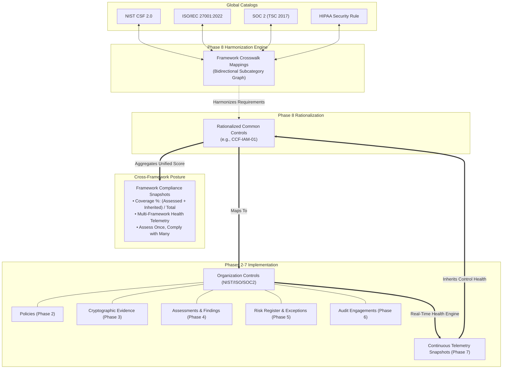

# ControlSphere Phase 8 — Multi-Framework Harmonization & Control Rationalization Architecture

**Document Version**: 1.0.0  
**Status**: ARCHITECTURAL PLANNING COMPLETE — READY FOR REVIEW  
**Scope**: ControlSphere Enterprise GRC Platform — Phase 8 Design Specification  

---

## 1. Existing System Lineage & Baseline Assessment

ControlSphere has established a 7-phase enterprise GRC core:
- **Phase 1**: Tenant isolation, JWT authentication, granular RBAC (`ADMIN`, `GRC_ANALYST`, `SECURITY_ANALYST`, `AUDITOR`, `MANAGER`, `VIEWER`), and tamper-evident audit logging.
- **Phase 2**: NIST CSF 2.0 framework hierarchy (`functions` $\rightarrow$ `categories` $\rightarrow$ `subcategories`), organization control instances, and versioned security policies.
- **Phase 3**: Cryptographic evidence management (SHA-256 integrity, MIME verification, path sanitization), evidence review workflows, and deterministic assurance metrics.
- **Phase 4**: Formal control assessments, technical & documentation findings, remediation tracking, and deterministic risk matrices.
- **Phase 5**: Enterprise risk register (inherent/residual scoring), security exception governance, and executive heatmaps.
- **Phase 6**: Audit management, scoped procedures, cross-control evidence packaging, and four-eyes auditor opinion issuance.
- **Phase 7**: Continuous Control Monitoring (CCM), real-time health scoring ($E \times 0.35 + A \times 0.25 + (40 - \min(40, P_F + P_E))$), and compliance drift telemetry.

**Verified Baseline**: 247/247 backend tests passing, 0 frontend build errors, clean Alembic migration lineage (`<base>` $\rightarrow$ `0001` $\rightarrow$ `0002` $\rightarrow$ `0003` $\rightarrow$ `0004` $\rightarrow$ `0005` $\rightarrow$ `0006` $\rightarrow$ `0007`), commit `266fd47`.

---

## 2. Strategic Purpose of Phase 8

In modern enterprise GRC, organizations are rarely subject to a single security standard. An enterprise typically must concurrently demonstrate compliance across:
1. **NIST CSF 2.0** (National Cybersecurity Posture)
2. **ISO/IEC 27001:2022** (Information Security Management Systems)
3. **SOC 2 Type II** (AICPA Trust Services Criteria — Security, Availability, Confidentiality)
4. **HIPAA Security Rule** (Protected Health Information Safeguards)
5. **PCI-DSS v4.0** (Payment Card Data Protection)

Managing these in disconnected silos leads to "audit fatigue," duplicated evidence collection, contradictory assessment results, and massive operational waste.

The strategic purpose of **Phase 8: Multi-Framework Harmonization & Control Rationalization** is to introduce an enterprise-grade **"Assess Once, Comply with Many"** engine. Phase 8 enables organizations to map disparate regulatory subcategories to canonical common control objectives, automatically inherit evidence and continuous telemetry across frameworks, and compute deterministic cross-framework compliance coverage.

---

## 3. Candidate Phase 8 Options & Comparative Evaluation

```
┌────────────────────────────────────────────────────────────────────────────────────────────────────────┐
│                                   PHASE 8 CANDIDATE COMPARISON MATRIX                                  │
├────────────────────────────────┬───────────────────────────┬───────────────────┬───────────────────────┤
│ Dimension                      │ Option 1: Multi-Framework │ Option 2: Third-  │ Option 3: Regulatory  │
│                                │ Harmonization (Selected)  │ Party Risk (TPRM) │ Change Mgmt (RegTech) │
├────────────────────────────────┼───────────────────────────┼───────────────────┼───────────────────────┤
│ Enterprise GRC Relevance       │ 10 / 10                   │ 8 / 10            │ 7 / 10                │
│ Cybersecurity / Portfolio Value│ 10 / 10                   │ 8 / 10            │ 6 / 10                │
│ Architectural Depth            │ 10 / 10                   │ 7 / 10            │ 7 / 10                │
│ Resume / Portfolio Impact      │ 10 / 10                   │ 8 / 10            │ 6 / 10                │
│ Implementation Feasibility     │ 9 / 10                    │ 8 / 10            │ 8 / 10                │
│ Continuity with Phases 1–7     │ 10 / 10                   │ 6 / 10            │ 7 / 10                │
├────────────────────────────────┼───────────────────────────┼───────────────────┼───────────────────────┤
│ TOTAL SCORE                    │ 59 / 60                   │ 45 / 60           │ 41 / 60               │
└────────────────────────────────┴───────────────────────────┴───────────────────┴───────────────────────┘
```

### Candidate 1: Multi-Framework Harmonization & Control Rationalization (RECOMMENDED)
- **Business Problem**: Eliminates redundant compliance workflows across overlapping standards (NIST CSF, ISO 27001, SOC 2, HIPAA, PCI-DSS) by mapping subcategories to rationalized common controls.
- **GRC Domain**: Cross-Regulatory Harmonization, Common Control Frameworks (CCF), Regulatory Crosswalks.
- **Continuity**: Direct architectural multiplier for Phase 2 catalogs, Phase 3 evidence, Phase 4 assessments, and Phase 7 CCM telemetry.

### Candidate 2: Third-Party & Vendor Cyber Risk Management (TPRM / VRM)
- **Business Problem**: Evaluates external vendor risk, supply-chain questionnaires, and third-party attestations.
- **GRC Domain**: Vendor Risk Management, Supply Chain Security.
- **Limitation**: Branches horizontally into procurement and supplier workflows rather than completing the primary internal control and multi-regulation compliance spine.

### Candidate 3: Regulatory Change Management & Obligation Tracking (RegTech)
- **Business Problem**: Tracks legislative updates and flags out-of-date policy clauses.
- **GRC Domain**: Legal Compliance, Regulatory Change.
- **Limitation**: Primarily text/diff management without deep mathematical telemetry integration.

---

## 4. Selected Direction: Multi-Framework Harmonization & Control Rationalization

**Candidate 1** is the chosen architecture. It delivers the highest enterprise value, provides the deepest architectural cohesion, and enables ControlSphere to showcase a complete Unified Compliance Framework (UCF / CCF) implementation.

---

## 5. Domain Model Specification

Phase 8 introduces 4 high-performance database models in `backend/app/models/harmonization.py`:

```
                                GLOBAL CATALOG LAYER
    ┌────────────────────────────────────────────────────────────────────────┐
    │  frameworks (Phase 2)          framework_crosswalk_mappings (Phase 8)  │
    │  ├─ ISO 27001:2022             ├─ source_subcategory_id (NIST PR.AC-1) │
    │  ├─ SOC 2 (TSC 2017)           ├─ target_subcategory_id (ISO A.5.15)   │
    │  └─ HIPAA Security Rule        ├─ mapping_type (EXACT / PARTIAL)       │
    │                                ├─ confidence_score (0.0 - 1.0)         │
    │                                └─ authoritative_rationale              │
    └───────────────────────────────────┬────────────────────────────────────┘
                                        │
                                        ▼
                             ORGANIZATION TENANT LAYER
    ┌────────────────────────────────────────────────────────────────────────┐
    │  rationalized_common_controls (Phase 8)                                │
    │  ├─ organization_id (Tenant FK)                                        │
    │  ├─ common_control_code ("CCF-IAM-01")                                 │
    │  ├─ title ("Centralized Identity & Access Lifecycle")                  │
    │  ├─ health_score (Deterministic Inherited CCM)                         │
    │  └─ rationalization_status ("ACTIVE" / "DEPRECATED")                   │
    │                                                                        │
    │  common_control_mappings (Phase 8)                                     │
    │  ├─ rationalized_common_control_id                                     │
    │  └─ organization_control_id (Phase 2 FK)                               │
    │                                                                        │
    │  framework_compliance_snapshots (Phase 8)                              │
    │  ├─ organization_id (Tenant FK)                                        │
    │  ├─ framework_id (Phase 2 FK)                                          │
    │  ├─ total_subcategories, covered_subcategories                         │
    │  ├─ coverage_percentage (Deterministic 0.0% - 100.0%)                  │
    │  ├─ compliance_score (Weighted Implementation & Telemetry)             │
    │  └─ snapshot_timestamp (UTC Server Authoritative)                      │
    └────────────────────────────────────────────────────────────────────────┘
```

### Table 1: `framework_crosswalk_mappings` (GLOBAL CATALOG)
*Authoritative normative crosswalks between regulatory subcategories.*
- `id` (Integer, PK)
- `source_subcategory_id` (Integer, FK $\rightarrow$ `subcategories.id`, nullable=False, index=True)
- `target_subcategory_id` (Integer, FK $\rightarrow$ `subcategories.id`, nullable=False, index=True)
- `mapping_type` (Enum: `EXACT`, `SUBSET`, `SUPERSET`, `PARTIAL`, `CORRELATED`, nullable=False, default=`EXACT`)
- `confidence_score` (Float, nullable=False, default=1.0)
- `bidirectional` (Boolean, nullable=False, default=True)
- `rationale` (Text, nullable=False)
- `created_at` (DateTime(UTC), default=now)
- *Constraint*: `UniqueConstraint("source_subcategory_id", "target_subcategory_id", name="uq_crosswalk_source_target")`

### Table 2: `rationalized_common_controls` (TENANT-SCOPED)
*Tenant-level unified control objectives that aggregate multiple regulatory requirements.*
- `id` (Integer, PK)
- `organization_id` (Integer, FK $\rightarrow$ `organizations.id`, ondelete="CASCADE", nullable=False, index=True)
- `common_control_code` (String(64), nullable=False, index=True)
- `title` (String(255), nullable=False)
- `description` (Text, nullable=False)
- `domain` (String(100), nullable=False, index=True) — *e.g., "IDENTITY_ACCESS", "CRYPTOGRAPHY", "INCIDENT_RESPONSE"*
- `rationalization_status` (Enum: `DRAFT`, `ACTIVE`, `RETIRED`, default=`ACTIVE`, nullable=False, index=True)
- `owner_id` (Integer, FK $\rightarrow$ `users.id`, ondelete="SET NULL", nullable=True)
- `inherited_health_score` (Float, nullable=False, default=100.0)
- `inherited_health_status` (Enum: `HEALTHY`, `DEGRADED`, `AT_RISK`, `FAILING`, default=`HEALTHY`, nullable=False)
- `created_at` / `updated_at` (DateTime(UTC), nullable=False)
- *Constraint*: `UniqueConstraint("organization_id", "common_control_code", name="uq_org_common_control_code")`

### Table 3: `common_control_mappings` (TENANT-SCOPED)
*Associative junction linking rationalized common controls to tenant organization controls.*
- `id` (Integer, PK)
- `organization_id` (Integer, FK $\rightarrow$ `organizations.id`, ondelete="CASCADE", nullable=False, index=True)
- `rationalized_common_control_id` (Integer, FK $\rightarrow$ `rationalized_common_controls.id`, ondelete="CASCADE", nullable=False, index=True)
- `organization_control_id` (Integer, FK $\rightarrow$ `organization_controls.id`, ondelete="CASCADE", nullable=False, index=True)
- `weight` (Float, nullable=False, default=1.0)
- `created_at` (DateTime(UTC), default=now)
- *Constraint*: `UniqueConstraint("rationalized_common_control_id", "organization_control_id", name="uq_cc_org_control")`

### Table 4: `framework_compliance_snapshots` (TENANT-SCOPED)
*Deterministic posture records measuring tenant coverage and compliance across entire frameworks.*
- `id` (Integer, PK)
- `organization_id` (Integer, FK $\rightarrow$ `organizations.id`, ondelete="CASCADE", nullable=False, index=True)
- `framework_id` (Integer, FK $\rightarrow$ `frameworks.id`, ondelete="CASCADE", nullable=False, index=True)
- `total_subcategories` (Integer, nullable=False)
- `directly_assessed_subcategories` (Integer, nullable=False)
- `crosswalk_inherited_subcategories` (Integer, nullable=False)
- `total_covered_subcategories` (Integer, nullable=False)
- `coverage_percentage` (Float, nullable=False)  # 0.0 - 100.0%
- `compliance_health_score` (Float, nullable=False)  # 0.0 - 100.0%
- `passing_controls_count` (Integer, nullable=False)
- `failing_controls_count` (Integer, nullable=False)
- `open_findings_count` (Integer, nullable=False)
- `created_at` (DateTime(UTC), default=now, index=True)

---

## 6. Authoritative Lineage Diagram



---

## 7. State Machines & Immutability Rules

### 1. Rationalized Common Control Lifecycle
- **States**: `DRAFT` $\rightarrow$ `ACTIVE` $\rightarrow$ `RETIRED`
- **Valid Transitions**:
  - `DRAFT` $\rightarrow$ `ACTIVE` (Requires at least 1 mapped `organization_control`)
  - `ACTIVE` $\rightarrow$ `RETIRED` (Requires mandatory deprecation rationale)
  - `RETIRED` $\rightarrow$ `ACTIVE` (Re-activation permitted only by `ADMIN`)
- **Invalid Transitions**:
  - `DRAFT` $\rightarrow$ `RETIRED` (Blocked: must activate or delete draft)
- **Enforcement**: Server-authoritative transition validator in `HarmonizationService`.

### 2. Framework Compliance Snapshot Immutability
- Snapshots are point-in-time audit artifacts. Once written, snapshot fields (`coverage_percentage`, `compliance_health_score`, `created_at`) are strictly **immutable**. No `PUT` or `PATCH` endpoints exist for snapshots.

---

## 8. Granular RBAC Matrix

Four new permissions added to [`backend/app/core/permissions.py`](file:///e:/PROJECT%20WORKSPACE%202/ControlSphere/backend/app/core/permissions.py):

| Permission | Identifier | Purpose |
|:---|:---|:---|
| `HARMONIZATION_READ` | `harmonization:read` | View crosswalks, common controls, coverage & compliance posture |
| `HARMONIZATION_MANAGE` | `harmonization:manage` | Create/edit common controls, link organization controls, configure weights |
| `HARMONIZATION_EXECUTE` | `harmonization:execute` | Trigger cross-framework compliance evaluations and snapshot calculations |
| `CROSSWALK_ADMIN` | `crosswalk:admin` | Seed, modify, or extend global framework crosswalk mappings |

### Role Permissions Assignment Matrix

| Role | `harmonization:read` | `harmonization:manage` | `harmonization:execute` | `crosswalk:admin` |
|:---|:---:|:---:|:---:|:---:|
| `ADMIN` | Yes | Yes | Yes | Yes |
| `GRC_ANALYST` | Yes | Yes | Yes | No |
| `SECURITY_ANALYST` | Yes | Yes | Yes | No |
| `AUDITOR` | Yes | No | No | No |
| `MANAGER` | Yes | Yes | Yes | No |
| `VIEWER` | Yes | No | No | No |

---

## 9. Multi-Tenancy & Authorization Security Rules

1. **Global vs. Tenant Partitioning**:
   - `framework_crosswalk_mappings` is **GLOBAL** (read-only for all tenants; modified only via `crosswalk:admin`).
   - `rationalized_common_controls`, `common_control_mappings`, and `framework_compliance_snapshots` are strictly **TENANT-SCOPED** (`organization_id == current_user.organization_id`).
2. **Cross-Tenant IDOR Prevention**:
   - Attempting to map an `organization_control_id` belonging to Organization B to a Common Control in Organization A returns `404 Not Found`.
   - Attempting to view or evaluate common controls of another tenant returns `404 Not Found`.
3. **Foreign User Assignment Protection**:
   - `owner_id` on common controls must strictly belong to the same `organization_id` and have `is_active=True`.

---

## 10. Adversarial Threat Model & Mitigations

| Threat Vector | Potential Impact | Preventive Control | Detection & Verification |
|:---|:---|:---|:---|
| **ADV-P8-01: Cross-Tenant Common Control IDOR Read** | Data leakage of internal common controls | Query filtered exclusively by `organization_id == current_user.organization_id` | Automated pytest verifying 404 on cross-tenant ID |
| **ADV-P8-02: Cross-Tenant Control Mapping Injection** | Mapping foreign organization's controls into local common control | Service validates that target `organization_control_id` belongs to `current_user.organization_id` | Pytest injecting foreign control ID receives 404 |
| **ADV-P8-03: Client-Dictated Coverage Percentage** | Fraudulent compliance reporting | Server calculates coverage and health strictly via backend deterministic engine | Pytest verifying injected score in payload is ignored/rejected |
| **ADV-P8-04: Non-Admin Global Crosswalk Tampering** | Global cross-regulation corruption | Endpoint protected by `crosswalk:admin` (ADMIN only) | Pytest verifying GRC_ANALYST/MANAGER receive 403 |
| **ADV-P8-05: Mass Assignment on Common Controls** | Unauthorized role or tenant escalation | Strict Pydantic v2 schemas (`CommonControlCreate`, `CommonControlUpdate`) | Pytest attempting to inject `organization_id` or `id` |
| **ADV-P8-06: Retired State Immutability Bypass** | Modifying deprecated control mappings | Service checks `rationalization_status != RETIRED` before allowing mapping edits | Pytest attempting mutation on RETIRED control returns 400 |
| **ADV-P8-07: Circular Crosswalk Graph Exploitation** | Infinite loop in crosswalk traversal | Traversal depth limit ($k=2$) and visited set checking in harmonization graph engine | Unit test verifying circular mapping A $\leftrightarrow$ B does not loop |

---

## 11. Deterministic Calculation Engine

### 1. Inherited Common Control Health Score
For a rationalized common control $CC$ mapping to organization controls $\mathcal{C} = \{c_1, c_2, \dots, c_n\}$ with weights $w_i$:
$$\text{InheritedHealth}(CC) = \begin{cases} 100.0 & \text{if } \mathcal{C} = \emptyset \\ \text{round}\left(\frac{\sum_{i=1}^n w_i \cdot \text{HealthScore}(c_i)}{\sum_{i=1}^n w_i}, 1\right) & \text{if } \mathcal{C} \neq \emptyset \end{cases}$$
Where $\text{HealthScore}(c_i)$ is the authoritative Phase 7 Continuous Monitoring health score.

### 2. Cross-Framework Compliance Coverage Metric
For a framework $F$ with $N_F$ total subcategories:
Let $\mathcal{S}_{\text{direct}}(F)$ be subcategories directly assessed as `IMPLEMENTED` within the tenant.
Let $\mathcal{S}_{\text{inherited}}(F)$ be subcategories mapped via crosswalks to implemented controls from other frameworks with $\text{confidence} \ge 0.80$.
$$\mathcal{S}_{\text{covered}}(F) = \mathcal{S}_{\text{direct}}(F) \cup \mathcal{S}_{\text{inherited}}(F)$$
$$\text{CoveragePercentage}(F) = \text{round}\left(\frac{|\mathcal{S}_{\text{covered}}(F)|}{N_F} \times 100.0, 1\right)$$

### 3. Framework Compliance Health Score
$$\text{ComplianceScore}(F) = \text{round}\left(\frac{\sum_{s \in \mathcal{S}_{\text{covered}}(F)} \text{SubcategoryHealth}(s)}{N_F}, 1\right)$$

---

## 12. Database Migration Plan (`0008_multi_framework_harmonization.py`)

- **Revision ID**: `'0008'`
- **Revises**: `'0007'`
- **Tables Created**:
  1. `framework_crosswalk_mappings` (with unique constraint `uq_crosswalk_source_target` and composite index)
  2. `rationalized_common_controls` (with unique constraint `uq_org_common_control_code` and tenant index)
  3. `common_control_mappings` (with unique constraint `uq_cc_org_control`)
  4. `framework_compliance_snapshots` (with tenant and framework foreign keys and timestamp index)
- **Seed Data**: Automated seed migration populating initial normative crosswalks between NIST CSF 2.0, ISO 27001:2022, and SOC 2 Type II subcategories.

---

## 13. REST API Surface Design

All endpoints registered under `/api/v1/harmonization`:

| Method | Path | Description | Permission |
|:---|:---|:---|:---|
| `GET` | `/crosswalks` | List normative framework crosswalk mappings (filterable by source/target framework) | `harmonization:read` |
| `POST` | `/crosswalks` | Create/update global crosswalk mapping | `crosswalk:admin` |
| `GET` | `/common-controls` | List tenant's rationalized common controls with inherited health scores | `harmonization:read` |
| `POST` | `/common-controls` | Create a new rationalized common control objective | `harmonization:manage` |
| `GET` | `/common-controls/{id}` | Get common control details and mapped organization controls | `harmonization:read` |
| `PUT` | `/common-controls/{id}` | Update common control metadata | `harmonization:manage` |
| `POST` | `/common-controls/{id}/mappings` | Link organization controls to common control | `harmonization:manage` |
| `DELETE` | `/common-controls/{id}/mappings/{control_id}` | Unlink organization control from common control | `harmonization:manage` |
| `POST` | `/evaluate` | Run deterministic multi-framework evaluation & generate snapshots | `harmonization:execute` |
| `GET` | `/posture` | Get cross-framework compliance overview (coverage %, health per framework) | `harmonization:read` |
| `GET` | `/posture/{framework_id}/matrix` | Get subcategory-by-subcategory crosswalk compliance matrix | `harmonization:read` |

---

## 14. Frontend Architecture & User Interface

1. **New Route**: `/harmonization` in `frontend/src/App.tsx` and `Sidebar.tsx` under `Compliance & Controls`.
2. **Page**: [`HarmonizationPage.tsx`](file:///e:/PROJECT%20WORKSPACE%202/ControlSphere/frontend/src/pages/HarmonizationPage.tsx):
   - **Executive Multi-Framework Posture Header**: Framework coverage meters (NIST CSF, ISO 27001, SOC 2, HIPAA) with "Assess Once, Comply with Many" ratio indicator.
   - **Common Controls Catalog Tab**: Searchable table of rationalized common control objectives showing mapped controls count and live inherited health badges.
   - **Crosswalk Mapping Matrix Tab**: Interactive cross-regulatory matrix showing source NIST CSF subcategories mapped to target ISO 27001 / SOC 2 requirements with confidence indicators.
   - **Evaluate Framework Posture Action**: Live trigger generating timestamped posture snapshots.
3. **Dashboard Integration**: Added Multi-Framework Compliance widget to [`DashboardPage.tsx`](file:///e:/PROJECT%20WORKSPACE%202/ControlSphere/frontend/src/pages/DashboardPage.tsx).

---

## 15. Comprehensive Test Strategy

The Phase 8 test suite will be structured as:
1. `backend/tests/test_harmonization_engine.py`: Unit tests for crosswalk graph traversal, inherited health weighting, and framework coverage math.
2. `backend/tests/test_harmonization_lifecycle.py`: Integration tests for common control CRUD, mapping/unmapping, and evaluation snapshots.
3. `backend/tests/test_phase8_adversarial_security.py`: 16-point adversarial security suite (`ADV-P8-01` through `ADV-P8-16`) covering cross-tenant IDOR, foreign control injection, permission boundaries, and terminal state immutability.
4. **Zero-Regression Invariant**: All 247 existing tests must pass at every stage.

---

## 16. Dependency Policy

- **No New Dependencies Required**:
  - Graph traversal and mathematical calculations will be implemented using Python 3.12 standard library (`collections`, `math`, `typing`).
  - Database schema handled entirely by existing SQLAlchemy 2.0 and Alembic.
  - UI built strictly with existing React 19, Lucide React icons, and Tailwind CSS.

---

## 17. Incremental Implementation Roadmap & Verification Gates

```
┌──────────────┐    ┌──────────────┐    ┌──────────────┐    ┌──────────────┐    ┌──────────────┐
│  Phase 8.1   │───>│  Phase 8.2   │───>│  Phase 8.3   │───>│  Phase 8.4   │───>│  Phase 8.5   │
│ DB Migration │    │ RBAC & Model │    │ Engine & Svc │    │ REST APIs    │    │ Security     │
└──────────────┘    └──────────────┘    └──────────────┘    └──────────────┘    └──────────────┘
                                                                                       │
┌──────────────┐    ┌──────────────┐    ┌──────────────┐    ┌──────────────┐           │
│  Phase 8.9   │<───│  Phase 8.8   │<───│  Phase 8.7   │<───│  Phase 8.6   │<──────────┘
│ Final Review │    │ E2E Regress  │    │ Frontend UI  │    │ Tests        │
└──────────────┘    └──────────────┘    └──────────────┘    └──────────────┘
```

- **Gate 1 (Data Layer)**: Migration `0008` applied cleanly; rollback verified.
- **Gate 2 (Logic Layer)**: Mathematical scoring engine verified with 100% boundary test coverage.
- **Gate 3 (Security Layer)**: All 16 adversarial security test cases passing.
- **Gate 4 (Full Stack Layer)**: Frontend production build passes with 0 TypeScript/Vite errors; full backend regression passes with $>270$ passing tests.

---

## 18. Risks & Architectural Trade-offs

1. **Trade-off: Global Static Crosswalks vs. Tenant-Custom Crosswalks**:
   - *Decision*: Crosswalks between standard frameworks (e.g. NIST CSF $\leftrightarrow$ ISO 27001) are defined in the global catalog to prevent contradictory compliance standards across tenants. Common control groupings remain tenant-customizable.
2. **Performance Consideration in Multi-Framework Aggregation**:
   - *Mitigation*: Snapshot caching and indexed junction tables ensure evaluation runs scale $O(N)$ with control count rather than $O(N^2)$.
